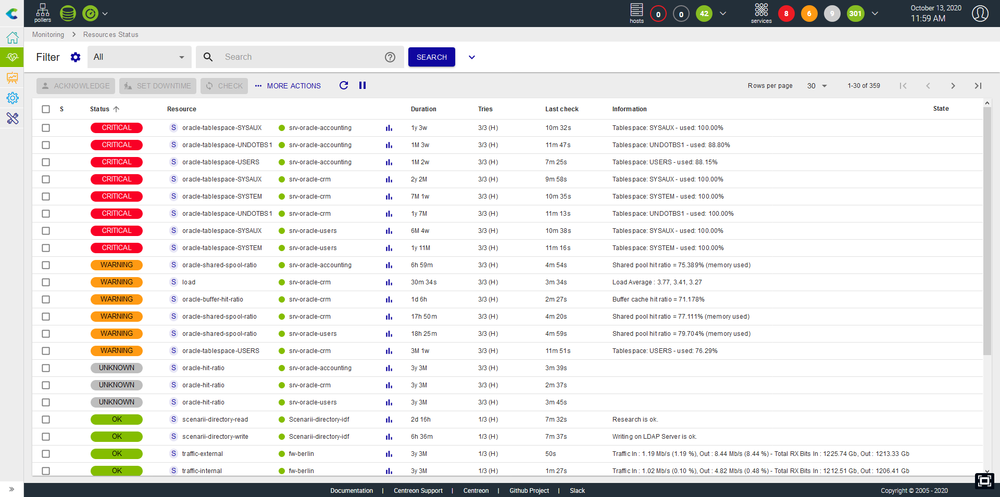
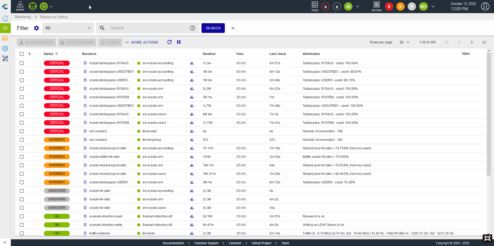
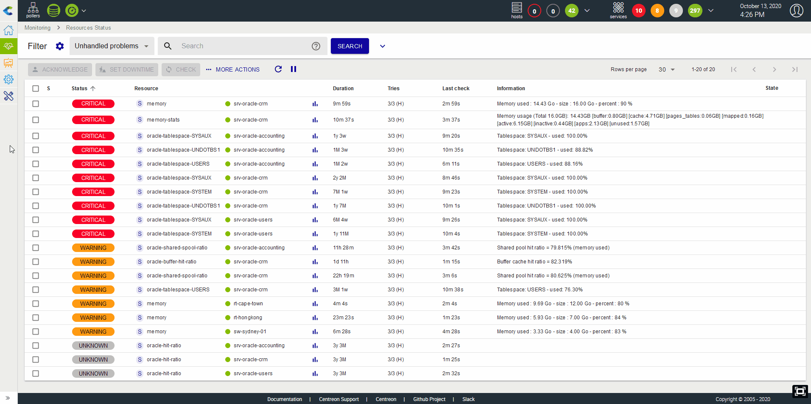
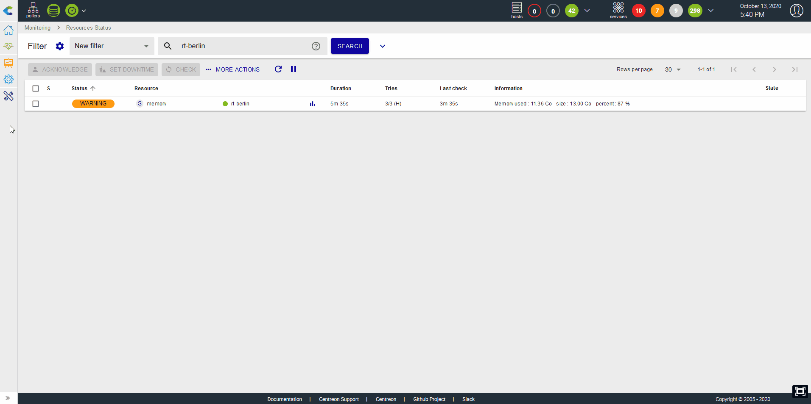
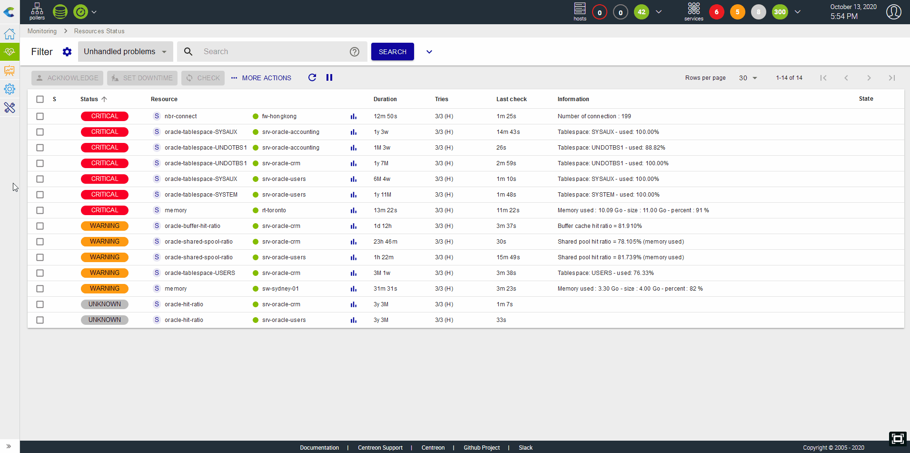
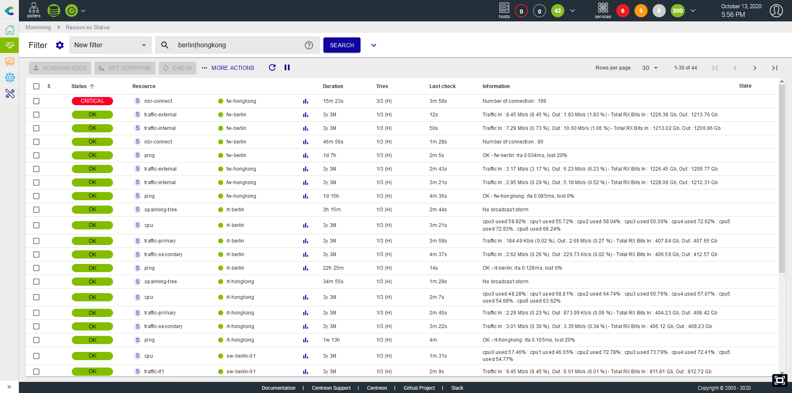
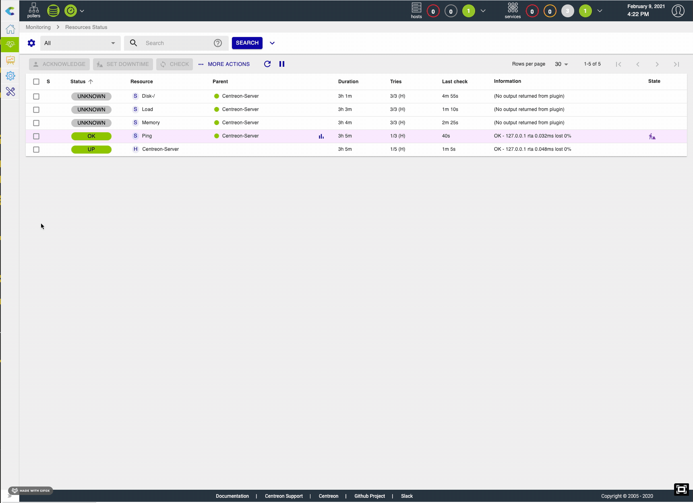

La vue `Statut des ressources` est votre vue principale pour connaître
les évènements en cours et être en mesure de les comprendre, les prendre
en compte et les traiter rapidement.

Cette vue rassemble à la fois les hôtes et les services afin de proposer
une interface unique et unifiée de gestion des évènements.

## Lister les évènements

Le listing des évènements permet d'avoir une vue condensée des alertes en
cours ou plus largement de l'état de toutes les ressources supervisées par
la plateforme Centreon.

Il est possible de choisir la colonne de tri afin d'ordonner le listing, par
exemple par durée la plus récente, statut ou encore par sévérité.

## Exécuter des actions sur les évènements

### Prendre en compte un évènement

Lorsqu'une ou plusieurs alertes apparaîssent, il est possible de les
prendre en compte immédiatement et ce, de deux manières:

-   En acquittant directement via le bouton qui s'affiche au survol de
    la ligne
-   En sélectionnant une ou plusieurs lignes et en cliquant sur le
    bouton "Acknowledge"

> Seules les ressources en statut "Non-OK" peuvent être acquittées.

L'acquitement a pour effet de masquer l'alerte de la vue "Unhandled
problems" et de stopper les notifications partant de la ressource.

L'acquittement peut aussi être supprimé pour reverser l'évènement dans la liste
des évènements non pris en compte ainsi que pour relancer les notifications.

### Planifier une plage de maintenance

Il est possible de planifier une plage de maintenance :

-   En définissant directement une plage de maintenance via le bouton
    qui s'affiche au survol de la ligne
-   En sélectionne une ou plusieurs lignes et en cliquant sur le bouton
    "Downtime"

La mise en maintenance d'une ressource a pour effet de masquer l'alerte
de la vue "Unhandled problems" et de stopper les notifications partant
de la ressource.

### Relancer un contrôle

Dans de nombreuses situations, il est nécessaire de pouvoir rafraîchir
le statut d'un service / hôte en lançant un controle manuellement via
l'interface. Cela est possible de deux manières différentes

-   En lançant le contrôle directement via le bouton qui s'affiche au
    survol de la ligne
-   En sélectionnant une ou plusieurs lignes et en cliquant sur le
    bouton "Check"

### Soumettre un statut

Dans certains cas, notamment avec les services dit "passif", il peut
être utile de soumettre un résultat, c'est à dire un statut, un message
de sortie et des métriques, afin de remettre à zéro l'évènement.

## Filtrer les évènements

### Filtres prédéfinis

Lorsque vous arrivez sur la vue d'évènements, par défaut le filtre est
positionné sur "Unhandled problems", ce filtre permet de visualiser
rapidement tous les problèmes n'ayant pas encore été pris en compte ou
associés à une plage de maintenance. Il est possible de choisir parmis 2
autres filtre: "Resource Problems" & "All".

Signification des filtres:

-   Unhandled problems: Le statut de la ressources est Warning ou
    Critical ou Unknown ou Down ET la resource n'est ni acquittée ni en
    plage de maintenance planifiée
-   Resource problems: Le statut de la ressources est Warning ou
    Critical ou Unknown ou Down
-   All: toutes les ressources

### Barre de recherche

Il est possible de filters les évènements par nom de ressource. La
mécanique d'expressions régulières est intégrée à cette barre de
recherche, rendant cette dernière plus flexible.

Par défaut la recherche se fait sur les champs suivants:

-   Nom d'hôtes
-   Alias de l'hôte
-   Adresse ou FQDN de l'hôte
-   Description du service

Il est possible de forcer le champ sur lequel on souhaite rechercher en
utilisant les labels suivants:

-   h.name: chercher uniquement sur le nom d'hôte
-   h.alias: chercher uniquement sur l'alias de l'hôte
-   h.address: chercher uniquement sur le FQDN / l'adresse IP de l'hôte
-   s.description: chercher uniquement sur la description du service

### Par critères avancés

Si les filtres pré-définis et la barre de recherche ne suffisent pas, il
est possible de déplier les filtres afin d'accéder à plus de critères:

-   Ttypes de ressource (hôte ou service)
-   Statut (Ok, Warning, Critical, Unknown, Pending, Up, Down,
    Unreachable)
-   Etat : y'a t'il une action en cours sur le service ou l'équipement ?
    (acquittement, plage de maintenance planifiée)
-   Groupes d'hôtes
-   Groupe de services

### Sauvergarder un filtre

Lorsque vous souhaitez ne lister qu'un sous ensemble des équipements de
la supervision, vous êtes amenés à utiliser de nombreux critères et
expressions régulières. Dans ce cas, il est intéressant de sauvegarder
le filtre afin de pouvoir facilement le réutiliser plus tard.

Cela est possible en utilisant l'icône "roue dentée" à côté de "Filtre".
Grâce à ce menu, vous serez en mesure de:

-   Sauvegarder la recherche actuelle comme un nouveau filtre
-   Mettre à jour le filtre actuel avec la recherche en cours
-   Editer la liste des filtres afin de les supprimer, les renommer ou
    les ré-ordonner.

Une fois qu'un filtre est créé, il apparaitra dans la liste des filtres
sous la section "Mes filtres".

## Panneau de détail

Lorsque vous cliquez sur une ligne, un panneau de détail s'affiche pour
présenter les informations principales de la ressource.

En fonction du type de ressource, différents onglets sont disponibles.

### Panneau d'hôte

Le panneau d'hôte contient plusieurs onglets informatifs :

-   Informations détaillées sur le statut courant,
-   La liste des services rattachés à cet hôte avec leur statut,
-   La chronologie des événements survenus pour cet hôte,
-   Les raccourcis vers la configuration, les journaux d'évènement et les
    rapports de disponibilité.

Si l'hôte est acquitté ou en downtime, des informations supplémentaires
seront visibles sur le panneau.

### Panneau de service

Le panneau de service contient plusieurs onglets informatifs :

-   Informations détaillées sur le statut courant,
-   La chronologie des événements survenus pour ce service,
-   Un graphique avec une courbe par métrique collectée par ce service,
-   Les raccourcis vers les configurations, les journaux d'évènement et les
    rapports de disponibilité pour ce service et son hôte.

Si le service est acquitté ou en downtime, des informations supplémentaires
seront visibles sur le panneau.
