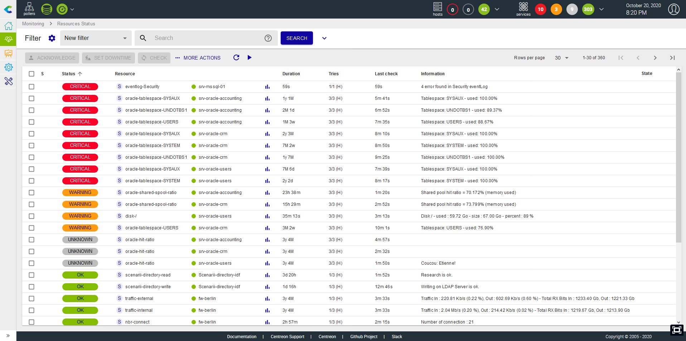
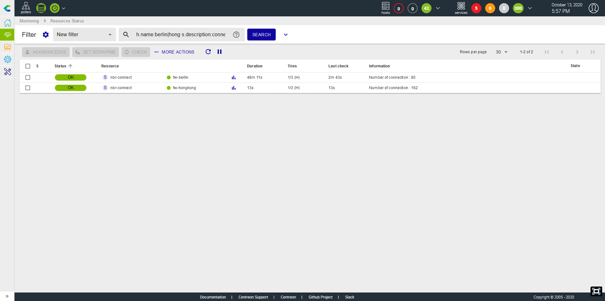
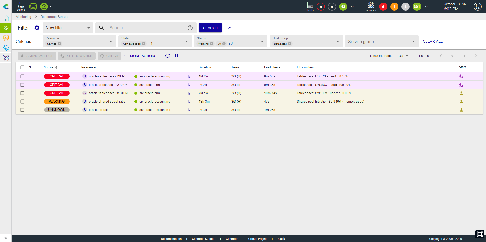
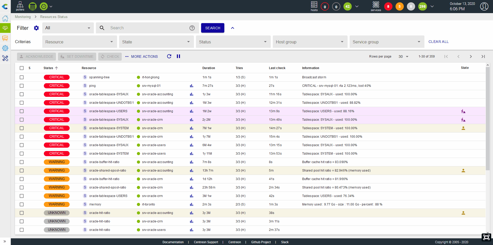
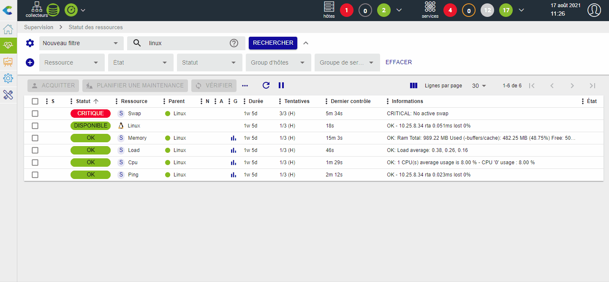
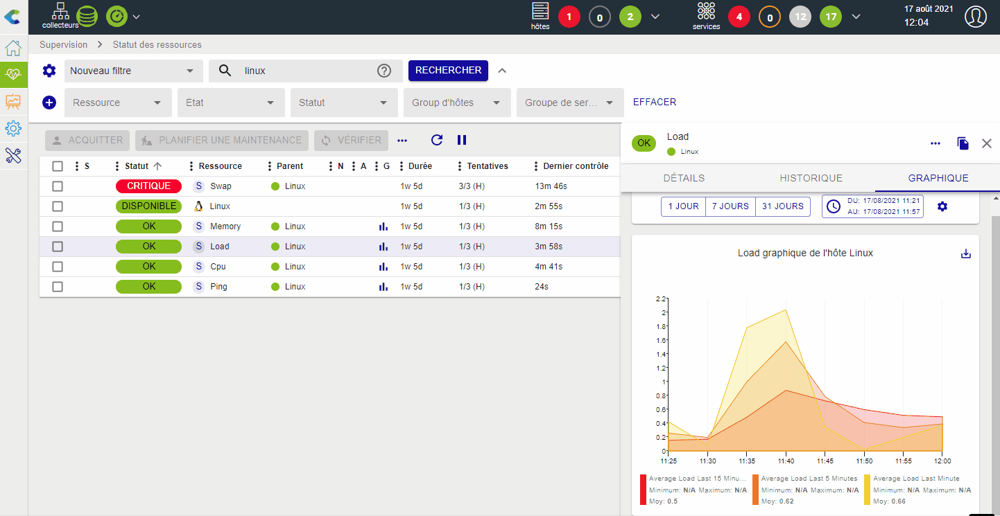
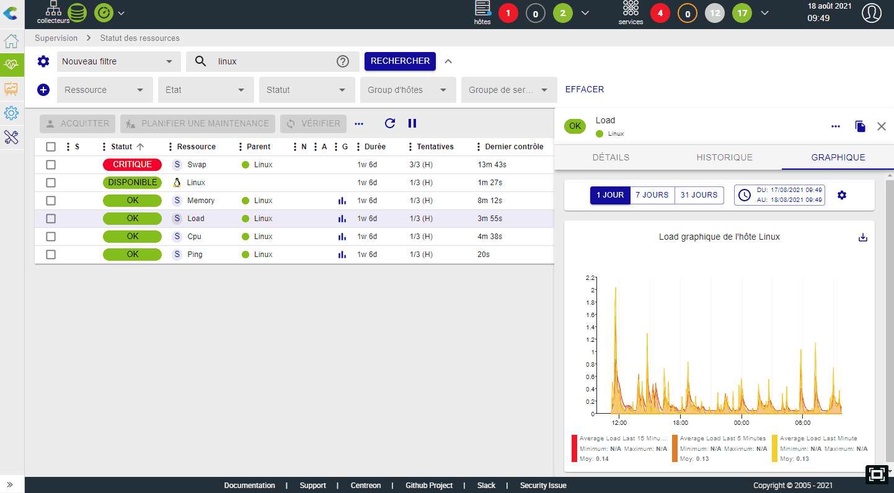
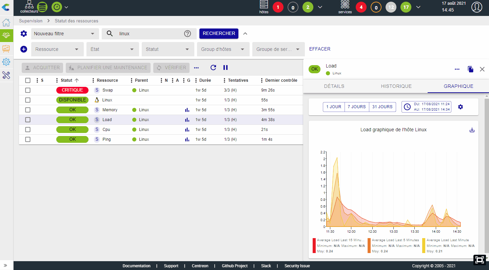
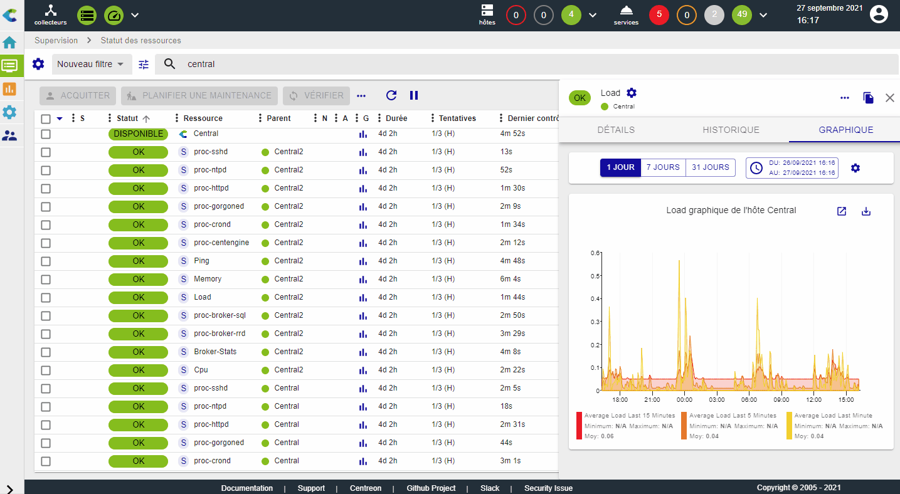

La vue `Supervision > Statut des ressources` est votre vue principale
pour connaître les évènements en cours et être en mesure de les comprendre,
les prendre en compte et les traiter rapidement.

Cette vue rassemble à la fois les hôtes et les services afin de proposer
une interface unique et unifiée de gestion des évènements.

## Lister les évènements

Le listing des évènements permet d'avoir une vue condensée des alertes en
cours ou plus largement de l'état de toutes les ressources supervisées par
la plateforme Centreon.

Il est possible d'ajouter ou de masquer des colonnes, ainsi que de choisir la colonne de tri afin d'ordonner le listing, par
exemple par statut ou encore par sévérité.

## Exécuter des actions sur les évènements

### Prendre en compte un évènement

Lorsqu'une ou plusieurs alertes apparaissent, il est possible de les [acquitter](manage-alerts.html#acquitter-un-problème) afin de montrer à votre équipe que le problème est bien
pris en compte, et ce de deux manières:

-   En acquittant la ressource directement via le bouton qui s'affiche au survol de
    la ligne
-   En sélectionnant une ou plusieurs lignes et en cliquant sur le
    bouton **Acquitter** au-dessus du tableau.

Seules les ressources en statut "Non-OK" peuvent être acquittées.
Seule une ressource non acquittée peut être acquittée.

Lorsqu'une ressource est acquittée :
- l'alerte disparaît de la vue **Problèmes non acquittés**
- les [notifications](notif-configuration.html) partant de la ressource sont stoppées
- L'arrière-plan de la ligne d'une ressource acquittée passe en jaune.

L'acquittement peut aussi être supprimé pour reverser l'évènement dans la liste
des évènements non pris en compte ainsi que pour relancer les notifications. Cliquez
sur **Désacquitter** dans le menu **Plus d'actions**.

### Planifier une plage de maintenance

Il est possible de [planifier une plage de maintenance](manage-alerts.html#ajouter-un-temps-darrêt) :

-   En définissant directement une plage de maintenance via le bouton
    qui s'affiche au survol de la ligne
-   En sélectionnant une ou plusieurs lignes et en cliquant sur le bouton
    **Planifier une maintenance** au-dessus du tableau.

La mise en maintenance d'une ressource a pour effet de masquer l'alerte
de la vue **Problèmes non acquittés** et de stopper les notifications partant
de la ressource. L'arrière-plan des lignes des ressources en maintenance est mauve.

### Relancer un contrôle

Dans de nombreuses situations, il est nécessaire de pouvoir rafraîchir
le statut d'un service/hôte en lançant un contrôle manuellement via
l'interface. Cela est possible de deux manières différentes :

-   En lançant le contrôle directement via le bouton qui s'affiche au
    survol de la ligne
-   En sélectionnant une ou plusieurs lignes et en cliquant sur le
    bouton **Vérifier**.

### Soumettre un statut

Dans certains cas, notamment avec les services dit "passifs", il peut
être utile de soumettre un résultat, c'est à dire un statut, un message
de sortie et des métriques, afin de remettre à zéro l'évènement.
Pour cela, sélectionnez un service passif puis cliquez sur **Soumettre un statut**
dans le menu **Plus d'actions**.

## Filtrer les évènements

### Filtres prédéfinis

Lorsque vous arrivez sur la vue d'évènements, par défaut le filtre est
positionné sur **Problèmes non acquittés** : ce filtre permet de visualiser
rapidement tous les problèmes n'ayant pas encore été pris en compte ou
associés à une plage de maintenance. Il est possible de choisir parmi 2
autres filtres : **Problèmes de ressources** & **Tous**.

Signification des filtres:

-   **Problèmes non acquittés** : Le statut de la ressource est **Alerte** ou
    **Critique** ou **Inconnu** ou **Indisponible** ET la ressource n'est ni acquittée ni en
    plage de maintenance planifiée
-   **Problèmes de ressources**: Le statut de la ressource est **Alerte** ou
    **Critique** ou **Inconnu** ou **Indisponible** (que la ressource ait été acquittée/mise en maintenance ou non)
-   **Tous** : toutes les ressources.

### Barre de recherche

Il est possible de filtrer les évènements par nom de ressource. Vous pouvez utiliser des expressions régulières.

Par défaut la recherche se fait sur les champs suivants:

-   Nom de l'hôte
-   Alias de l'hôte
-   Adresse ou FQDN de l'hôte
-   Description du service
-   Information

Il est possible de forcer le champ sur lequel on souhaite rechercher en
utilisant les labels suivants:

-   h.name: chercher uniquement sur le nom d'hôte
-   h.alias: chercher uniquement sur l'alias de l'hôte
-   h.address: chercher uniquement sur le FQDN / l'adresse IP de l'hôte
-   s.description: chercher uniquement sur la description du service
-   information: chercher uniquement sur l’information

### Par critères avancés

Si les filtres pré-définis et la barre de recherche ne suffisent pas, dépliez les filtres afin d'accéder à plus de critères:

-   Type de ressource (hôte ou service)
-   Statut (OK, **Alerte**, **Critique**, **Inconnu**, **En attente**, **Disponible**, **Indisponible**,
    **Injoignable**)
-   État : y a-t'il une action en cours sur le service ou l'équipement ?
    (acquittement, plage de maintenance planifiée)
-   Groupes d'hôtes
-   Groupe de services

### Afficher / masquer des critères

Il est également possible d'afficher ou de masquer des critères qui ne sont pas pertinents pour la recherche à effectuer, en cliquant sur le bouton "Sélectionner des critères" à gauche :

### Sauvegarder un filtre

Lorsque vous souhaitez ne lister qu'un sous-ensemble des équipements de
la supervision, vous pouvez être amenés à utiliser de nombreux critères et
expressions régulières. Dans ce cas, il est intéressant de sauvegarder
le filtre afin de pouvoir facilement le réutiliser plus tard.

Utilisez l'icône "roue dentée" à côté de **Filtre** pour :

-   Sauvegarder la recherche actuelle comme un nouveau filtre
-   Mettre à jour le filtre actuel avec la recherche en cours
-   Éditer la liste des filtres afin de les supprimer, les renommer ou
    les ré-ordonner.

Une fois qu'un filtre est créé, il apparaîtra dans la liste des filtres
sous la section **Mes filtres**.

En cliquant sur le menu **Éditer les filtres**, il est possible de manipuler les filtres sauvegardés (en les renommant, ré-ordonnant et supprimant) :

## Panneau de détail

Lorsque vous cliquez sur une ligne, un panneau de détail s'affiche pour
présenter les informations principales de la ressource. Ce panneau peut être redimensionné.

En fonction du type de ressource, différents onglets sont disponibles.

### Panneau d'hôte

Le panneau d'hôte contient les éléments suivants :

- Onglet **Détails** : Informations détaillées sur le statut courant,
- Onglet **Services** : La liste des services rattachés à cet hôte avec leur statut (et de leurs graphiques, quand le mode correspondant est sélectionné),
- Onglet **Historique** : La chronologie des événements survenus pour cet hôte,
- Des raccourcis vers la configuration, les journaux d'évènements et les
    rapports de disponibilité.

Si l'hôte est acquitté ou en maintenance planifiée, des informations supplémentaires
seront visibles sur le panneau.

### Panneau de service

Le panneau de service contient les éléments suivants :

- Onglet **Détails** : Informations détaillées sur le statut courant,
- Onglet **Historique** : La chronologie des événements survenus pour ce service,
- Onglet **Graphique** : Un graphique avec une courbe par métrique collectée par ce service,
- Des raccourcis vers les configurations, les journaux d'évènements et les
    rapports de disponibilité pour ce service et son hôte.

Si le service est acquitté ou en downtime, des informations supplémentaires
seront visibles sur le panneau.

#### Graphique

L'onglet **Graphique** vous permet d’afficher de manière visuelle l'évolution des métriques dans le temps pour la ressource sélectionnée. Survolez les courbes avec la souris pour afficher l'heure exacte sous le titre du graphique, et dans la légende, les valeurs des différentes métriques correspondant à l'instant.

Lorsque le curseur ne survole pas les courbes, la légende affiche les valeurs minimum, maximum et moyennes 
pour chaque métrique.

Utilisez la légende pour afficher ou masquer des métriques. 
- Cliquez sur un élément de la légende pour que seule la courbe correspondante s'affiche. 
- Pour réafficher l'ensemble des métriques, cliquez à nouveau sur la légende de la métrique affichée.

Vous pouvez également afficher plusieurs métriques en faisant Ctrl+clic (ou bien Cmd+clic pour les utilisateurs Mac) sur la légende correspondante :

Les graphiques affichent l'évolution des métriques sur une période donnée. La période affichée peut être définie de différentes façons :

- Des périodes préconfigurées sont disponibles dans l'en-tête du graphique : 1 jour, 7 jours, 31 jours.

- Des sélecteurs de date et d'heure sont disponibles pour les points de début et de fin. Ils sont mis à jour lorsque la période affichée change.

- Utilisez les boutons [<] et [>] qui apparaissent sur les côtés au survol du bord du graphique pour avancer ou reculer dans le temps de la moitié de la période de temps affichée.

- Sélectionnez une période dans le graphique pour zoomer sur cette période.

    

La bascule **Afficher les évènements** permet d'afficher certains évènements de la chronologie de la ressource (plages de maintenance, acquittements, commentaires) directement sur le graphique, aux travers d'annotations :

Il est possible d'ajouter un commentaire directement sur le graphique, en cliquant n’importe où, au niveau du temps souhaité, et ensuite en cliquant sur **Ajouter un commentaire** sur l'infobulle qui apparaît :

Pour supprimer un commentaire, allez à la page **Supervision > Planifier des plages de maintenance > Commentaires**.

En cliquant sur le bouton **Exporter comme PNG**, vous pouvez exporter une capture du graphique sous forme d'image PNG, qui va aussi inclure les évènements de la chronologie, si l'option correspondante est activée. Notez que seules les métriques sélectionnées seront exportées :

