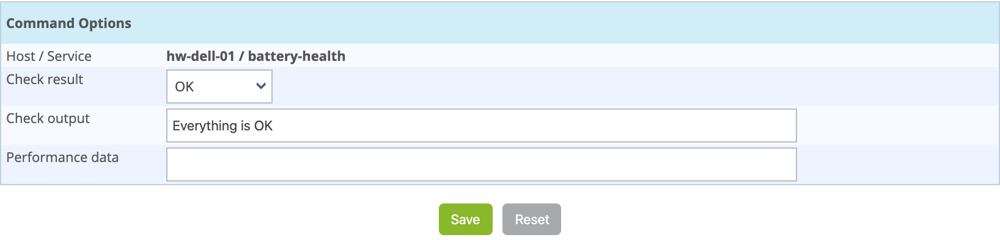

## Soumettre un résultat

### Principe

Pour les services ayant la propriété de contrôle passif, il est possible
d'envoyer manuellement un résultat à l'ordonnanceur afin que celui-ci
soit pris en compte par l'ordonnanceur.

### En pratique

Pour soumettre un résultat, accédez à la page de détails de l'objet.
Dans la catégorie **Service Commands** cliquez sur **Submit result for
this service**

La fenêtre suivante s'affiche :

-   Les champs **Host Name** et **Service** définissent l'hôte et le
    service pour lequel le résultat sera soumis
-   Le champ **Check result**définit le statut du service
-   Le champ **Check output** définit le message à afficher pour le
    service
-   Le champ **Performance data** permet de définir des données de
    performances pour la génération des graphiques

