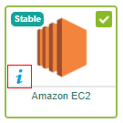
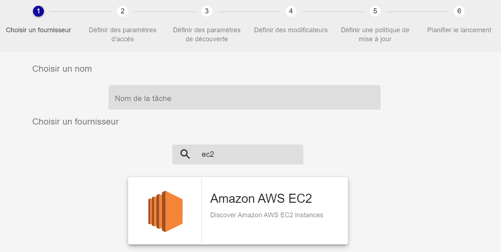
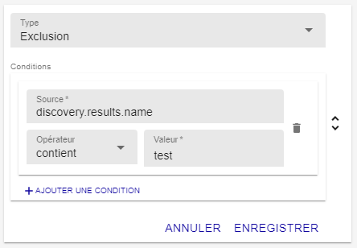
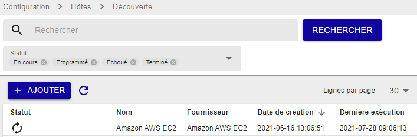
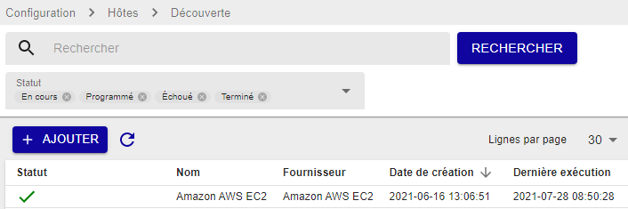
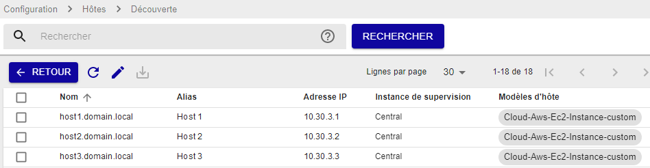

Dans ce tutoriel, nous allons utiliser le module [Auto Discovery](../monitoring/discovery/hosts-discovery.html) pour détecter des instances AWS EC2 et les mettre en supervision.

## Prérequis

Vous devez disposer des informations d'identification pour le groupe d'instances AWS que vous souhaitez superviser (nom, AWS Access Key et AWS Secret Key), et de la région dans laquelle se trouvent vos instances.

## Étape 1 : Installer le plugin Amazon EC2

1. Assurez-vous que votre [licence](../administration/licenses.html) commerciale ou votre licence gratuite [IT-100](IT100.html) est installée.

2. [Installez](../monitoring/discovery/installation.html) le module d'autodécouverte.

3. Rendez les Plugin Packs disponibles :

    - Si vous avez une licence hors ligne, dans le terminal de votre serveur central, entrez :
     
        ```shell
        yum install centreon-pack-*
        ```

    - Si vous avez une licence en ligne, les Plugin Packs sont déjà disponibles dans l'interface.

4. Pour installer le Plugin Pack Amazon EC2, allez à la page **Configuration > Packs de plugins**.

5. Dans le champ **Keyword**, entrez **Amazon EC2** puis cliquez sur **Rechercher**.

6. Cliquez sur le `+` dans le coin supérieur droit du Plugin Pack. Le Plugin Pack a maintenant une bordure verte et une coche dans le coin supérieur droit : les modèles de configuration et les fournisseurs de découverte sont maintenant installés.

7. Suivez [cette procédure](../integrations/plugin-packs/procedures/cloud-aws-ec2.html)
 (sections [Plugin dependencies](../integrations/plugin-packs/procedures/cloud-aws-ec2.html#plugin-dependencies) et 
[Setup](../integrations/plugin-packs/procedures/cloud-aws-ec2.html#setup)) pour finir d'installer le Plugin Pack. (Vous pouvez également accéder à la documentation d'un Plugin Pack en cliquant sur le `i`.)

    

## Étape 2 : Configurer la tâche de découverte

3. Allez à la page **Configuration > Hôtes > Découverte**, puis cliquez sur **Ajouter**.

4. Entrez un nom pour votre tâche de découverte, puis sélectionnez le fournisseur **Amazon AWS EC2**. Cliquez sur **Suivant**.

    

4. Si votre infrastructure le demande, renseignez les détails du proxy désiré.

5. Cliquez sur le `+` à droite de la liste **Choisir des identifants**. Renseignez les champs nom, AWS Access Key et AWS Secret Key, 
puis cliquez sur **Confirmer**. Cliquez sur **Suivant**.

6. Entrez la région où se situent vos instances EC2 (par exemple, **eu-north-1**). Cliquez sur **Suivant**.

7. Éditez ou ajoutez des [modificateurs](../monitoring/discovery/hosts-discovery.html#comment-utiliser-les-modificateurs) :
    - Faites correspondre `host.name` à l'attribut `discovery.results.name`. Les noms de vos hôtes dans Centreon seront ceux définis dans cet attribut (c'est-à-dire le hostname de l'instance).
    - Dans notre exemple, nous allons exclure les instances dont le hostname contient "test".

    

    Cliquez sur **Suivant**.

8. Sélectionnez **Analyse manuelle** : nous devrons ajouter manuellement les hôtes à la liste des hôtes à superviser. Cliquez sur **Suivant**.

9. Sélectionnez **Exécuter immédiatement** puis cliquez sur **Finir**. La tâche de découverte apparaît dans la liste des tâches.
    
    

## Étape 3 : Sauvegarder les hôtes et les mettre en supervision

10. Après quelques secondes, rafraîchissez la page. Une coche verte devrait apparaître dans la colonne **Statut**.

    

11. Survolez la ligne correspondant à la tâche qui vient de se terminer puis cliquez sur **Display the job result** (l'icône flèche). Une liste d'hôtes apparaît.

    

12. Sélectionnez les hôtes que vous souhaitez ajouter à la liste des hôtes supervisés, puis cliquez sur **Enregistrer**. 

13. Allez à la page **Configuration > Hôtes > Hôtes** et vérifiez que les hôtes que vous avez sélectionnés à l'étape précedente apparaissent bien dans la liste. Attention, les hôtes ont été ajoutés à la liste des hôtes mais ils ne sont pas encore supervisés.

14. [Déployez la configuration](../monitoring/monitoring-servers/deploying-a-configuration.html). Les hôtes apparaissent à la page **Statut des ressources** : ils sont maintenant supervisés.

