Bonjour et bienvenu ! Nous sommes heureux que vous ayiez décidé de mettre en place la
supervision de votre IT via Centreon.  

Vous trouverez dans ce chapitre les information nécessaires à un démarrage rapide sur Centreon. Il est composé de 
plusieurs sections afin d'installer & utiliser rapidement Centreon suivis de quelques tutoriels.

* [Demandez votre essai gratuit](#demander-votre-essai-gratuit)
* [Installation rapide](#installation-rapide)
* [Première connexion à l'interface](#première-connexion-à-linterface)
* [Ajouter son jeton Centreon IT Edition](#ajouter-son-jeton-centreon-it-edition)
* [Principe de base de la supervision](#principe-de-base-de-la-supervision)
* [Superviser votre premier hôte](#superviser-votre-premier-hôte)
* [Deployer la configuration](#deployer-la-configuration)
* [Tutoriels pour profiter de votre supervision](introduction-tutorials.html)

## Demander votre essai gratuit

Centreon vous propose de tester gratuitement toutes les fonctionnalités de **Centreon IT Edition**.
Pour cela-, rendez-vous sur nos site internet dans la rubrique **[Essayez Centreon IT Edition](https://www.centreon.com/essai-gratuit/)**
et remplissez le formulaire :


Vous recevrez un email contenant votre **jeton** permettant d'essayer **Centreon IT Edition**.

Il est maintenant temps de passer au chapitre suivant pour installer votre plateforme Centreon.

## Installation rapide

Pour configurer votre première plateforme Centreon, nous vous suggérons d'utiliser une machine virtuelle prête à l'emploi.

**Prérequis**

Ces machines virtuelles sont disponibles au format OVA pour l'environnement VMware et OVF pour l'outil Oracle VirtualBox.
Celles-ci sont basées sur le système d'exploitation **Linux CentOS v7** incluant une installation de Centreon permettant
de démarrer en toute simplicité votre première supervision.

La machine virtuelle a besoin de :

- Processeur. Tout processeur Intel ou AMD récent avec au moins 2vCPU devrait faire l'affaire.
- Mémoire. Selon vos systèmes d'exploitation, vous aurez besoin d'au moins 1 Go de RAM. Pour profiter pleinement de
  l'expérience, vous avez besoin d'au moins 2 Go de mémoire libre.
- Espace disque. La machine virtuelle nécessite au moins 6,5 Go d'espace libre sur votre disque dur. Cependant, si
  vous souhaitez continuer à utiliser Centreon, il est recommandé d'avoir au moins 10 Go car sa taille augmentera avec
  le temps.
- Un accès Internet pour bénéficier de l'offre gratuite IT-100.

> Pour une installation plus personnalisée, les prérequis complets sont disponibles [ici](../installation/prerequisites.html).

### Download

Vous pouvez installer Centreon :

- [A partir de l'ISO](../installation/installation-of-a-central-server/using-centreon-iso.html)
- A partir des machines virtuelles prêtes à l'emploi :

Les machines virtuelles sont disponibles sur notre site de [téléchargement Centreon](https://download.centreon.com).

<!--DOCUSAURUS_CODE_TABS-->

<!--VMware environment-->
\
Accédez à **Fichier > Déployer le modèle OVF** et sélectionnez le **fichier OVA**. Parce que les sélections de menu sont
liées à votre configuration VMWare, nous ne pouvons pas fournir plus d'informations. Sachez que la meilleure pratique
consiste à utiliser l'option **Thin Provision** pour économiser autant d'espace libre que possible sur le disque.

<!--Oracle Virtualbox-->
\
Extraire le contenu de l'archive et double-cliquez sur le **fichier OVF**. Suivez les instructions pour importer la
machine virtuelle.

<!--END_DOCUSAURUS_CODE_TABS-->

Une fois votre machine virtuelle importée, vous devez **ajouter une carte réseau**. Modifiez les paramètres de la
machine virtuelle et d'une carte réseau. Sélectionnez le bon réseau associé pour accéder à Internet.

Vous pouvez maintenant démarrer la machine virtuelle.

#### Premier démarrage

Une fois que votre machine virtuelle a démarré. Vous devez vous y connecter via un terminal shell et effectuer les
opérations demandées.

> Il est impératif de compléter les instructions, notamment les opérations 4 et 5.

Une fois ces opérations effectuées, vous pouvez supprimer ce message en supprimant le fichier /etc/profile.d/centreon.sh.

#### Identifiants par défaut

- Le compte d'interface Web Centreon par défaut est : **admin / centreon**.
- Le compte d'administration du serveur (via SSH) est: **root / centreon**.
- Le mot de passe root du SGBD n'est pas initialisé.

> Pour des raisons de sécurité, nous vous recommandons fortement de modifier ces mots de passe après l'installation.

Vous pouvez maintenant continuer vers la première section de connexion.

## Première connexion à l'interface

Pour se connecter à l'interface se rendre à l'adresse : http://IP_ADDRESS/centreon

> Remplacer **IP_ADDRESS** par l'adresse IP ou FQDN du serveur web Centreon.

Renseigner le nom d'utilisateur et le mot de passe associé et cliquer sur le bouton **Connect** :


Vous êtes maintenant connecté à l'interface web Centreon.

### Présentation rapide des menus

L'interface web de Centreon est composée de plusieurs menus, chaque menu a une fonction bien précise :


* Le menu **Accueil** permet d'accéder au premier écran d'accueil après s'être connecté. Il résume l'état général de
  la supervision. Votre espace de travail peut être vide pour l'instant. Une fois que vous avez configuré les widgets
  personnalisables, vous verrez les données et les graphiques en fonction de votre personnalisation.
* Le menu **Supervision** regroupe l'état de tous les éléments supervisés en temps réel et en différé au travers de la
  visualisation des logs.
* Le menu **Vues** permet de visualiser et de configurer les graphiques de performances pour chaque élément du système
  d'informations.
* Le menu **Rapports** permet de visualiser de manière intuitive (via des diagrammes) l'évolution de la supervision sur
  une période donnée.
* Le menu **Configuration** permet de configurer l'ensemble des éléments supervisés ainsi que l'infrastructure de supervision.
* Le menu **Administration** permet de configurer l'interface web Centreon ainsi que de visualiser l'état général des serveurs.

### Choisissez la langue de l'interface utilisateur

Dans le bandeau, cliquez sur l'icône profile, puis cliquez sur **Edit profile**:


Dans la liste de sélection des langages, sélectionnez le vôtre :

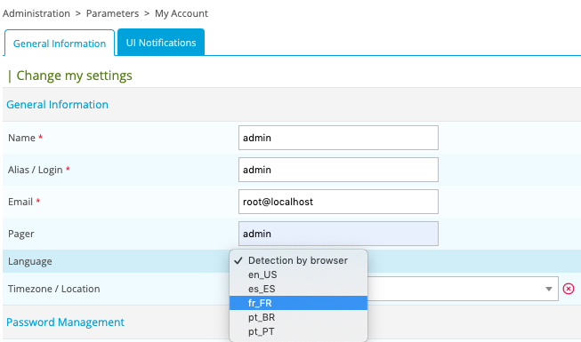

Puis cliquez sur **Save**. Votre interface est maintenant traduite dans votre
langue.

> Si votre langue n'apparaît pas dans la liste, vous pouvez aider la communauté Centreon à traduire l'interface web.
> Rendez-vous dans le chapitre [How to translate menu](../developer/developer-translate-centreon.html) pour plus d'informations.

## Ajouter son jeton Centreon IT Edition

> Votre jeton d'essai **Centreon IT Edition** vous est parvenu par mail.

Rendez-vous dans le menu **Administration > Extensions > Manager** et cliquez sur le bouton **Add Token** :


Une fenêtre s'ouvre, saisissez votre jeton et cliquez sur le bouton enregistrer :


Vous bénéficiez désormais de l'offre **Centreon IT Edition** limitée à la supervision de 100 ressources.

Continuez avec les chapitres suivants pour commencer à superviser votre système d'information.

## Principe de base de la supervision

Avant de commencer à superviser, voyons ensemble quelques notions principales :

* Un **hôte** (ou **host** en anglais) est tout équipement qui possède une adresse IP et que l'on souhaite superviser :
  un serveur physique, une machine virtuelle, une sonde de température, une caméra IP, une imprimante ou un espace de
  stockage, par exemple.
* Un **service** est un point de contrôle, ou indicateur, à superviser sur un hôte. Cela peut être le taux d'utilisation
  du CPU, la température, la détection de mouvement, le taux d'utilisation de la bande passante, les E/S disque, etc.
* Afin de mesurer chaque indicateur, on utilise des **sondes** de supervision (**plugin** en anglais) qui sont exécutées
  périodiquement par un moteur de collecte appelé **Centreon Engine**.
* Pour être exécutée, une sonde a besoin d'un ensemble d'arguments qui définissent par exemple à quel hôte se connecter
  ou via quel protocole. La sonde et ses arguments associés forment une **commande** (**command** en anglais).
  
Ainsi, superviser un hôte avec Centreon consiste à configurer l'ensemble des commandes nécessaires à la mesure des
indicateurs désirés, puis à déployer cette configuration sur le moteur de collecte afin que ces commandes soient
exécutées périodiquement.

Néanmoins, pour simplifier drastiquement la configuration on s'appuyera avantageusement sur des modèles de supervision :

* Un **modèle d'hôte** (**host template** en anglais) définit la configuration des indicateurs pour un type d'équipement donné.
* Il s'appuie sur des **modèles de service** (**service templates**) qui définissent la configuration des commandes
  nécessaires à la mesure de ces indicateurs.
* Centreon fournit des **Plugins Packs** téléchargeables à installer sur sa plateforme de supervision: chaque Plugin
  Pack regroupe modèles de hôte et de services pour configurer en quelques clics la supervision d'un équipement
  particulier.

Ce guide de démarrage rapide propose d'installer les modèles de supervision fournis gratuitement avec la solution
Centreon puis de les mettre en oeuvre pour superviser vos premiers équipements. 


> Pour aller plus loin avec les modèles de configuration, lisez le chapitre [modèles](../monitoring/templates.html).

### Installation des modèles de supervision de base

Rendez-vous dans le menu **Configuration > Plugin Packs**.

> Avant toute chose, appliquez la procédure de [configuration du proxy](../administration/parameters/centreon-ui.html#configuration-du-proxy)
> pour configurer et vérifier la connexion de votre serveur Centreon à Internet.

Commencez par installer le Plugin Pack **Base Generic** en déplaçant votre curseur sur ce dernier et en cliquant sur
l'icône **+** (il s'agit d'un pré-requis à l'installation de tout autre Plugin Pack) :


Vous pouvez aussi cliquer sur le Plugin Pack afin d'en connaître son contenu avant de l'installer :


Installez ensuite les Plugin Packs inclus gratuitement avec la solution, par exemple **Linux SNMP** et **Windows SNMP** :


Vous disposez maintenant des modèles de base pour configurer votre supervision !

## Superviser votre premier hôte

### Superviser un serveur Linux en SNMP

Rendez-vous dans le men **Configuration > Plugin Packs** et installez le Plugin Pack **Linux SNMP** :


Rendez-vous maintenant dans le men **Configuration > Hosts > Hosts** et cliquez sur le bouton **Add**:

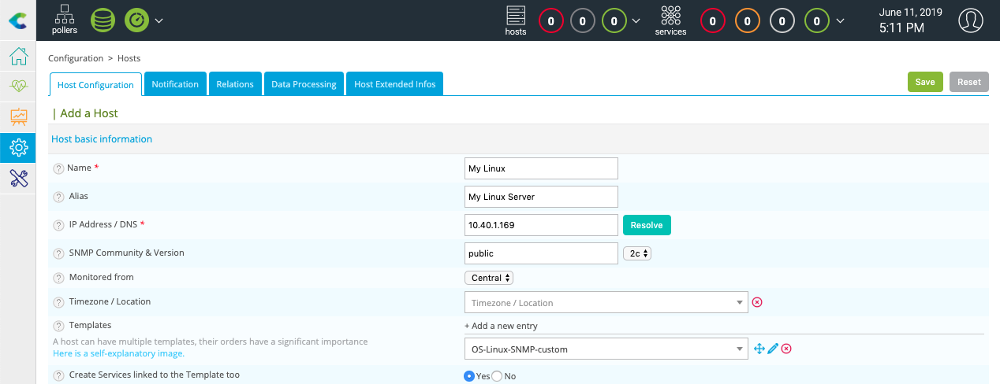

Renseignez les informations suivantes :

* Le nom de votre server
* Une description de votre serveur
* Son adresse IP
* La communauté et la version SNMP

Cliquez sur le bouton **+ Add a new entry** pour le champ **Templates** puis sélectionnez le modèle **OS-Linux-SNMP-custom**.

Cliquez sur le bouton **Save**.

Votre équipement a été ajouté à la configuration de la supervision :


Rendez-vous dans le menu **Configuration > Services > Services by host**. Un ensemble d'indicateurs a été déployé
automatiquement :

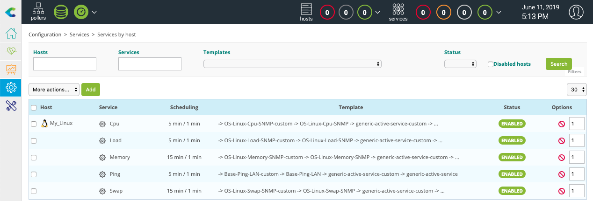

D'autres indicateurs peuvent être supervisés. Cliquez sur le bouton **Add** pour ajouter par exemple la supervision de
la bande passante d'une interface réseau :


Dans le champ **Description**, saisissez le nom du service à ajouter, puis sélectionner l'hôte auquel lier cet
indicateur. Dans le champ **Template** sélectionner le modèle **OS-Linux-Traffic-Generic-Name-SNMP-custom**.

Une liste de macros en correspondance avec le modèle va alors apparaître :


Saisissez le nom de votre interface pour la macro **INTERFACENAME** et cliquez sur le bouton **Save** pour ajouter cet
indicateur à la configuration.

Faites de même pour ajouter la supervision des erreurs de paquets :

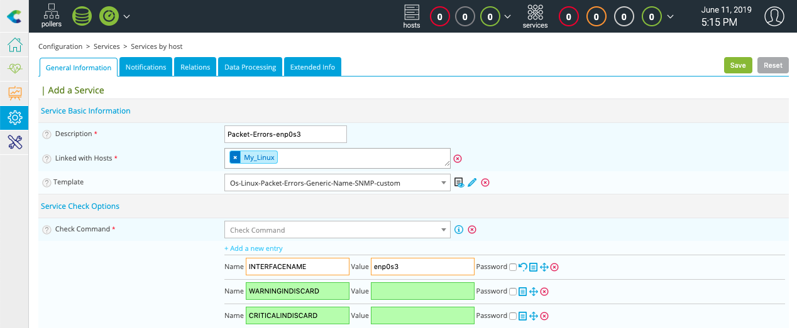

Ou la supervision d'une partition système :


Il est maintenant temps de [déployer la supervision](#déployer-une-configuration).

Rendez-vous ensuite dans le menu **Monitoring > Status Details > Services** et sélectionnez la valeur **All** pour le
filtre **Service Status**. Après quelques minutes, les premiers résultats de la supervision apparaissent :


#### Pour aller plus loin

Le Plugin Pack **Linux SNMP** apporte de nombreux modèles de supervision. Lors de la création d'un service, il est
possible de rechercher les modèles disponibles dans la liste de sélection :

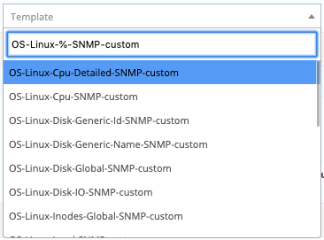

Il est également possible d'accèder au menu **Configuration > Services > Templates** pour en connaître la liste :


> Avec **Centreon IT Edition**, vous pouvez ajouter très rapidement et très simplement la surveillance de vos cartes
> réseau, partition, processus et services en utilisant la fonctionnalité de **[Découverte des services](../monitoring/discovery/services-discovery.html)**.

Pour connaître manuellement le nom des partitions disponibles, vous pouvez exécuter le plugin Centreon en ligne de commande tel quel :

```Shell
/usr/lib/centreon/plugins/centreon_linux_snmp.pl --plugin=os::linux::snmp::plugin \
    --hostname=10.40.1.169 --snmp-community=public --snmp-version=2c --mode=list-storages
```
Voici le résultat :
```Shel
List storage:
Skipping storage 'Physical memory': no type or no matching filter type
Skipping storage 'Swap space': no type or no matching filter type
Skipping storage 'Virtual memory': no type or no matching filter type
'/' [size = 21003583488B] [id = 31]
'/dev/shm' [size = 1986875392B] [id = 36]
'/run' [size = 1986875392B] [id = 38]
'/sys/fs/cgroup' [size = 1986875392B] [id = 39]
'/boot' [size = 1015308288B] [id = 57]
'/var/cache/centreon/backup' [size = 5150212096B] [id = 58]
'/var/lib/centreon-broker' [size = 5150212096B] [id = 59]
Skipping storage 'Memory buffers': no type or no matching filter type
'/var/lib/centreon' [size = 7264002048B] [id = 60]
'/var/log' [size = 10434662400B] [id = 61]
'/var/lib/mysql' [size = 16776032256B] [id = 62]
'/run/user/0' [size = 397377536B] [id = 63]
Skipping storage 'Cached memory': no type or no matching filter type
Skipping storage 'Shared memory': no type or no matching filter type
```

Faites de même pour connaître la liste des interfaces réseau :

```Shell
/usr/lib/centreon/plugins/centreon_linux_snmp.pl --plugin=os::linux::snmp::plugin \
    --hostname=10.40.1.169 --snmp-community=public --snmp-version=2c --mode=list-interfaces
```
Voici le résultat : 
```Shell
List interfaces:
'lo' [speed = 10, status = up, id = 1]
'enp0s3' [speed = 1000, status = up, id = 2]
```

### Superviser un serveur Windows en SNMP

Rendez-vous dans le menu **Configuration > Plugin Packs** et installez le Plugin Pack **Windows SNMP** :

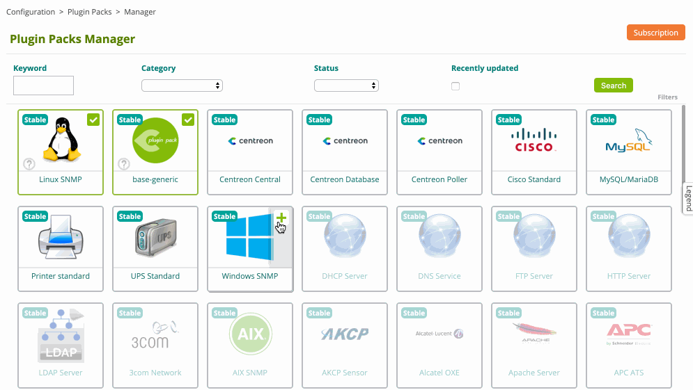

Rendez-vous maintenant dans le menu **Configuration > Hosts > Hosts** et cliquez sur le bouton **Add** :


Renseignez les informations suivantes :

* Le nom de votre server
* Une description de votre serveur
* Son adresse IP
* La communauté et la version SNMP

Cliquez sur le bouton **+ Add a new entry** pour le champ **Templates** puis
sélectionnez le modèle **OS-Windows-SNMP-custom**.

Cliquez sur le bouton **Save**.

Votre équipement a été ajouté à la configuration de la supervision :

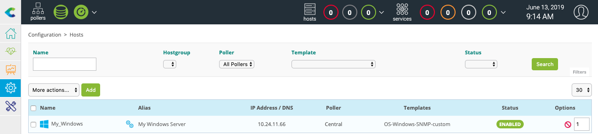

Rendez-vous dans le menu **Configuration > Services > Services by host**. Un ensemble d'indicateurs a été déployé
automatiquement :


D'autres indicateurs peuvent être supervisés. Cliquez sur le bouton **Add** pour ajouter par exemple la supervision
de la partition C :


Dans le champ **Description**, saisissez le nom du service à ajouter, puis sélectionner l'hôte auquel lier cet
indicateur. Dans le champ **Template** sélectionner le modèle **OS-Windows-Disk-Generic-Name-SNMP-custom**.

Une liste de macros en correspondance avec le modèle va alors apparaître :


Saisissez le nom de votre partition pour la macro **DISKNAME**, ajoutez la valeur **--regexp** pour la macro
**EXTRAOPTIONS** afin de ne pas donner le nom complet de la partition et cliquez sur le bouton **Save** pour ajouter
cet indicateur à la configuration.

Faites de même pour ajouter la supervision de la bande passante des interfaces réseau :


Il est maintenant temps de [déployer la supervision](#déployer-une-configuration).

Rendez-vous ensuite dans le menu **Monitoring > Status Details > Services** et sélectionnez la valeur **All** pour le
filtre **Service Status**. Après quelques minutes, les premiers résultats de la supervision apparaissent :


#### Pour aller plus loin

Le Plugin Pack **Windows SNMP** apporte de nombreux modèles de supervision. Lors de la création d'un service, il est
possible de rechercher les modèles disponibles dans la liste de sélection :


Il est également possible d'accèder au menu **Configuration > Services > Templates** pour en connaître la liste :


> Avec **Centreon IT Edition**, vous pouvez ajouter très rapidement et très simplement la surveillance de vos cartes
> réseau, partition, processus et services en utilisant la fonctionnalité de **[Découverte des services](../monitoring/discovery/services-discovery.html)**.

Pour connaître manuellement le nom des partitions disponibles, vous pouvez exécuter le plugin Centreon en ligne de commande tel quel :

```Shell
/usr/lib/centreon/plugins/centreon_windows_snmp.pl --plugin=os::windows::snmp::plugin \
    --hostname=10.24.11.66 --snmp-version='2c' --snmp-community='public' --mode=list-storages
```
Voici le résultat : 
```Shell
List storage:
'C:\ Label:  Serial Number 2cb607df' [size = 53317988352B] [id = 1]
Skipping storage 'Virtual Memory': no type or no matching filter type
Skipping storage 'Physical Memory': no type or no matching filter type
```

Faites de même pour connaître la liste des interfaces réseau :

```Shell
/usr/lib/centreon/plugins/centreon_windows_snmp.pl --plugin=os::windows::snmp::plugin \
    --hostname=10.24.11.66 --snmp-version='2c' --snmp-community='public' --mode=list-interfaces
```
Voici le résultat :
```Shell
List interfaces:
'loopback_0' [speed = 1073, status = up, id = 1]
'ethernet_3' [speed = , status = notPresent, id = 10]
'ppp_1' [speed = , status = notPresent, id = 11]
'ethernet_10' [speed = 1000, status = up, id = 12]
'tunnel_4' [speed = 0.1, status = down, id = 13]
'ethernet_4' [speed = , status = up, id = 14]
'ethernet_5' [speed = , status = up, id = 15]
'ethernet_6' [speed = , status = up, id = 16]
'ethernet_7' [speed = , status = up, id = 17]
'ethernet_8' [speed = , status = up, id = 18]
'ethernet_9' [speed = , status = up, id = 19]
'tunnel_0' [speed = , status = down, id = 2]
'ethernet_11' [speed = 1000, status = up, id = 20]
'ethernet_12' [speed = 1000, status = up, id = 21]
'ethernet_13' [speed = 1000, status = up, id = 22]
'tunnel_1' [speed = , status = down, id = 3]
'tunnel_2' [speed = , status = down, id = 4]
'tunnel_3' [speed = , status = down, id = 5]
'ppp_0' [speed = , status = down, id = 6]
'ethernet_0' [speed = , status = up, id = 7]
'ethernet_1' [speed = , status = up, id = 8]
'ethernet_2' [speed = , status = up, id = 9]
```

### Superviser un routeur Cisco en SNMP

Rendez-vous dans le menu **Configuration > Plugin Packs** et installez le Plugin Pack **Cisco Standard** :


Rendez-vous maintenant dans le menu **Configuration > Hosts > Hosts** et cliquez sur le bouton **Add** :


Renseignez les informations suivantes :

* Le nom de votre server
* Une description de votre serveur
* Son adresse IP
* La communauté et la version SNMP

Cliquez sur le bouton **+ Add a new entry** pour le champ **Templates** puis sélectionnez le modèle
**Net-Cisco-Standard-SNMP-custom**.

Cliquez sur le bouton **Save**.

Votre équipement a été ajouté à la configuration de la supervision :


Rendez-vous dans le menu **Configuration > Services > Services by host**. Un ensemble d'indicateurs a été déployé
automatiquement :


D'autres indicateurs peuvent être supervisés. Cliquez sur le bouton **Add** pour ajouter par exemple la supervision de
la bande passante d'une interface réseau :


Dans le champ **Description**, saisissez le nom du service à ajouter, puis sélectionner l'hôte auquel lier cet
indicateur. Dans le champ **Template** sélectionner le modèle **Net-Cisco-Standard-Traffic-Generic-Name-SNMP-custom**.

Une liste de macros en correspondance avec le modèle va alors apparaître :

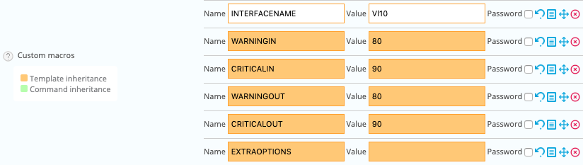

Saisissez le nom de votre interface pour la macro **INTERFACENAME** et cliquez sur le bouton **Save** pour ajouter cet
indicateur à la configuration.

Faites de même pour ajouter la supervision des erreurs de paquets :


Il est maintenant temps de [déployer la supervision](#déployer-une-configuration).

Rendez-vous ensuite dans le menu **Monitoring > Status Details > Services** et sélectionnez la valeur **All** pour le
filtre **Service Status**. Après quelques minutes, les premiers résultats de la supervision apparaissent :


#### Pour aller plus loin

Le Plugin Pack **Cisco Standard** apporte de nombreux modèles de supervision. Lors de la création d'un service, il est
possible de rechercher les modèles disponibles dans la liste de sélection :


Il est également possible d'accèder au menu **Configuration > Services > Templates** pour en connaître la liste :

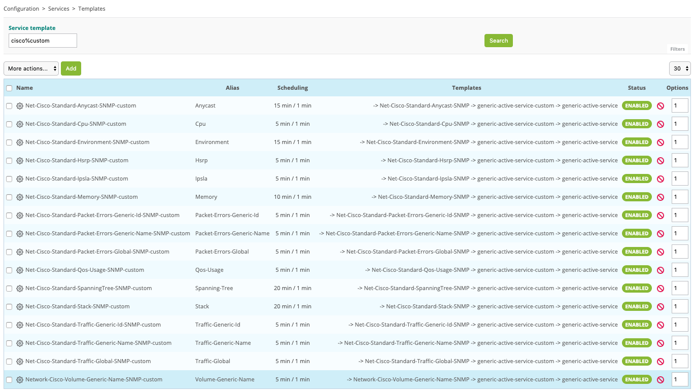

> Avec **Centreon IT Edition**, vous pouvez ajouter très rapidement et très simplement la surveillance de vos cartes
> réseau, partition, processus et services en utilisant la fonctionnalité de **[Découverte des services](../monitoring/discovery/services-discovery.html)**.

Pour connaître manuellement le nom des interfaces réseau disponibles, vous pouvez exécuter le plugin Centreon en ligne de commande tel quel :

```Shell
/usr/lib/centreon/plugins/centreon_cisco_standard_snmp.pl \
    --plugin=network::cisco::standard::snmp::plugin --hostname=10.40.1.254 \
    --snmp-community=mrthsrnrd --snmp-version=2c --mode=list-interfaces
```
Voici le résultat : 
```Shell
List interfaces:
'Gi1/0/1' [speed = 1000, status = up, id = 10101]
'Gi1/0/2' [speed = 1000, status = up, id = 10102]
'Gi1/0/3' [speed = 10, status = down, id = 10103]
'Gi1/0/4' [speed = 10, status = down, id = 10104]
'Gi1/0/5' [speed = 10, status = down, id = 10105]
'Gi1/0/6' [speed = 1000, status = up, id = 10106]
'Gi1/0/7' [speed = 10, status = down, id = 10107]
'Gi1/0/8' [speed = 10, status = down, id = 10108]
'Gi1/0/9' [speed = 10, status = down, id = 10109]
'Gi1/0/10' [speed = 10, status = down, id = 10110]
'Gi1/0/11' [speed = 10, status = down, id = 10111]
'Gi1/0/12' [speed = 10, status = down, id = 10112]
'Gi1/0/13' [speed = 10, status = down, id = 10113]
'Gi1/0/14' [speed = 10, status = down, id = 10114]
'Gi1/0/15' [speed = 10, status = down, id = 10115]
'Gi1/0/16' [speed = 10, status = down, id = 10116]
'Gi1/0/17' [speed = 1000, status = up, id = 10117]
'Gi1/0/18' [speed = 10, status = down, id = 10118]
'Gi1/0/19' [speed = 10, status = down, id = 10119]
'Gi1/0/20' [speed = 100, status = up, id = 10120]
'Gi1/0/21' [speed = 10, status = down, id = 10121]
'Gi1/0/22' [speed = 1000, status = up, id = 10122]
'Gi1/0/23' [speed = 10, status = down, id = 10123]
'Gi1/0/24' [speed = 1000, status = up, id = 10124]
'Gi1/0/25' [speed = 10, status = down, id = 10125]
'Gi1/0/26' [speed = 10, status = down, id = 10126]
'Gi1/0/27' [speed = 10, status = down, id = 10127]
'Gi1/0/28' [speed = 10, status = down, id = 10128]
```

Ou pour récupérer la liste des spanning-tree :

```Shell
/usr/lib/centreon/plugins/centreon_cisco_standard_snmp.pl \
    --plugin=network::cisco::standard::snmp::plugin --hostname=10.40.1.254 \
    --snmp-community=mrthsrnrd --snmp-version=2c --mode=list-spanning-trees
```
Voici le résultat : 
```Shell
List ports with Spanning Tree Protocol:
[port = GigabitEthernet1/0/20] [state = forwarding] [op_status = up] [admin_status = up] [index = 10120]
[port = Port-channel1] [state = forwarding] [op_status = up] [admin_status = up] [index = 5001]
```

### Superviser une base de données MySQL ou MariaDB

Rendez-vous dans le menu **Configuration > Plugin Packs** et installez le Plugin Pack **MySQL/MariaDB** :

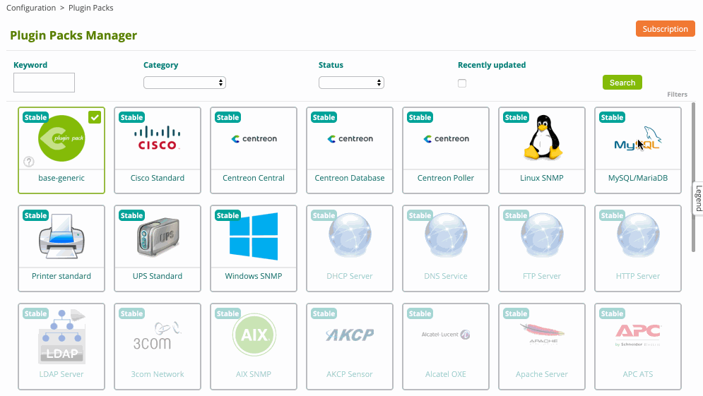

Rendez-vous maintenant dans le menu **Configuration > Hosts > Hosts** et cliquez sur le bouton **Add** :


Renseignez les informations suivantes :

* Le nom de votre server
* Une description de votre serveur
* Son adresse IP

Cliquez sur le bouton **+ Add a new entry** pour le champ **Templates** puis sélectionnez le modèle
**App-DB-MySQL-custom**.

Une liste de macros en correspondance avec le modèle va alors apparaître :


Renseigner la valeur des macros suivantes :

* **MYSQLUSERNAME** : le nom de l'utilisateur pour se connecter à la base de données.
* **MYSQLPASSWORD** : le mot de passe associé à l'utilisateur.
* **MYSQLPORT** : le port d'écoute de la base de données, par défaut 3306.

Puis, cliquez sur le bouton **Save**.

Votre équipement a été ajouté à la configuration de la supervision :


Rendez-vous dans le menu **Configuration > Services > Services by host**. Un ensemble d'indicateurs a été déployé
automatiquement :


Il est maintenant temps de [déployer la supervision](#déployer-une-configuration).

Rendez-vous ensuite dans le menu **Monitoring > Status Details > Services** et sélectionnez la valeur **All** pour le
filtre **Service Status**. Après quelques minutes, les premiers résultats de la supervision apparaissent :


#### Pour aller plus loin

Le Plugin Pack **MySQL/MariaDB** apporte de nombreux modèles de supervision. Lors de la création d'un service, il est
possible de rechercher les modèles disponibles dans la liste de sélection :


Il est également possible d'accèder au menu **Configuration > Services > Templates** pour en connaître la liste :

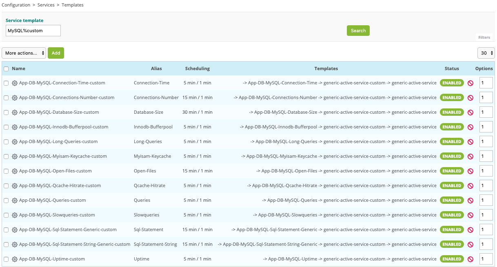

### Superviser une imprimante en SNMP

Rendez-vous dans le menu **Configuration > Plugin Packs** et installez le Plugin Pack **Printer Standard** :


Rendez-vous maintenant dans le menu **Configuration > Hosts > Hosts** et cliquez sur le bouton **Add** :


Renseignez les informations suivantes :

* Le nom de votre server
* Une description de votre serveur
* Son adresse IP
* La communauté et la version SNMP

Cliquez sur le bouton **+ Add a new entry** pour le champ **Templates** puis
sélectionnez le modèle **HW-Printer-standard-rfc3805-custom**.

Cliquez sur le bouton **Save**.

Votre équipement a été ajouté à la configuration de la supervision :


Rendez-vous dans le menu **Configuration > Services > Services by host**. Un ensemble d'indicateurs a été déployé
automatiquement :


Il est maintenant temps de [déployer la supervision](#déployer-une-configuration).

Rendez-vous ensuite dans le menu **Monitoring > Status Details > Services** et sélectionnez la valeur **All** pour le
filtre **Service Status**. Après quelques minutes, les premiers résultats de la supervision apparaissent :


### Superviser un onduleur en SNMP

Rendez-vous dans le menu **Configuration > Plugin Packs** et installez le Plugin Pack **UPS Standard** :


Rendez-vous maintenant dans le menu **Configuration > Hosts > Hosts** et cliquez sur le bouton **Add** :


Renseignez les informations suivantes :

* Le nom de votre server
* Une description de votre serveur
* Son adresse IP
* La communauté et la version SNMP

Cliquez sur le bouton **+ Add a new entry** pour le champ **Templates** puis sélectionnez le modèle
**HW-UPS-Standard-Rfc1628-SNMP-custom**.

Cliquez sur le bouton **Save**.

Votre équipement a été ajouté à la configuration de la supervision :


Rendez-vous dans le menu **Configuration > Services > Services by host**. Un ensemble d'indicateurs a été déployé
automatiquement :


Il est maintenant temps de [déployer la supervision](#déployer-une-configuration).

Rendez-vous ensuite dans le menu **Monitoring > Status Details > Services** et sélectionnez la valeur **All** pour le
filtre **Service Status**. Après quelques minutes, les premiers résultats de la supervision apparaissent :


## Déployer une configuration

Lors de la création/suppression/modification des objets via l'interface de configuration, les changements effectués ne
sont pas appliqués de manière automatique aux serveurs de supervision. Afin de pouvoir appliquer les modifications
effectuées, il est nécessaire de suivre la procédure suivante ci-dessous.

#### Première étape

1. Rendez-vous dans le menu **Configuration > Pollers**
2. Choisissez les collecteurs sur lesquels exporter la configuration
3. Cliquez sur **Apply configuration**


4. Cochez les cases **Generate Configuration Files** et **Run monitoring engine debug (-v)**
5. Cliquez sur **Export**


Vérifier qu'aucune erreur n'apparait lors de la génération. 

> Si cela est le cas, corriger les erreurs et refaire la première étape.

#### Deuxième étape

1.	Décochez les cases **Generate Configuration Files** et **Run monitoring engine debug (-v)**
2.	Puis cochez les cases **Move Export Files** ainsi que **Restart Monitoring Engine**
3.	Cliquez sur **Export**


