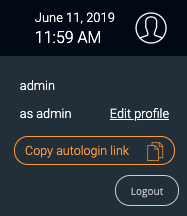

## Première connexion à l'interface

Pour vous connecter à l'interface web, rendez-vous à l'adresse : `http://ADRESSE_IP/centreon`.

> Remplacez **ADRESSE_IP** par l'adresse IP ou le FQDN du serveur web Centreon.

Renseignez le nom d'utilisateur et le mot de passe associé et cliquez sur le bouton **Connect** :

>Les identifiants par défaut sont : `admin`/`centreon`. 

Vous êtes maintenant connecté à l'interface web Centreon.

## Présentation rapide des menus

L'interface web de Centreon est composée de plusieurs menus, chaque menu a une fonction bien précise :

* Le menu **Accueil** contient vos [vues personnalisées](create-custom-view.html). Votre espace de travail peut être vide pour l'instant. Une fois que vous avez configuré les widgets
  personnalisables, vous verrez les données et les graphiques en fonction de votre personnalisation.
* Le menu **Supervision** regroupe l'état de tous les éléments supervisés en temps réel et en différé au travers de la
  visualisation des logs.
* Le menu **Vues** permet de visualiser et de configurer les graphiques de performances pour chaque élément du système
  d'informations.
* Le menu **Rapports** permet de visualiser de manière intuitive (via des diagrammes) l'évolution de la supervision sur
  une période donnée.
* Le menu **Configuration** permet de configurer l'ensemble des éléments supervisés ainsi que l'infrastructure de supervision.
* Le menu **Administration** permet de configurer la plateforme Centreon (authentification, proxy, extensions...) 
ainsi que de visualiser l'état général des serveurs.

## Langue de l'interface utilisateur

Dans le bandeau, cliquez sur l'icône profil, puis cliquez sur **Edit profile**:

Dans la liste de sélection des langues, sélectionnez la vôtre :

Puis cliquez sur **Save**. Votre interface est maintenant traduite dans votre
langue.

> Si votre langue n'apparaît pas dans la liste, vous pouvez aider la communauté Centreon à traduire l'interface web.
> Rendez-vous dans le chapitre [How to translate Centreon](../developer/developer-translate-centreon.html) pour plus d'informations.