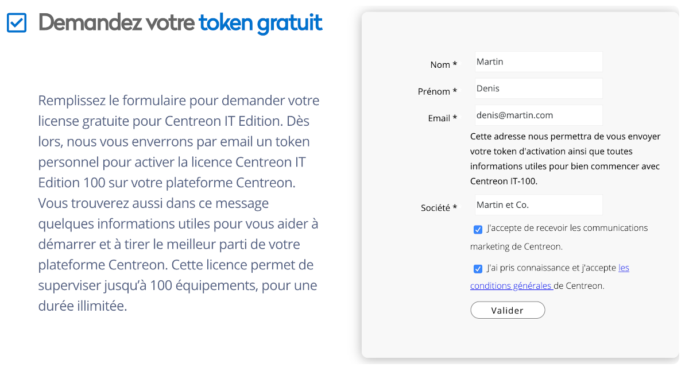
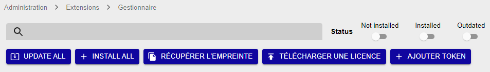

Centreon vous propose de tester gratuitement toutes les fonctionnalités de **Centreon IT Edition**, grâce à l'offre d'essai IT-100.

- Vous pourrez installer jusqu'à 3 serveurs centraux, et monitorer jusqu'à 100 hôtes. 
- Vous aurez accès à la fonctionnalité de [découverte automatique des hôtes](../monitoring/discovery/introduction.html), et à la totalité de la bibliothèque de [plugin packs Centreon](../integrations/plugin-packs/introduction.html).

Votre plateforme Centreon doit être connectée à internet pour que la licence IT-100 puisse fonctionner.

Pour plus d'informations, consultez notre [FAQ sur Centreon IT-100](https://www.centreon.com/faq/faq-centreon-it-100/).

## Procédure

1. Pour demander votre licence d'essai gratuite, rendez-vous sur notre site internet à la page **[Essayez Centreon IT Edition](https://www.centreon.com/essai-gratuit/)**
et remplissez le formulaire suivant :

    

    Vous recevrez un email contenant votre jeton permettant d'essayer **Centreon IT Edition**.

2. Installez Centreon rapidement en utilisant une [machine virtuelle prête à l'emploi](../installation/installation-of-a-central-server/using-virtual-machines.html).

3. Connectez-vous à l'interface :
    1. Allez l'adresse : `http://ADDRESSE_IP/centreon`.

        > Remplacer **ADDRESSE_IP** par l'adresse IP ou le FQDN du serveur web Centreon.

    2. Renseigner le nom d'utilisateur et le mot de passe associé et cliquer sur le bouton **Connect** :

        
      
        Les identifiants par défaut sont `admin`/`centreon`.

4. Ajoutez le jeton Centreon IT Edition que vous avez reçu par email.
    > Avant toute chose, appliquez la procédure de [configuration du proxy](../administration/parameters/centreon-ui.html#configuration-du-proxy) pour configurer et vérifier la connexion de votre serveur Centreon à Internet.

      1. Rendez-vous dans le menu **Administration > Extensions > Manager** et cliquez sur le bouton **Add Token** :

          

      2. Une fenêtre s'ouvre. Saisissez votre jeton et cliquez sur le bouton **Enregistrer** :

          

5. Votre plateforme est maintenant prête. Vous pouvez [superviser votre premier hôte](first-supervision.html). Consultez également nos [tutoriels](introduction-tutorials.html).