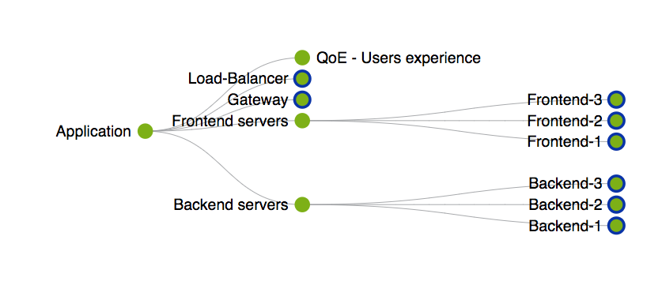
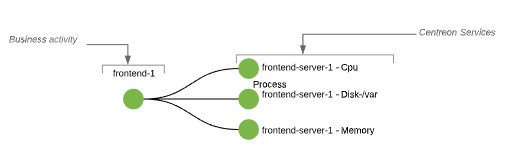
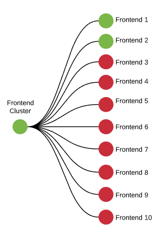
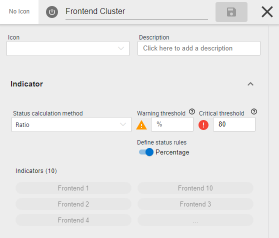

L'extension Centreon BAM est utilisée pour modéliser des services IT et applications
mis à disposition des utilisateurs finaux. Il permet de connaître en
temps réel l'état du service fourni et d'en suivre l'évolution afin
de comparer les résultats à des engagements (SLA) pris auprès des
métier, utilisateurs internes ou externes.

> Centreon BAM est une **extension** Centreon qui requiert une license valide. Pour plus d'information,
> contactez [Centreon](mailto:sales@centreon.com).

## Concepts

Un service IT ou une application, dans Centreon BAM, correspond à un
nouvel indicateur de supervision orienté "métier", appelé "Activité
métier" (Business Activity - BA), à partir d'une agrégation
d'indicateurs unitaires collectés par la supervision appelé indicateurs
ou KPI (KPI: Key Performance Indicators).

Les indicateurs sont soit des services au sens Centreon soit une règle logique
entre plusieurs services soit une autre activité métier. Le
nouvel objet créé à partir des KPis est appelé une Business Activity
(BA).

Il est possible d'utiliser des BA en tant qu'indicateurs d'autre BA afin de
créer des arbre d'impact et modéliser finement les services IT ou
applications que vous souhaitez analyser.

L'évolution du statut de la BA déterminera une qualité de service (Qos)
correspondant à la qualité rendu par l'application aux utilisateurs de
cette dernière. En s'appuyant sur cette mesure de Qos, on peut définir
les niveaux de fonctionnement la BA et ainsi des indicateurs de niveau
de service (SLA).

En cas de défaillance de la BA, il est possible d'analyser les
dysfonctionnements qui ont conduit à la baisse de la Qos et par
extension la diminution de la SLA.

Ci-dessous un exemple de ce qu'il est possible de modéliser dans
Centreon BAM.

## Introduction

La construction d'une BA et de ses KPI associés doit être réalisée de
manière *simple* et par étape. L'idéal est de commencer par intégrer les
indicateurs les plus évidents, ceux directement liés au fonctionnement général
de la BA puis d'ajouter au fur et à mesure celles qui ont un impact
potentiel sur le fonctionnement global.

Tous les indicateurs ajoutés aux BA doivent être initialement supervisés
par le système de supervision pour connaître leurs états de fonctionnement.

Une des notions importantes à comprendre lorsqu'on manipule des BA est la méthode de calcul appliquée. Il
y a quatre méthodes de calcul disponible afin de rendre compte de l'état d'une BA:

- **Best Status**: Lorsque vous souhaitez suivre le dysfonctionnement de TOUS les indicateurs au même moment
- **Worst Status**: Lorsque vous souhaitez savoir dès qu'un indicateur ne fonctionne plus
- **Ratio**: Lorsque vous souhaitez modéliser des concepts de **Cluster** en spécifiant un pourcentage ou un nombre
 de resources maximum en statut Critique que vous ne voulez pas dépassez
- **Impact**: Lorsque vous souhaitez définir finement l'impact de chaque indicateur en fonction de leurs poids (<=> sévérité)

Pour plus d'information sur les méthodes de calcul, consulter [ce chapitre](../service-mapping/ba-management.html#méthodes-de-calcul)

## Méthode d'implémentation

La première chose à faire avant de démarrer la création d'une activité métier dans Centreon est d'avoir parfaitement
en tête / sur papier, la composition de l'application ou du service métier cible que vous allez modéliser et de s'assurer 
que les indicateurs sont tous disponibles, c'est à dire supervisés, dans Centreon. 

**La visualisation** d'une activité métier se fait de haut en bas: vous souhaitez représenter une application "A", dont le 
fonctionnement repose sur des concepts Réseau, Backend & Frontaux, qui eux même reposent sur des serveurs et équipements réseaux dont le fonctionnement est déterminé par leurs *services* (au sens Centreon)

**La création** d'une activité métier se fait de bas en haut: vous partez des *services* pour donner une représentation
du statut des équipements réseau et servers pour ensuite les agréger en indicateur "Réseau", Frontaux, Backend pour enfin
créer un indicateur de plus haut niveau représentant l'application "A"

Maintenant que vous avez déterminé les indicateurs qui entrent dans
la composition de la BA, vous pouvez les catégoriser en deux catégories: 

-   Les indicateurs clés dont on sait qu'ils ont un impact bloquant
-   Les indicateurs clés dont on ne sait pas mesurer l'impact

> Dans un premier temps il est plus simple d'utiliser uniquement les indicateurs
> ayant des impacts "*Bloquants*".

## Exemple

Prenons un exemple assez simple: la modélisation d'un cluster de serveurs frontaux. Nous voulons nous assurer que 
20% au moins des serveurs sont fonctionnels.

Cela se fera en deux étapes (de bas en haut)

- Premièrement, définir ce qu'est un frontend server qui fonctionne en créant un premier niveau de BA
- Ensuite, définir la règle de clustering au dessus des BA en créant une BA parent

Définissons simplement ce qu'est un serveur frontend-x qui est ok:

- un serveur qui n'est pas surchargé (load qui n'est pas critique)
- un espace disque qui n'est pas proche de la saturation (statut critique dans Centreon)
- de la mémoire physique qui n'est pas proche de la saturation (statut critique dans Centreon)

Partant de ces règles, l'état d'un serveur frontal le plus approprié va être déterminé par la
 règle de calcul "Worst status". Voici un exemple avec le serveur (1)

 <!--DOCUSAURUS_CODE_TABS-->

<!-- Concept   -->

<!-- Configuration -->

<!--END_DOCUSAURUS_CODE_TABS-->

Maintenant que nous avons défini nos 10 serveurs frontaux en suivant cette règle, il est temps de créer notre BA 
principale: le cluster des serveurs frontaux. Nous allons pour cela utiliser la règle "Ratio" et défnir que ce Cluster
passera en Critique lorsque plus de 80% des serveurs frontaux seront non-ok.

<!--DOCUSAURUS_CODE_TABS-->

<!-- Concept   -->

<!-- Configuration -->

<!--END_DOCUSAURUS_CODE_TABS-->

Pour rajouter de la pro-activité dans notre gestion et éviter que le cluster comptent 80% de frontaux non fonctionnels,
nous pouvons également ajouter la règle suivant: à partir de 50% de serveurs frontaux non disponibles, nous voulons être
avertis

Au final nous obtenons cette activité métier "Frontend Cluster" nous permettant de suivre l'état de fonctionnement
général des serveurs frontaux. Il est également possible de ré-utiliser cette BA dans une autre, notamment une BA représentant le fonctionnement d'une application reposant sur ces serveurs.

 

En suivant au quotidien l'état de la BA, il sera possible de faire des ajustements afin de rendre compte de plus 
en plus précisemment de l'état du service ou de l'application représenté par la BA ou ses composants.

La valeur finale de la SLA est liée au temps passé dans les états
opérationnels, dégradés/critiques (indisponibilité/disponibilité),
visible dans les écrans de "reporting".

## Reporting 

Maintenant que vous êtes pro-actif sur la gestion de vos services IT et applications grâce à un suivi temps réel
de leur état, il est temps d'analyser la disponibilité par rapport aux SLA.
Cela est possible grâce à l'extension Centreon MBI et la configuration de la section "Reporting" de la BA.

**Comment la disponibilité est elle calculée ?**

La disponibilité est calculée par rapport au temps passé dans les status OK, Warning et Critical.

Exemples : 

-   Supervision 24x7 
-   Sur une période de 1 jour, le temps passé dans chaque seuil pour la BA: 
      - BA en statut OK = 23hours & 30min
      - BA en statut WARNING = 10 minutes
      - BA en statut CRITICAL = 20 minutes

Dans le cas présent, la disponibilité se calcul comme suit: 

-   % de disponibilité & performance optimale ~ 97,917% (Opérationnel)
-   % de disponibilité ~ 0,694% (Dégradé)
-   % d'indisponibilité ~ 1,388% (Critique)
