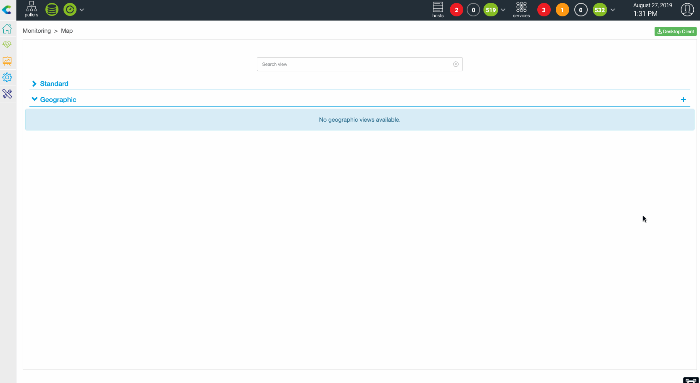
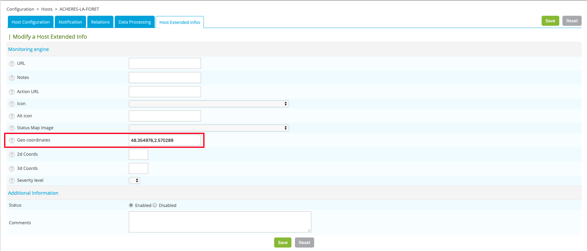
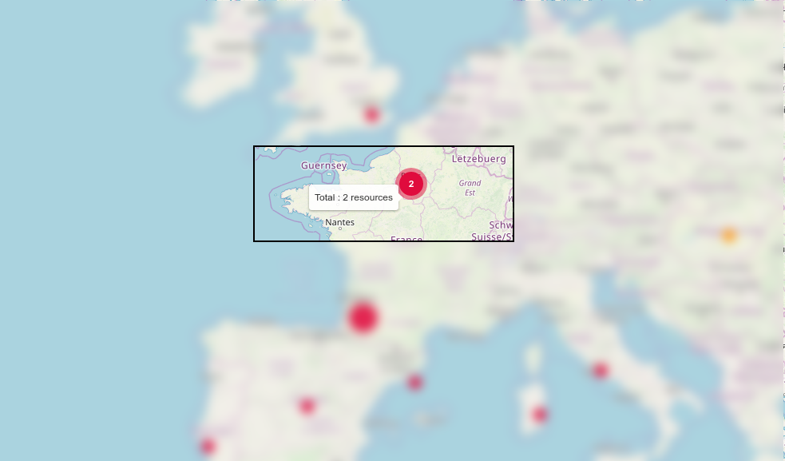
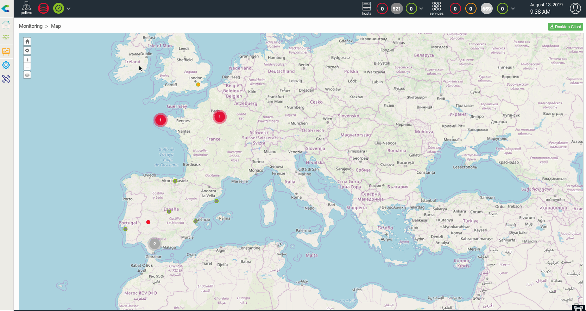

## Create a GeoView

A user that is a Centreon admin, or a Centreon Map admin or has right to create view can create geographic views
using the web interface, to do so:

1.  Go to *Monitoring \> Map* and click on the "+" on the Geographic section.
2.  You're asked to give a name to the view and then to define resources to
    display on the view.
3.  After configuring these parameters, resources will appear on this geographic
    view

The following resources can be displayed on a GeoView:

  - Hosts belonging to hostgroup(s)
  - Business Activity belonging to Business View(s)
  - One or multiple Hostgroup(s)

Pre-requisites: Define lat/long coordinate in the resources configuration form
for host, hostgroups or business activity.

Example with a host:

## How access control limitation (ACL) are handled

As soon as you give access to `Monitoring > Map` or to a custom view containing a Map widdget, GeoViews are
accessible to every Centreon user. A user will only see resources he is authorized to see, based on his ACL profile

## How resources are displayed

When a resource (host, hostgroup or a business activity) is positionned on a
geoview, it's displayed as a circle which colored is defined using the following
rules:

  - Host: worst state between the host and its services
  - Hostgroups: worst state of hosts belonging to the hostgroups
  - Business activity: current status

*Worst state order: Critical (red) \> Down (red) \> Warning(orange) \>
Unknown(gray) \> Unreachable(gray) \> Ok(green) \> Up(green) \> Pending(blue)*

### Clustering

When multiple resources are geographically close and you are at "certain" zoom
level, then they're grouped into one single circle displaying two things:

  - Status of the worst object (displayed as a color between green, orange, red
    and gray)
  - Number of resources in this state

*This behavior can be disabled in the global Centreon Map parameters*

### Blinking resources

If a resources is in a "not-ok" state, it blinks.

*This behavior can be disabled in the global Centreon Map parameters*

## Datalayers on Geoview

Centreon MAP gives you the possibility to display additionnal "data layers" on
maps to add context to your real time IT infrastructure status.

First you need to add data layers in Centreon Map option (`here
<layer_conf>`{.interpreted-text role="ref"}), then, if the data layer is
enabled, you may make it visible or not by checking the concerned layer using
the top left icon.

**Examples**

