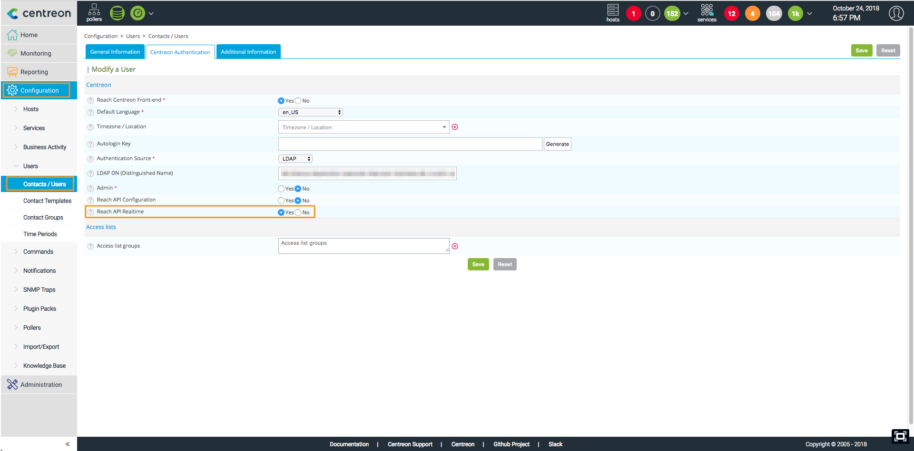

> Centreon MAP requires a valid license key. To purchase one and retrieve the
> necessary repositories, contact [Centreon](sales@centreon.com).

This chapter describes how to install Centreon MAP. The server must be installed
on a dedicated machine to allow Centreon MAP to operate with its own database
and avoid any potential conflict with the Centreon central server.

Before installation, be sure to review the Prerequisites chapter for system
requirements (CPU and memory). Remember to choose the best type of architecture
to suit your needs.

## Architecture

Centreon MAP consists of three components:

  - Centreon MAP Server, developed in Java, using Hibernate and CXF, and hosted
    by Tomcat
  - Centreon MAP Web interface, developed in Javascript, based on
    [Backbone.js](http://backbonejs.org/)
  - Centreon MAP Desktop Client, developed in Java, based on [Eclipse RCP
    4](https://wiki.eclipse.org/Eclipse4/RCP).

The diagram below summarizes the architecture:

**Table of network flow**

| **Application** | **Source** | **Destination**         | **Port**  | **Protocol** | **Purpose**                                         |
| --------------- | ---------- | ----------------------- | --------- | ------------ | --------------------------------------------------- |
| Map Server      | Map server | Centreon central broker | 5758      | TCP          | Get real-time status updates                        |
| Map Server      | Map server | Centreon MySQL database | 3306      | TCP          | Retrieve configuration and other data from Centreon |
| Map Server      | Map server | Map server database     | 3306      | TCP          | Store all views and data related to Centreon MAP    |
| Web + Desktop   | Map server | Centreon central        | 80/443    | HTTP/HTTPS   | Authentication & data retrieval                     |
| Web interface   | User       | Map server              | 8080/8443 | HTTP/HTTPS   | Retrieve views & content                            |
| Web interface   | User       | Internet\* (Mapbox)     | 443       | HTTPS        | Retrieve Mapbox data                                |
| Desktop client  | User       | Map server              | 8080/8443 | HTTP/HTTPS   | Retrieve and create views & content                 |
| Desktop client  | User       | Internet\* (Mapbox)     | 443       | HTTPS        | Retrieve Mapbox data                                |
| Desktop client  | User       | Internet\* (p2 repo)    | 80        | HTTP         | Retrieve automatic desktop client update            |

\* *With or without a proxy*

## Prerequisites

### Centreon

The required version of Centreon software for compatibility with Centreon MAP is
**Centreon 20.04**

**Centreon must be installed using the RPM packages.**

### Centreon MAP Server

**License**

The server requires the license to be available and valid on Centreon's central
server. To do this, you must contact the support [Centreon support
team](https://centreon.force.com/) to get & install your license key.

**Hardware**

Hardware requirements for your dedicated Centreon MAP server are as follows:

| *Monitored services*     | \< 10 000               | \< 20 000            | \< 40 000            | \> 40 000            |
| ------------------------ | ----------------------- | -------------------- | -------------------- | -------------------- |
| *CPU*                    | 2 vCPU ( 3Ghz ) minimum | 4 CPU (3GHz) Minimum | 4 CPU (3GHz) Minimum | Ask Centreon Support |
| *Dedicated Memory*       | 2GB                     | 4GB                  | 8GB                  | Ask Centreon Support |
| *MySQL data partition*   | 2GB                     | 5GB                  | 10GB                 | Ask Centreon Support |

To correctly implement the dedicated memory, you have to edit the *JAVA\_OPTS*
parameter in the Tomcat configurations file `/etc/tomcat/tomcat.conf` and
restart the service:

    JAVA_OPTS="-Xms512m -Xmx4G"

NB: The Xmx value depends on the amount of memory indicated in the above table.

and restart the service: 

  systemctl restart centreon-map

The space used by Centreon MAP server is directly determined by the number of
elements you add into your views. An element is any graphical object in Centreon
MAP. Most elements (like hosts, groups, etc.) have children which must be
included in the count.

> These values are applied after optimization of Centreon MAP tables.

**Software**

  - OS: CentOS 7 / Redhat 7
  - DBMS: MariaDB 10.2
  - Firewall: Disabled
  - SELinux: Disabled

**Information required during configuration**

  - Centreon Web login with admin rights.

> Even with a correctly sized server, you should have in mind the best practices
> & recommandations when creating views so you don't face performance issues.

### Centreon MAP Web interface

**License**

The web interface requires the license to be available and valid on Centreon's
central server. To do this, you must contact the support [Centreon support
team](https://centreon.force.com/) to get & install your license key.

**Compatibility**

The Centreon MAP Web interface is compatible with the following web browsers:

  - Firefox (latest version)
  - Chrome (latest version)
  - Safari (latest version).

Resolution must be at least 1280 x 768.

### Centreon MAP Desktop Client

  - 4 GB of RAM minimum, 8 GB advised (mandatory for 10,000 or more services)
  - **Java 64 bits version 8**
  - Resolution must be at least 1280 x 768.

> Desktop Client is not compatible with Microsoft Windows Server. \* If a
> version of Java other than 8 is installed, consider installing Java 8 and
> modifying Centreon-Map4.ini to add the following line `-vm
> \$path\_to\_java8\$` BEFORE `-vmwargs`.

To optimize the desktop client, you have to "give" it more memory than the
default value. To do so, modify the Centreon-Map4.ini\* file and add the
following parameters:

    -Xms512m
    -Xmx4Go

Note: The Xmx value is the maximum memory used by the application (i.e, if your
computer has 4 Go RAM, set this value to 3GB maximum (or 75% of the maximum).

Depending on your OS, the file is located in one of this directories:

  - WINDOWS: *C:\[USER\]\[AppdatalocaleCentreon-map4unstableCentreon-Map4.ini*
  - LINUX: */opt/centreon-map4-desktop-client/Centreon-Map4.ini*

### Network requirements

Centreon MAP Server machine must access:

  - Centreon Central broker, usually on Centreon Central machine, using TCP port
    5758
  - Centreon Database, usually on Centreon Central machine, using TCP port 3306
  - Centreon MAP database, usually on localhost, using TCP port 3306.

All the ports above are default values and can be changed if needed.

  - Centreon Web Central, using HTTP port 80 or HTTPS port 443

Centreon MAP Desktop Client machines must access:

  - Centreon MAP Server, using HTTP port 8080 or 8443 when HTTPS/TLS is enabled
  - Internet with or without proxy.

Ports 8080 and 8443 are recommanded default values, but other configurations are
possible.

## Server installation

### Centreon Web interface

The Centreon MAP server requires a dedicated user who has access to all
resources. Since the password will be stored in human-readable form in a
configuration file, you should not use a Centreon admin user account.

Provide this user with access to the Centreon Web real-time API:

### Centreon Central server

Create a user in the mysql instance hosting 'centreon' and 'centreon\_storage'
databases:

    # mysql

    > CREATE USER 'centreon_map'@'<IP_SERVER_MAP>' IDENTIFIED BY 'centreon_map';
    > GRANT SELECT ON centreon_storage.* TO 'centreon_map'@'<IP_SERVER_MAP>';
    > GRANT SELECT, INSERT ON centreon.* TO 'centreon_map'@'<IP_SERVER_MAP>';

The INSERT privilege will only be used during the installation process in order
to create new Centreon Broker output. It will be revoked later.

### Centreon MAP server

Install Centreon MAP from the Centreon MAP yum repository. It will automatically
install java (OpenJDK 11) and Tomcat if needed. You need to have a MySQL/MariadDB database to
store Centreon Map data, wether it's on localhost or somewhere else.

If you installed your Centreon Map server from a "fresh CentOS installation" you
need to install the Centreon-Release package : :

    yum install http://yum.centreon.com/standard/20.04/el7/stable/noarch/RPMS/centreon-release-20.04-1.el7.centos.noarch.rpm

*If the URL doesn't work, you can manualy find this package in the folder*

Then install Centreon Map server using the following command:

    yum install centreon-map-server

### Configuration

Make sure the database that stores Centreon MAP data is optimized (automatically
added by the RPM in /etc/my.cnf.d/map.cnf):

    max_allowed_packet=20M
    innodb_log_file_size = 200M

Then, restart MySQL:

    systemctl restart mysql

Execute the Centreon MAP server configuration script:

    /etc/centreon-studio/configure.sh

### Central server

> Before restarting Broker you must export the configuration from the Centreon
> Web interface.

Restart Centreon Broker on the Central server:

    systemctl restart cbd

Remove the INSERT privilege from user centreon\_map:

    REVOKE INSERT ON centreon.* FROM 'centreon_map'@'<IP_SERVER_MAP>';

### Centreon MAP server

Check your configuration:

    /etc/centreon-studio/diagnostic.sh

If the configuration is correct, then start Tomcat from the Centreon MAP server:

    # systemctl restart centreon-map

### Verifying your installation

Once your server is started, you can check if all its APIs are up and running by
entering the following URL in your favorite web browser:

If your server is running in http mode:
http://\<IP\_SERVER\_MAP\>:8080/api/beta/actuator/health.

If your server is running in HTTPS mode:
https://\<IP\_SERVER\_MAP\>:8443/api/beta/actuator/health.

Installation of the Centreon MAP server is complete. If you want to configure
the SSL, go to this page: `Advanced Centreon MAP Configuration
<advanced_configuration>`{.interpreted-text role="ref"}.

## Web Interface installation

### Central server

    yum install centreon-map-web-client

### Web

Go to *Centreon \> Administration \> Extensions* and click on the install
button:

  - License Manager (*if not yet installed*)
  - Map Web Client

You can see a red stripe asking for a license.

Upload the license *map.license* given by the support team. Refresh the page and
the banner must be green with the valid license date.

Click on Back to return to the Extensions page. Now that the module is
installed, we will configure it.

### Configuration

Go to *Administration \> Extensions \> Options*, and in the Centreon MAP menu
update the Centreon MAP server address field:

> Use the real IP address/hostname of your Centreon MAP server.

### Using the client

The Centreon MAP Web interface is now available in Centreon -\> Monitoring -\>
MAP.

### Centreon MAP Widget

By installing the Web interface, you automatically add the Centreon MAP Widget,
but you need to perform one last task. Go to *Centreon \> Administration \>
Extensions* and click on the "Install" button on the widget. The result after
installed:

## Desktop Client

### Executables

The desktop client is currently available only for **64-bit** Windows, Mac and
Linux platforms (Debian and Ubuntu).

You can find the installers in "Monitoring \> Map \> Desktop Client." or
[here](https://download.centreon.com/?action=product&product=centreon-map&version=20.04&secKey=9ae03a4457fa0ce578379a4e0c8b51f2).

> For performance considerations, we highly recommand to have less than 5, 10
> users maximum connected at the same time manipulating views.

### Installation

#### On user's computer

The desktop client requires **Java 8**. You can download and install the latest
version of Java from [here](https://java.com/fr/download/manual.jsp).

> Be sure to download the 64-bit version. Browsers are usually 32-bit and the
> Oracle website generally proposes 32-bit Java instead of the 64-bit version.
> If you already have Java installed, use the java -version command to check the
> architecture. If 64-bit does not appear, the version is 32-bit.

> On a Mac platform, note that you must install Oracle JDK instead of the
> usually-required JRE.

To check the Java version run the command:

    java -version

**For Windows:**

Execute centreon-map4-desktop-client\*.exe:

> You do not need to be the administrator of your computer to perform the
> installation. All the files are will be installed in your personnal folders.

The default installation folder is C:UsersuserAppDataLocalCentreon-Map4.

You can install the software at this location without administrator rights but
can change the destination to Program files if you have the sufficient rights.

Use the installer to install the software properly and integrate it into the
Windows environment. The installer can also be used to uninstall it from the
Windows dedicated configuration page.

**For Debian**

Download the provided DEB file and run the command from the root directory:

    sudo dpkg -i centreon-map4-desktop-client*.deb

Alternatively, you can open the DEB file using the Ubuntu software Center.

You should now be able to run Centreon-Map4.

    centreon-map4

You will also find it in the list of installed applications.

### Updates

Once installed, the Desktop Client is automatically kept up to date through an
online update system. When it connects to a Centreon MAP server it automatically
downloads and installs the latest version compatible with the server.
Auto-update requires your computer to have internet access.
