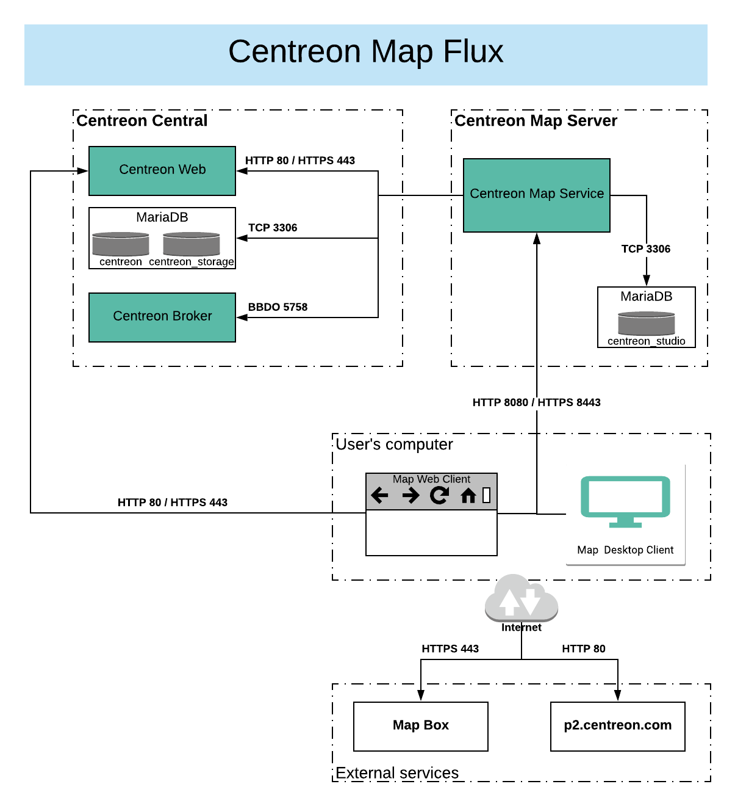
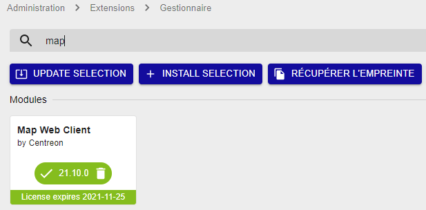
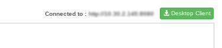
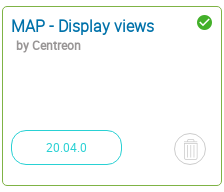

> Centreon MAP requière une licence valide. Pour en acheter une et récupérer les
> référentiels nécessaires, contactez [Centreon](mailto:sales@centreon.com).

Ce chapitre décrit comment installer Centreon MAP. Le serveur doit être
être installé sur une machine dédiée pour permettre à Centreon MAP de fonctionner avec
sa propre base de données et d'éviter tout conflit potentiel avec le serveur Centreon.

Avant l'installation, assurez-vous de consulter le chapitre sur les prérequis pour 
connaître la configuration requise (CPU et mémoire). N'oubliez pas de choisir le 
meilleur type d'architecture qui répond le mieux à vos besoins.

## Architecture

Centreon MAP se compose de trois éléments:

- Centreon MAP Server, développé en Java, utilise SpringBoot, Hibernate et CXF
- l'interface Web Centreon MAP, developpée en Javascript, et basée sur
  [Backbone.js](http://backbonejs.org/)
- le client Centreon MAP Desktop, developpé en Java, et basé sur [Eclipse RCP
  4](https://wiki.eclipse.org/Eclipse4/RCP).

Le schéma ci-dessous résume l'architecture:



**Tableau des flux réseaux**

| Application    | Source     | Destination               | Port      | Protocole  | Description                                                 |
|----------------|------------|---------------------------|-----------|------------|-------------------------------------------------------------|
| Map Server     | Map server | Centreon central broker   | 5758      | TCP        | Obtenir des mises à jour du statut en temps réel            |
| Map Server     | Map server | Centreon MariaDB database | 3306      | TCP        | Récupérer la configuration et d'autres données de Centreon  |
| Map Server     | Map server | Map server database       | 3306      | TCP        | Stocker toutes les vues et données relatives à Centreon MAP |
| Web + Desktop  | Map server | Centreon central          | 80/443    | HTTP/HTTPS | Authentification et récupération des données                |
| Web interface  | User       | Map server                | 8080/8443 | HTTP/HTTPS | Récupérer les vues et le contenu                            |
| Web interface  | User       | Internet\* (Mapbox)       | 443       | HTTPS      | Récupérer les données Mapbox                                |
| Desktop client | User       | Map server                | 8080/8443 | HTTP/HTTPS | Récupérer et créer des vues et du contenu                   |
| Desktop client | User       | Internet\* (Mapbox)       | 443       | HTTPS      | Récupérer les données Mapbox                                |
| Desktop client | User       | Internet\* (p2 repo)      | 80        | HTTP       | Récupérer la mise à jour automatique du client du bureau    |

\* *Avec ou sans proxy*

## Prérequis

### Centreon

La version du logiciel Centreon requise pour la compatibilité avec Centreon
MAP est **Centreon 21.04**

**Centreon doit être installé à partir des paquets RPM.**

### Centreon MAP Server

#### Licence

Le serveur exige que la licence soit disponible et valide sur le serveur central de Centreon. Pour ce faire, vous devez contacter le support [Centreon support
team](https://centreon.force.com/) pour obtenir et installer votre clé de licence.

#### Matériel

Les prérequis matériels pour votre serveur Centreon MAP sont les suivants:

| *Service supervisés*     | \< 10 000               | \< 20 000            | \< 40 000            | \> 40 000                     |
| ------------------------ | ----------------------- | -------------------- | -------------------- | ----------------------------- |
| *CPU*                    | 2 vCPU ( 3Ghz ) minimum | 4 CPU (3GHz) Minimum | 4 CPU (3GHz) Minimum | Contacter le support Centreon |
| *Memoire dédiée*         | 2GB                     | 4GB                  | 8GB                  | Contacter le support Centreon |
| *Partition data MariaDB* | 2GB                     | 5GB                  | 10GB                 | Contacter le support Centreon |

Pour mettre en œuvre correctement la mémoire dédiée, vous devez modifier le paramètre
*JAVA\_OPTS* dans le fichier de configuration de Centreon Map
`/etc/centreon-studio/centreon-map.conf` et redémarrer le service:

```text
JAVA_OPTS="-Xms512m -Xmx4G"
```

> La valeur Xmx dépend de la quantité de mémoire indiquée dans le tableau ci-dessus.

Puis redémarrez le service:

```shell
systemctl restart centreon-map
```

L'espace utilisé par le serveur MAP de Centreon est directement déterminé par le
nombre d'éléments que vous ajoutez dans vos vues. Un élément est tout objet graphique
dans Centreon MAP. La plupart des éléments (comme les hôtes, les groupes, etc.) possèdent des enfants
qui doivent être inclus dans le décompte.

> Ces valeurs sont appliquées après l'optimisation des tables MAP de Centreon.

#### Logiciel

- OS: CentOS or Redhat 7 / 8
- DBMS: MariaDB 10.5
>- Firewall: Désactivé
>- SELinux: Désactivé

#### Informations requises pendant l'installation

- Compte administrateur Centreon Web.

> Même avec un serveur correctement dimensionné, vous devez garder à l'esprit 
> les meilleures pratiques et recommandations lors de la création de vues 
> afin de ne pas rencontrer de problèmes de performance.

### Interface Web Centreon MAP Web

#### Licence

L'interface web nécessite que la licence soit disponible et valide sur le serveur 
central de Centreon. Pour ce faire, vous devez contacter le support
[équipe de support de Centreon] https://centreon.force.com/) pour obtenir
et installer votre clé de licence.

#### Compatibilité

L'interface Web Centreon MAP est compatible avec les navigateurs Web suivants:

* Google Chrome (dernière version au moment de la sortie du logiciel Centreon et supérieure).  Veuillez consulter la [FAQ Google Chrome] (https://support.google.com/chrome/a/answer/188447?hl=en) pour une description de la politique de support de Chrome. 
* Mozilla Firefox (dernière version au moment de la sortie du logiciel Centreon et supérieure).  Veuillez consulter la [FAQ Mozilla] (https://www.mozilla.org/en-US/firefox/organizations/faq/) pour obtenir une description de la politique de support de Firefox.
* Apple Safari (dernière version au moment de la sortie du logiciel Centreon et plus)
* Microsoft Edge Chromium (dernière version au moment de la sortie du logiciel Centreon et plus)

Si une mise à jour des navigateurs pris en charge devait entraîner une incompatibilité, Centreon s'efforcerait de la
résoudre dans les meilleurs délais (pour les versions Centreon prises en charge). Bien que d'autres navigateurs puissent
fonctionner, Centreon ne tentera pas de résoudre les problèmes liés aux navigateurs autres que ceux énumérés ci-dessus.

La résolution de votre écran doit être d'au moins 1280 x 768.

### Client Centreon MAP Desktop

- 4 GB de RAM minimum, 8 GB recommandé (obligatoire pour 10 000 services ou plus)
- **Java 64 bits version 8**
- Résolution "cran d'au moins 1280 x 768.
- Debian 7,8 or 9

> Desktop Client n'est pas compatible avec Microsoft Windows Server. * Si une version de Java
> autre que 8 est installée, envisagez d'installer Java 8 et de modifier le fichier 
> Centreon-Map4.ini pour ajouter la ligne suivante `-vm $path_to_java8$` AVANT `-vmwargs`.

Pour optimiser le client de bureau, vous devez lui " donner " plus de mémoire que la
valeur par défaut. Modifiez le fichier suivant:

<!--DOCUSAURUS_CODE_TABS-->

<!--Windows-->

```shell
C:\Users\<YOUR_USERNAME>\AppData\Local\Centreon-Map4\Centreon-Map4.ini
```

<!--Linux-->

```shell
/opt/centreon-map4-desktop-client/Centreon-Map4.ini
```

<!--END_DOCUSAURUS_CODE_TABS-->

Et ajoutez les lignes suivantes à la fin du fichier, sur une nouvelle ligne:

```text
-Xms512m
-Xmx4g
```

### Prérequis réseau

La machine Centreon MAP Server doit accéder:

- Centreon Central broker, généralement sur la machine Centreon Central, en utilisant le port TCP
  5758
- Centreon Database, généralement sur la machine Centreon Central, en utilisant le port TCP 3306
- Centreon MAP database, généralement sur localhost, en utilisant le port TCP 3306.

Tous les ports ci-dessus sont des valeurs par défaut et peuvent être modifiés si nécessaire.

- Centreon Web Central, utilise HTTP port 80 ou HTTPS port 443

Les machines Centreon MAP Desktop Client doivent accéder :

- Centreon MAP Server, en utilisant HTTP sur le port 8080 ou 8443 lorsque HTTPS/TLS est activé
- Internet avec ou sans proxy.

Les ports 8080 et 8443 sont des valeurs par défaut recommandées, mais d'autres
configurations sont possibles.

## Server installation

### Centreon Web interface

You must provide to Centreon MAP server a dedicated user
**who has access to all resources** through the appropriate [access list groups](../administration/access-control-lists.html). 
Since the password will be stored in human-readable form in a
configuration file, you should not use a Centreon admin user account.

Provide this user with access to the Centreon Web real-time API:


### Centreon Central server

Create a user in the mysql instance hosting 'centreon' and 'centreon_storage'
databases:

```sql
CREATE USER 'centreon_map'@'<IP_SERVER_MAP>' IDENTIFIED BY 'centreon_map';
GRANT SELECT ON centreon_storage.* TO 'centreon_map'@'<IP_SERVER_MAP>';
GRANT SELECT, INSERT ON centreon.* TO 'centreon_map'@'<IP_SERVER_MAP>';
```

The INSERT privilege will only be used during the installation process
in order to create new Centreon Broker output. It will be revoked later.

### Centreon MAP server

If you installed your Centreon MAP server from a "fresh CentOS installation"
you need to install the `centreon-release` package:

<!--DOCUSAURUS_CODE_TABS-->

<!--RHEL / CentOS / Oracle Linux 8-->

```shell
dnf install http://yum.centreon.com/standard/21.04/el8/stable/noarch/RPMS/centreon-release-21.04-4.el8.noarch.rpm
```

<!--CentOS 7-->

```shell
yum install http://yum.centreon.com/standard/21.04/el7/stable/noarch/RPMS/centreon-release-21.04-4.el7.centos.noarch.rpm
```

<!--END_DOCUSAURUS_CODE_TABS-->

> If the URL doesn't work, you can manualy find this package in the folder.

Install Centreon MAP repository, you can find it on the
[support portal](https://support.centreon.com/s/repositories).

Then install Centreon MAP server using the following command:

<!--DOCUSAURUS_CODE_TABS-->

<!--RHEL / CentOS / Oracle Linux 8-->

```shell
dnf install centreon-map-server
```

<!--CentOS 7-->

```shell
yum install centreon-map-server
```

<!--END_DOCUSAURUS_CODE_TABS-->

When installing Centreon MAP server, it will automatically install java
(OpenJDK 11) if needed.

> You need to have a MariaDB database to store Centreon MAP data, whether
> it's on localhost or somewhere else.

### Configuration

Make sure the database that stores Centreon MAP data is optimized
(automatically added by the RPM in `/etc/my.cnf.d/map.cnf`):

```text
max_allowed_packet = 20M
innodb_log_file_size = 200M
```

Then, restart MariaDB:

```shell
systemctl restart mariadb
```

Execute the Centreon MAP server configuration script. Two modes are available:
interactive or automatic.

- interactive *(no option/default mode)*: Several questions will be asked to
  interactively fill in the installation variables.
- automatic *(--automatic or -a)*: The installation will be done automatically
  from the values set in `/etc/centreon-studio/vars.sh` file

If it's your first installation, we advice you to use the standard mode
(interactive) and choose **No** when asked for advanced installation mode:

```shell
/etc/centreon-studio/configure.sh
```

### Central server

> Before restarting Broker you must export the configuration from the Centreon
> Web interface.

Restart Centreon Broker on the Central server:

```shell
systemctl restart cbd
```

Remove the INSERT privilege from user centreon_map:

```sql
REVOKE INSERT ON centreon.* FROM 'centreon_map'@'<IP_SERVER_MAP>';
```

### Centreon MAP server

Check your configuration:

```shell
/etc/centreon-studio/diagnostic.sh
```

If configuration is correct, the centreon-map service can be
started from the Centreon MAP server:

```shell
systemctl restart centreon-map
```

Enable the service to start up automatically on server boot:

```shell
systemctl enable centreon-map
```

Centreon Map server is now started and enabled, let's install
the interface part of the extension.

## Web Interface installation

### Central server

Install Centreon MAP repository, you can find it on the
[support portal](https://support.centreon.com/s/repositories).

Then execute the following command:

<!--DOCUSAURUS_CODE_TABS-->

<!--RHEL / CentOS / Oracle Linux 8-->

```shell
dnf install centreon-map-web-client
```

<!--CentOS 7-->

```shell
yum install centreon-map-web-client
```

<!--END_DOCUSAURUS_CODE_TABS-->

### Web

Go to `Centreon > Administration > Extensions` and click on the install
button:

- License Manager (*if not yet installed*)
- Map Web Client


You can see a red stripe asking for a license.

Upload the license **map.license** given by the support team. Refresh
the page and the banner must be green with the valid license date.



Click on Back to return to the Extensions page. Now that the module is
installed, we will configure it.

### Configuration

Go to `Administration > Extensions > Options`, and in the Centreon MAP menu
update the Centreon MAP server address field:

> Use the real IP address/hostname of your Centreon MAP server.


### Using the client

The Centreon MAP Web interface is now available in `Monitoring > MAP`.


>If the content doesn't display, you may empty your browser cache

You can see to which IP the client is connected.



### Centreon MAP Widget

By installing the Web interface, you automatically add the Centreon MAP
Widget, but you need to perform one last task. Go to
`Administration > Extensions` and click on the "Install" button on the
widget. The result after installed:



## Desktop Client

### Executables

The desktop client is currently available only for **64-bit** Windows,
Mac and Linux platforms (Debian and Ubuntu).

You can find the installers in `Monitoring > Map > Desktop Client` or
[here](https://download.centreon.com/?action=product&product=centreon-map&version=21.04&secKey=9ae03a4457fa0ce578379a4e0c8b51f2).

> For performance considerations, we highly recommand to have less than 5, 10
> users maximum connected at the same time manipulating views.

### Installation

#### On user's computer

The desktop client requires **Java 8**. You can download and install the latest
version of Java from [here](https://java.com/fr/download/manual.jsp).

> Be sure to download the 64-bit version. Browsers are usually 32-bit
> and the Oracle website generally proposes 32-bit Java instead of the
> 64-bit version. If you already have Java installed, use the java
> -version command to check the architecture. If 64-bit does not appear,
> the version is 32-bit.

> On a Mac platform, note that you must install Oracle JDK instead of
> the usually-required JRE.

To check the Java version run the command:

```shell
java -version
```

<!--DOCUSAURUS_CODE_TABS-->

<!--Windows-->

Execute centreon-map4-desktop-client-xxxx.exe:

> You do not need to be the administrator of your computer to perform the
> installation. All the files are will be installed in your personnal folders.

The default installation folder is `C:\Users\$user$\AppData\LocalCentreon-Map4`.

You can install the software at this location without administrator rights but
can change the destination to Program files if you have the sufficient rights.

Use the installer to install the software properly and integrate it into the
Windows environment. The installer can also be used to uninstall it from the
Windows dedicated configuration page.


<!--Debian-->

Download the provided DEB file and run the command from the root directory:

```shell
sudo dpkg -i centreon-map4-desktop-client*.deb
```

Alternatively, you can open the DEB file using the Ubuntu software Center.

You should now be able to run Centreon-Map4.

```shell
centreon-map4
```

You will also find it in the list of installed applications.


<!--END_DOCUSAURUS_CODE_TABS-->

### Updates

Once installed, the Desktop Client is automatically kept up to date
through an online update system. When it connects to a Centreon MAP
server it automatically downloads and installs the latest version
compatible with the server. Auto-update requires your computer to have
internet access.

## Centreon MAP NG

The server is in **experimental phase** and is subject to evolution.

It is currently only used for visualizing maps. Maps creation and edition
still use the server as we know it.

### Server

The Centreon MAP NG Server is available on the same repository as
the usual server.

To begin, install the server using the following command:

<!--DOCUSAURUS_CODE_TABS-->

<!--RHEL / CentOS / Oracle Linux 8-->

```shell
dnf install centreon-map-server-ng
```
<!--CentOS 7-->

```shell
yum install centreon-map-server-ng
```
<!--END_DOCUSAURUS_CODE_TABS-->

And proceed to the configuration with the following command:

```shell
/etc/centreon-map/configure.sh
```

The configuration is exactly the same as the usual server, but is stored
in the **/etc/centreon-map/** folder.

> The default listening port is **8081**.

If the configuration is correct, the server can be started:

```shell
systemctl restart centreon-map-ng
```

Enable the service to be started automatically at server startup:

```shell
systemctl enable centreon-map-ng
```

### Client

The client does not require any other installation than the actual
Centreon MAP Web Client.

However, new options are available in the
`Administration > Extensions > Options` page:

- An input field for the IP address and port of the NG server,
- A "yes/no" toggle to choose whether the new server should be
  used to display maps.


In the `Monitoring > Map` page, new actions allow to launch
synchronizations: - Resources from the production server to the NG
server - Standard maps - Geoviews - ACLs - Images

Synchronization progression can then be followed from this same page.


> At each synchronizations, all resources are deleted and imported
> again.

## Secure your platform

Don't forget to secure your Centreon platform following our
[recommendations](secure-your-map-platform.html)
