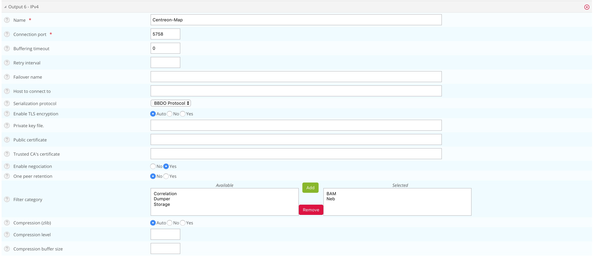

This chapter describes advanced procedures for secure your Centreon MAP
system.

## HTTPS/TLS Configuration

### HTTPS/TLS configuration with a recognized key

> This section describes how to add a **recognized key** to the Centreon Map server.
> If you want to create an auto-signed key and add it to your server, please
> refer to the [following section](#httpstls-configuration-with-an-auto-signed-key)

You will require:

- A key file, referred to as *key.key*.
- A certificate file, referred to as *certificate.crt*.

Access the Centreon MAP server through SSH.

Create a PKCS12 file with the following command line:

    openssl pkcs12 -inkey key.key -in certificate.crt -export -out keys.pkcs12

Then, import this file into a new keystore (a Java repository of security certificates):

    keytool -importkeystore -srckeystore keys.pkcs12 -srcstoretype pkcs12 -destkeystore studio.jks

Put above keystore file (studio.jks) to the folder "/etc/centreon-studio/", and set below parameters inside "/etc/centreon-studio/studio-config.properties"

    centreon-map.keystore=/etc/centreon-studio/studio.jks
    centreon-map.keystore-pass=xxx

> Replace the keystore-pass value "xxx" with the password you used for 
> the keystore and adapt the path (if it was changed) to the keystore.

### HTTPS/TLS configuration with an auto-signed key

> Enabling the TLS mode with an auto-signed key will force every user to add an 
> exception for the certificate before using the web interface. 
> Enable it only if your Centreon also uses this protocol.
> Users will have to open the URL https://centreon-map-url:8443/centreon-studio/api/beta/actuator/health.
> *The solution we recommend is to use a recognized key method, as explained above.*

On the Centreon MAP server

Create a keystore.

Go to the folder where Java is installed:

    cd $JAVA_HOME/bin

Then generate a keystore file with the following command:

    keytool -genkey -alias studio -keyalg RSA -keystore /etc/centreon-studio/studio.jks

The alias value "studio" and the keystore file path /etc/centreon-studio/studio.jks may be changed, but unless there is a specific reason, we advise keeping the default values.

Provide the needed information when creating the keystore.

At the end of the screen form, when the "key password" is requested, use the same password as the 
one used for the keystore itself by pressing the ENTER key.

Put above keystore file (studio.jks) to the folder "/etc/centreon-studio/", and set below parameters
inside "/etc/centreon-studio/studio-config.properties"

    centreon-map.keystore=/etc/centreon-studio/studio.jks
    centreon-map.keystore-pass=xxx

> Replace the keystore-pass value "xxx" with the password you used for the keystore 
> and adapt the path (if it was changed to the keystore.

### Activate TLS profile of Centreon MAP service

1. Stop Centreon MAP service:
``` shell
systemctl stop centreon-map
```
2. Edit the file "/etc/centreon-studio/centreon-map.conf", adding ",tls" after "prod" profile
``` shell
RUN_ARGS="--spring.profiles.active=prod,tls"
```
3. Restart Centreon MAP service.
``` shell
systemctl start centreon-map
```
Centreon MAP server is now configured to respond to requests from HTTPS at port 8443.
For the requirement of changing service's port, refer to :ref:`change_server_port`

> Don't forget to modify the URL on Centreon side in 
> **Administration** > **Extensions** > **Map** > **Options** => **Map server address** 

## Broker TLS connection configuration

An additional broker output for Centreon central (centreon-broker-master) has
been created during the installation. You can check it in your central Centreon
web interface *Centreon \> Configuration \> Pollers \> Broker Configuration* in
the Main menu \> Centreon-broker-master.

The output configuration should look like this:



### Setup TLS connection between broker and map server

The socket connection between broker and map server can be secured by using TLS
protocol.

#### Broker side configuration

You could enable TLS output and set up broker's private key and public
certificate as described in [broker TLS
output](https://documentation.centreon.com/docs/centreon-broker/en/latest/user/modules.html#tls)


> "Trusted CA's certificate" field is optional. If you activate broker's client
> authentication by setting this "ca\_certificate.crt", then you must setup a
> [keystore for map server](#httpstls-configuration)

> You MUST push the new broker configuration and restart the broker after
> configuration.

#### Map server side configuration

First of all, you should [activate HTTPS/TLS of Centreon MAP service](#httpstls-configuration)

Than, set the following parameter in map server configuration at “/etc/centreon-studio/studio-config.properties“ to enable TLS socket connection with broker :

    broker.tls=true

**1. Self signed broker certificate**

If the broker public certificate is self signed, you must create a trust store
containing given certificate or its CA certificate with the following command
line:

    keytool -import -alias centreon-broker -file broker_public.crt -keystore truststore.jks

  - "broker\_public.crt" is broker public certificate or its CA certificate in
    PEM format.
  - "truststore.jks" is the generated trust store in JKS format.
  - a store password is required during generation

Then, put the generated output file "truststore.jks" into "/etc/centreon-studio"
of map server host.

and add truststore parameters in - “/etc/centreon-studio/studio-config.properties“

    centreon-map.truststore=/etc/centreon-studio/truststore.jks
    centreon-map.truststore-pass=XXXX

> Replace the trustStorePassword value "xxx" with the password you used when
> generate the trust store

Meanwhile, you should activate the "tls_broker" profile of Centreon MAP service:
Edit the file  "/etc/centreon-studio/centreon-map.conf", replace ",tls" by ",tls_broker" after "prod" profile

    RUN_ARGS="--spring.profiles.active=prod,tls_broker"

> "tls_broker" profile implies "tls" profile. So Centreon MAP service serves necessarily HTTPS.


**2. Recognized CA signed broker certificate**

If the broker public certificate is signed with a recognized CA, the JVM default trust store "cacerts (/etc/pki/java/cacerts)" will be used. Nothing to configure for Centreon MAP service
