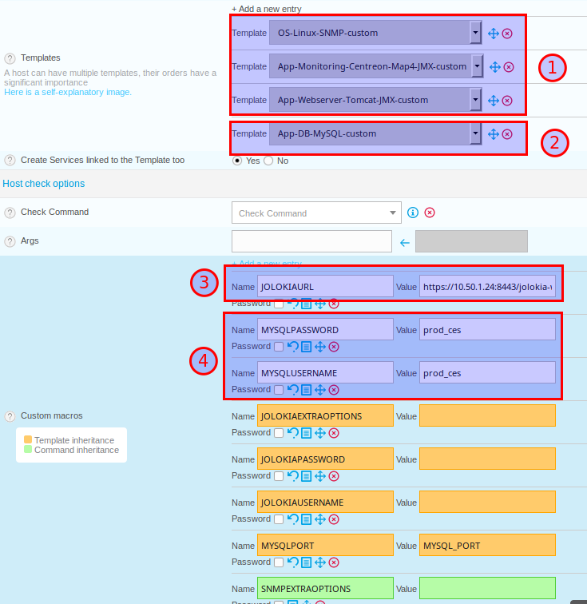
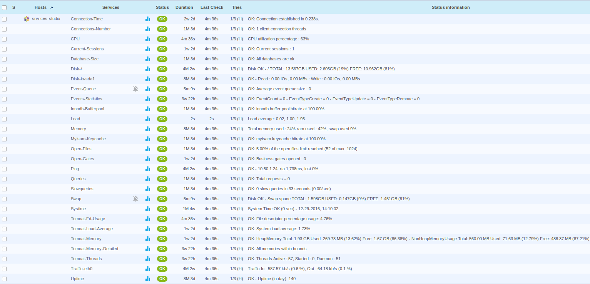

This chapter describes advanced procedures for configuring your Centreon MAP
system.

## Monitoring your Centreon MAP server after installation

Centreon provides a plugin pack and a plugin to monitor your Centreon MAP
server.

### Install the Packs

On the Central server, install the required Packs with the following commands:

```shell
yum install centreon-pack-operatingsystems-linux-snmp centreon-pack-applications-monitoring-centreon-map-jmx centreon-pack-applications-webservers-tomcat-jmx centreon-plugin-Applications-Databases-Mysql
```

From the Plugin Packs Manager, install the Packs.

### Install the Plugins

Use SSH to access the Poller that will be monitoring your Centreon MAP server.

Install all the required plugins with the following commands:

```shell
yum install centreon-plugin-Operatingsystems-Linux-Snmp centreon-plugin-Applications-Monitoring-Centreon-Map-Jmx centreon-plugin-Applications-Webservers-Tomcat-Jmx centreon-pack-applications-databases-mysql
```

### Configure your database

Access your MariaDB server where the Centreon MAP database is stored (the
Centreon MAP database is called 'centreon\_studio' by default).

Execute the following query on the SQL instance:

```sql
GRANT SELECT ON centreon_studio.* TO 'centreon_map'@'<POLLER_IP>' identified by 'PASSWORD';
```

- Replace 'centreon\_studio' by the DB name of your Centreon MAP server.
- Replace \<POLLER\_IP\> by the IP address of the poller which will be
  monitoring your DB.
- Replace 'PASSWORD' by any password you prefer.

### Configure your services

Access your Centreon Web interface. Go to `Configuration > Host > Add`.

Fill in the basic information about your host and add the following host
templates:

- OS-Linux-SNMP-custom
- App-Monitoring-Centreon-Map-JMX-custom
- App-Webserver-Tomcat-JMX-custom

Also add the following only if you have a local MariaDB DB on you MAP server:

- App-DB-MySQL-custom



Important:

1. The above host templates are the three main templates required for
   monitoring your Centreon MAP server.

2. The MySQL/MariaDB template is useful only if there is a MariaDB server
   on your Centreon MAP server (for Centreon MAP database).

3. Enter the Jolokia URL, accessible on the Centreon Map server, through
   actuator endpoint:

    - For an HTTP configuration:

        ```text
        http://<MAP_IP>:8080/centreon-studio/actuator/jolokia
        ```

    - For an HTTPS configuration:

        ```text
        https://<MAP_IP>:8443/centreon-studio/actuator/jolokia
        ```

    > Replace \<MAP\_IP\> by the IP address of your Centreon MAP server.

4. *If you have installed a MariaDB server on your Centreon MAP server*, enter
   the user/password you used in [Configure your
   database](#configure-your-database).

> Remember to check the "Create Services linked to the Template too" checkbox.

You can now export your configuration, and your Centreon MAP server will be
monitored.



> You may also just check the access to the following URL that tells that
> the server is up or not:
>
> - If your server is running in HTTP mode:
>
>     ```text
>     http://<MAP_IP>:8080/centreon-studio/api/beta/actuator/health.
>     ```
>
> - If your server is running in HTTPS mode:
>
>     ```text
>     https://<MAP_IP>:8443/centreon-studio/api/beta/actuator/health.
>     ```

## Migrating your Centreon MAP server

This section explains how to move Centreon MAP server over to another server.
This task may be useful if you need to migrate your reporting server from CentOS
6 to CentOS 7.

### Install the new Centreon MAP server

Please refer to the installation chapter in this documentation to install your
new Centreon MAP server.

### Synchronize the data

Stop Centreon Map service on **both** Centreon MAP servers:

```shell
systemctl stop centreon-map
```

Dump the Centreon MAP data:

```shell
mysqldump -u XXXXXX -p centreon_studio > /tmp/centreon_studio.sql
```

Upload *centreon\_studio.sql* to the new Centreon MAP (in /tmp) server and
import it into the database:

```shell
mysql -u XXXXXX -p centreon_studio < /tmp/centreon_studio.sql
```

Start Centreon Map service on the new Centreon MAP servers:

```shell
systemctl start centreon-map
```

## Centreon MAP configuration files

> We advise you against editing the configuration files manually unless you are
> an experienced user.

The four configuration files are located in */etc/centreon-studio/*. Their
templates can be found in */etc/centreon-studio/templates/*.

The configuration script replaces the macros in these templates and copies them
to the folder /etc/centreon-studio.

If these files are modified, the server must be restarted with the command:

```shell
systemctl restart centreon-map
```

> Do not delete any variables in these files! This may cause the server to
> malfunction or not to start up.

## Backup of Centreon MAP server

### Saved items

The saved items are:

- Saving configuration files (**/etc/centreon-studio**)
- Saving database **centreon\_studio**

### How it works?

The backup script is executed on a daily basis (2AM) with a cron job located in
**/etc/cron.d/centreon-map-server-backup**:

```text
#
# Cron to backup Centreon MAP server
#
PATH=/sbin:/bin:/usr/sbin:/usr/bin

# rewrite file with new cron line
CRONTAB_EXEC_USER=""

0 2 * * * root bash /usr/share/centreon-map-server/bin/centreon-map-server-backup.sh >> /var/log/centreon-studio/backup.log 2>&1
```

The backup **centreon-map-server-yyyy-mm-dd.tar.gz** is stored in
**BACKUP\_DIR**, which is defined in configuration file.

### Backup parameters

Backup parameters are stored in **/etc/centreon-studio/backup.conf**

- ENABLE: enable/disable backup mechanism (default value: 0)
- BACKUP\_DIR: where the backup is stored (default value: /var/backup)
- RETENTION\_AGE: backup retention in days (default value: 8)

> **We advise to export backups to another resource in order to secure them.**

### Restore data from Centreon MAP server

Restore process is divided in several steps:

- Extracting backup
- Restoring configuration files
- Restoring database

> **We assume that you have followed the Centreon MAP server installation
> procedure to get a fresh install.**

### Extracting backup

Get the last **centreon-map-server-yyyy-mm-dd.tar.gz** backup and extract it
into **/tmp** directory:

```shell
cd /tmp
tar xzf centreon-map-server-yyyy-mm-dd.tar.gz
```

### Restoring configuration files

To restore configuration files, run the following command:

```shell
cp -R etc/centreon-studio/* /etc/centreon-studio/
```

### Restoring database

To restore **centreon\_studio** database, run the following command:

```shell
systemctl stop centreon-map
mysql -h <db_host> -u <db_user> -p<db_password> <db_name> < centreon-map-server.dump
systemctl start centreon-map
```

## Change Centreon MAP server port

By default, the Centreon MAP server is listening and sending information
through the port 8080. If you set the SSL (see [HTTPS/TLS
Configuration](secure-your-map-platform.html#configure-httpstls-on-the-web-server),
use the port 8443.

You can change this port (e.g., if you have a firewall on your network
blocking these ports).

> If the new port is below 1024, use this procedure below "Define
> port below 1024" instead.

On your Centreon MAP server, stop the Centreon MAP server:

```shell
systemctl stop centreon-map
```

Edit the studio-config.properties settings file located in
/etc/centreon-studio:

```shell
vim /etc/centreon-studio/studio-config.properties
```

Add the following line at the MAP SERVER section

```text
centreon-map.port=XXXX
```

> Replace *XXXX* with the port you want.

Then restart the Centreon MAP server:

```shell
systemctl start centreon-map
```

Wait for Centreon MAP service to start completely (~30 sec to 1 minutes).

Test that your server is up and accessible on the new port you defined by
entering the following URL in your web browser:

```text
http://<MAP_IP>:<NEW_PORT>/centreon-studio/api/beta/actuator/health
```

## Define port below 1024

You may want to setup your server to listen and send data through ports below
1024, such as port 80 or 443 (as these ports are rarely blocked by a firewall).

If you want to set a port below 1024, the method is different since all ports
under 1024 are restricted and only accessible through special applications.

There are a few different workarounds for this issue. One method is "port
forwarding" through the firewall.

> For this example, set the MAP server to listen and send data through port 80.
> Replace each occurence of *80* with the port you want to use.

1.  Check your firewall.

    On your MAP server, run the following command to check that the firewall is
    running:

    ```shell
    systemctl status iptables
    ```

    If your firewall is running, you will see the following output:

    ```shell
    Table: raw
    Chain PREROUTING (policy ACCEPT)
    num  target     prot opt source               destination

    Chain OUTPUT (policy ACCEPT)
    num  target     prot opt source               destination

    Table: mangle
    Chain PREROUTING (policy ACCEPT)
    num  target     prot opt source               destination
    ...
    ...
    ...
    ```

    If your firewall is stopped, you will see the following output:

    ```shell
    iptables: Firewall is not running.
    ```

    Start the firewall:

    ```shell
    systemctl start iptables
    ```

2.  Enable a connection on the port for MAP for listening and sending.

    Execute the following lines on your console:

    ```shell
    /sbin/iptables -A OUTPUT -p tcp --dport 80 -j ACCEPT
    /sbin/iptables -A INPUT -p tcp --dport 80 -j ACCEPT
    ```

3.  Add port forwarding.

    Execute the following line on your console:

    ```shell
    iptables -t nat -A PREROUTING -p tcp --dport 80 -j REDIRECT --to-port 8080
    ```

4.  Restart and save.

    Restart your firewall:

    ```shell
    systemctl restart iptables
    ```

    Save this configuration so it will be applied each time you reboot your server:

    ```shell
    /sbin/iptables save
    ```

Your Centreon MAP server is now accessible on port 80. Check this by entering
the following URL in your browser:

```text
http://<MAP_IP>/centreon-studio/api/beta/actuator/health
```

You should see server's state:

```json
{"status":"UP"}
```

> Don't forget to update both your desktop client configuration and your web
> interface configuration.
