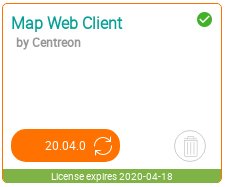

This chapter describes how to update your Centreon MAP extension. This
is done by updating the three main components:

- Centreon MAP server
- Centreon MAP web interface & its widget
- Desktop client (automatically updated).

Before updating Centreon MAP server, we highly recommend performing a
MariaDB dump (backup) of your `centreon_studio` database. This will
allow you easily to roll back to the previous state if necessary.

Be sure to read the release notes for an explanation of features, fixes
& custom procedures.

## Centreon MAP Server

Update the release package to install the new repository file:

``` shell
# Replace <centreon_map_release_package> by the new centreon-map release package name
yum install <centreon_map_release_package>
```

Clean yum metadata and cache.

``` shell
yum clean all --enablerepo=*
```

Run the following commands to upgrade your Centreon MAP server:

``` shell
systemctl stop centreon-map
yum update centreon-map-server
systemctl start centreon-map
```

## Centreon MAP Web interface
Update the release package to install the new repository file:

``` shell
# Replace <centreon_map_release_package> by the new release package name
yum install <centreon_map_release_package>
```

Clean yum metadata and cache.

``` shell
yum clean all --enablerepo=*
```

Update the centreon map web client package.

```shell
yum update centreon-map-web-client
```

Complete the upgrade by going to `Administration > Extensions > Manager`
(module & widget parts):



## Centreon MAP Desktop client

If the user's computer has an online connection, the desktop client is
automatically upgraded to the latest version that corresponds to the server.

Alternatively, the client can be downloaded through the menu `Monitoring >
Map` and **Desktop client** button.
