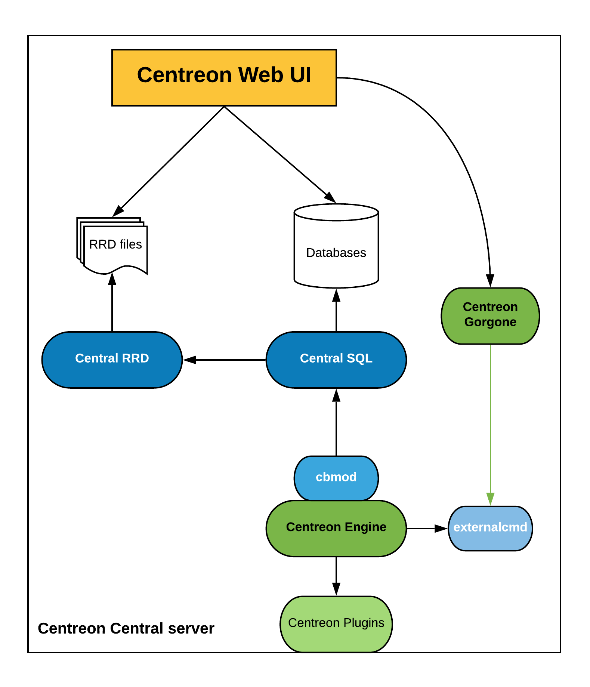
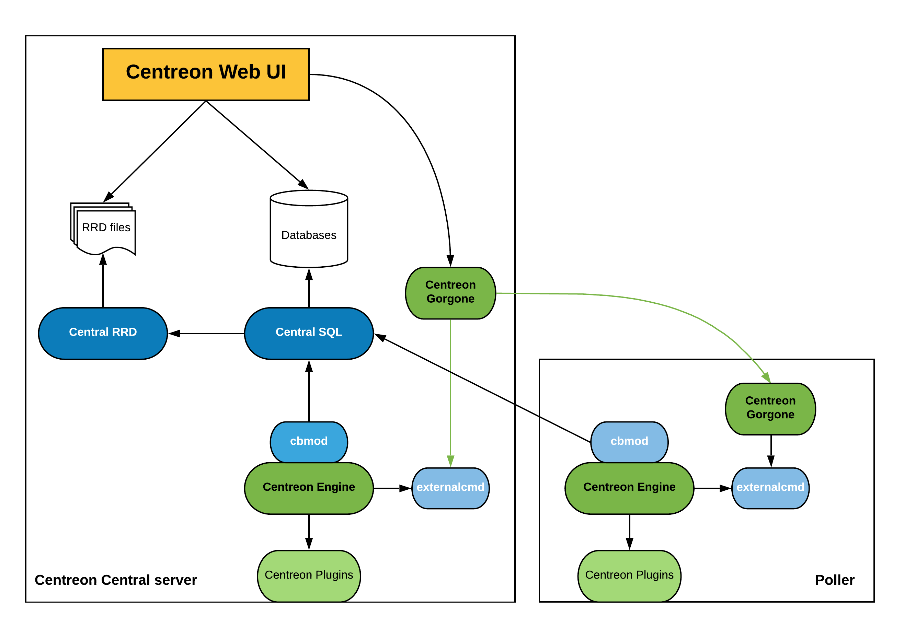
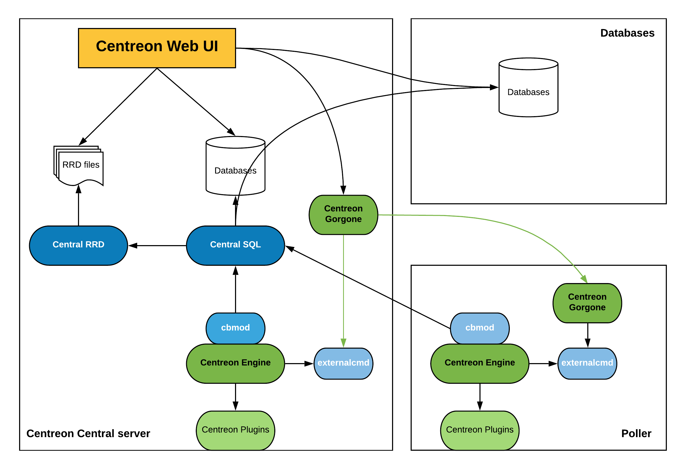
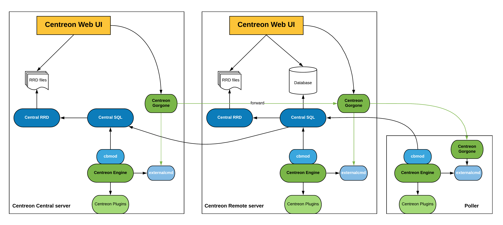

Centreon permet plusieurs choix dans la composition de l'architecture de votre outil de supervision. D'une architecture
relativement simple avec un serveur hébergeant tous les services, l'architecture peut aussi être organisée autour d'un
découpage stratégique permettant de répartir la charge de collecte sur plusieurs serveur avec la mise en place de points
de collecte sur plusieurs continents.

Vous trouverez ici toutes les architectures supportées :

<!--DOCUSAURUS_CODE_TABS-->
<!--Architecture simple-->
#### Description

L'architecture simple consiste à avoir toutes les entités de supervision au sein du même serveur, à savoir :

* L'interface web de Centreon
* La base de données (MySQL + RRD)
* Le moteur de supervision
* Le broker

Cette architecture est la plus simple qu'un utilisateur peut rencontrer.

#### Entités

Plusieurs entités servent à mettre en place cette architecture :

* Le serveur Apache est chargé d'héberger l'interface web de Centreon
* Plusieurs bases de données MySQL sont chargées de stocker la configuration de Centreon, les informations de
  supervision ainsi que les données de performances
* Le moteur de supervision supervise le système d'informations
* Les informations de supervision sont envoyées via cbmod à Centreon Broker SQL
* Centreon Broker SQL est chargé d'insérer les données de supervision en base de données et de transmettre les données
  de performances à Centreon Broker RRD
* Centreon Broker RRD est chargé de générer les fichiers RRD (qui servent à générer les graphiques de performances)

#### Architecture

Le schéma ci-dessous résume le fonctionnement de l'architecture :

<!-- Architecture distribuée-->
#### Description

L'architecture distribuée consiste à avoir deux types d'entités :

* Le serveur central qui centralise les informations de supervision
* Un ou plusieurs collecteurs qui sont chargés de la supervision des équipements

Le serveur central regroupe les éléments suivants :

* L'interface web de Centreon
* La base de données (MySQL + RRD)
* Le moteur de supervision
* Le broker

Le serveur satellite a les éléments suivants :

* Le moteur de supervision
* Le module de broker qui permet l'envoi des informations de supervision vers le serveur central

Cette architecture a plusieurs intérêts :

* Elle permet la répartition de la charge de supervision entre plusieurs serveurs de supervision
* Isolation des flux réseaux : si votre infrastructure de supervision est chargée de superviser une DMZ, il est plus
simple (et sécurisant) de placer un serveur satellite sur le réseau DMZ

#### Entités

##### Serveur central

Le serveur central fonctionne de la manière suivante :

* Le serveur Apache est chargé d'héberger l'interface web de Centreon
* Plusieurs bases de données MySQL sont chargées de stocker la configuration de Centreon, les informations de supervision ainsi que les données de performances
* Le service CentCore est chargé d'exporter la configuration des moteurs de supervision vers le serveur central et satellites ainsi que du redémarrage des moteurs de supervision
* Le moteur de supervision supervise le système d'informations
* Les informations de supervision sont envoyées via cbmod à Centreon Broker SQL
* Centreon Broker SQL est chargé d'insérer les données de supervision en base de données et de transmettre les données de performances à Centreon Broker RRD
* Centreon Broker RRD est chargé de générer les fichiers RRD (qui servent à générer les graphiques de performances)

##### Collecteur

Le collecteure fonctionne de la manière suivante :

* Le moteur de supervision supervise le système d'informations
* Les informations de supervision sont envoyées via cbmod au service Centreon Broker SQL hébergé sur le serveur Central

#### Architecture

Le schéma ci-dessous résume le fonctionnement de l'architecture :

<!--SGBD déporté-->
#### Description

L'architecture distribuée avec base de données déportée consiste à avoir trois types d'entités :

* Le serveur central qui centralise les informations de supervision
* Un serveur de base de données chargée de stocker toutes les bases de données
* Un ou plusieurs collecteur qui sont chargés de la supervision des équipements

Le serveur central regroupe les éléments suivants :

* L'interface web de Centreon
* Le moteur de supervision
* Le broker
* Les fichiers RRD

Le serveur de base de données est chargé de stocker la base de données MySQL.

Le collecteur regroupe les éléments suivants :

* Le moteur de supervision
* Le module de broker qui permet l'envoi des informations de supervision vers le serveur central

Cette architecture a plusieurs intérêts :

* Elle permet la répartition de la charge de supervision entre plusieurs serveurs de supervision
* Isolation des flux réseaux : si votre infrastructure de supervision est chargée de superviser une DMZ, il est plus
  simple (et sécurisant) de placer un collecteur sur le réseau DMZ
* Avoir une base de données MySQL externalisée

#### Entités

##### Serveur de base de données

Le serveur de base de données sert uniquement à stocker la configuration de Centreon, les informations de supervision
ainsi que les données de performances au sein de la base de données MySQL.

##### Serveur central

Le serveur central fonctionne de la manière suivante :

* Le serveur Apache est chargé d'héberger l'interface web de Centreon
* Le serveur central récupère la configuration ainsi que les informations de supervision en se connectant au serveur de
  base de données
* Le service CentCore est chargé d'exporter la configuration des moteurs de supervision vers le serveur central et
  collecteurs ainsi que du redémarrage des moteurs de supervision
* Le moteur de supervision supervise le système d'informations
* Les informations de supervision sont envoyées via cbmod à Centreon Broker SQL
* Centreon Broker SQL est chargé d'insérer les données de supervision en base de données et de transmettre les données de
  performances à Centreon Broker RRD
* Centreon Broker RRD est chargé de générer les fichiers RRD (qui servent à générer les graphiques de performances)

##### Collecteur

Le collecteur fonctionne de la manière suivante :

* Le moteur de supervision supervise le système d'informations
* Les informations de supervision sont envoyées via cbmod au service Centreon Broker SQL hébergé sur le serveur Central

#### Architecture

Le schéma ci-dessous résume le fonctionnement de l'architecture :

<!--Remote Server-->
#### Description

L'architecture distribuée avec Remote Server consiste à avoir trois types d'entités :

* Le serveur central qui centralise les informations de supervision et permet de configurer la supervision
* Un ou plusieurs collecteurs qui sont chargés de la supervision des équipements
* Un ou plusieurs Remote Server pour afficher et opérer sur un sous-ensemble des données collectées

Le serveur central regroupe les éléments suivants :

* L'interface web de Centreon (configuration, présentation et opération)
* Le moteur de supervision
* Le broker
* Les bases de données (MySQL + RRD)

Le Remote Server regroupe les éléments suivants :

* L'interface web de Centreon (présentation et opération d'un sous-ensemble des données)
* Le moteur de supervision
* Le broker
* Les bases de données (MySQL + RRD)

Le collecteur contient les éléments suivants :

* Le moteur de supervision
* Une interface web de Centreon minimaliste

Cette architecture a plusieurs intérêts :

* Elle permet la répartition de la charge de supervision entre plusieurs serveurs de supervision
* Isolation des flux réseaux : si votre infrastructure de supervision est chargée de superviser une DMZ, il est plus
  simple (et sécurisant) de placer un collecteur sur le réseau DMZ
* Disposer d'une interface web déportée afin de pouvoir consulter les éléments supervisés d'un sous ensemble

### Entités

#### Serveur central

Le serveur central fonctionne normalement :

* Le serveur Apache est chargé d'héberger l'interface web de Centreon
* Plusieurs bases de données MySQL sont chargées de stocker la configuration de Centreon, les informations de supervision
  ainsi que les données de performances
* Le service CentCore est chargé d'exporter la configuration des moteurs de supervision vers le serveur central et
  collecteurs ainsi que du redémarrage des moteurs de supervision
* Le moteur de supervision supervise le système d'informations
* Les informations de supervision sont envoyées via cbmod à Centreon Broker SQL
* Centreon Broker SQL est chargé d'insérer les données de supervision en base de données et de transmettre les données de
  performances à Centreon Broker RRD
* Centreon Broker RRD est chargé de générer les fichiers RRD (qui servent à générer les graphiques de performances)

#### Remote Server

Le Remote Server fonctionne normalement :

* Le serveur Apache est chargé d'héberger l'interface web de Centreon
* Plusieurs bases de données MySQL sont chargées de stocker les informations de supervision ainsi que les données de
  performances
* Le service CentCore est chargé d'opérer sur les données collectées
* Le moteur de supervision supervise le système d'informations
* Les informations de supervision sont envoyées via cbmod à Centreon Broker SQL
* Centreon Broker SQL est chargé d'insérer les données de supervision en base de données et de transmettre les données
  de performances à Centreon Broker RRD localement. Il est également chargé de transmettre l'ensemble des informations
  au serveur Centreon Central.
* Centreon Broker RRD est chargé de générer les fichiers RRD (qui servent à générer les graphiques de performances)

#### Collecteur

Le collecteur fonctionne de la manière suivante :

* Le moteur de supervision supervise le système d'informations
* Les informations de supervision sont envoyées via cbmod au serveur Centreon central.

### Architecture

Le schéma ci-dessous résume le fonctionnement de l'architecture :

<!--END_DOCUSAURUS_CODE_TABS-->