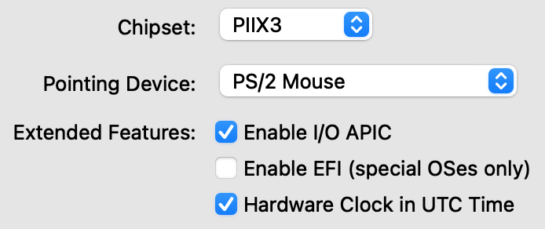

> Si vous souhaitez installer Centreon sur une distribution CentOS / Oracle Linux
> / RHEL en version 8, vous devez suivre la procédure
> [à partir des paquets RPM](./using-packages.html)

**Prérequis**

Cette machine virtuelle est disponible au format OVA pour les environnements
VMware et pour l'outil Oracle VirtualBox.
Celles-ci sont basées sur le système d'exploitation **Linux CentOS 7** incluant
une installation de Centreon permettant de démarrer en toute simplicité votre
première supervision.

La machine virtuelle a besoin de :

- Processeur. Tout processeur Intel ou AMD récent avec au moins 2vCPU devrait
  faire l'affaire.
- Mémoire. Selon vos systèmes d'exploitation, vous aurez besoin d'au moins 1 Go
  de RAM. Pour profiter pleinement de l'expérience, vous avez besoin d'au moins
  2 Go de mémoire libre.
- Espace disque. La machine virtuelle nécessite au moins 6,5 Go d'espace libre
  sur votre disque dur. Cependant, si vous souhaitez continuer à utiliser Centreon,
  il est recommandé d'avoir au moins 10 Go car sa taille augmentera avec le temps.

## Téléchargement

La machine virtuelle est disponible sur notre site de
[téléchargement Centreon](https://download.centreon.com).

> La machine virtuelle ne contient pas de configuration de carte réseau. Il sera
> nécessaire d'ajouter une carte réseau avant de démarrer le serveur.

## Import

<!--DOCUSAURUS_CODE_TABS-->

<!--VMware environment-->
\
Accédez à **Fichier > Déployer le modèle OVF** et sélectionnez le **fichier OVA**.
Parce que les sélections de menu sont liées à votre configuration VMWare, nous ne
pouvons pas fournir plus d'informations. Sachez que la meilleure pratique
consiste à utiliser l'option **Thin Provision** pour économiser autant d'espace
libre que possible sur le disque.

<!--Oracle Virtualbox-->
\
Extraire le contenu de l'archive et double-cliquez sur le **fichier OVA**. Suivez
les instructions pour importer la machine virtuelle.
Editez la machine virtuelle et dans l'onglet **System** cocher la case
**Hardware Clock in UTC Time**, puis cliquez sur **OK**.

<!--END_DOCUSAURUS_CODE_TABS-->

Une fois votre machine virtuelle importée, vous devez **ajouter une carte réseau**.
Modifiez les paramètres de la machine virtuelle et d'une carte réseau. Sélectionnez
le bon réseau associé pour accéder à Internet.

Vous pouvez maintenant démarrer la machine virtuelle.

## Premier démarrage

Une fois votre machine virtuelle démarrée, vous devez vous y connecter via un
terminal shell et effectuer les opérations demandées.

> Il est impératif de compléter les instructions, notamment les opérations 4 et 5.

Une fois ces opérations effectuées, vous pouvez supprimer ce message en
supprimant le fichier /etc/profile.d/centreon.sh.

## Identifiants par défaut

- Le compte d'interface Web Centreon par défaut est : **admin / centreon**.
- Le compte d'administration du serveur (via SSH) est: **root / centreon**.
- Le mot de passe root du SGBD n'est pas initialisé.

> Pour des raisons de sécurité, nous vous recommandons fortement de modifier ces mots de passe après l'installation.

Vous pouvez maintenant continuer vers la première section de connexion.

## Première connexion à l'interface

Pour se connecter à l'interface se rendre à l'adresse : http://IP_ADDRESS/centreon

> Remplacer **IP_ADDRESS** par l'adresse IP ou FQDN du serveur web Centreon.

Renseigner le nom d'utilisateur et le mot de passe associé et cliquer sur le bouton **Connect** :

Vous êtes maintenant connecté à l'interface web Centreon.

## Premiers pas

Rendez-vous dans le chapitre [Premiers pas](../../getting-started/installation-first-steps.html)
pour mettre en place votre première supervision.

## Sécurisez votre plateforme

N'oubliez pas de sécuriser votre plateforme Centreon en suivant nos
[recommandations](../../administration/secure-platform.html)
