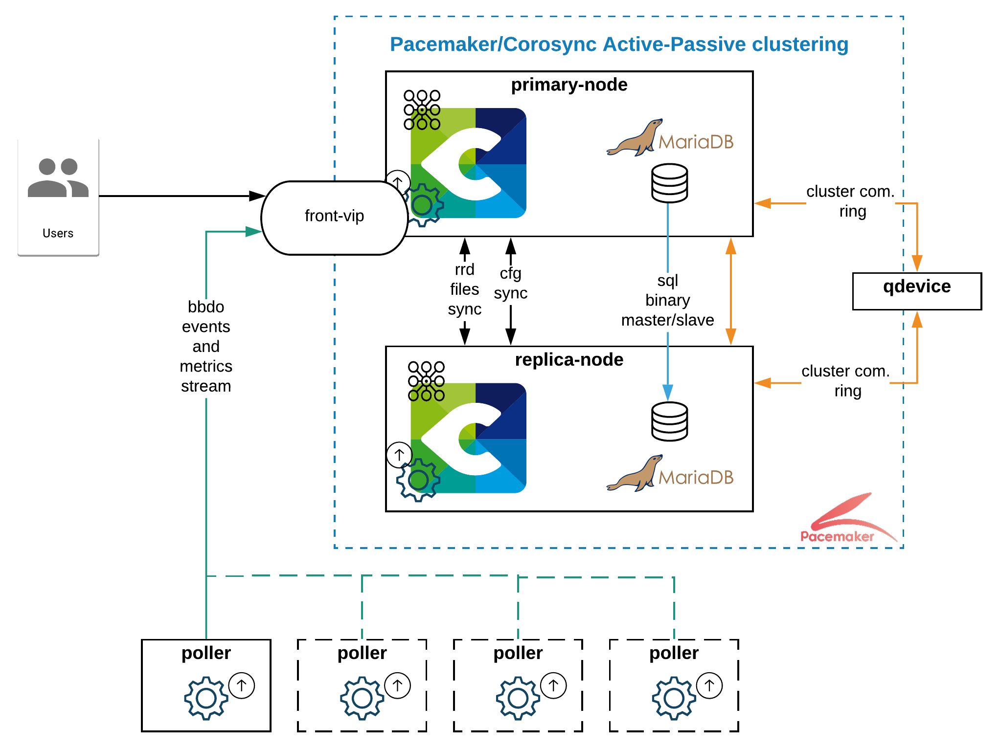
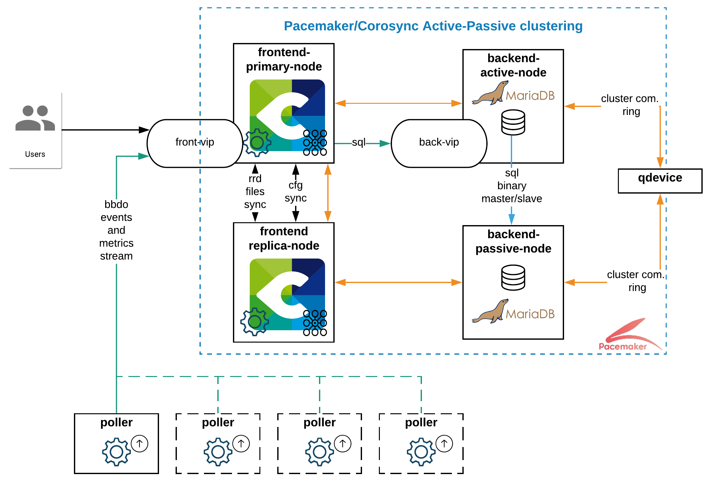

## Introduction 

Centreon-HA est la seule solution officielle et supportée pour mettre en place un cluster de supervision en haute disponibilité. Il inclut
les éléments suivants : 
* Une documentation, principalement pour décrire comment mettre en place votre Cluster sur votre solution Centreon.
* Une collection de scripts permettant une gestion sûre et efficace des ressources liées à Centreon.
* Des fichiers additionnels qui étendront les capacités par défaut de Centreon. 

Cette architecture s'appuie sur les composants pacemaker et corosync de [ClusterLabs] (https://clusterlabs.org/),
permettant une tolérance aux pannes sur les composants suivants : 

* Daemons applicatifs du serveur central
  * centreon-engine (ordonnanceur)
  * centreon-Broker (multiplexeur)
  * centreon-Gorgone (gestionnaire de tâches)
  * centreon-central-sync (réplication des fichiers de configuration)
  * snmptrapd et centreontrapd (système et processus applicatifs de gestion des traps SNMP)
* Daemons tiers du serveur central
  * php-fpm (cache FastCGI PHP)
  * apache server (serveur web)
* Bases de données
  * Réplication active/passive de binlogs (stockage)
* Défaillances des hôtes
  * Machines virtuelles ou serveurs physiques

> **Avertissement:** Si vous disposez d'une IT ou Business edition, veuillez contacter votre représentant commercial Centreon 
ou votre responsable de compte technique avant de le mettre en place. Les extensions ont besoin de fichiers
de licence spécifiques pour fonctionner sans problème sur les deux nœuds.

## Concepts

La solution met en œuvre trois types de ressources différentes : 

* Ressources _multi-state_, fonctionnant sur les deux nœuds avec des rôles différents. 
* Ressources _clone_, fonctionnant à la fois sur le nœud principal et le nœud secondaire.
* Ressources _unique_, faisant partie d'un _groupe_ et fonctionnant sur un seul nœud.

Les services du cluster sont divisés en deux groupes fonctionnels.

### Groupe fonctionnel MariaDB

Le groupe fonctionnel `ms_mysql` est une ressource _multi-state_. Cette ressource peut être en mode 
actif/primaire sur un nœud et en mode secondaire/passif sur l'autre nœud. 

La méta-ressource `ms_mysql-master` est affectée à la base de données primaire.

### Groupe fonctionnel Centreon

Le groupe fonctionnel `centreon` rassemble toutes les ressources Centreon pour les gérer.

### Description du type de ressources

Toutes ces ressources sont décrites dans le tableau ci-dessous.

| Nom                     | Type                  | Description                                                     |
| ----------------------- | --------------------- | --------------------------------------------------------------- |
| `ms_mysql`              | ressource multi-state | Gère le processus `mysql` et la réplication des données.        |
| `ms_mysql-master`       | location              | Définir la préférence de règle du serveur maître MariaDB        |
| `php7`                  | service clone         | Service gestionnaire des processus FastCGI (`rh-php73-php-fpm`) |
| `cbd_rrd`               | service clone         | Service du Broker RRD (`cbd`)                                   |
| `centreon`              | groupe                | Groupe des "services primitifs" de Centreon                     |
| `vip`                   | service primitif      | Adresse de la VIP pour Centreon                                 |
| `http`                  | service primitif      | Service Apache  (`httpd24-httpd`)                               |
| `gorgone`               | service primitif      | Service Gorgone  (`gorgoned`)                                   |
| `centreon_central_sync` | service primitif      | Service de synchronisation des fichiers                         |
| `cbd_central_broker`    | service primitif      | Service du Broker Central  (`cbd-sql`)                          |
| `centengine`            | service primitif      | Service Centreon-Engine (`centengine`)                          |
| `centreontrapd`         | service primitif      | Service de gestion des traps SNMP (`centreontrapd`)             |
| `snmptrapd`             | service primitif      | Service d'écoute des traps SNMP (`snmptrapd`)                   |

**Note:** Les ressources du groupe `centreon` sont démarrées les unes après les autres dans l'ordre de la liste.

### Contraintes de resources　：

Pacemaker propose différents types de contraintes :
* Location : où la ressource doit ou ne doit pas s'exécuter.
* Colocation : comment les ressources se comportent les unes par rapport aux autres.

Par exemple, Centreon-HA utilise des contraintes de location pour spécifier à Pacemaker que le processus 
de base de données dois être opérationnel sur les nœuds arrière, mais pas sur les nœuds frontaux. 

En ce qui concerne les contraintes de colocation, ils peuvent s'assurer qu'une IP virtuelle (VIP) est attribuée aux nœuds maîtres et/ou au rôle. 
Par conséquent, les utilisateurs, les Pollers et les Daemons interagissent constamment avec le nœud primaire.

### QDevice et votes

La configuration d'un qdevice est **obligatoire** pour éviter le split-brain et autres situations auxquelles personne ne veut être 
confronté dans un Cluster. Le serveur avec le rôle `quorum-device` vise à obtenir une majorité absolue lors d'un vote 
pour élire un nœud maître ou un rôle ressource.

## Support

### Logiciels et systèmes d'exploitation

Centreon supporte officiellement le Clustering sur les produits suivants : 

* Toutes les éditions sous licence de Centreon 
* Serveur de Map Centreon 

Et sur les systèmes d'exploitation suivants : 

* CentOS 7
* RHEL 7 

*Important:* Pour installer les paquets pacemaker et corosync sur les systèmes RedHat, les serveurs doivent avoir accès au dépôt
sous licence _Red Hat Enterprise Linux High Availability_.  

Le seul système de base de données officiel pris en charge par Centreon est MariaDB. 

Néanmoins, notez que nous avons validé que l'ensemble de la solution peut fonctionner sur MySQL 8 *avec quelques modifications*, 
seule la [communauté] https://github.com/centreon-ha/issues) (ou vos DBA) peut vous aider 
et vous supporter dans l'exécution d'un Cluster sur un serveur Oracle MySQL.

Pour MariaDB et Oracle MySQL, la configuration de la réplication peut être intrusive. Nous *vous déconseillons fortement* de 
mettre en place un Cluster sur un serveur contenant d'autres bases de données d'applications, nous ne le supporterons pas. 

### Architectures

Centreon prend en charge les architectures à 2 et 4 nœuds. Nous recommandons l'utilisation d'une architecture à deux nœuds, 
sauf si votre organisation exige une séparation systématique des serveurs frontaux et arrière ou si votre périmètre de surveillance 
est supérieur à 5k hôtes. 

Les schémas ci-dessous montrent à la fois la structure de l'architecture et les flux réseau entre les serveurs. Pour obtenir la matrice 
complète des flux, reportez-vous à la page d'installation de l'architecture dédiée.

<!--DOCUSAURUS_CODE_TABS-->

<!--Cluster-deux-nœuds-->

Accéder à [cette page](../../installation/installation-of-centreon-ha/installation-2-nodes.html) pour commencer votre installation à deux nœuds !

<!--Cluster-quatre-nœuds-->

Accéder à [cette page](../../installation/installation-of-centreon-ha/installation-4-nodes.html) pour commencer votre installation à quatre nœuds !

<!--END_DOCUSAURUS_CODE_TABS-->

## Informations complémentaires

### Organisation du serveur

La mise en place d'un cluster Centreon-HA peut s'avérer excessive ou du moins non-optimale lorsque tous vos serveurs 
fonctionnent dans le même datacenter, voire dans la même baie. 

Dans un monde parfait, les nœuds primaires et secondaires fonctionnent sur des sites (géographiques) différents, et le QDevice 
communique avec les deux sites indépendamment. Évidemment, tous les nœuds doivent communiquer entre eux.

### Rôle du serveur central Centreon

Dans le cas d'une architecture hautement disponible, le **cluster central Centreon ne doit pas être utilisé comme Poller**. 
En d'autres termes, il ne doit pas surveiller les ressources. Sa capacité de supervision ne doit être utilisée que pour surveiller ses Pollers. 
Si cette recommandation n'est pas suivie, le service `centengine` prendrait trop de temps à redémarrer 
et **il pourrait provoquer le basculement du groupe fonctionnel `centreon`**.

### VIP et équilibrage de charge

Centreon recommande d'utiliser des adresses VIP.

L'utilisation d'un load balancer est une option, mais il doit prendre en charge des règles personnalisées afin d'acheminer les flux d'applications.

Par exemple, dans une configuration à quatre nœuds, un load balancer peut s'appuyer sur :
* frontend-vip: le port d'écoute ou l'état du processus apache pour acheminer les communications des utilisateurs et des Pollers vers les serveurs frontaux.
* backend-vip: la valeur de l'indicateur "read_only" sur les deux serveurs de base de données pour déterminer lequel est le serveur primaire.
