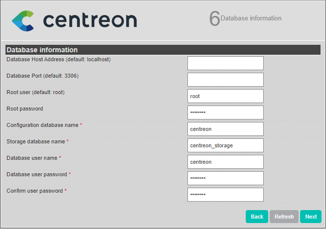

## Installation web

Connectez-vous à l'interface web via *http://\<IP\>/centreon*.

L'assistant de configuration de Centreon s'affiche. Cliquez sur **Next**.


Les modules et les prérequis nécessaires sont vérifiés.

Ils doivent tous être satisfait. Cliquez sur **Refresh** lorsque les actions
correctrices nécessaires ont été effectuées.

Puis cliquez sur **Next**.


Definissez les chemins utilisés par le moteur de supervision. Nous recommandons
d'utiliser ceux par défaut.

Puis cliquez sur **Next**.


Definissez les chemins utilisés par le multiplexeur. Nous recommandons
d'utiliser ceux par défaut.

Puis cliquez sur **Next**.


Définissez les informations pour la création de l'utilisateur admin.

Puis cliquez sur **Next**.


Fournissez les informations de connexion à l'instance de base de données.

Par défaut, l'adresse de l'instance est défini à *localhost*, l'utilisateur
root est défini à *root* et le mot de passe root est vide.

> Si vous utilisez un serveur de base de données distant, ou un utilisateur
> root spécifique, il convient de modifier ces deux informations.

Puis définissez les noms et identifiants des bases de données qui seront créés.
Nous recommandons d'utiliser les valeurs par défaut.

> Le mot de passe de l'utilisateur des bases de données Centreon devrait être
> le seul paramètre modifié ici

Puis cliquez sur **Next**.



L'assistant de configuration crée les fichiers de configuration et les bases de
données.

Quand le processus est terminé, cliquez sur **Next**.


Sélectionnez les modules et widgets disponibles à l'installation.

Puis cliquez sur **Install**.


Une fois les modules installés, cliquez sur **Next**.


À cette étape une publicité permet de connaître les dernières nouveautés de
Centreon.

Si votre plate-forme est connectée à Internet vous disposez des dernières
informations.

Sinon l’information présente dans cette version sera proposée.


L’installation est terminée, cliquez sur **Finish**.

Vous pouvez maintenant vous connecter.


## Initialisation de la supervision

Pour démarrer les processus de supervision :

1. Depuis l'interface web, rendez-vous dans le menu `Configuration >
Collecteurs`,
2. Sélectionnez le collecteur **Central** dans la liste et cliquez sur
**Exporter la configuration**,
3. Cochez **Déplacer les fichiers générés** en plus de la sélection par défaut
et cliquez sur **Exporter**,
4. Connectez-vous au serveur Central,
5. Démarrez/redémarrez les processus de collecte :

    ```shell
    systemctl restart cbd centengine
    ```

6. Redémarrez le gestionnaire de tâches :

    ```shell
    systemctl restart gorgoned
    ```

7. Démarrez les services de supervision passive :

    ```shell
    systemctl start snmptrapd centreontrapd
    ```

8. Si vous voulez superviser ce serveur, démarrer le démon SNMP :

    ```shell
    systemctl start snmpd
    ```

La supervision est maintenant opérationnelle.

## Ajouter une licence

Selon votre édition de Centreon, vous pouvez devoir [ajouter une licence](../administration/licenses.html).

## Installer les extensions disponibles

Rendez-vous au menu `Administration > Extensions > Gestionnaire` et cliquez sur
le bouton **Install all** :


## Sécurisez votre plateforme

N'oubliez pas de sécuriser votre plateforme Centreon en suivant nos
[recommandations](../administration/secure-platform.html).

## Premiers pas

Rendez-vous dans le chapitre [Premiers pas](../getting-started/installation-first-steps.html#demander-votre-essai-gratuit)
pour mettre en place votre première supervision.