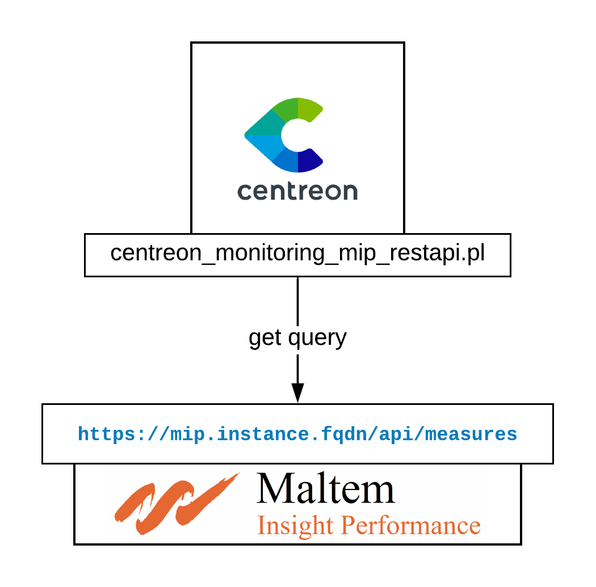
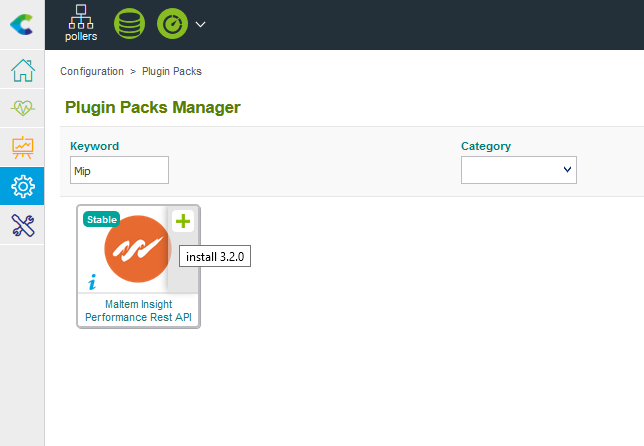

## Vue d'ensemble 

Maltem Insight Performance (MIP) développe et intègre des solutions permettant la mesure du ressenti utilisateurs. Ces mesures prennent la forme de scénarios personnalisés sur les applications web comme les clients riches. MIP met à disposition une API pour récupérer les métriques et les statuts associés à ces scénarios.

## How it works

Une instance MIP expose une Rest API au format JSON. Le Plugin Centreon utilise ce biais pour récupérer les données. 



## Compatibility

Ce connecteur a été testé et validé avec MIP en version 6.4.90

## Requirements

### MIP

Afin de pouvoir interroger l'API, il est nécessaire d'avoir à disposition une clé d'API valide. MIP vous met à disposition cette clé au travers de son service de support. 

### Centreon

Installer le Plugin Sur chaque collecteur se connectant à une instance MIP:

```bash
yum install -y centreon-plugin-Applications-Monitoring-Mip-Restapi`
```

Sur le serveur Central, installer le Plugin-Pack via la page "Configuration > Plugin-Packs > Manager": 



> :warning: **Si vous utilisez une licence IMP hors-ligne**: Installer le RPM du Plugin-Pack comme indiqué ci-dessous et avant l'étape précédente. 

```bash
yum install -y centreon-pack-applications-monitoring-mip-restapi`
```

## Configuration

### Hôtes

Déployez votre hôte et appliquez lui le modèle **App-Monitoring-Mip-Restapi-custom**. Les macros suivantes doivent être renseignées:

| Mandatory   | Name                 | Description                                              |
| :---------- | :------------------- | :------------------------------------------------------- |
|     x       | MIPAPIPROTO          | Protocol used to connect to MIP API. Default: https      |
|     x       | MIPAPIPORT           | Port used to connect to MIP API. Default: 443            |
|     x       | MIPAPIHOSTNAME       | MIP Instance FQDN                                        |
|     x       | MIPAPIKEY            | MIP API Key                                              |
|             | MIPAPIEXTRAOPTIONS   | Any relevant extraoptions (proxy, http-backend, etc.)    |
|     x       | MIPAPITIMEOUT        | Timeout to use during API requests                       |

Il n'est pas nécessaire de mettre la case "Créer les services liés au modèle" à 'Oui' pour cet Hôte. 

### Services

Il est recommandé d'utiliser la règle de découverte associée au Plugin-Pack pour déployer les Services. Voici un guide pas-à-pas pour faire cela:
 
* Rendez-vous dans le menu "Configuration > Services" et cliquer sur "Scan" dans le sous-menu "Découverte"
* Compléter le champ "Hôte" avec le nom utilisé dans la section précédente
* Choisir 'App-Monitoring-Mip-Scenarios' dans la liste déroulante "Règle" sur la droite
* Cliquer sur 'Scan' pour lancer la découverte 
* Une fois la liste des scénarios disponible, cocher les cases correspondant aux services à superviser
* Sauvegarder ce formulaire pour créer les Services
