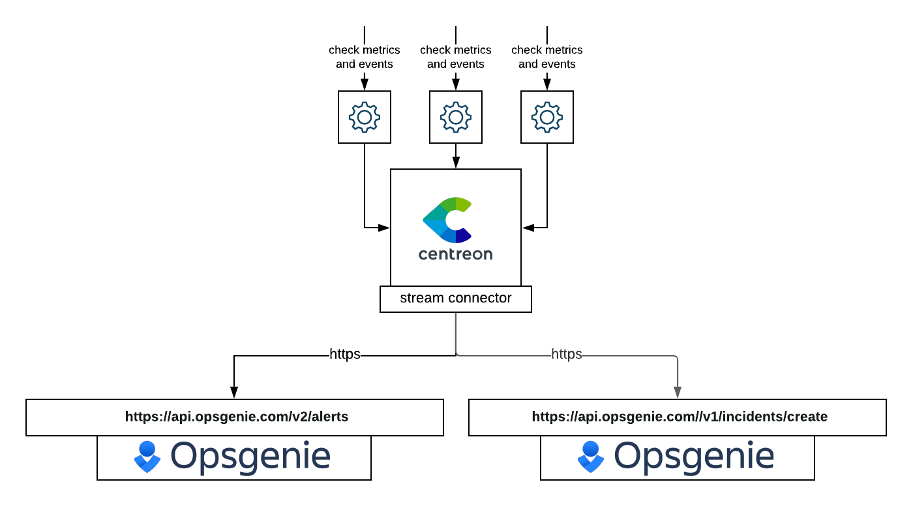

## Avantages de l'intégration Opsgenie + Centreon

* Gérez vos notification quand une alerte est détectée par Centreon
* Evitez les doublons d'alertes de Centreon
* Distinguez les alertes et les incidents en couplant Centreon BAM et Opsgenie
* Créez un reporting reposant sur les notifications de Centreon

## Comment ça marche

* A chaque fois que le statut d'un service, hôte ou BA est contrôlé, l'évènement passe par Centreon Broker qui utilise le Stream Connector puor envoyer ce changement d'état.
* Un changement d'état peut survenir en cas de détection d'anomalie
* Un alias est généré pour chaque alerte afin de profiter de la déduplication d'Opsgenie



## Prérequis

* L'intégration d'Opsgenie nécessite deux clé d'API différentes. La première est une clé d'intégration provenant de l'intégration **Rest API HTTPS over JSON**. Cette intégration doit avoir les droits **Create and Update Access**. la seconde clé est une clé d'API provenant des **APP Settings**. Cette clé doit avoir les droits d'accès **Create and Update**
* Il est aussi nécessaire d'avoir un compte Centreon avec soit des **droits admin** ou alors la possibilité **d'exporter les configuration** et **configurer le broker**. Il faut aussi un accès en tant que **`root` en ligne de commande sur le serveur Centreon**.

## Support

Si vous avez besoin d'aide avec cette intégration, selon votre utilisation de Centreon, vous pouvez :

* **Client Business Edition**: Contactez le [support Centreon](mailto:support@centreon.com).
* **Utilisateurs open source** ou **Utilisateurs Centreon IT-100** (version gratuite): Rejoignez notre [communauté slack](https://centreon.github.io) où les utiisateurs et les équipes Centreon pourront vous répondre.

## Guide d'intégration

### Dans Opsgenie

#### intégration Opsgenie: alerts

1. Depuis le menu **Setting**, selectionnez **Integration list**
2. Dans la liste des intégrations, ajoutez l'intégraiton **API** (Rest API HTTPS over JSON)
3. Rendez vous dans le menu **Configured integrations** et éditez votre intégration **API** pour l'activer si elle ne l'est pas. Vous devez aussi donner les droits **Create and Update Access**. Sauvegardez votre coniguration ainsi que votre **API Key** qui est obligatoire pour l'envoi d'alertes depuis Centreon vers Opsgenie. Cette **API Key** est référrée en tant qu'**integration_api_token** dans la configuration Centreon

#### Opsgenie integration: incidents

1. Avant de commencer, cette intégration ne marchera que si vous utilisez le module Centreon BAM
2. Depuis le menu **Settings**, allez dans la sous catégorie **APP SETTINGS** pour y trouver le menu **API key management**
3. Dans le menu **API key management** ajoutez une nouvelle **API key** avec les droits **Create and Update**
4. Sauvegardez votre configuration et votre **Api key** qui est obligatoire pour envoyer des incidents depuis Centreon vers Opsgenie. Cette **API key** est référrée en tant qu'**app_api_token** dans le configuration Centreon.

### Dans Centreon

#### Installation 

Connectez vous en tant que `root` sur le serveur Centreon central en utilisant votre client SSH préféré.

Dans le cas où votre serveur Centreon central doit utiliser un proxy pour sortir sur Internet, vous devrez exporter la variable d'environnement `https_proxy` et configurer `yum` pour être capable d'installer le nécessaire.

```bash
export https_proxy=http://my.proxy.server:3128
echo "proxy=http://my.proxy.server:3128" >> /etc/yum.conf
```

Maintenant que votre serveur Centreon cetral est capable de sortir sur internet vous pouvez exécuter les commandes suivantes :

```bash
yum install -y lua-curl epel-release
```

Ces paquets sont nécessaires pour que le script marche. Maintenant, il faut le télécharger :

```bash
wget -O /usr/share/centreon-broker/lua/opsgenie.lua https://raw.githubusercontent.com/centreon/centreon-stream-connector-scripts/master/opsgenie/opsgenie.lua
chmod 644 /usr/share/centreon-broker/lua/opsgenie.lua
```

Le Stream Connector Opsgenie est maintenant installé sur votre serveur Centreon central !

#### Broker configuration

1. Connectez vous sur l'interface web votre Centreon avec un compte administrateur
2. Rendez vous dans le menu **Configuration** > **Collecteurs** et allez dans **Configuration Broker**
3. Cliquez sur la configuration broker **central-broker-master** et allez dans l'onglet **ouput**
4. Ajoutez un nouvel output **Generic - Stream connector**.
5. Nommez le comme vous le souhaitez (ex : **Opsgenie**) et indiquez le bon chemin pour le script LUA : `/usr/share/centreon-broker/lua/opsgenie.lua`.
6. Ajoutez au moins un paramètre string. Ce paramètre est une clé d'API qui doit être configurée. Le nom du paramètre *doit être* `app_api_token` (pour les alertes) ou `integration_api_token` (pour les incidents, nécessite le module Centreon BAM). Si vous voulez utilisez ces deux aspects alors vous devez renseigner les deux paramètres dans la configuration.

| Name                      | Type   | Value                   |
| ------------------------- | ------ | ----------------------- |
| `app_api_token`           | String | `<paste your key here>` |
| `integration_api_token`   | String | `<paste your key here>` |

7. Sauvegardez votre configuration puis naviguez dans le menu **Configurtion** > **Collecteurs** et choisissez **collecteurs**.
8. Sélectionnez le collecteur **Central** et cliquez sur **Exporter la configuration**
9. Gardez **Générer les fichiers de configuration** et **Lancer le débogage du moteur de supervision (-v)** cochées et cochez aussi **Déplacer les fichiers générés** puis cliquez sur le bouton **Exporter**..
10. Redémarrez le service `cbd` :

```bash
systemctl restart cbd
```

Maintenant votre serveur central a chargé le Stream Connector Opsgenie et commence à envoyer de la donnée !

To make sure that everything goes fine, you should have a look at `central-broker-master.log` and `connector-opsgenie.log`, both located in `/var/log/centreon-broker`.
Pour être sûr que tout va bien, vous pouvez jeter un oeil aux fichiers de log `central-broker-master.log` et `connector-opsgenie.log`. Tous deux sont situés dans `/var/log/centreon-broker`.

#### Configuration avancée

**Table des paramètres**

| Name                        | Type   | Default value                                                           | Description                                    |
| --------------------------- | ------ | ----------------------------------------------------------------------- | ---------------------------------------------- |
| `api_url`                   | String | `https://api.opsgenie.com`                                              | Adresse API d'Opsgenie. Utilisez https://api.eu.opsgenie.com si votre instance est en Europe |               
| `proxy_address`             | String |                                                                         | Si besoint, l'adresse du serveur proxy (nécessite le paramètre proxy_port) |
| `proxy_port`                | String |                                                                         | Le port du serveur proxy |                 
| `proxy_username`            | String |                                                                         | Si besoin, l'utilisateur pour le proxy (nécessite le paramètre proxy_password) |                 
| `proxy_password`            | String |                                                                         | Le mot de passe de l'utilisateur du serveur proxy |                  
| `logfile`                   | String | `/var/log/centreon-broker/connector-opsgenie.log`                       | Le fichier de log du stream connector |
| `host_status`               | String | `0,1,2`                                                                 | Envoie les évènements d'hôte up, down and unreachable|               
| `service_status`            | String | `0,1,2,3`                                                               | Envoie les évènements de service ok, warning, critical, unknown services |               
| `ba_status`                 | String | `0,1,2`                                                                 | Envoie les évènements de BA ok, warning, critical business activities |
| `hard_only`                 | Number | `1`                                                                     | Envoie uniquement les évènements en état HARD |               
| `acknowledged`              | Number | `0`                                                                     | Envoie uniquement les évènements qui ne sont pas acquittés |               
| `element_type`              | String | `host_status,service_status,ba_status`                                  | Envoie les évènements de statut des hôtes, services et BA |               
| `category_type`             | String | `neb,bam`                                                               | Filtre les évènements qui ne sont pas du neb ou du bam |               
| `in_downtime`               | Number | `0`                                                                     | Envoie uniquement les évènements qui ne sont pas en downtime |               
| `max_buffer_size`           | Number | `1`                                                                     | Envoie les évènements un par un |               
| `max_buffer_age`            | Number | `5`                                                                     | Stocke les évènements pendant 5 secondes à moins que le max_buffer_size soit atteint avant |               
| `max_stored_events`         | Number | `10`                                                                    | Garde les évènements en mémoire pour éviter d'envoyer des duplicatas. Ne pas modifier sans maîtriser les Stream Connectors |               
| `skip_anon_events`          | Number | `1`                                                                     | N'envoie pas les évènements dont l'hôte ou le service ne sont pas trouvés dans le cache du broker |               
| `skip_nil_id`               | Number | `1`                                                                     | N'envoie pes les évènements qui n'ont pas d'ID. (meta-service la plupart du temps) |               
| `accepted_hostgroups`       | String |                                                                         | Liste des groupes d'hôtes dans lequel un hôte doit être (séparateur `,` ex : grp1,grp2,grp3) |               
| `date_format`               | String | `%Y-%m-%d %H:%M:%S`                                                     | Format de conversion par défaut des timestamps (https://www.lua.org/pil/22.1.html) |               
| `host_alert_message`        | String | `{last_update_date} {hostname} is {state}`                              | Le message par défaut des alertes d'hôte. Voir [host event macros](./opsgenie.html#host-event-macros) pour plus de détails sur les macros |
| `host_alert_description`    | String |                                                                         | La description par défaut des alertes d'hôte. See [host event macros](./opsgenie.html#host-event-macros) for more details about macros |
| `host_alert_alias`          | String | `{hostname}_{state}`                                                    | L'alias par défaut des alertes d'hôte. Utile pour la déduplication d'alertes See [host event macros](./opsgenie.html#host-event-macros) for more details about macros  |
| `service_alert_message`     | String | `{last_update_date} {hostname} // {serviceDescription} is {state}`      | Le message par défaut des alertes de service. See [service event macros](./opsgenie.html#service-event-macros) for more details about macros |
| `service_alert_description` | String |                                                                         | La description par défaut des alertes de service. See [service event macros](./opsgenie.html#service-event-macros) for more details about macros |
| `service_alert_alias`       | String | `{hostname}_{serviceDescription}_{state}`                               | L'alias par défaut des alertes de service. Utile pour la déduplication d'alertes. See [service event macros](./opsgenie.html#service-event-macros) for more details about macros  |
| `ba_incident_message`       | String | `{baName} is {state}, health level reached {level_nominal}`             | Le message par défaut des incidents de BA. See [BA event macros](./opsgenie.html#ba-event-macros) for more details about macros |
| `ba_incident_description`   | String |                                                                         | La description par défaut des incidents de BA. See [BA event macros](./opsgenie.html#ba-event-macros) for more details about macros |
| `enable_incident_tags`      | Number | `1`                                                                     | Ajoute les tags pour les incidents |
| `get_bv`                    | Number | `1`                                                                      | Ajoute le nom des BV dans les tags si `enable_incident_tags` est à `1`
| `ba_incident_tags`          | String | `centreon,applications`                                                 | Liste de tags pour un incident. Doit utiliser la virgule comme séparateur. Les noms des BV seront ajoutés automatiquement dans les tags |
| `enable_severity`           | Number | `0`                                                                     | Si positionné à 1, essaie de lier une sévérité de Centreon à une priorité d'Opsgenie |
| `priority_must_be_set`      | Number | `0`                                                                     | Ignorera l'alerte si positionné à 1 et qu'aucune sévérité ne correspond à une priorité selon la relation établie dans le paramètre `priority_matching` |
| `priority_matching`         | String | `P1=1,P2=2,P3=3,P4=4,P5=5`                                              | Associe une priorité à une sévérité selon la syntaxe suivante : nom_priorité=valeur_sévérité,nom_priorité=valeur_sévérité. |
| `opsgenie_priorities`       | String | `P1,P2,P3,P4,P5`                                                        | Liste des priorités Opsgenie avec la virgule pour séparateur |

**Remarques**

* Une valeur de 2 pour  `log_level` est valide pour un début d'analyse en cas de dysfonctionnement. Cela peut cependant générer un grand volume de journaux si vous supervisez beaucoup d'hôtes. Pour avoir moins de messages, vous devriez conserver la valeur à 1.

---------------

## Comment désinstaller

1. Connectez vous à l'interface web de Centreon avec un compte administrateur.
2. Naviguez dans le menu **Configuration** > **Collecteurs** et sélectionnez **Configuration du broker**.
3. Cliquez sur la configuration broker **central-broker-master** puis allez dans l'onglet **Output**.
4. Supprimez l'output **Generic - Stream connector** en cliquant sur l'icône de croix rouge en bout de ligne.
5. Sauvegardez votre configuration et rendez vous dans le menu **Configuration** > **Collecteurs** et sélectionnez **Collecteurs**.
6. Sélectionnez le collecteur **Central** et cliquez sur **Exporter la configuration**
7. Gardez **Générer les fichiers de configuration** et **Lancer le débogage du moteur de supervision (-v)** cochées et cochez aussi **Déplacer les fichiers générés** puis cliquez sur le bouton **Exporter**.
8. Redémarrez le service `cbd` :

```bash
systemctl restart cbd
```

Le stream connecteur n'est alors plus actif !

9. Vous pouvez aussi supprimer le script LUA si vous le désirez :

```bash
rm -f /usr/share/centreon-broker/lua/opsgenie.lua
```

## Macros

Les macros sont un outil pour créer des messages dynamiques dépendant de l'évènement que vous envoyez. Elles doivent être mises entre {} (ex : {hostname}). Si une macro est une macro de type *time* alors vous pouvez utiliser le suffixe **\_date** pour le convertir en un format lisible pour l'Homme. Vous pouvez changer le format de la date avec le paramètre de type string `date_format`. (ex : {last_update} est une macro sous la forme d'un timestamp. Vous pouvez utiliser {last_update_date} pour la convertir)

#### Host event macros

| Nom de la macro |
| --------------- |
| hostname        |

Toutes les propriétés de la table [Host status](../../developer/developer-broker-mapping.html#host-status) sont aussi utilisables

#### Service event macros

| Nom de la macro      |     |
| -------------------- |
| hostname             |
| serviceDescription   |

Toutes les propriétés de la table  [Service status](../../developer/developer-broker-mapping.html#service-status) sont aussi utilisables

#### BA event macros

| Nom de la macro |
| --------------- |
| baName          |
| baDescription   |

Toutes les propriétés de la table  [Ba status event](../../developer/developer-broker-mapping.html#ba-status-event) sont aussi utilisables