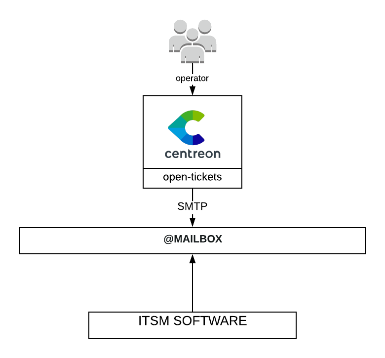

## How it works

The Mail provider sends a mail to a mailbox that an ITSM software will read and
create a ticket based upon it

## Compatibility

This integration is compatible with any ITSM software that is able to create a
ticket from a mail.

## Requirements

Before going any further, make sure that you correctly setup
[centreon-open-ticket](https://documentation.centreon.com/docs/centreon-open-tickets/en/latest/installation/index.html)
into your Centreon instance

Our provider requires the following parameters:

| Parameter | Example of value |
| --------- | ---------------- |
| From      | {$user.email}    |
| To        |                  |

## Possibilities

You can add custom headers when sending your email
