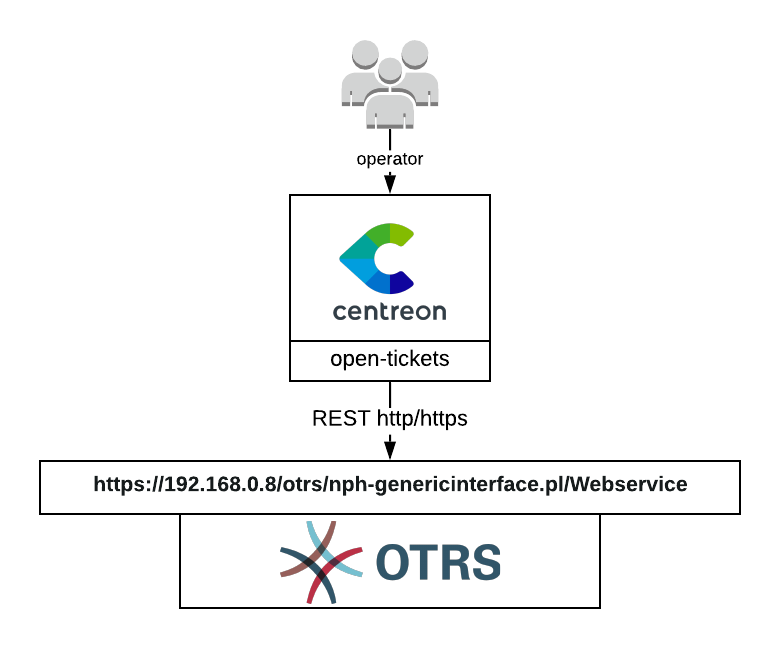

## How it works

The OTRS provider uses the REST API of OTRS to retrieve data in order to open a
ticket.



## Compatibility

This connector is at least compatible with the following versions of OTRS:

  - OTRS 5
  - OTRS 4

## Requirements

Before going any further, make sure that you correctly setup
[centreon-open-ticket](https://documentation.centreon.com/docs/centreon-open-tickets/en/latest/installation/index.html)
into your Centreon instance

Our provider requires the following parameters:

| Parameter       | Example of value                   |
| --------------- | ---------------------------------- |
| Address         | 192.168.0.8                        |
| Rest link       | nph-genericinterface.pl/Webservice |
| Path            | /otrs                              |
| Webservice name | centreon                           |
| Username        | centreon                           |
| Password        | MyPassword                         |
| Timeout         | 60                                 |

## Possibilities

As of now, the provider is able to retrieve the following objects from OTRS:

  - Queues
  - Priorities
  - States
  - Types
  - Customer users

## Configuration

Sadly, some extra configuration is required in order to gather this data from
OTRS.

1.  copying custom webservice files

copy the content of `extra/Custom` and `extra/Kernal` in `/opt/otrs/` on your
OTRS server.

2.  Edit the configuration file

Add the following lines in the `/opt/otrs/Kernel/Config.pm` file

``` perl
# ---------------------------------------------------- #
# insert your own config settings "here"               #
# config settings taken from Kernel/Config/Defaults.pm #
# ---------------------------------------------------- #
# $Self->{SessionUseCookie} = 0;
# $Self->{CheckMXRecord} = 0;
$Self->{'GenericInterface::Operation::Module'}->{'Priority::PriorityGet'} =  {
    'ConfigDialog' => 'AdminGenericInterfaceOperationDefault',
    'Controller' => 'Priority',
    'Name' => 'PriorityGet'
};
$Self->{'GenericInterface::Operation::Module'}->{'Queue::QueueGet'} =  {
    'ConfigDialog' => 'AdminGenericInterfaceOperationDefault',
    'Controller' => 'Queue',
    'Name' => 'QueueGet'
};
$Self->{'GenericInterface::Operation::Module'}->{'State::StateGet'} =  {
    'ConfigDialog' => 'AdminGenericInterfaceOperationDefault',
    'Controller' => 'State',
    'Name' => 'StateGet'
};
$Self->{'GenericInterface::Operation::Module'}->{'Type::TypeGet'} =  {
    'ConfigDialog' => 'AdminGenericInterfaceOperationDefault',
    'Controller' => 'Type',
    'Name' => 'TypeGet'
};
$Self->{'GenericInterface::Operation::Module'}->{'CustomerUser::CustomerUserGet'} =  {
    'ConfigDialog' => 'AdminGenericInterfaceOperationDefault',
    'Controller' => 'CustomerUser',
    'Name' => 'CustomerUserGet'
};
```

3.  Import the webservice

On your OTRS web interface, use the import web service button and select the
appropriate yaml file wich is `extra/export/otrs4/centreon.yml` or
`extra/export/otrs5/centreon.yml`
