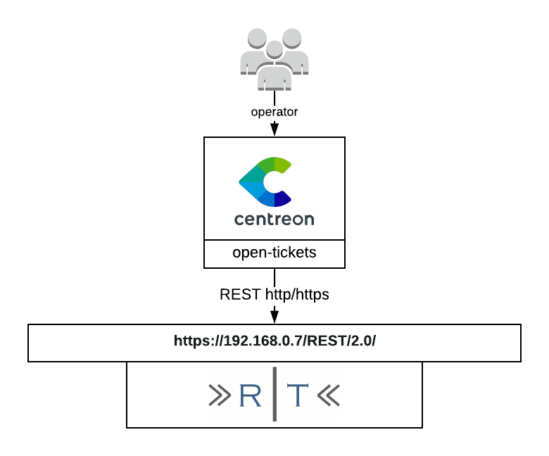

## How it works

The Request Tracker provider uses the REST API of Request Tracker to retrieve
data in order to open a ticket.

## Compatibility

This connector requires at least the version 2.0 of the REST API of Request
Tracker

## Requirements

Before going any further, make sure that you correctly setup
[centreon-open-ticket](https://documentation.centreon.com/docs/centreon-open-tickets/en/latest/installation/index.html)
into your Centreon instance

Our provider requires the following parameters:

| Parameter | Example of value             |
| --------- | ---------------------------- |
| Address   | 192.168.0.7                  |
| token     | xxxxxxxxxxxxxxxxxxxxxxxxxxxx |
| Path      | /REST/2.0/                   |
| Timeout   | 60                           |

## Possibilities

As of now, the provider is able to retrieve the following objects from Request
Tracker:

  - Queues
