## Introduction

This documentation is brought to you thanks to our partner PILPRÉ Yann from


## How it works

Telegram notifications connector uses the perl Centreon plugin to send notification through Telegram using their REST API

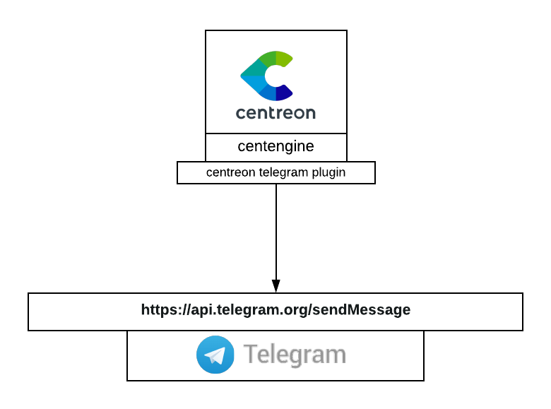

## Installation

### centreon plugin with telegram

First of all, you need the Centreon Telegram plugin to be installed on your Centreon server

```bash
yum install git
mkdir /usr/lib/centreon/git-plugins
cd /usr/lib/centreon/git-plugins
git clone https://github.com/centreon/centreon-plugins.git
chown -R centreon-engine. /usr/lib/centreon/git-plugins
```

### Telegram configuration

First of all, reach https://web.telegram.org and sign in

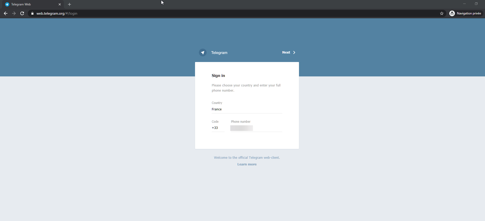

Then, proceed to talk to the BotFather and tell him the following command

```/newbot```

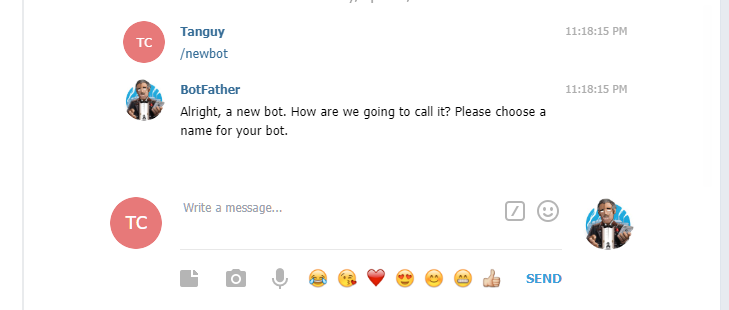

As asked by the BotFather, you need to give your bot a name and a username for your bot. This one must end with **_bot**.
To avoid confusion, you can use the same name for both like shown in the picture below.

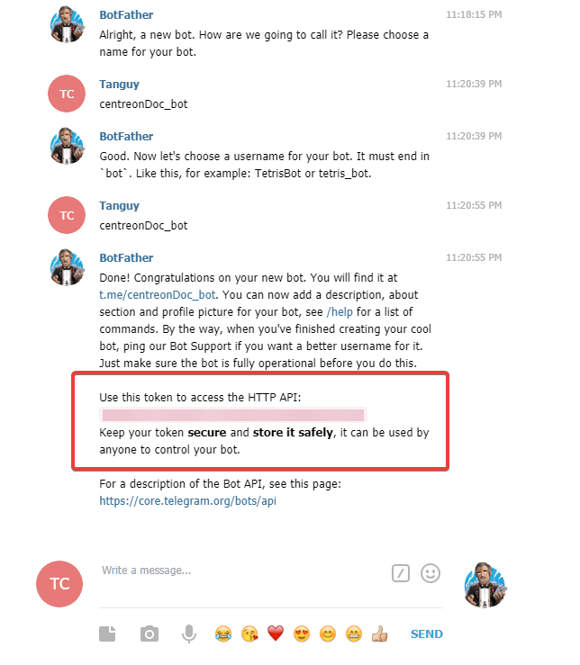

Like said by the BotFather, it is very important that you **save your token**. We are going to need it to send notifications later on.

Now we need to create a new group. To do so, use the telegram menu as follow

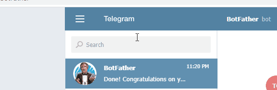

When creating your group, add your bot to it

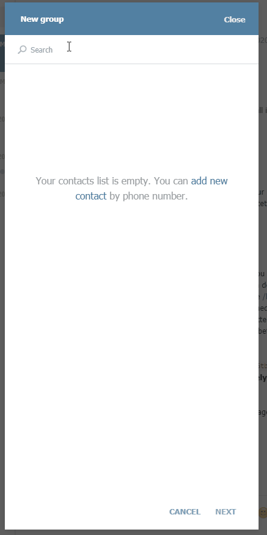

## Configuration

### Get your chat-id from telegram

On the telegram webapp page, click on the group previously created to obtain a chat-id from URL

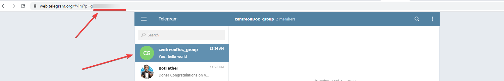

for example, if the url is as follow: **https://web.telegram.org/#/im?p=g123456** then, your chat-id is **123456**.

> Note that while 123456 is your chat-id, you'll need to use **-123456** in your configuration  otherwise it won't work

### Command creation in Centreon

#### Service notification command

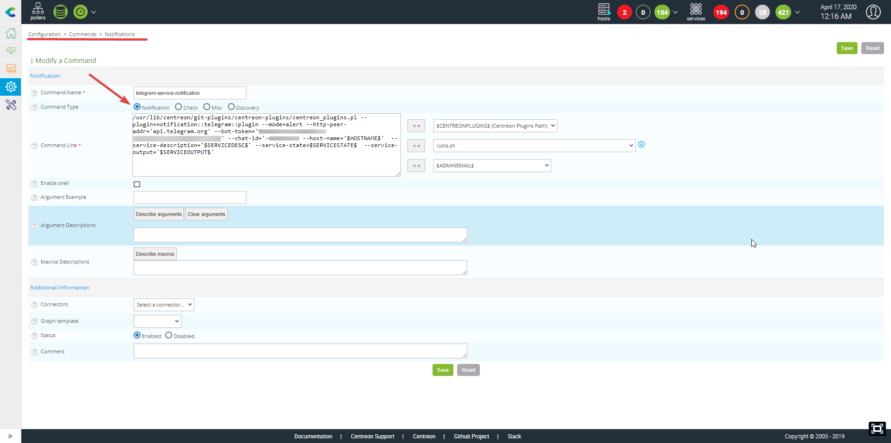

```bash
/usr/lib/centreon/git-plugins/centreon-plugins/centreon_plugins.pl \
--plugin=notification::telegram::plugin \
--mode=alert \
--http-peer-addr='api.telegram.org' --bot-token='xxxxxxxxxxxxxxxxxxxxxxxxxxxxxxxxxxx' \
--chat-id='-xxxxxxxxxx' --host-name='$HOSTNAME$'  --service-description='$SERVICEDESC$' --service-state=$SERVICESTATE$ \
--service-output='$SERVICEOUTPUT$'
``` 

#### Host notification command

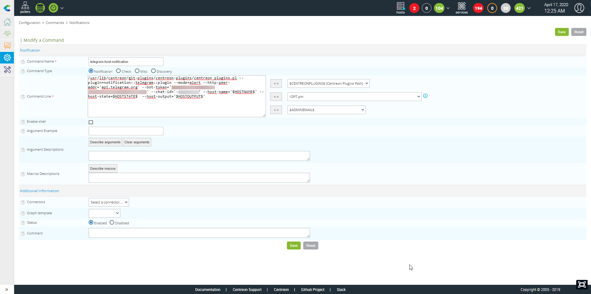

```bash
/usr/lib/centreon/git-plugins/centreon-plugins/centreon_plugins.pl \
--plugin=notification::telegram::plugin \
--mode=alert \
--http-peer-addr='api.telegram.org' \
--bot-token='xxxxxxxxxxxxxxxxxxxxxxxxxxxxxxxxxxxxxxx' \
--chat-id='-xxxxxxx' \ 
--host-name='$HOSTNAME$' \
--host-state=$HOSTSTATE$  \
--host-output='$HOSTOUTPUT$'
```

## Exemple

```bash
/usr/lib/centreon/git-plugins/centreon-plugins/centreon_plugins.pl \ 
--plugin=notification::telegram::plugin \
--mode=alert \
--http-peer-addr='api.telegram.org' \
--bot-token='xxxxxxxxxxxxxxxxxxxxxxxxxxxxxxxxxxx' \
--chat-id='-xxxxxxxx' \
--host-name='nirvana' \
--service-description='yellow-submarine' \
--service-state=CRITICAL 
--service-output='highway to hell'
```

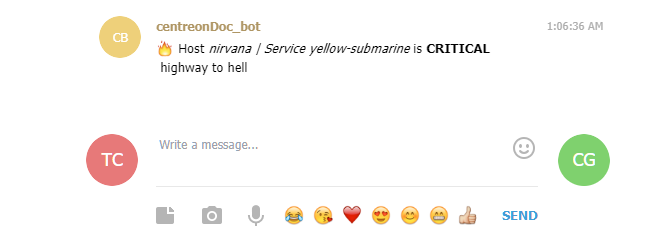

```bash
/usr/lib/centreon/git-plugins/centreon-plugins/centreon_plugins.pl \
--plugin=notification::telegram::plugin \
--mode=alert \
--http-peer-addr='api.telegram.org' \
--bot-token='xxxxxxxxxxxxxxxxxxxxxxxxxxxxxxxxxxx' \
--chat-id='-xxxxxxx' \
--host-name='REM' \
--host-state=DOWN \
--host-output='let the sky fall'
```

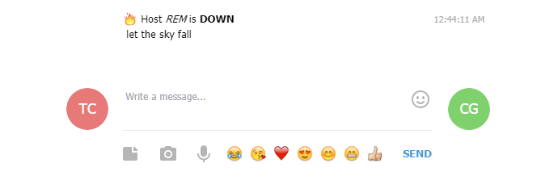

## Message options

When sending your notification you can add various options that you can list using the `--help` option of the Centreon plugin. 

Below are some of the available options:

| Options           | Explanation                                            | Example                                                                                                                                                                                   |
| ----------------- | ------------------------------------------------------ | ----------------------------------------------------------------------------------------------------------------------------------------------------------------------------------------- |
| \--centreon-token | an autologin token from centreon                       |                                                                                                                                                                                           |
| \--centreon-url   | the centreon url                                       |                                                                                                                                                                                           |
| \--graph-url      | graph url. You can use the above options as macro here | **%{centreon\_url}**/include/views/graphs/generateGraphs/generateImage.php?username=myuser\&token=**%{centreon\_token}**\&hostname=**%{host\_name}**\&service=**%{service\_description}** |
| \--link-url       | a link url                                             | **%{centreon\_url}**/main.php?p=20201\&o=svc\&host\_search=**%{host\_name}**\&svc\_search=**%{service\_description}**                                                                     |
| \--proxyurl       | the url to your proxy if needed                        |                                                                                                                                                                                           |

All options can be displayed with the following command:

```bash
/usr/lib/centreon/git-plugins/centreon-plugins/centreon_plugins.pl \
--plugin=notification::telegram::plugin \
--mode=alert \
--help
```