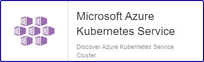

## Vue d'ensemble

Azure Kubernetes Service (AKS) simplifie le déploiement d’un cluster Kubernetes managé en déléguant la charge opérationnelle à Azure. En tant que service Kubernetes hébergé, Azure gère des tâches critiques telles que l’analyse de l’intégrité et la maintenance.

Le Plugin Pack Centreon *Azure Kubernetes Service* peut s'appuyer sur l'API d'Azure ou bien Azure CLI pour collecter les métriques relatives à AKS.

## Contenu du Pack

### Modèles

Le Plugin Pack Centreon Azure Kubernetes Service apporte un modèle d'hôte :

* Cloud-Azure-Compute-Aks-custom

Il apporte les Modèles de Service suivants :

| Alias                 | Service Template                                  | Défaut |
| :-------------------- | :------------------------------------------------ | :----- |
| Allocatable-resources | Cloud-Azure-Compute-Aks-Allocatable-Resources-Api | X      |
| Cpu-Usage             | Cloud-Azure-Compute-Aks-Cpu-Usage-Api             | X      |
| Health                | Cloud-Azure-Compute-Aks-Health-Api                | X      |
| Storage               | Cloud-Azure-Compute-Aks-Storage-Api               | X      |
| Traffic               | Cloud-Azure-Compute-Aks-Traffic-Api               | X      |
| Unneeded-nodes        | Cloud-Azure-Compute-Aks-Unneeded-Nodes-Api        | X      |

### Règles de découverte

Le Plugin-Pack Centreon *Azure Kubernetes Service* inclut un fournisseur de découverte d'Hôtes nommé **Microsoft Azure Kubernetes Services**. Celui-ci permet de découvrir l'ensemble des instances rattachées à une *souscription* Microsoft Azure donnée et les ajouter à la supervision :



> La découverte *Azure Kubernetes Service* n'est compatible qu'avec le mode 'api'. Le mode 'azcli' n'est pas supporté dans le cadre de cette utilisation.

Vous trouverez plus d'informations sur la découverte d'Hôtes et son fonctionnement sur la documentation du module : [Découverte des hôtes](../../../monitoring/discovery/hosts-discovery.html)

### Métriques & statuts collectés

<!--DOCUSAURUS_CODE_TABS-->

<!--Allocatable-resources-->

| Nom                                          | Unité |
| :------------------------------------------- | :---- |
| *instance*#aks.node.allocatable.cpu.cores    | Count |
| *instance*#aks.node.allocatable.memory.bytes | B     |

<!--Cpu-Usage-->

| Nom                                            | Unité |
| :--------------------------------------------- | :---- |
| *instance*#aks.node.cpu.utilization.percentage | %     |

<!--Health-->

| Nom    | Unité  |
| :----- | :----- |
| Statut | String |

<!--Storage-->

| Nom                                       | Unité |
| :---------------------------------------- | :---- |
| *instance*#aks.node.disk.usage.percentage | %     |
| *instance*#aks.node.disk.usage.bytes      | B     |

<!--Traffic-->

| Nom                                   | Unité |
| :------------------------------------ | :---- |
| *instance*#aks.node.traffic.in.bytes  | B     |
| *instance*#aks.node.traffic.out.bytes | B     |

<!--Unneeded-nodes-->

| Nom                                              | Unité |
| :----------------------------------------------- | :---- |
| *instance*#aks.cluster.autoscaler.unneeded.nodes | Count |

<!--END_DOCUSAURUS_CODE_TABS-->

## Prérequis

Deux moyens sont disponibles pour interroger les API de Microsoft Azure :	

* Azure API ('api')
* Azure CLI ('azcli')

Centreon préconise l'utilisation de la méthode *API* plutôt que la *CLI*, cette dernière étant significativement moins performante. L'API permet également une authentification *Application* et ne nécessite pas de compte de service dédié.

<!--DOCUSAURUS_CODE_TABS-->

<!--Azure Monitor API-->

Pour le custom-mode 'api', récupérez les informations en suivant la procédure ci-dessous (en anglais) et notez celles-ci en lieu sûr. Elles seront en effet indispensables lors de la configuration des ressources dans Centreon.

* Create an *application* in Azure Active Directory:
  - Log in to your Azure account.
  - Select *Azure Active directory* in the left sidebar.
  - Click on *App registrations*.
  - Click on *+ Add*.
  - Enter Centreon as the application name (or any name of your choice), select application type (api) and sign-on-url.
  - Click on the *Create* button.

* Get *Subscription ID*
  - Log in to your Azure account.
  - Select *Subscriptions* in the left sidebar.
  - Select whichever subscription is needed.
  - Click on *Overview*.
  - Copy the Subscription ID.

* Get *Tenant ID*
  - Log in to your Azure account.
  - Select *Azure Active directory* in the left sidebar.
  - Click on *Properties*.
  - Copy the directory ID.

* Get *Client ID*
  - Log in to your Azure account.
  - Select *Azure Active directory* in the left sidebar.
  - Click on *Enterprise applications*.
  - Click on *All applications*.
  - Select the application previously created.
  - Click on *Properties*.
  - Copy the Application ID.

* Get *Client secret*
  - Log in to your Azure account.
  - Select *Azure Active directory* in the left sidebar.
  - Click on *App registrations*.
  - Select the application previously created.
  - Click on *All settings*.
  - Click on *Keys*.
  - Enter the key description and select the duration.
  - Click on *Save*.
  - Copy and store the key value. **You won't be able to retrieve it after you leave this page**.

Please make sure to assign the **Monitoring Reader** role to the application.

<!--Azure AZ CLI-->

Afin d'utiliser le custom-mode 'azcli', installez le binaire associé sur tous les Collecteurs Centreon devant superviser des ressources Azure:

- La CLI requiert une version de Python >= 2.7 
  (<https://github.com/Azure/azure-cli/blob/dev/doc/install_linux_prerequisites.md>)

Sur un système utilisant le packaging RPM, utilisez les commandes ci-dessous avec l'utilisateur **root** ou un utilisateur avec les droits **sudo** adéquats:

```shell
sudo rpm --import https://packages.microsoft.com/keys/microsoft.asc
sudo echo -e "[azure-cli]\nname=Azure CLI\nbaseurl=https://packages.microsoft.com/yumrepos/azure-cli\nenabled=1\ngpgcheck=1\ngpgkey=https://packages.microsoft.com/keys/microsoft.asc" > /etc/yum.repos.d/azure-cli.repo
sudo yum install azure-cli-2.29.2-1.el7
```

Ensuite, réalisez les opérations suivantes avec l'utilisateur **centreon-engine** afin de récupérer le token d'authentification Azure:

```shell
su - centreon-engine
az login
```

La commande retourne le message ci-dessous contenant un code d'authentification :

	*To sign in, use a web browser to open the page https://microsoft.com/devicelogin*
	*and enter the code CWT4WQZAD to authenticate.*

Rendez-vous sur <https://microsoft.com/devicelogin> afin de saisir le code obtenu, puis connectez-vous avec le compte de service dédié à la supervision.

Une fois ces actions effectuées, des informations d'auhtentification de la forme suivante devraient s'afficher dans le terminal du collecteur Centreon: 

```shell
	[
	  {
		"cloudName": "AzureCloud",
		"id": "0ef83f3a-d83e-2039-d930-309df93acd93d",
		"isDefault": true,
		"name": "N/A(tenant level account)",
		"state": "Enabled",
		"tenantId": "0ef83f3a-03cd-2039-d930-90fd39ecd048",
		"user": {
		  "name": "email@mycompany.onmicrosoft.com",
		  "type": "user"
		}
	  }
	]
```

Vous avez désormais les informations stockées localement dans un fichier **accessTokens.json** qui sera utilisé automatiquement par le Plugin.

<!--END_DOCUSAURUS_CODE_TABS-->

## Installation

<!--DOCUSAURUS_CODE_TABS-->

<!--Online License-->

1. Installer le Plugin Centreon sur tous les collecteurs Centreon devant superviser des ressources *Azure Kubernetes Service*:

```bash
yum install centreon-plugin-Cloud-Azure-Compute-Aks-Api
```

2. Sur l'interface Web de Centreon, installer le Plugin Pack **Azure Kubernetes Service** depuis la page **Configuration > Packs de plugins**.

<!--Offline License-->

1. Installer le Plugin Centreon sur tous les collecteurs Centreon devant superviser des ressources *Azure Kubernetes Service*:

```bash
yum install centreon-plugin-Cloud-Azure-Compute-Aks-Api
```

2. Sur le serveur Central Centreon, installer le RPM du Pack **Azure Kubernetes Service**:

 ```bash
yum install centreon-pack-cloud-azure-compute-aks
 ```

3. Sur l'interface Web de Centreon, installer le Plugin Pack **Azure Kubernetes Service** depuis la page **Configuration > Packs de plugins**.

<!--END_DOCUSAURUS_CODE_TABS-->

## Configuration

### Hôte

* Ajoutez un Hôte à Centreon, remplissez le champ **Adresse IP/DNS** avec l'adresse 127.0.0.1. et appliquez-lui le Modèle d'Hôte **Cloud-Azure-Compute-Aks-custom**.
* Une fois le modèle appliqué, les Macros ci-dessous indiquées comme requises (*Mandatory*) doivent être renseignées selon le *custom mode* utilisé.

> Deux méthodes peuvent être utilisées lors de l'assignation des Macros :
>
> * Utilisation de l'ID complet de la ressource (```/subscriptions/<subscription_id>/resourceGroups/<resourcegroup_id>/providers/Microsoft.ContainerService/ManagedClusters/<resource_name>```)
>   in *AZURERESOURCE*
> * Utilisation du nom de la ressource dans la Macro *AZURERESOURCE* associée à la Macro *AZURERESOURCEGROUP*.

| Mandatory | Nom                | Description                                        |
| --------- | ------------------ | -------------------------------------------------- |
| X         | AZURECUSTOMMODE    | Custom mode 'api'                                  |
| X         | AZURESUBSCRIPTION  | Subscription ID                                    |
| X         | AZURETENANT        | Tenant ID                                          |
| X         | AZURECLIENTID      | Client ID                                          |
| X         | AZURECLIENTSECRET  | Client secret                                      |
| X         | AZURERESOURCE      | ID or AKS cluster name                             |
|           | AZURERESOURCEGROUP | Associated Resource Group if resource name is used |

| Mandatory | Nom                | Description                                        |
| --------- | ------------------ | -------------------------------------------------- |
| X         | AZURECUSTOMMODE    | Custom mode 'azcli'                                |
| X         | AZURESUBSCRIPTION  | Subscription ID                                    |
| X         | AZURERESOURCE      | ID or AKS cluster name                             |
|           | AZURERESOURCEGROUP | Associated Resource Group if resource name is used |

## Comment puis-je tester le Plugin et que signifient les options des commandes ? 

Une fois le Plugin installé, vous pouvez tester celui-ci directement en ligne de commande depuis votre collecteur Centreon en vous connectant avec l'utilisateur **centreon-engine** :

```bash
/usr/lib/centreon/plugins//centreon_azure_compute_aks_api.pl \
    --plugin=cloud::azure::compute::aks::plugin \
    --mode=storage \
    --custommode='api' \
    --resource='' \
    --resource-group='' \
    --subscription='' \
    --tenant='' \
    --client-id='' \
    --client-secret='' \
    --proxyurl='' \
    --filter-metric='' \
    --timeframe='900' \
    --interval='PT5M' \
    --warning-storage-used='' \
    --critical-storage-used='' \
    --warning-storage-percent='90' \
    --critical-storage-percent='95' \
    --use-new-perfdata 
```

La commande devrait retourner un message de sortie similaire à :

```bash
OK:Instance 'CLUSTER90' Statistic 'average' Metrics Storage Percent: 38.54%, Storage Used: 11.17GB | 'CLUSTER90~average#aks.node.disk.usage.percentage'=38.54%;0:90;0:95;0; 'CLUSTER90~average#aks.node.disk.usage.bytes'=11989825262.93B;;;0;
```

Dans cet exemple, une alarme de type WARNING sera déclenchée si l'espace utilisé sur le disque est supérieur à 90%  (`--warning-storage-percent='90'`) et l'alarme sera de type CRITICAL si ce pourcentage est supérieur à 95% (`--critical-storage-percent='95'`).

La liste de toutes les options complémentaires et leur signification peut être affichée en ajoutant le paramètre `--help` à la commande :

```bash
/usr/lib/centreon/plugins//centreon_azure_compute_aks_api.pl \
    --plugin=cloud::azure::compute::aks::plugin \
    --mode=storage \
    --help
```

Tous les modes disponibles peuvent être affichés en ajoutant le paramètre`--list-mode` à la commande :

```bash
/usr/lib/centreon/plugins//centreon_azure_compute_aks_api.pl \
    --plugin=cloud::azure::compute::aks::plugin \
    --list-mode
```

### Diagnostic des erreurs communes

Rendez-vous sur la [documentation dédiée](../tutorials/troubleshooting-plugins.html#http-and-api-checks) des Plugins basés sur HTTP/API.