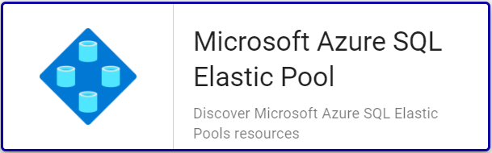

## Vue d'ensemble

Les pools élastiques Azure SQL Database représentent une solution simple et rentable de gestion et de mise à l’échelle de plusieurs
bases de données qui ont des demandes d’utilisation variables et imprévisibles. Les bases de données d’un pool élastique se trouvent
sur un seul serveur et partagent un nombre défini de ressources à prix fixe. 

Le Plugin-Pack Centreon *Azure Elastic Pool* s'appuie sur les API Azure Monitor afin de récuperer les métriques relatives au service
Elastic Pool. Il est possible d'utiliser les 2 modes proposés par Microsoft: RestAPI ou Azure CLI.

## Contenu du Plugin-Pack

### Objets supervisés

* *Elastic Pools* Azure SQL

### Règles de découverte

Le Plugin-Pack Centreon *Azure Elastic Pool* inclut un *provider* de découverte d'Hôtes nommé **Microsoft Azure SQL Elastic Pool**.
Celui-ci permet de découvrir l'ensemble des *Elastic Pools* rattachés à une *souscription* Microsoft Azure donnée:



> La découverte *Azure Elastic Pool* n'est compatible qu'avec le mode 'api'. Le mode 'azcli' n'est pas supporté dans le cadre
> de cette utilisation. 

Vous trouverez plus d'informations sur la découverte d'Hôtes et son fonctionnement sur la documentation du module:
[Découverte des hôtes](../../../monitoring/discovery/hosts-discovery.html)

### Métriques collectées 

<!--DOCUSAURUS_CODE_TABS-->

<!--Cpu-->

> Ces métriques sont disponibles uniquement pour les *Pools* de type *vCore*

| Metric name                      | Description    | Unit  |
|:---------------------------------|:---------------|:------|
| elasticpool.cpu.limit.count      | CPU limit      | Count |
| elasticpool.cpu.usage.percentage | CPU percentage | %     |
| elasticpool.cpu.used.count       | CPU used       | Count |

<!--Dtu-->

> Ces métriques sont disponibles uniquement pour les *Pools* de type *DTU*

| Metric name                             | Description    | Unit  |
|:----------------------------------------|:---------------|:------|
| elasticpool.dtu.consumpution.percentage | DTU percentage | %     |
| elasticpool.edtu.limit.count            | eDTU limit     | Count |
| elasticpool.edtu.used.count             | eDTU used      | Count |

<!--Log-->

| Metric name                             | Description                    | Unit |
|:----------------------------------------|:-------------------------------|:-----|
| elasticpool.log.write.percentage        | Log IO percentage              | %    |
| elasticpool.log.tempdb.size.kilobytes   | Tempdb Log File Size Kilobytes | KB   |
| elasticpool.log.tempdb.usage.percentage | Tempdb Percent Log Used        | %    |

<!--Sessions-->

| Metric name                           | Description         | Unit |
|:--------------------------------------|:--------------------|:-----|
| elasticpool.sessions.usage.percentage | Sessions percentage | %    |
| elasticpool.workers.usage.percentage  | Workers percentage  | %    |

<!--Storage-->

| Metric name                                   | Description                  | Unit |
|:----------------------------------------------|:-----------------------------|:-----|
| elasticpool.storage.data.allocated.bytes      | Data space allocated         | B    |
| elasticpool.storage.data.allocated.percentage | Data space allocated percent | %    |
| elasticpool.storage.used.bytes                | Data space used              | B    |
| elasticpool.storage.usage.percentage          | Data space used percent      | %    |

<!--END_DOCUSAURUS_CODE_TABS-->

## Prérequis

Deux moyens sont disponibles pour interroger les API Microsoft Azure. 

Centreon préconise l'utilisation de la méthode *API* plutôt que la *CLI*, cette dernière étant significativement
moins performante. L'API permet également une authentification *Application* et ne nécessite pas de compte de service dédié.

<!--DOCUSAURUS_CODE_TABS-->

<!--Azure Monitor API-->

Pour le custom-mode 'api', récupérez les informations en suivant la procédure ci-dessous (en anglais)
et notez celles-ci en lieu sûr. Elles seront en effet indispensables lors de la configuration des ressources
dans Centreon.

* Create an *application* in Azure Active Directory:
    - Log in to your Azure account.
    - Select *Azure Active directory* in the left sidebar.
    - Click on *App registrations*.
    - Click on *+ Add*.
    - Enter Centreon as the application name (or any name of your choice), select application type(api) and sign-on-url.
    - Click on the *Create* button.

* Get *Subscription ID*
    - Log in to your Azure account.
    - Select *Subscriptions* in the left sidebar.
    - Select whichever subscription is needed.
    - Click on *Overview*.
    - **Copy the Subscription ID.**

* Get *Tenant ID*
    - Log in to your Azure account.
    - Select *Azure Active directory* in the left sidebar.
    - Click on *Properties*.
    - **Copy the directory ID.**

* Get *Client ID*
    - Log in to your Azure account.
    - Select *Azure Active directory* in the left sidebar.
    - Click on *Enterprise applications*.
    - Click on *All applications*.
    - Select the application previously created.
    - Click on *Properties*.
    - **Copy the Application ID.**

* Get *Client secret*
    - Log in to your Azure account.
    - Select *Azure Active directory* in the left sidebar.
    - Click on *App registrations*.
    - Select the application previously created.
    - Click on *All settings*.
    - Click on *Keys*.
    - Enter the key description and select the duration.
    - Click on *Save*.
    - **Copy and store the key value. You won't be able to retrieve it after you leave this page.**

<!--Azure AZ CLI-->

Afin d'utiliser le custom-mode 'azcli', installez le binaire associé sur tous les Collecteurs Centreon
devant superviser des resources Azure:

- La CLI requiert une version de Python >= 2.7 (<https://github.com/Azure/azure-cli/blob/dev/doc/install_linux_prerequisites.md>)

Sur un système utilisant le packaging RPM, utilisez les commandes ci-dessous avec 
l'utilisateur *root* ou un utilisateur avec les droits 'sudo' adéquats:

```shell
sudo rpm --import https://packages.microsoft.com/keys/microsoft.asc
sudo echo -e "[azure-cli]\nname=Azure CLI\nbaseurl=https://packages.microsoft.com/yumrepos/azure-cli\nenabled=1\ngpgcheck=1\ngpgkey=https://packages.microsoft.com/keys/microsoft.asc" > /etc/yum.repos.d/azure-cli.repo
sudo yum install azure-cli
```

Ensuite, réalisez les opérations suivantes avec l'utilisateur *centreon-engine*
afin de récupérer le token d'authentification Azure:

```shell
su - centreon-engine
az login
```

La commande retourne le message ci-dessous contenant un code:

    *To sign in, use a web browser to open the page https://microsoft.com/devicelogin*
    *and enter the code CWT4WQZAD to authenticate.*

Rendez-vous sur <https://microsoft.com/devicelogin> afin de saisir le code obtenu, puis connectez vous avec le compte de service dédié à la supervision.

Une fois ces actions effectuées, des informations d'auhtentification de la forme suivante devraient s'afficher dans le terminal
du collecteur Centreon: 

```shell
    [
      {
        "cloudName": "AzureCloud",
        "id": "0ef83f3a-d83e-2039-d930-309df93acd93d",
        "isDefault": true,
        "name": "N/A(tenant level account)",
        "state": "Enabled",
        "tenantId": "0ef83f3a-03cd-2039-d930-90fd39ecd048",
        "user": {
          "name": "email@mycompany.onmicrosoft.com",
          "type": "user"
        }
      }
    ]
```

Vous avez désormais les informations stockées localement dans un fichier 
accessTokens.json qui sera utilisé automatiquement par le Plugin. 

<!--END_DOCUSAURUS_CODE_TABS-->

## Installation 

<!--DOCUSAURUS_CODE_TABS-->

<!--Online IMP Licence & IT-100 Editions-->

1. Installer le Plugin sur tous les collecteurs Centreon devant superviser des resources Azure Elastic Pool:

```bash
yum install centreon-plugin-Cloud-Azure-Database-Elasticpool-Api
```

2. Sur l'interface Web de Centreon, installer le Plugin-Pack *Azure Elastic Pool* depuis la page "Configuration > Plugin packs > Manager"

<!--Offline IMP License-->

1. Installer le Plugin sur tous les collecteurs Centreon devant superviser des resources Azure Elastic Pool::

```bash
yum install centreon-plugin-Cloud-Azure-Database-Elasticpool-Api
```

2. Sur le serveur Central Centreon, installer le RPM du Plugin-Pack *Azure Elastic Pool*:

```bash
yum install centreon-pack-cloud-azure-database-elasticpool.noarch
```

3. Sur l'interface Web de Centreon, installer le Plugin-Pack *Azure Elastic Pool* depuis la page "Configuration > Plugin packs > Gestionnaire"

<!--END_DOCUSAURUS_CODE_TABS-->

## Configuration

### Hôte

* Ajoutez un Hôte à Centreon, remplissez le champ *Adresse IP/DNS* avec l'adresse 127.0.0.1 
et appliquez-lui le Modèle d'Hôte *Cloud-Azure-Database-Elasticpool-custom*.
* Une fois le modèle appliqué, les Macros ci-dessous indiquées comme requises (*Mandatory*) 
doivent être renseignées selon le custom-mode utilisé:

<!--DOCUSAURUS_CODE_TABS-->

<!--Azure Monitor API-->

| Mandatory | Nom               | Description                                                                                     |
|:----------|:------------------|:------------------------------------------------------------------------------------------------|
| X         | AZURECUSTOMMODE   | Custom mode 'api'                                                                               |
| X         | AZURESUBSCRIPTION | Subscription ID                                                                                 |
| X         | AZURETENANT       | Tenant ID                                                                                       |
| X         | AZURECLIENTID     | Client ID                                                                                       |
| X         | AZURECLIENTSECRET | Client secret                                                                                   |
| X         | AZURERESOURCE     | Id of the Elastic Pool resource (syntax: \<server\_name\>\/elasticpool\/\<elasticpools\_name\>) |

<!--Azure AZ CLI-->

| Mandatory | Nom               | Description                                                                                     |
|:----------|:------------------|:------------------------------------------------------------------------------------------------|
| X         | AZURECUSTOMMODE   | Custom mode 'azcli'                                                                             |
| X         | AZURESUBSCRIPTION | Subscription ID                                                                                 |
| X         | AZURERESOURCE     | Id of the Elastic Pool resource (syntax: \<server\_name\>\/elasticpool\/\<elasticpools\_name\>) |

<!--END_DOCUSAURUS_CODE_TABS-->

## FAQ

### Comment puis-je tester le Plugin et que signifient les options des commandes ?

Une fois le Plugin installé, vous pouvez tester celui-ci directement en ligne de
commande depuis votre collecteur Centreon en vous connectant avec l'utilisateur
*centreon-engine*:

```bash
/usr/lib/centreon/plugins/centreon_azure_database_elasticpool_api.pl \
    --plugin=cloud::azure::database::elasticpool::plugin \
    --mode=sessions \
    --custommode=api \
    --subscription='xxxxxxxxx' \
    --tenant='xxxxxxxxx' \
    --client-id='xxxxxxxxx' \
    --client-secret='xxxxxxxxx' \
    --resource='SQLSRV001/elasticpools/SQLELP001' \
    --timeframe='900' \
    --interval='PT5M' \
    --aggregation='average' \
    --warning-sessions-percent='80' \
    --critical-sessions-percent='90' \
    --verbose
```

La commande devrait retourner un message de sortie similaire à: 

```bash
OK: Elastic Pool 'SQLSRV001/SQLELP001' Statistic 'average' Metrics Workers usage percentage: 0.03 %, Sessions usage percentage: 0.00 % |
'SQLSRV001/SQLELP001~average#elasticpool.workers.usage.percentage'=0.03%;;;; 'SQLSRV001/SQLELP001~average#elasticpool.sessions.usage.percentage'=0.00%;;;;
Checking Pool'SQLSRV001/SQLELP001' 
    Statistic 'average' Metrics Workers usage percentage: 0.03 %, Sessions usage percentage: 0.00 %
```

La commande ci-dessus collecte les métriques relatives aux statistiques de *sessions* de l'*Elastic Pool* SQLELP001 hebergé sur le 
*SQL server* SQLSRV001 (```--plugin=cloud::azure::database::elasticpool::plugin --mode=sessions --resource='SQLSRV001/elasticpools/SQLELP001'```).

Le mode de connexion utilisé est 'api' (```--custommode=api```), les paramètres d'authentification nécessaires à l'utilisation de ce mode
sont donc renseignés en fonction (```--subscription='xxxxxxxxx' --tenant='xxxxxxx' --client-id='xxxxxxxx' --client-secret='xxxxxxxxxx'```).

Les métriques retournées seront une moyenne (```--aggregation='average'```) sur un intervalle de 15 minutes / 900 secondes  (```--timeframe='900'```) 
avec un point par tranche de 5 minutes (```--interval='PT5M'```).

Dans cette exemple, une alarme de type WARNING sera déclenchée si le pourcentage de *sessions* en cours pendant l'intervalle donné
est supérieur à 80% des capacités du *pool* (```--warning-sessions-percent='80'```); l'alarme sera de type CRITICAL au delà de 90%
d'utilisation des capacités de *sessions* (```--critical-sessions-percent='90'```).

La liste de toutes les options complémentaires et leur signification
peut être affichée en ajoutant le paramètre ```--help``` à la commande:

```bash
/usr/lib/centreon/plugins/centreon_azure_database_elasticpool_api.pl \
    --plugin=cloud::azure::database::elasticpool::plugin \
    --mode=sessions \
    --help
```

### Diagnostic des erreurs communes  

#### ```UNKNOWN: Login endpoint API returns error code 'ERROR_NAME' (add --debug option for detailed message)```

Lors du déploiement de mes contrôles, j'obtiens le message suivant : 
```UNKNOWN: Login endpoint API returns error code 'ERROR_NAME' (add --debug option for detailed message)```.

Cela signifie que l'un des paramètres utilisés pour authentifier la requête est incorrect. Le paramètre 
en question est spécifié dans le message d'erreur en lieu et place de 'ERROR_DESC'. 

Par exemple, 'invalid_client' signifie que le client-id et/ou le client-secret
n'est (ne sont) pas valide(s).

#### Les identifiants ont changé et mon Plugin ne fonctionne plus

Le Plugin utilise un fichier de cache pour conserver les informations de connexion afin de ne pas 
se ré-authentifier à chaque appel. Si des informations sur le Tenant, la Souscription ou les 
Client ID / Secret changent, il est nécessaire de supprimer le fichier de cache du Plugin. 

Celui ci se trouve dans le répertoire ```/var/lib/centreon/centplugins/``` avec le nom azure_api_<md5>_<md5>_<md5>_<md5>.

#### UNKNOWN: 500 Can't connect to login.microsoftonline.com:443 

Si l'utilisation d'un proxy est requise pour les connexions HTTP depuis le 
collecteur Centreon, il est nécessaire de le préciser dans la commande en
utilisant l'option ```--proxyurl='http://proxy.mycompany.com:8080'```.

Il est également possible qu'un équipement tiers de type Pare-feu bloque la requête
effectuée par le Plugin.
