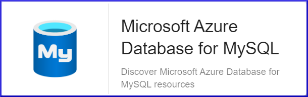

## Vue d'ensemble

Azure Database pour MySQL vous permet de configurer facilement des instances 
MySQL de haute disponibilité, sécurisées et extensibles.

Le Plugin Pack Centreon *Azure Database for MySQL* s'appuie sur les API Azure Monitor afin de récuperer les métriques relatives au service
API Management. Il est possible d'utiliser les 2 modes proposés par Microsoft: RestAPI ou Azure CLI.

## Contenu du Pack

### Objets supervisés

* Instances Azure *Azure Database for MySQL*
    * Connections
    * CPU
    * IO consumption
    * Memory
    * Queries
    * Replication
    * Storage
    * Traffic

### Règles de découverte

Le Plugin Pack Centreon *Azure Database for MySQL* inclut un *provider* de découverte d'Hôtes nommé **Microsoft Azure Database for MySQL**.
Celui-ci permet de découvrir l'ensemble des instances *Azure Database for MySQL* rattachés à une *souscription* Microsoft Azure donnée:



> La découverte *Azure Database for MySQL* n'est compatible qu'avec le mode 'api'. Le mode 'azcli' n'est pas supporté dans le cadre
> de cette utilisation. 

Vous trouverez plus d'informations sur la découverte d'Hôtes et son fonctionnement sur la documentation du module:
[Découverte des hôtes](../../../monitoring/discovery/hosts-discovery.html)

### Métriques & statuts collectés 

<!--DOCUSAURUS_CODE_TABS-->

<!--Connections-->

| Metric Name                       | Description                   | Unit  |
|:----------------------------------|:------------------------------|:------|
| azmysql.connections.active.count  | Number of active connections  | Count |
| azmysql.connections.failed.count  | Number of failed Connections  | Count |
| azmysql.connections.aborted.count | Number of aborted Connections | Count |
| azmysql.connections.total.count   | Number of total Connections   | Count |

<!--Cpu-->

| Metric Name                        | Description     | Unit      |
|:---------------------------------- |:----------------|:----------|
| azmysql.cpu.utilization.percentage | CPU utilization | Percentage |

<!--IO-Consumption-->

| Metric Name                            | Description    | Unit       |
|:---------------------------------------|:---------------|:-----------|
| azmysql.ioconsumption.usage.percentage | IO consumption | Percentage |

<!--Memory-->

| Metric Name                     | Description  | Unit       |
|:--------------------------------|:-------------|:-----------|
| azmysql.memory.usage.percentage | Memory usage | Percentage |

<!--Queries-->

| Metric Name           | Description       | Unit  |
|:----------------------|:------------------|:------|
| azmysql.queries.count | Number of queries | Count |

<!--Replication-->

| Metric Name                     | Description      | Unit    |
|:--------------------------------|:-----------------|:--------|
| azmysql.replication.lag.seconds | Replication Lag  | Seconds |
| azmysql.replication.lag.count   | Replication Lag  | Count   |

<!--Storage-->

| Metric Name                                | Description              | Unit       |
|:-------------------------------------------|:-------------------------|:-----------|
| azmysql.storage.usage.bytes                | Storage used             | Bytes      |
| azmysql.storage.limit.bytes                | Storage limit            | Bytes      |
| azmysql.storage.usage.percentage           | Storage used             | Percentage |
| azmysql.storage.backup.usage.bytes         | Backup storage used      | Bytes      |
| azmysql.storage.serverlog.limit.bytes      | Server Log storage limit | Bytes      |
| azmysql.storage.serverlog.usage.bytes      | Server Log storage used  | Bytes      |
| azmysql.storage.serverlog.usage.percentage | Server Log storage used  | Percentage |

<!--Traffic-->

| Metric Name               | Description | Unit  |
|:--------------------------|:------------|:------|
| azmysql.traffic.out.bytes | Network Out | Bytes |
| azmysql.traffic.in.bytes  | Network In  | Bytes |

<!--END_DOCUSAURUS_CODE_TABS-->

## Prérequis

Deux moyens sont disponibles pour interroger les API Microsoft Azure. 

Centreon préconise l'utilisation de la méthode *API* plutôt que la *CLI*, cette dernière étant significativement
moins performante. L'API permet également une authentification *Application* et ne nécessite pas de compte de service dédié.

<!--DOCUSAURUS_CODE_TABS-->

<!--Azure Monitor API-->

Pour le custom-mode 'api', récupérez les informations en suivant la procédure ci-dessous (en anglais)
et notez celles-ci en lieu sûr. Elles seront en effet indispensables lors de la configuration des ressources
dans Centreon.

* Create an *application* in Azure Active Directory:
    - Log in to your Azure account.
    - Select *Azure Active directory* in the left sidebar.
    - Click on *App registrations*.
    - Click on *+ Add*.
    - Enter Centreon as the application name (or any name of your choice), select application type(api) and sign-on-url.
    - Click on the *Create* button.

* Get *Subscription ID*
    - Log in to your Azure account.
    - Select *Subscriptions* in the left sidebar.
    - Select whichever subscription is needed.
    - Click on *Overview*.
    - **Copy the Subscription ID.**

* Get *Tenant ID*
    - Log in to your Azure account.
    - Select *Azure Active directory* in the left sidebar.
    - Click on *Properties*.
    - **Copy the directory ID.**

* Get *Client ID*
    - Log in to your Azure account.
    - Select *Azure Active directory* in the left sidebar.
    - Click on *Enterprise applications*.
    - Click on *All applications*.
    - Select the application previously created.
    - Click on *Properties*.
    - **Copy the Application ID.**

* Get *Client secret*
    - Log in to your Azure account.
    - Select *Azure Active directory* in the left sidebar.
    - Click on *App registrations*.
    - Select the application previously created.
    - Click on *All settings*.
    - Click on *Keys*.
    - Enter the key description and select the duration.
    - Click on *Save*.
    - **Copy and store the key value. You won't be able to retrieve it after you leave this page.**

<!--Azure AZ CLI-->

Afin d'utiliser le custom-mode 'azcli', installez le binaire associé sur tous les Collecteurs Centreon
devant superviser des resources Azure:

- La CLI requiert une version de Python >= 2.7 (<https://github.com/Azure/azure-cli/blob/dev/doc/install_linux_prerequisites.md>)

Sur un système utilisant le packaging RPM, utilisez les commandes ci-dessous avec 
l'utilisateur *root* ou un utilisateur avec les droits 'sudo' adéquats:

```shell
sudo rpm --import https://packages.microsoft.com/keys/microsoft.asc
sudo echo -e "[azure-cli]\nname=Azure CLI\nbaseurl=https://packages.microsoft.com/yumrepos/azure-cli\nenabled=1\ngpgcheck=1\ngpgkey=https://packages.microsoft.com/keys/microsoft.asc" > /etc/yum.repos.d/azure-cli.repo
sudo yum install azure-cli
```

Ensuite, réalisez les opérations suivantes avec l'utilisateur *centreon-engine*
afin de récupérer le token d'authentification Azure:

```shell
su - centreon-engine
az login
```

La commande retourne le message ci-dessous contenant un code:

    *To sign in, use a web browser to open the page https://microsoft.com/devicelogin*
    *and enter the code CWT4WQZAD to authenticate.*

Rendez-vous sur <https://microsoft.com/devicelogin> afin de saisir le code obtenu, puis connectez vous avec le compte de service dédié à la supervision.

Une fois ces actions effectuées, des informations d'auhtentification de la forme suivante devraient s'afficher dans le terminal
du collecteur Centreon: 

```shell
    [
      {
        "cloudName": "AzureCloud",
        "id": "0ef83f3a-d83e-2039-d930-309df93acd93d",
        "isDefault": true,
        "name": "N/A(tenant level account)",
        "state": "Enabled",
        "tenantId": "0ef83f3a-03cd-2039-d930-90fd39ecd048",
        "user": {
          "name": "email@mycompany.onmicrosoft.com",
          "type": "user"
        }
      }
    ]
```

Vous avez désormais les informations stockées localement dans un fichier 
accessTokens.json qui sera utilisé automatiquement par le Plugin. 

<!--END_DOCUSAURUS_CODE_TABS-->

## Installation 

<!--DOCUSAURUS_CODE_TABS-->

<!--Online IMP Licence & IT-100 Editions-->

1. Installer le Plugin sur tous les collecteurs Centreon devant superviser des resources Azure Database for MySQL:

```bash
yum install centreon-plugin-Cloud-Azure-Database-MySQL-Api
```

2. Sur l'interface Integration de Centreon, installer le Plugin Pack *Azure Database for MySQL* depuis la page "Configuration > Plugin packs > Manager"

<!--Offline IMP License-->

1. Installer le Plugin sur tous les collecteurs Centreon devant superviser des resources Azure Database for MySQL:

```bash
yum install centreon-plugin-Cloud-Azure-Database-MySQL-Api
```

2. Sur le serveur Central Centreon, installer le RPM du Pack *Azure Database for MySQL*:

```bash
yum install centreon-pack-cloud-azure-database-mysql.noarch
```

3. Sur l'interface Integration de Centreon, installer le Plugin Pack *Azure Database for MySQL* depuis la page "Configuration > Plugin Packs > Gestionnaire"

<!--END_DOCUSAURUS_CODE_TABS-->

## Configuration

### Hôte

* Ajoutez un Hôte à Centreon, remplissez le champ *Adresse IP/DNS* avec l'adresse 127.0.0.1 
et appliquez-lui le Modèle d'Hôte *Cloud-Azure-Database-MySQL-custom*.
* Une fois le modèle appliqué, les Macros ci-dessous indiquées comme requises (*Mandatory*) 
doivent être renseignées selon le *custom mode* utilisé.

> Deux méthodes peuvent être utilisées lors de l'assignation des Macros:
> * Utilisation de l'ID complet de la ressource (de type ```/subscriptions/<subscription_id>/resourceGroups/<resourcegroup_id>/providers/Microsoft.Network/<resource_type>/<resource_name>```)
dans la Macro *AZURERESOURCE*
> * Utilisation du nom de la ressource dans la Macro *AZURERESOURCE* associée aux Macros *AZURERESOURCEGROUP* et *AZURERESOURCETYPE*

<!--DOCUSAURUS_CODE_TABS-->

<!--Azure Monitor API-->

| Mandatory | Nom                | Description                                        |
|:----------|:-------------------|:---------------------------------------------------|
| X         | AZURECUSTOMMODE    | Custom mode 'api'                                  |
| X         | AZURESUBSCRIPTION  | Subscription ID                                    |
| X         | AZURETENANT        | Tenant ID                                          |
| X         | AZURECLIENTID      | Client ID                                          |
| X         | AZURECLIENTSECRET  | Client secret                                      |
| X         | AZURERESOURCE      | ID or name of the API Management resource          |
|           | AZURERESOURCEGROUP | Associated Resource Group if resource name is used |
| X         | AZURERESOURCETYPE  | Associated Resource Type if resource name is used  |

<!--Azure AZ CLI-->

| Mandatory | Nom                | Description                                        |
|:----------|:-------------------|:---------------------------------------------------|
| X         | AZURECUSTOMMODE    | Custom mode 'azcli'                                |
| X         | AZURESUBSCRIPTION  | Subscription ID                                    |
| X         | AZURERESOURCE      | ID or name of the API Management resource          |
|           | AZURERESOURCEGROUP | Associated Resource Group if resource name is used |
| X         | AZURERESOURCETYPE  | Associated Resource Type if resource name is used  |

<!--END_DOCUSAURUS_CODE_TABS-->

## Comment puis-je tester le Plugin et que signifient les options des commandes ?

Une fois le Plugin installé, vous pouvez tester celui-ci directement en ligne de
commande depuis votre collecteur Centreon en vous connectant avec l'utilisateur
*centreon-engine*:

```bash
/usr/lib/centreon/plugins/centreon_azure_database_mysql_api.pl \
    --plugin=cloud::azure::database::mysql::plugin \
    --mode=cpu \
    --custommode=api \
    --subscription='xxxxxxxxx' \
    --tenant='xxxxxxxxx' \
    --client-id='xxxxxxxxx' \
    --client-secret='xxxxxxxxx' \
    --resource='SQL001ABCD' \
    --resource-group='RSG1234' \
    --timeframe='900' \
    --interval='PT5M' \
    --aggregation='Average' \
    --warning-cpu-usage='80' \
    --critical-cpu-usage='90' \
```

La commande devrait retourner un message de sortie similaire à:

```bash
OK: Instance 'SQL001ABCD' Statistic 'average' Metrics CPU percent: 0.44 | 'SQL001ABCD~average#azmysql.cpu.utilization.percentage'=0.44;0:80;0:90;0;100
```

La commande ci-dessus vérifie les statistiques l'utilisation du *processeur* de l'instance *Azure Database for MySQL* nommée *SQL001ABCD*
(```--plugin=cloud::azure::database::mysql::plugin --mode=cpu --resource='SQL001ABCD'```) et liée au *Resource Group* *RSG1234*
(```--resource-group='RSG1234'```).

Le mode de connexion utilisé est 'api' (```--custommode=api```), les paramètres d'authentification nécessaires à l'utilisation de ce mode
sont donc renseignés en fonction (```--subscription='xxxxxxxxx' --tenant='xxxxxxx' --client-id='xxxxxxxx' --client-secret='xxxxxxxxxx'```).

Les statuts caculés se baseront sur les valeurs totales d'un échantillon dans un intervalle de 15 minutes / 900 secondes  (```--timeframe='900'```) 
avec un état retourné par tranche de 5 minutes (```--interval='PT5M'```).

Dans cet exemple, une alarme de type WARNING sera déclenchée si le pourcentage d'utilisation du processeur pendant l'intervalle donné
est supérieur à 80 (```--warning-cpu-usage='80'```); l'alarme sera de type CRITICAL au-delà de 90%.
(```--critical-cpu-usage='90'```).

La liste de toutes les options complémentaires et leur signification
peut être affichée en ajoutant le paramètre ```--help``` à la commande:

```bash
/usr/lib/centreon/plugins/centreon_azure_database_mysql_api.pl \
    --plugin=cloud::azure::database::mysql::plugin \
    --mode=cpu \
    --help
```

### Diagnostic des erreurs communes  

#### Les identifiants ont changé et mon Plugin ne fonctionne plus

Le Plugin utilise un fichier de cache pour conserver les informations de connexion afin de ne pas 
se ré-authentifier à chaque appel. Si des informations sur le Tenant, la Souscription ou les 
Client ID / Secret changent, il est nécessaire de supprimer le fichier de cache du Plugin. 

Celui ci se trouve dans le répertoire ```/var/lib/centreon/centplugins/``` avec le nom azure_api_<md5>_<md5>_<md5>_<md5>.

#### ```UNKNOWN: Login endpoint API returns error code 'ERROR_NAME' (add --debug option for detailed message)```

Cela signifie que l'un des paramètres utilisés pour authentifier la requête est incorrect. Le paramètre 
en question est spécifié dans le message d'erreur en lieu et place de 'ERROR_DESC'. 

Par exemple, 'invalid_client' signifie que le client-id et/ou le client-secret
n'est (ne sont) pas valide(s).

#### ```UNKNOWN: 500 Can't connect to login.microsoftonline.com:443```

Si l'utilisation d'un proxy est requise pour les connexions HTTP depuis le 
collecteur Centreon, il est nécessaire de le préciser dans la commande en
utilisant l'option ```--proxyurl='http://proxy.mycompany.com:8080'```.

Il est également possible qu'un équipement tiers de type Pare-feu bloque la requête
effectuée par le Plugin.

#### ```UNKNOWN: No metrics. Check your options or use --zeroed option to set 0 on undefined values```

Lors du déploiement de mes contrôles, j'obtiens le message suivant 'UNKNOWN: No metrics. Check your options or use --zeroed option to set 0 on undefined values'. 

Cela signifie qu'Azure n'a pas consolidé de données sur la période.

Vous pouvez ajouter ```--zeroed``` à la macro EXTRAOPTIONS du **service** en question afin de forcer le stockage d'un 0 et ainsi éviter un statut UNKNOWN.
