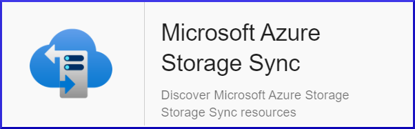

## Vue d'ensemble

En transformant un serveur Windows en cache rapide, le service Azure Storage 
Sync vous permet de centraliser votre partage de fichiers dans Azure Files.

Le Plugin-Pack Centreon *Azure Storage Sync* s'appuie sur les API Azure Monitor afin de récuperer les métriques relatives au service
Storage Sync. Il est possible d'utiliser les 2 modes proposés par Microsoft: 
RestAPI ou Azure CLI.

## Contenu du Pack

### Objets supervisés

* Files synchronised 

* Recalls statistics

* Server Status

### Règles de découverte

Le Plugin-Pack Centreon *Azure Storage Sync* inclut un *provider* de découverte
d'Hôtes nommé *Microsoft Azure Storage Syncs**. Celui-ci permet de découvrir l'ensemble des instances
*Azure Storage Sync* rattachées à une *souscription* Microsoft Azure donnée:


> La découverte *Azure Storage Sync* n'est compatible qu'avec le mode 'api'. Le mode 'azcli' n'est pas supporté dans le cadre
> de cette utilisation.

Vous trouverez plus d'informations sur la découverte d'Hôtes et son
fonctionnement sur la documentation du module:
[Découverte des hôtes](../../../monitoring/discovery/hosts-discovery.html)

### Métriques & statuts collectés

<!--DOCUSAURUS_CODE_TABS-->

<!--Files-Synced-->

| Metric name                    | Description  | Unit  |
|:-------------------------------|:-------------|:------|
| storagesync.files.synced.count | Files Synced | Count |
| storagesync.item.errors.count  | Item errors  | Count |
| storagesync.bytes.synced.bytes | Bytes synced | B     |

<!--Recalls-->

| Metric name                                        | Description                              | Unit |
|:---------------------------------------------------|:-----------------------------------------|:-----|
| storagesync.recalls.succesful.percentage           | Cloud tiering recall success rate        | %    |
| storagesync.recalls.application.size.bytes         | Cloud tiering recall size by application | B    |
| storagesync.recalls.size.bytes                     | Cloud tiering recall size                | B    |
| storagesync.recalls.total.size.bytes               | Cloud tiering recall                     | B    |
| storagesync.recalls.throughput.size.bytespersecond | Cloud tiering recall throughput          | B/s  |

<!--Server-Status-->

| Metric name                 | Description | Unit  |
|:----------------------------|:------------|:------|
| storagesync.heartbeat.count | Heartbeat   | Count |

<!--END_DOCUSAURUS_CODE_TABS-->

## Prérequis

Deux moyens sont disponibles pour interroger les API Microsoft Azure.

Centreon préconise l'utilisation de la méthode *API* plutôt que la *CLI*, cette dernière étant significativement
moins performante. L'API permet également une authentification *Application* et ne nécessite pas de compte de service dédié.

<!--DOCUSAURUS_CODE_TABS-->

<!--Azure Monitor API-->

Pour le custom-mode 'api', récupérez les informations en suivant la procédure ci-dessous (en anglais)
et notez celles-ci en lieu sûr. Elles seront en effet indispensables lors de la configuration des ressources
dans Centreon.

* Create an *application* in Azure Active Directory:
	- Log in to your Azure account.
	- Select *Azure Active directory* in the left sidebar.
	- Click on *App registrations*.
	- Click on *+ Add*.
	- Enter Centreon as the application name (or any name of your choice), select application type(api) and sign-on-url.
	- Click on the *Create* button.

* Get *Subscription ID*
	- Log in to your Azure account.
	- Select *Subscriptions* in the left sidebar.
	- Select whichever subscription is needed.
	- Click on *Overview*.
	- **Copy the Subscription ID.**

* Get *Tenant ID*
	- Log in to your Azure account.
	- Select *Azure Active directory* in the left sidebar.
	- Click on *Properties*.
	- **Copy the directory ID.**

* Get *Client ID*
	- Log in to your Azure account.
	- Select *Azure Active directory* in the left sidebar.
	- Click on *Enterprise applications*.
	- Click on *All applications*.
	- Select the application previously created.
	- Click on *Properties*.
	- **Copy the Application ID.**

* Get *Client secret*
	- Log in to your Azure account.
	- Select *Azure Active directory* in the left sidebar.
	- Click on *App registrations*.
	- Select the application previously created.
	- Click on *All settings*.
	- Click on *Keys*.
	- Enter the key description and select the duration.
	- Click on *Save*.
	- **Copy and store the key value. You won't be able to retrieve it after you leave this page.**

<!--Azure AZ CLI-->

Afin d'utiliser le custom-mode 'azcli', installez le binaire associé sur tous les Collecteurs Centreon
devant superviser des resources Azure:

- La CLI requiert une version de Python >= 2.7 (<https://github.com/Azure/azure-cli/blob/dev/doc/install_linux_prerequisites.md>)

Sur un système utilisant le packaging RPM, utilisez les commandes ci-dessous avec
l'utilisateur *root* ou un utilisateur avec les droits 'sudo' adéquats:

```shell
sudo rpm --import https://packages.microsoft.com/keys/microsoft.asc
sudo echo -e "[azure-cli]\nname=Azure CLI\nbaseurl=https://packages.microsoft.com/yumrepos/azure-cli\nenabled=1\ngpgcheck=1\ngpgkey=https://packages.microsoft.com/keys/microsoft.asc" > /etc/yum.repos.d/azure-cli.repo
sudo yum install azure-cli
```

Ensuite, réalisez les opérations suivantes avec l'utilisateur *centreon-engine*
afin de récupérer le token d'authentification Azure:

```shell
su - centreon-engine
az login
```

La commande retourne le message ci-dessous contenant un code:

	*To sign in, use a web browser to open the page https://microsoft.com/devicelogin*
	*and enter the code CWT4WQZAD to authenticate.*

Rendez-vous sur <https://microsoft.com/devicelogin> afin de saisir le code obtenu, puis connectez vous avec le compte de service dédié à la supervision.

Une fois ces actions effectuées, des informations d'auhtentification de la forme suivante devraient s'afficher dans le terminal
du collecteur Centreon: 

```shell
	[
	  {
		"cloudName": "AzureCloud",
		"id": "0ef83f3a-d83e-2039-d930-309df93acd93d",
		"isDefault": true,
		"name": "N/A(tenant level account)",
		"state": "Enabled",
		"tenantId": "0ef83f3a-03cd-2039-d930-90fd39ecd048",
		"user": {
		  "name": "email@mycompany.onmicrosoft.com",
		  "type": "user"
		}
	  }
	]
```

Vous avez désormais les informations stockées localement dans un fichier
accessTokens.json qui sera utilisé automatiquement par le Plugin.

<!--END_DOCUSAURUS_CODE_TABS-->

## Installation

<!--DOCUSAURUS_CODE_TABS-->

<!--Online IMP Licence & IT-100 Editions-->

1. Installer le Plugin Centreon sur tous les collecteurs Centreon devant superviser des resources*Azure Storage Sync*:

```bash
yum install centreon-plugin-Cloud-Azure-Storage-StorageSync-Api
```

2. Sur l'interface Integration de Centreon, installer le Plugin Pack *Azure Storage Sync* depuis la page"Configuration > Plugin packs > Manager"

<!--Offline IMP License-->

1. Installer le Plugin Centreon sur tous les collecteurs Centreon devant superviser des resources*Azure Storage Sync*:

```bash
yum install centreon-plugin-Cloud-Azure-Storage-StorageSync-Api
```

2. Sur le serveur Central Centreon, installer le RPM du Pack *Azure Storage Sync*:

 ```bash
yum install centreon-pack-cloud-azure-storage-storagesync
```

3. Sur l'interface Integration de Centreon, installer le Plugin Pack *Azure Storage Sync* depuis la page"Configuration > Plugin packs > Manager"

<!--END_DOCUSAURUS_CODE_TABS-->

## Configuration

### Hôte

* Ajoutez un Hôte à Centreon, remplissez le champ *Adresse IP/DNS* avec l'adresse 127.0.0.1 
et appliquez-lui le Modèle d'Hôte *Cloud-Azure-Storage-StorageSync-custom*.
* Une fois le modèle appliqué, les Macros ci-dessous indiquées comme requises (*Mandatory*) 
doivent être renseignées selon le *custom mode* utilisé.

> Deux méthodes peuvent être utilisées lors de l'assignation des Macros:
> * Utilisation de l'ID complet de la ressource (de type ```/subscriptions/<subscription_id>/resourceGroups/<resourcegroup_id>/providers/Microsoft.EventHub/<resource_type>/<resource_name>```)
dans la Macro *AZURERESOURCE*
> * Utilisation du nom de la ressource dans la Macro *AZURERESOURCE* associée à la Macro *AZURERESOURCEGROUP* 

<!--Azure Monitor API-->

| Mandatory | Nom                | Description                                        |
|:----------|:-------------------|:---------------------------------------------------|
| X         | AZURECUSTOMMODE    | Custom mode 'api'                                  |
| X         | AZURESUBSCRIPTION  | Subscription ID                                    |
| X         | AZURETENANT        | Tenant ID                                          |
| X         | AZURECLIENTID      | Client ID                                          |
| X         | AZURECLIENTSECRET  | Client secret                                      |
| X         | AZURERESOURCE      | ID or name of the Storage Sync resource            |
|           | AZURERESOURCEGROUP | Associated Resource Group if resource name is used |

<!--Azure AZ CLI-->

| Mandatory | Nom                | Description                                        |
|:----------|:-------------------|:---------------------------------------------------|
| X         | AZURECUSTOMMODE    | Custom mode 'azcli'                                |
| X         | AZURESUBSCRIPTION  | Subscription ID                                    |
| X         | AZURERESOURCE      | ID or name of the Storage Sync resource            |
|           | AZURERESOURCEGROUP | Associated Resource Group if resource name is used |

<!--END_DOCUSAURUS_CODE_TABS-->

## Comment puis-je tester le Plugin et que signifient les options des commandes ? 

Une fois le Plugin installé, vous pouvez tester celui-ci directement en ligne 
de commande depuis votre collecteur Centreon en vous connectant avec 
l'utilisateur *centreon-engine*:

```bash
 /usr/lib/centreon/plugins//centreon_azure_storage_storagesync_api.pl   \
    --plugin=cloud::azure::storage::storagesync::plugin  \
    --mode=files-synced  \
    --custommode='api'  \
    --subscription='xxxxxxxxx' \
    --tenant='xxxxxxxxx' \
    --client-id='xxxxxxxxx' \
    --client-secret='xxxxxxxxx' \
    --resource='STO001ABCD' \
    --resource-group='RSG1234'
    --aggregation='Total' \
    --timeframe='900' \
    --interval='PT5M' \
    --warning-item-errors='800'  \
    --critical-item-errors='900'
 ```

 La commande devrait retourner un message de sortie similaire à :

```bash
OK : Instance 'STO001ABCD' Statistic 'total'Files Synced: 546.00, Item errors: 3.00, Bytes synced: 246.00 |
'STO001ABCD~storagesync.files.synced.count'=546;;;; 'STO001ABCD~storagesync.item.errors.count'=3;800;900;0; 'STO001ABCD~storagesync.bytes.synced.bytes'=246;;;0;
 ```

La commande ci-dessus vérifie le nombre d'erreurs de synchronisation sur l'instance *Storage Sync* nommée *STO001ABCD*
(```--plugin=cloud::azure::network::cdn::plugin --mode=requests --resource='STO001ABCD'```) et liée au *Resource Group* *RSG1234*
(```--resource-group='RSG1234'```).

Le mode de connexion utilisé est 'api' (```--custommode=api```), les paramètres d'authentification nécessaires à l'utilisation de ce mode
sont donc renseignés en fonction (```--subscription='xxxxxxxxx' --tenant='xxxxxxx' --client-id='xxxxxxxx' --client-secret='xxxxxxxxxx'```).

Les statuts caculés se baseront sur les valeurs totales d'un échantillon dans un intervalle de 15 minutes / 900 secondes  (```--timeframe='900'```) 
avec un état retourné par tranche de 5 minutes (```--interval='PT5M'```).

Dans cet exemple, une alarme de type WARNING sera déclenchée si le nombre d'erreurs de synchronisation pendant l'intervalle donné
est supérieur à 800 (```--warning-item-errors='800'```); l'alarme sera de type CRITICAL au-delà de 900 erreurs
(```--critical-item-errors='900'```).

```bash
/usr/lib/centreon/plugins//centreon_azure_storage_storagesync_api.pl   \
    --plugin=cloud::azure::storage::storagesync::plugin  \
    --mode=files-synced  \
    --help
 ```

Tous les modes disponibles peuvent être affichés en ajoute le paramètre 
```--list-mode``` à la commande:

```bash
 /usr/lib/centreon/plugins//centreon_azure_storage_storagesync_api.pl   \
    --plugin=cloud::azure::storage::storagesync::plugin  \
    --list-mode
 ```

### Diagnostic des erreurs communes

#### ```Error message```

......