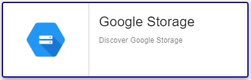

## Contenu du Plugin-Pack

### Objets supervisés

Le Plugin-Pack Google Storage collecte les données pour:
* Bucket

### Règles de découverte

Le Plugin-Pack Centreon *Google Storage* inclut un *provider* de découverte d'Hôtes.
Celui-ci permet de découvrir l'ensemble des supports de stockage associés à un projet GCP donné:



> Le fichier *key* doit être déployé sur les Collecteurs utilisés pour la découverte en amont de son execution (voir chapitre Prérequis)

Vous trouverez plus d'informations sur la découverte d'Hôtes et son fonctionnement sur la documentation du module:
[Découverte des hôtes](../../../monitoring/discovery/hosts-discovery.html)

### Métriques collectées

Pour l'ensemble des métriques collectées, il est possible de choisir *aggregation*: _average_, _minimum_, _maximum_ et _total_.

<!--DOCUSAURUS_CODE_TABS-->

<!--Bucket-->

| Metric name                                                                | Description                                         | Unit  |
| :------------------------------------------------------------------------- | :-------------------------------------------------- | :---- |
| *bucket_name*~*aggregation*#storage.bucket.objects.count                   | Number of objects                                   |       |
| *bucket_name*~*aggregation*#storage.network.received.volume.bytes          | Count of bytes received over the network            | B     |
| *bucket_name*~*aggregation*#storage.network.received.volume.bytespersecond | Count of bytes received per second over the network | B/s   |
| *bucket_name*~*aggregation*#storage.network.sent.volume.bytes              | Count of bytes sent over the network                | B     |
| *bucket_name*~*aggregation*#storage.network.sent.volume.bytespersecond     | Count of bytes sent per second over the network     | B/s   |

<!--END_DOCUSAURUS_CODE_TABS-->

## Prérequis

### Privilèges Google Cloud

Créer une *clé de compte de service* (télécharger sa clé privée sous la forme d'un fichier JSON) avec les privilèges suivants:

| Google Scope                                     | Description                                                     |
| :----------------------------------------------- | :-------------------------------------------------------------- |
| https://www.googleapis.com/auth/cloud-platform   | View and manage your data across Google Cloud Platform services |

Comment créer une clé de compte de service: https://developers.google.com/identity/protocols/oauth2/service-account

## Installation

<!--DOCUSAURUS_CODE_TABS-->

<!--Online IMP Licence & IT-100 Editions-->

1. Installer le Plugin sur tous les Collecteurs Centreon :

```bash
yum install centreon-plugin-Cloud-Gcp-Storage-Api
```

2. Sur l'interface Web de Centreon, installer le Plugin-Pack *Google Storage* depuis la page "Configuration > Plugin packs > Manager"

<!--Offline IMP License-->

1. Installer le Plugin sur tous les Collecteurs Centreon :

```bash
yum install centreon-plugin-Cloud-Gcp-Storage-Api
```

2. Sur le serveur Central Centreon, installer le Plugin-Pack via le RPM:

```bash
yum install centreon-pack-cloud-gcp-storage
```

3. Sur l'interface Web de Centreon, installer le Plugin-Pack *Google Storage* depuis la page "Configuration > Plugin packs > Manager"

<!--END_DOCUSAURUS_CODE_TABS-->

## Configuration

Ce Plugin-Pack est conçu de manière à avoir dans Centreon un hôte par bucket Google Storage.
Lorsque vous ajoutez un hôte à Centreon, appliquez-lui le modèle *Cloud-Gcp-Storage-custom*. 
Une fois celui-ci configuré, certaines macros doivent être renseignées:

| Mandatory   | Name                 | Description                                                                                 |
| :---------- | :------------------- | :------------------------------------------------------------------------------------------ |
| X           | GCPKEYFILEPATH       | Service account key json file                                                               |
| X           | GCPSCOPEENDPOINT     | Google Scope. Default: https://www.googleapis.com/auth/cloud-platform                       |
| X           | GCPDIMENSIONNAME     | The name of the dimension to filter on. Default: resource.labels.bucket_name                |
| X           | GCPDIMENSIONOPERATOR | Define the type of filter match to use. Default: equals                                     |
| X           | GCPDIMENSIONVALUE    | Name of the bucket you want to monitor.                                                     |
|             | PROXYURL             | Configure proxy URL                                                                         |
|             | GCPEXTRAOPTIONS      | Any extra option you may want to add to every command_line (eg. a --verbose flag)           |
|             | DUMMYSTATUS          | Host state. Default is OK, do not modify it until you know what you are doing               |
|             | DUMMYOUTPUT          | Host check output. Default is 'This is a dummy check'. Customize it with your own if needed |

> **WARNING**: La clé de service (format json) doit être hébergée sur le collecteur Centreon. L'utilisateur *centreon-engine* doit avoir les droits en lecture sur ce fichier.

## FAQ

### Comment puis-je tester le Plugin et que signifient les options des commandes ?

Une fois le Plugin installé, vous pouvez tester celui-ci directement en ligne de commande
depuis un collecteur Centreon en vous connectant avec l'utilisateur *centreon-engine*:

```bash
/usr/lib/centreon/plugins/centreon_gcp_storage_api.pl \
    --plugin=cloud::google::gcp::storage::plugin \
    --mode=bucket \
    --key-file=/var/lib/centreon-engine/centreon-dev-6e5531fc9e82.json \
    --dimension-name='resource.labels.bucket_name' \
    --dimension-operator='equals' \
    --dimension-value='centreon-dev.appspot.com' \
    --aggregation='average' \
    --warning-bucket-objects='1000' \
    --critical-bucket-objects='2000' \
    --verbose
```

La commande devrait retourner un message de sortie de la forme ci-dessous:

```bash
OK: Instance 'centreon-dev.appspot.com' aggregation 'average' metrics objects: 0.00, received: 0.00 B, sent: 382.00 B | 'centreon-dev.appspot.com~average#storage.bucket.objects.count'=0.00;0:1000;0:2000;0; 'centreon-dev.appspot.com~average#storage.network.received.volume.bytes'=0.00B;;;0; 'centreon-dev.appspot.com~average#storage.network.sent.volume.bytes'=382.00B;;;0;
Checking 'centreon-dev.appspot.com'
    aggregation 'average' metrics objects: 0.00, received: 0.00 B, sent: 382.00 B
```

Cette commande contrôle l'utilisation (```--mode=bucket```) d'une bucket Google Storage 
ayant pour nom *centreon-dev.appspot.com* (```--dimension-name='resource.labels.bucket_name' --dimension-operator='equals' --dimension-value='centreon-dev.appspot.com'```).

Cette commande déclenchera une alarme WARNING si le nombre d'objets est supérieur à 1000 (```--warning-bucket-objects='1000'```)
et une alarme CRITICAL si supérieur à 2000 (```--critical-bucket-objects='2000'```).

Pour chaque mode, la liste de toutes les métriques, seuils associés et options complémentaires peut être affichée
en ajoutant le paramètre ```--help``` à la commande:

```bash
/usr/lib/centreon/plugins/centreon_gcp_storage_api.pl \
    --plugin=cloud::google::gcp::storage::plugin \
    --mode=bucket \
    --help
```

### J'obtiens le message d'erreur suivant: ```UNKNOWN: No metrics. Check your options or use --zeroed option to set 0 on undefined values```

Lors du déploiement de mes contrôles, j'obtiens le message suivant 'UNKNOWN: No metrics. Check your options or use --zeroed option to set 0 on undefined values'. 

Cela signifie qu'il n'y a pas de données sur la période.

Vous pouvez ajouter ```--zeroed``` à la macro EXTRAOPTIONS du **service** en question afin de forcer le stockage d'un 0 et ainsi éviter un statut UNKNOWN.
