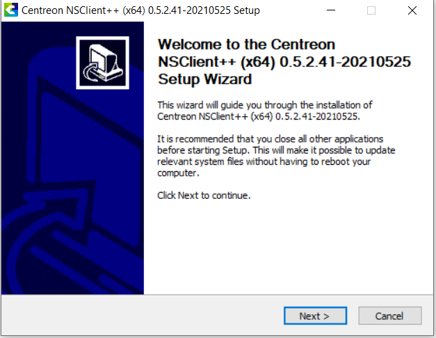
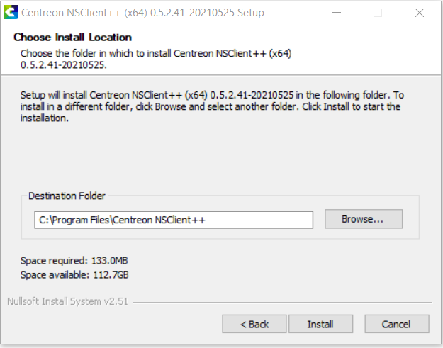
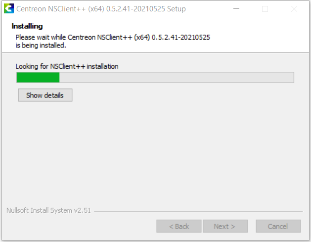
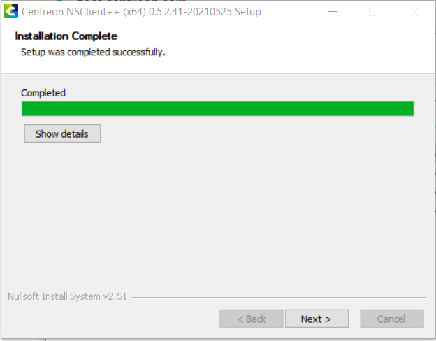
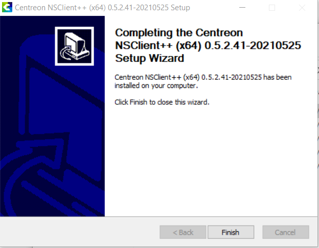
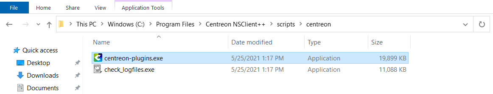
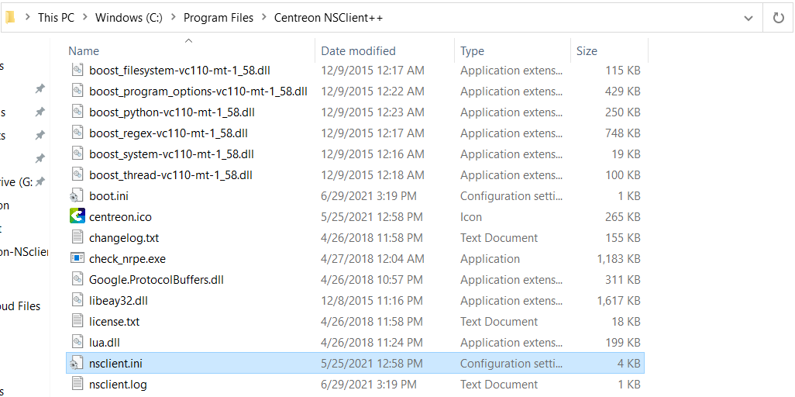

## Introduction

NSClient++ est un agent de supervision Open Source multi plateformes utilisable sur les environnements Microsoft Windows et Linux. Il permet l'exécution
locale de commandes personnalisées et l'utilisation de protocoles de supervision standards : NRPE, NSCA, HTTPS. Cet agent vise à fournir un ensemble
exhaustif d'indicateurs, tant au niveau système qu'au niveau applicatif.

Centreon fournit une version recompilée et personnalisée prête à l'emploi de l'agent tout simplement baptisée **centreon-nsclient**.
Cette version permet de profiter des fonctionnalités natives de NSClient++ combinées à la puissance des Plugins Centreon, permettant ainsi la supervision
d'indicateurs applicatifs tels que Hyper-V, Active Directory, WSUS, SCCM, Microsoft Exchange, Veeam et bien d'autres.

Les Plugins Centreon issus du [projet centreon-plugins](https://github.com/centreon/centreon-plugins) sont spécialement recompilés et packagés pour une utilisation
sous Windows. Ils sont directement déployés et prêts à l'emploi lors de l'installation de l'agent **centreon-nsclient** sous la forme d'un exécutable nommé
*centreon_plugins.exe*.

> Retrouvez la liste des Plugin Packs compatibles avec l'agent centreon-nsclient sur le [catalogue](https://www.centreon.com/catalogue-plugins-packs/)
> officiel Centreon

La procédure suivante vous permettra de comprendre le fonctionnement, l'installation et l'exploitation de l'agent **centreon-nsclient** sur vos serveurs
Windows.

## Support et mises à jour

Centreon supporte et maintient uniquement les Plugins personnalisés fournis au travers de l'agent **centreon-nsclient**. Pour toute question ou problème
relatif au fonctionnement de NSClient++, rendez-vous sur la [documentation officielle](https://docs.nsclient.org/) de NSClient++.

Centreon publiera une version mensuelle des exécutables *centreon_plugins.exe*  et *check_logfiles* comprenant les dernières nouveautés ainsi que les
*bugfixes*. L'installateur de l'agent **centreon-nsclient** est également mis à jour et proposé dans sa dernière version pour les nouvelles installations.

> Pour la mise à jour des Plugins Centreon integrés à l'agent **centreon-nsclient**, consultez le chapitre [Mise à Jour](#mise-a-jour)

## Téléchargement

Tout d'abord, rendez-vous sur la page Github du projet **[centreon-nsclient](https://github.com/centreon/centreon-nsclient-build/releases)** et récupérez
les dernières versions des exécutables suivants suivant votre environnement (x86 ou x64):
* Centreon-NSClient
* centreon_plugins
* check_logfiles


## Installation

> Cette section concerne une nouvelle installation de l'agent **centreon-nsclient**.

Lancez l'installation de l'agent **centreon-nsclient** et suivez l'assistant :

* La première étape vous informe sur NSClient++, sa version et sa date de publication. Appuyez sur suivant pour passer à la deuxième étape :


* Choisissez le dossier d'installation et cliquez sur suivant :


* Attendez la fin de l'installation :


* Une fois l'installation terminée, vous pouvez cliquer sur suivant :


* L'assistant d'installation confirme le succès de l'installation et vous pouvez cliquer sur terminer.


## Mise à Jour

> Cette section concerne la mise à jour de l'exécutable *centreon_plugins.exe* et *check_logfiles* sur une installation existante.

Lors des nouvelles *releases* mensuelles, il n'est pas nécessaire de réinstaller complètement l'agent, seul les Plugins packagés peuvent être mis à jour.

Pour cela, rendez-vous dans le dossier contenant les scripts *centreon_plugins.exe* et *check_logfiles.exe* (généralement 
`C:\Program Files\Centreon NSClient++\scripts\centreon` et remplacez les exécutables par les dernières versions téléchargées sur Github
(voir le chapitre [Installation](#installation)) .



> Remarque N'oubliez pas de renommer les fichiers en supprimant les numéros de version des téléchargements
> (le fichiers doivent être impérativement nommés *centreon_plugins.exe* et *check_logfiles.exe*)

## Configuration

La configuration générale de l'agent, des modules et des commandes appelées est centralisée dans le fichier *nsclient.ini*, généralement
présent dans le répertoire `C:\Program Files\Centreon NSClient++\`.


La configuration par défaut permet une utilisation immédiate de la plupart des fonctionnalités. Il est cependant recommandé d'ajuster
certains paramètres, notamment pour des raisons de sécurité.

### NRPE

Dans la section `[/modules]`, vérifiez que le serveur NRPE est activé :

```csv
NRPEServer = 1
```

Dans la section `[/settings/NRPE/server]`:

* saisissez l'adresse IP des Collecteurs Centreon autorisés à superviser le serveur:

```csv
allowed hosts = @IP_Poller1, @IP_Poller2
```

* Vérifiez que le numéro de port NRPE utilisé est défini sur 5666 :

```csv
port = 5666
```

* Centreon recommande l'utilisation de la version 3 du protocole, proposant nativement le chiffrement SSL/TLS.
Ainsi, Vérifiez que l'option correspondante est activée :

```csv
use ssl = true
```

* Vérifiez que la taille maximale des paquets est bien définie à 8192 :

```csv
payload length = 8192
```

* Enfin, redémarrez l'agent NSCP

```bash
net stop nscp
net start nscp
```


### Serveur Web / RestAPI

NSClient++ embarque nativement un serveur Web permettant la supervision via le protocole HTTPS, privilégié par rapport aux anciens protocoles NRPE et
NSCLIENT, et ce pour les raisons suivantes :

* Protocole sécurisé par défaut
* Utilisation possible de certificats personnalisés
* Suppression des problèmes de compatibilité NRPE v2/v3

#### Prérequis

* Le port HTTPS 8443/TCP doit être ouvert et accessible sur le serveur Windows cible afin de permettre la communication du collecteur Centreon avec
l'API NSClient++
* Comme pour le protocole NRPE, les paramètres *port* et *allowed hosts* de la section `/settings/WEB/server` doivent être renseignés dans le fichier
`nsclient.ini` (le numéro de port à utiliser est ici le 8443 ou tout autre port personnalisé >1024).
 
#### Configurer l'accès Rest HTTPS

Pour utiliser l’API Rest de NSClient++, vous devez tout d'abord activer le service web :

* **En tant qu'administrateur**, depuis un shell sous le serveur Windows, exécutez les commandes suivantes :

```bash
nscp web install
```

* Configurez un mot de passe afin de sécuriser la communication.

```bash
nscp web -- password --set new-password
Password updated successfully, please restart nsclient++ for changes to affect.
```

Il est également possible d'afficher le mot de passe précédemment défini :

```bash
nscp web -- password --display
Current password: centreon
```

* Enfin, redémarrez l'agent NSCP

```bash
net stop nscp
net start nscp
```

* En local sur le serveur Windows, vérifiez que le serveur Web est opérationnel à l'adresse
`https://127.0.0.1:8443/`:

![image] (../../../assets/integrations/plugin-packs/tutorials/centreon-nsclient-tutorial-webserver.png)

## Diagnostic des erreurs communes

En cas de soucis de configuration et/ou d'exploitation, référez-vous à la [documentation officielle](https://docs.nsclient.org/faq/) de NSClient++ qui
offre les résolutions aux problèmes les plus courants.

Vous pouvez aussi nous rendre visite et ouvrir une [issue sur la page Github du projet](https://github.com/centreon/centreon-nsclient-build/issues)
**centreon-nsclient** pour toute problématique liée aux Plugins Centreon.

