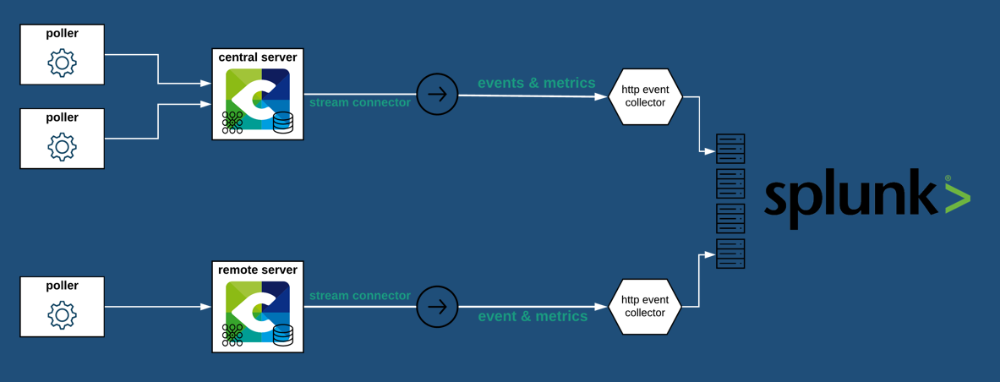

## Ce qu'apporte l'intégration de Splunk + Centreon 

## Comment ça marche

* À chaque fois qu'un service ou hôte est vérifié, l'évènement est traité par Centreon Broker qui charge le Stream Connector pour envoyer les métriques.



### Format de données

Voici un exemple du format POST du Stream Connector pour un événement "metric":

```json
{
    "fields": {
        "ctime": 1595496809,
        "hostname": "HQ-Switch-Lan-Build_B",
        "metric_name:traffic_out": 68058785.44,
        "service_description": "Traffic-interco_sw_buildB_1stfloor_1"
    },
    "host": "Centreon",
    "index": "archimede-metrics",
    "source": "http:archimede-metrics",
    "sourcetype": "_json",
    "time": 1595496809
}

```

## Prérequis

* L'intégration avec Splunk nécessite de disposer d'un accès ayant le rôle Admin pour pouvoir donner des permissions à un compte. Si vous n'en disposez pas, veuillez vous adresser à une personne ayant un tel rôle dans votre organisation pour configurer l'intégration de Splunk avec Centreon.
* Il est également nécessaire d'avoir un **compte Centreon avec des privilèges d'administrateur** ou bien les accès aux menus **Exporter la configuration** et **Configuration de Centreon Broker**, de même qu'un **accès `root` en ligne de commande**.

## Support

Si vous avez besoin d'aide, vous pourrez en trouver via deux canaux, suivant votre statut :

* **Clients de Centreon titulaires d'un contrat de support** : vous pouvez vous adresser directement à [l'équipe du Support de Centreon](mailto:support@centreon.com).
* **Utilisateurs de l'édition Open Source** ou de **Centreon IT-100** (versions gratuites): nous vous invitons à rejoindre notre [communauté sur Slack](https://centreon.github.io) où nos utilisateurs et nos équipes feront de leur mieux pour vous aider.

## Procédure d'intégration

### Dans Splunk

Il sera nécessaire de créer un HTTP Event Collector specifique à Centreon en suivant la [documentation officielle de Splunk](https://docs.splunk.com/Documentation/Splunk/latest/Data/UsetheHTTPEventCollector).
Vous pouvez utilisez un HTTP Event Collector déjà existant et créer un **Metrics Index** spécifique au Stream Connector Splunk de Centreon.

### Dans Centreon

#### Installation 

Se connecter en tant que `root` au serveur central Centreon avec votre client SSH favori.

Dans le cas où votre serveur doit passer par un proxy pour accéder à Internet, il faudra exporter la variable d'environnement `https_proxy` et configurer `yum` pour être en mesure d'installer toutes les dépendances.

```bash
export https_proxy=http://my.proxy.server:3128
echo "proxy=http://my.proxy.server:3128" >> /etc/yum.conf
```

Maintenant que le serveur peut accéder à Internet, lancer les commandes :

```bash
yum install -y lua-curl epel-release
yum install -y luarocks
luarocks install luatz
```

Ces paquets sont nécessaires au bon fonctionnement du script LUA qu'il ne reste plus qu'à télécharger :

```bash
wget -O /usr/share/centreon-broker/lua/splunk-metrics-http.lua https://raw.githubusercontent.com/centreon/centreon-stream-connector-scripts/master/splunk/splunk-metrics-http.lua
chmod 644 /usr/share/centreon-broker/lua/splunk-metrics-http.lua
```

Le Stream Connector Splunk Metrics est maintenant installé sur votre serveur Centreon central !

#### Configuration de *Centreon Broker*

1. Se connecter à l'interface Web de Centreon avec un compte administrateur.
2. Naviguer vers **Configuration** > **Collecteurs** et choisir **Configuration de Centreon Broker**.
3. Cliquer sur l'objet de configuration **central-broker-master** et naviguer dans l'onglet **Output**.
4. Sélectionner **Generic - Stream connector** et cliquer sur **Ajouter** pour créer une nouvelle sortie.
5. Choisir son nom (**Name**) par exemple **Splunk Metrics** et saisir l'emplacement (**Path**) où le script a été installé : `/usr/share/centreon-broker/lua/splunk-metrics-http.lua`.
6. Renseigner au minimum ces 3 champs:

| Name              | Type   | Value                                                                                                        |
| ----------------- | ------ | ------------------------------------------------------------------------------------------------------------ |
| `http_server_url` | String | `L'url de connexion au Service Collector de Splunk (eg. http://splunk.centreon.com:8088/services/collector)` |
| `splunk_token`    | String | `Le token lié à votre HTTP Event Collector`                                                                  |
| `splunk_index`    | String | `L'index où seront stockés les évènements/métriques dans Splunk`                                             |

7. Sauvegarder la configuration, puis naviguer vers le menu **Configuration** > **Collecteurs** et choisir **Collecteurs**.
8. Sélectionner le collecteur **Central** et cliquer sur **Exporter la configuration**.
9. Conserver les cases **Générer les fichiers de configuration** et **Lancer le débogage du moteur de supervision (-v)** et cocher également **Deplacer les fichiers générés** puis cliquer sur le bouton **Exporter**.
10. Redémarrer le service `cbd` 

```bash
systemctl restart cbd
```
Votre serveur central a maintenant chargé le Stream Connector et commence à envoyer des données vers Splunk !

> Pour s'assurer que tout fonctionne bien, on consultera les fichiers `central-broker-master.log` et `stream-connector-splunk-metrics.log`, tous deux situés à l'emplacement `/var/log/centreon-broker` du serveur central.

#### Configuration avancée

**Tableau des paramètres**

| Name                | Type   | Value example                                    | Explanation                                                                                                            |
|---------------------|--------|--------------------------------------------------|------------------------------------------------------------------------------------------------------------------------|
| `http_proxy_string` | String | `http://your.proxy.server:3128`                  | Paramétrage du proxy permettant de sortir vers Internet en HTTP/HTTPS                                                  |
| `splunk_sourcetype` | String | `_json` (default value)                          | Un champ par défaut qui identifie la structure de données d'un événement.                                              |
| `splunk_host`       | String | `Centreon` (default value)                       | Un champ par défaut qui contient le nom d'hôte / l'adresse IP du périphérique qui a généré un événement.               |
| `log_level`         | Number | 2 (default value)                                | Niveau de verbosité des logs 0: errors seulement, 1: +warnings, 2: +verbose, 3: +debug                                 |
| `log_path`          | String | `/var/log/centreon-broker/my-custom-logfile.log` | Chemin complet du fichier de log                                                                                       |
| `max_buffer_size`   | Number | 1 (default value)                                | Nombre maximum d'événements à stocker en mémoire tampon en attendant de les transmettre en un seul envoi               |
| `max_buffer_age`    | Number | 5 (default value)                                | Temps d'attente maximum avant d'envoyer les événements en mémoire tampon si `max_buffer_size` n'est pas encore atteint |

**Remarques**

* La valeur par défaut de 2 pour le paramètre `log_level` est adaptée à la mise en place et au *troubleshooting* initial éventuel, cela peut cependant générer un volume important de logs. Il est donc recommandé, une fois la mise en place validée, de l'abaisser à 1.
* La valeur par défaut de 1 pour le paramètre `max_buffer_size` fonctionne bien et garantit une latence réduite au minimum entre l'apparition d'une alerte et sa transmission à Splunk. Il pourrait s'avérer utile de l'augmenter dans le cas où le flux à transmettre comporterait en continu plusieurs événements par seconde et au-delà. 

---------------

## Désinstallation

1. Se connecter à l'interface Web de Centreon avec un compte administrateur.
2. Naviguer vers **Configuration** > **Collecteurs** et choisir **Configuration de Centreon Broker**.
3. Cliquer sur l'objet de configuration **central-broker-master** et naviguer dans l'onglet **Output**.
4. Supprimer la sortie **Generic - Stream connector** en cliquant sur la croix rouge entourée d'un cercle à la fin de la ligne.
5. Sauvegarder la configuration, puis naviguer vers le menu **Configuration** > **Collecteurs** et choisir **Collecteurs**.
6. Sélectionner le collecteur **Central** et cliquer sur **Exporter la configuration**.
7. Conserver les cases **Générer les fichiers de configuration** et **Lancer le débogage du moteur de supervision (-v)** et cocher également **Deplacer les fichiers générés** puis cliquer sur le bouton **Exporter**.
8. Redémarrer le service `cbd` :

```bash
systemctl restart cbd
```

Le Stream Connector n'est plus chargé par `centreon-broker`.

9. Ce n'est pas nécessaire, mais vous pouvez également supprimer le script pour désinstaller complètement le Stream Connector :

```bash
rm -f /usr/share/centreon-broker/lua/splunk-metrics-http.lua
```
