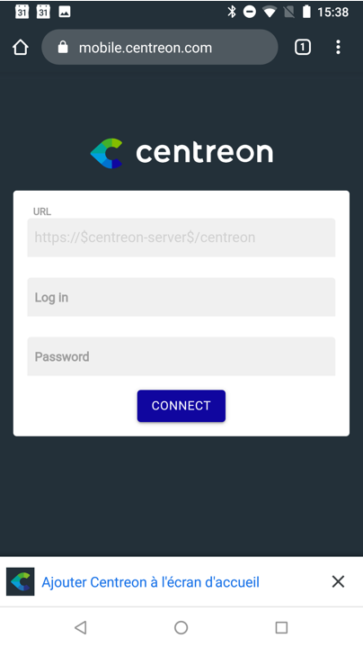
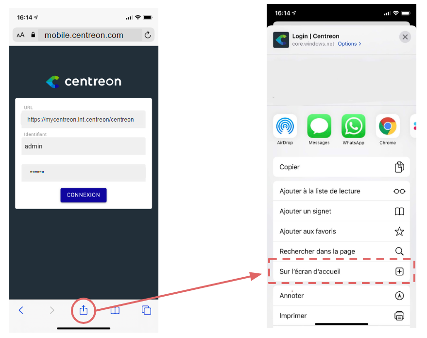
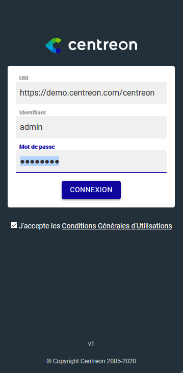

Une application mobile est disponible et vous permet de visualiser le statut des resources supervisées 
par Centreon, sur une tablette ou un téléphone.

  

Les fonctionnalités principales de cette application sont:

- Visualisation des statuts de vos ressources: hôtes et services
- Filtrer la liste des ressources
- Prendre des actions sur les ressources: acquitter ou démarrer une plage de maintenance programmée
- Accéder aux informations détaillées des ressources
- Accéder à l'historique d'une métrique via un graphique

  <video width="375" height="812" controls="true" allowfullscreen="true" poster="../assets/mobile/mobile-login.png">
    <source src="../assets/mobile/mobile-demo.mp4" type="video/mp4">
  </video>

## Pre-requis

Voici les pré-requis vous permettant de profiter de l'application et d'être en mesure de vous 
connecter à votre plateforme Centreon

- Disposer d'iOS >= 13.x ou Android >= 8 sur votre appareil
- Disposer d'un Centreon >= 20.04
- Avoir un accès direct à votre plateforme Centreon à partir de votre téléphone (même réseau ou VPN par exemple)
- Disposer d'un certificat SSL valide sur votre plateforme Centreon provenant d'une autorité de certification reconnue par votre téléphone

## Installer l'application

La manière d'installer l'application dépend de votre appareil:

Pour **Android**, deux possibilités:

  - Télécharger l'application à partir du [Google Play store](https://play.google.com/store/apps/details?id=com.centreon.mobileapp)
  - Installer l'application via Google Chrome et en vous rendant sur 
  [mobile.centreon.com](https://mobile.centreon.com/)  utilsant la fonctionnalité "Ajouter à l'écran d'accueil"

    

Pour **iOS**, rendez vous sur [mobile.centreon.com](https://mobile.centreon.com/)  avec le navigateur Safari 
puis installer l'application via la fonctionnalité "Sur l'écran d'accueil"

## Se connecter à l'application

Une fois l'application installée et lancée pour la première fois, vous devez remplir les champs 
suivant afin de vous connecter à votre plateforme Centreon:

- URL: L'adresse que vous utilisez pour votre connecter à votre plateforme. Ne pas oublier le "/centreon" sauf si une personnalisation
de l'URL a été mise en place 
- User: le login pour vous connecter à Centreon 
- Passowrd: votre mot de passe pour vous connecter à Centreon

L'application stocke ensuite **localement** l'URL et le login pour vous éviter de les retaper à chaque fois. Il se peut également
que votre téléphone vous propose de stocker le mot de passe via son système de gestion des mots de passe.

Si vous rencontrez des problèmes de connexion:

- Assurez vous que votre téléphone a bien accès en direct à votre plateforme Centreon (en vous rendant directement sur l'URL par exemple)
- Il se peut que votre configuration Apache ait été modifiée et empêche l'applicatiaon d'accéder aux APIs de Centreon, dans ce cas, 
consultez [la section suivante](../administration/accessing-to-centreon-ui). 

