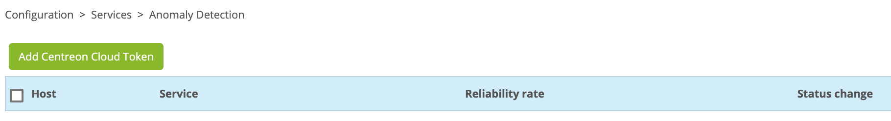

> Centreon Anomaly Detection est actuellement en **phase de bêta fermée** et
> nécessite un jeton valide fourni par Centreon. Nous ouvrirons bientôt la
> phase bêta au public sous certaines conditions.

## Description

Le module **Centreon Anomaly Detection** détecte les déviations par rapport au
comportement de service normal.

Les données collectées sont envoyées à la plateforme centrale Centreon Cloud
afin de pouvoir calculer un modèle de comportement régulier grâce à l'historique
de ces données.

Une fois le modèle calculé, les prédictions sont ensuite générées et récupérées
sur la plateforme Centreon sur site.

Ces prévisions serviront de seuils flottants qui seront ensuite utilisés par le
moteur de surveillance pour comparer la valeur collectée avec les seuils prévus
pour mettre en évidence les écarts et générer des alertes.


## Prérequis

Le module **Centreon Anomaly Detection** requiert les prérequis suivants :

  - Centreon en version minimale 20.04
  - Un jeton fourni par Centreon pour accéder à la plateforme Centreon Cloud
  - Une connexion Internet depuis le serveur Centreon Central
  - La variable d'environnement SHELL [LC_ALL](https://www.gnu.org/software/gettext/manual/html_node/Locale-Environment-Variables.html) ne doit pas être renseignée ou bien avoir la valeur `C`. Pour vérifier la valeur de cette variable, entrez :

      ```
      echo $LC_ALL
      ```
      
  - La prédiction fonctionne mieux avec des services surveillés qui présentent
    un comportement saisonnier comme indiqué ci-dessous :


## Installation

### Installation des paquets

Ajouter un référentiel supplémentaire:
<!--DOCUSAURUS_CODE_TABS-->
<!--RHEL / CentOS / Oracle Linux 8-->
Rien à faire
<!--CentOS 7-->
```shell
yum install -y epel-release
```
<!--END_DOCUSAURUS_CODE_TABS-->

Puis, exécutez la commande suivante :
```shell
yum install centreon-anomaly-detection
```

### Installation via l'interface

Rendez-vous dans le menu `Administration > Extensions > Gestionnaire` et
recherchez **anomaly**. Cliquez sur le bouton **Install selection** :


Le module est maintenant installé :


### Redémarrage du processus

Exécutez la commande suivante en tant qu'utilisateur privilégié:

```shell
systemctl restart gorgoned
```

### Ajouter votre jeton

Rendez-vous dans le menu `Configuration > Services > Anomaly Detection` et
cliquez sur le bouton **Add Centreon Cloud Token** :



Saisissez votre jeton et cliquez sur **Save** :


> Si votre serveur Centreon Central a besoin d'une configuration proxy pour
> accéder à Internet, cochez la case **Use proxy**.

Votre plateforme Centreon est maintenant prête à utiliser la détection
d'anomalies Centreon.

## Configuration

> Dans sa version bêta, le module Centreon Anomaly Detection ne vous permet pas
> de configurer des services à partir de services classiques déjà supervisés par
> votre plateforme Centreon.

La configuration doit se faire en 3 étapes :

1.  [Activer l'envoi des données collectées vers Centreon
    Cloud](#activer-lenvoi-des-données-collectées-vers-centreon-cloud) afin de
    démarrer la modélisation du comportement régulier puis de contrôler via le
    menu `Supervision > Informations de performance > Graphiques` les premiers
    calculs de modélisation effectués.
2.  Une fois que les modèles semblent corrects, [activer la génération
    d'alertes](#activer-la-génération-dalertes)
3.  Dès que les alertes générées semblent correctes, [activer le processus de
    notification](#activer-le-processus-de-notification)

### Activer l'envoi des données collectées vers Centreon Cloud

Rendez-vous dans le menu `Configuration > Services > Anomaly Detection` et
cliquez sur le bouton **Create manually** :


#### Champs de configuration

  - Le champ **Description** permet de définir le nom du service.
  - Le champ **Status** permet d'activer ou désactiver le service.
  - Le champ **Select host - service** permet de sélectionner le couple hôte /
    service à partir duquel les données seront utilisées.
  - Le champ **Select metric** permet de sélectionner la métrique sur laquelle
    appliquer la détection d'anomalie.
  - Sélectionnez un contact par défaut pour le champ **Implied Contacts**.
  - Sélectionnez **0** pour le champ **Notification Interval**.
  - Sélectionnez une période par défaut pour le champ **Notification Period**.
  - Sélectionnez **None** pour le champ **Notification Type**.
  - Vous pouvez sélectionner une criticité via le champ **Severity level**.

Cliquez sur **Save**.

Il est maintenant temps de [déployer la
supervision](monitoring-servers/deploying-a-configuration.html).

Accédez ensuite au menu `Supervision > Détails des statuts > Services` et
sélectionnez **All** pour le filtre État du service. Après quelques minutes,
les premiers résultats de la surveillance apparaissent.

> Le calcul du modèle de comportement démarre. Cependant, pour obtenir un modèle
> représentant un comportement régulier, il faut attendre plusieurs semaines
> (environ 6 semaines) afin d'obtenir un modèle stable.

> Si les données sur lesquelles vous appliquez la détection d'anomalies ont été
> supervisées depuis un certain temps, il est possible de [transférer
> l'historique des données](#transférer-lhistorique-des-données) pour obtenir
> plus rapidement un modèle fiable.

### Activer la génération d'alertes

Si, en suivant régulièrement le modèle généré et les données du menu
`Monitoring > Performances > Graphs`, vous pensez que votre modèle est
stable, vous pouvez activer la génération d'alertes.

Rendez-vous dans le menu `Configuration > Services > Anomaly Detection` et
éditez un service de détection d'anomalie:


Vous pouvez activer le champ **Enable change of status** et sélectionner un
nombre de déviation à partir duquel le service se critique en utilisant le champ
**Detect anomalies after**.

Cliquez sur **Save** et [déployer la
supervision](monitoring-servers/deploying-a-configuration.html).

### Activer le processus de notification

Rendez-vous dans le menu `Configuration > Services > Anomaly Detection` et
éditez un service de détection d'anomalie:


  - Sélectionnez **Enabled** pour le champ **Enable notification**.
  - Sélectionnez les contacts qui seront notifiés via le champ **Implied
    Contacts**.
  - Sélectionnez les groupes contacts qui seront notifiés via le champ **Implied
    Contact Groups**.
  - Sélectionnez l'intervalle de notification, par défaut **0** via le champ
    **Notification Interval**.
  - Sélectionnez la période de notification via le champ **Notification
    Period**.
  - Sélectionnez les type de notification que vous souhaitez recevoir via le
    champ **Notification Type**.

Cliquez sur **Save** et [déployer la
supervision](./monitoring-servers/deploying-a-configuration.html).

### Utiliser l'assistant de création

Depuis la version 20.10.1, il est possible d'utiliser l'assistant de création.
En effet, cette nouvelle fonctionnalité permet de mettre en avant les services
présentant soit une saisonnalité, soit une stabilité régulière.

Rendez-vous dans le menu `Configuration > Services > Anomaly Detection` et
cliquez sur le bouton **Create from analysis**.

La liste des services existant de votre plate-forme Centreon est affichée ainsi
qu'un score en nombre d'étoiles : de 5 étoiles à 0, 5 étoiles représentant les
services à fort potentiel :


Après avoir sélectionné un service intéressant, cliquez sur le bouton **ADD** à
gauche de la ligne. Vous arrivez sur le formulaire de création pré-rempli :


Modifez le nom du service puis cliquez sur le bouton **Save**.

> Si la liste est vide, c'est que le calcul afin de déterminer les services
> intéressant n'a pas encore démarré.
> 
> Celui-ci est réalisé toutes les 6 heures via un cron lancé par le processus
> `gorgoned` (définit dans le fichier **/etc/centreon-gorgone/config.d/cron.d/42-anomalydetection.yaml**).
> 
> Il est possible de lancer le premier calcul manuellement via la commande
> suivante depuis le serveur Centreon central :
> ```shell
> su - centreon
> perl /usr/share/centreon/bin/anomaly_detection --seasonality
> ```

## Visualiser les anomalies détectées

Les services d'anomalies sont des services réguliers mais disposant de seuils
flottants qui s'adaptent selon le modèle calculé. Il est donc possible de
visualiser ses services et les alertes détectées :

  - Dans le menu `Supervision > Détails des statuts > Services`.
  - Dans le menu `Supervision > Informations de performance > Graphiques`.
  - Dans le menu `Supervision > Journaux d'évènements`.
  - Dans la widget **service-monitoring** via le menu `Accueil >
    Vues personnalisées`.
  - Et tous les menus où vous pouvez opérer sur les services.

## Transférer l'historique des données

> L'envoi de l'historique des données est un processus très consommateur de CPU.
> Selon le nombre de services surveillés, l'extraction des données de la base de
> données **centreon\_storage** peut prendre plusieurs dizaines de minutes. Cela
> aura un impact important sur les performances de la base de données et
> pourrait ralentir globalement la plate-forme de supervision.

Pour envoyer l'historique des données d'un service d'anomalie, connectez-vous à
votre serveur Centreon Central et accédez à l'utilisateur **centreon**:

```shell
su - centreon
```

Sélectionnez le service d'anomalie à l'aide de la commande suivante :

```shell
/usr/share/centreon/bin/anomaly_detection --list-services
```

Vous verrez la liste des services avec leur identifiant :

```shell
List of available anomaly detection services:

- id: 14, hostname: fw-beijing, servicename: anomaly-nbr-connect, metric name: connection
- id: 15, hostname: fw-brasilia, servicename: anomaly-nbr-connect, metric name: connection
- id: 17, hostname: fw-mexico, servicename: anomaly-nbr-connect, metric name: connection
- id: 18, hostname: fw-berlin, servicename: anomaly-nbr-connect, metric name: connection
- id: 22, hostname: fw-brasilia, servicename: anomaly-traffic-in, metric name: traffic_in
```

Pour envoyer l'historique des données du service d'anomalies avec l'ID 14 pour
les 4 dernières semaines, exécutez la commande suivante :

```shell
/usr/share/centreon/bin/anomaly_detection --send-history 14 --history-period 4w
```

Attendez la fin du processus :

```shell
Sending data from 2020-03-09T09:32:31 to 2020-03-10T00:00:00
Sending data from 2020-03-10T00:00:00 to 2020-03-11T00:00:00
Sending data from 2020-03-11T00:00:00 to 2020-03-12T00:00:00
Sending data from 2020-03-12T00:00:00 to 2020-03-13T00:00:00
Sending data from 2020-03-13T00:00:00 to 2020-03-14T00:00:00
Sending data from 2020-03-14T00:00:00 to 2020-03-15T00:00:00
Sending data from 2020-03-15T00:00:00 to 2020-03-16T00:00:00
Sending data from 2020-03-16T00:00:00 to 2020-03-17T00:00:00
Sending data from 2020-03-17T00:00:00 to 2020-03-18T00:00:00
Sending data from 2020-03-18T00:00:00 to 2020-03-19T00:00:00
Sending data from 2020-03-19T00:00:00 to 2020-03-20T00:00:00
Sending data from 2020-03-20T00:00:00 to 2020-03-21T00:00:00
Sending data from 2020-03-21T00:00:00 to 2020-03-22T00:00:00
Sending data from 2020-03-22T00:00:00 to 2020-03-23T00:00:00
Sending data from 2020-03-23T00:00:00 to 2020-03-24T00:00:00
Sending data from 2020-03-24T00:00:00 to 2020-03-25T00:00:00
Sending data from 2020-03-25T00:00:00 to 2020-03-26T00:00:00
Sending data from 2020-03-26T00:00:00 to 2020-03-27T00:00:00
Sending data from 2020-03-27T00:00:00 to 2020-03-28T00:00:00
Sending data from 2020-03-28T00:00:00 to 2020-03-29T00:00:00
Sending data from 2020-03-29T00:00:00 to 2020-03-30T00:00:00
Sending data from 2020-03-30T00:00:00 to 2020-03-31T00:00:00
Sending data from 2020-03-31T00:00:00 to 2020-04-01T00:00:00
Sending data from 2020-04-01T00:00:00 to 2020-04-02T00:00:00
Sending data from 2020-04-02T00:00:00 to 2020-04-03T00:00:00
Sending data from 2020-04-03T00:00:00 to 2020-04-04T00:00:00
Sending data from 2020-04-04T00:00:00 to 2020-04-05T00:00:00
Sending data from 2020-04-05T00:00:00 to 2020-04-06T00:00:00
```

## FAQ

### Quels services sont offerts et quel est le SLA associé?

Le service de détection d'anomalies est actuellement en phase de beta test fermée. Le but de cette phase de test bêta
fermée est de tester nos algorithmes de calcul des prédictions (seuils flottants). Au cours de cette phase, Centreon
améliorera la fonctionnalité de détection d'anomalies en fonction du retour d'expérience des utilisateurs. Aucun SLA ne sera disponible 
pendant cette phase.

### Quels sont les critères de sélection pour le programme de bêta ? Pour quelle durée et pour quel volume ?

Un formulaire de participation est disponible pour les clients Centreon. À partir des réponses, Centreon
sélectionnera les candidats pour participer à la phase de test bêta fermée.

### Quel est le processus défini pour le programme de test bêta ?

Une fois les candidats sélectionnés, Centreon les contactera pour leur indiquer la procédure à suivre. Des réunions
régulières seront programmées pour évaluer l'efficacité de la fonctionnalité sur la plateforme des clients. Des
sessions de prise en main à distance peuvent être nécessaires. Une mise à jour de la fonctionnalité peut également
être demandée pour valider les modifications apportées suite au retour d'expérience.

### Quelle est la durée du programme de test bêta ?

La période de test bêta fermé est d'environ 4 mois. Cela devrait permettre de valider les prévisions générées à partir
du calcul des modèles, ainsi que la génération d'alertes dans la console d'événements et le déclenchement du processus
de notification.

#### Quand la fonctionnalité sera-t-elle disponible? Et pour quelle édition Centreon ?

La fonctionnalité de détection des anomalies sera disponible pour Centreon Business Edition dans la version 21.10.

### Combien de temps les données sont-elles hébergées ?

Les données sont conservées pendant toute la validité de la licence. Elles permettront de recalculer les modèles si
nécessaire. Un délai supplémentaire de 3 mois sera ajouté à la fin de la validité de la licence avant la suppression
de ces dernières.

### Quelles données sont hébergées par le service ?

Les données hébergées par le service de détection d'anomalies ne concernent que les données liées aux services créés
par l'utilisateur. Elles comprennent la date et l'heure du contrôle, l'identifiant de la ressource surveillée,
l'identifiant de l'indicateur associé, le nom des données de performance sur lesquelles les calculs seront effectués
ainsi que la valeur des données de performance.

### Quel est l'usage des données ?

Les données sont utilisées pour calculer des modèles de comportement. A partir de ces modèles seront générées des
prédictions utilisées comme seuils flottants par la plateforme Centreon.

### Qui a accès aux données hébergées par le service ?

Les données sont associées au jeton d'accès de l'offre de détection d'anomalies. Elles sont hébergés sur la plateforme
Centreon Cloud et partitionnées par utilisateurs. Seul l'utilisateur avec le jeton a accès aux données.

### Comment puis-je demander la suppression des données ?

La suppression des données peut être demandée à tout moment. Cependant, l'historique des données est utilisé pour
créer un modèle afin de calculer les seuils flottants. Par conséquent, la participation au programme ou l'abonnement à
l'offre sera impossible.
Une demande par mail doit être faite via l'interface de support professionnel Centreon.
