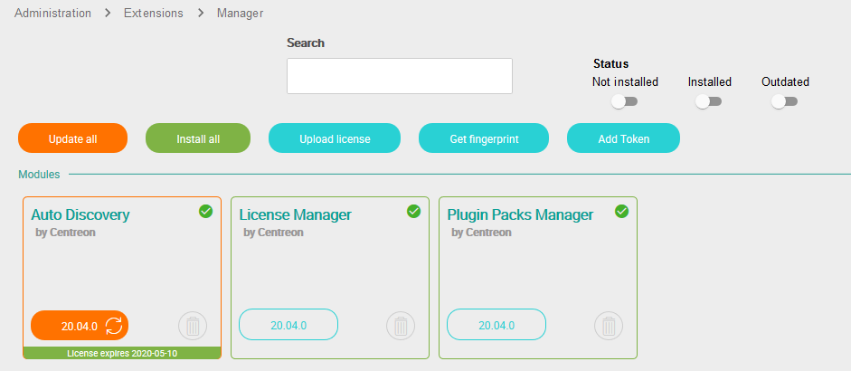
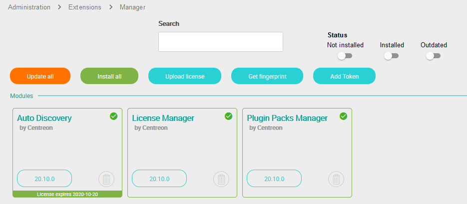
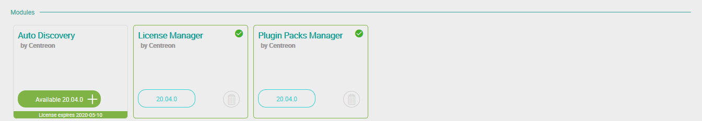

## Mise à jour

> Lors de la montée de version à partir d'une version antérieure à la version
> 20.04, toutes les données de la fonctionnalité **Host Discovery** seront
> perdues:
>
> - Tâches de découverte,
> - Paramètres/informations d'identification sauvegardés.
>
> Cela est dû à la nouvelle méthode renforcée de stockage des informations
> d'identification dans cette version.
>
> Les hôtes découverts au travers des tâches ne sont pas touchés.
>
> La montée de version vers 21.04 conserve toutes les données présentes depuis
> la version 20.04.

Pour mettre à jour le module, exécutez la commande suivante :

``` shell
yum update -y centreon-auto-discovery-server
```

Connectez-vous sur l’interface web de Centreon en utilisant un compte ayant le
droit d’installer des modules et rendez-vous dans le menu `Administration >
Extensions > Gestionnaire`.

> Assurez-vous que les modules **License Manager** et **Plugin Packs Manager**
> sont à jour avant de procéder à la mise à jour du module **Auto Discovery**

Cliquez sur l’icône de mise à jour correspondant au module **Auto Discovery** :



Le module est maintenant à jour :



## Désinstallation

Connectez-vous sur l’interface web de Centreon en utilisant un compte ayant le
droit d’installer des modules et rendez-vous dans le menu `Administration >
Extensions > Gestionnaire`.

Cliquer sur l’icône de suppression correspondant au module **Auto Discovery** :


Une fenêtre de confirmation apparaît, confirmer l’action :


Le module est maintenant désinstallé :



> La désinstallation du module supprimera toutes les données associées. Les
> données ne pourront être restaurées sauf si une sauvegarde de la base de
> données a été faite.

## Configuration du module Gorgone

Le module **Auto Discovery** amène une configuration spécifique pour le service
Gorgone du serveur Central. La configuration par défaut est
`/etc/centreon-gorgone/config.d/41-autodiscovery.yaml`.

Une durée maximale pour les tâches de découverte d'hôtes est configurée de
manière globale au module. S'il est nécessaire de la modifier (par exemple pour
une découverte SNMP sur un large sous-réseau), il faut éditer le fichier
de configuration et ajouter le directive *global_timeout*.

Si les notifications par mail ont été activées dans des règles de découverte de
services, les paramètres relatifs au système d'envoi peuvent être définis pour
choisir l'expéditeur, le sujet ou la commande mail.

Exemple de configuration :

```yaml
gorgone:
  modules:
    - name: autodiscovery
      package: "gorgone::modules::centreon::autodiscovery::hooks"
      enable: true
      # Host Discovery
      check_interval: 15
      global_timeout: 300
      # Service Discovery
      mail_subject: Centreon Auto Discovery
      mail_from: centreon-autodisco
      mail_command: /bin/mail
```

> Assurez-vous de redémarrer le service Gorgone après chaque modification :
>
> ```shell
> systemctl restart gorgoned
> ```

### Architecture distribuée

La découverte d'hôtes et de services se base sur Gorgone pour effectuer les
découvertes à la fois sur le serveur Central et sur les Remote Servers ou
Pollers.

> Il est nécessaire d'avoir une communication en ZMQ entre le serveur Central
> et un Remote Server pour effectuer une découverte sur un Poller rattaché à ce
> Remote Server.
>
> Consultez la documentation sur les différents types de
> [communication](../monitoring-servers/communications.html) pour en savoir
> plus.

### Tâche planifiée de découverte de services

Toutes les règles de découverte actives sont exécutées périodiquement à travers
une tâche ordonnancée par le module cron de Gorgone. Le module **Auto
Discovery** amène une définition pour cette tâche dans le fichier suivant :
`/etc/centreon-gorgone/config.d/cron.d/41-service-discovery.yaml`.

```yaml
- id: service_discovery
  timespec: "30 22 * * *"
  action: LAUNCHSERVICEDISCOVERY
```

La configuration par défaut exécute les règles de découverte tous les jours à
22h30.

> Si vous aviez changé la tâche cron pour adapter la planification, vous
> devez appliquer ces changements dans le nouveau fichier.

Il est aussi possible d'exécuter plusieurs tâches de découverte de services
avec différents paramètres:

```yaml
- id: service_discovery_poller_1
  timespec: "15 9 * * *"
  action: LAUNCHSERVICEDISCOVERY
  parameters:
    filter_pollers:
      - Poller-1
- id: service_discovery_poller_2_linux
  timespec: "30 9 * * *"
  action: LAUNCHSERVICEDISCOVERY
  parameters:
    filter_pollers:
      - Poller-2
    filter_rules:
      - OS-Linux-SNMP-Disk-Name
      - OS-Linux-SNMP-Traffic-Name
- id: service_discovery_poller_2_windows
  timespec: "45 9 * * *"
  action: LAUNCHSERVICEDISCOVERY
  parameters:
    filter_pollers:
      - Poller-2
    filter_rules:
      - OS-Windows-SNMP-Disk-Name
      - OS-Windows-SNMP-Traffic-Name
```

Ci-dessous la liste des paramètres disponibles:

| Clé                  | Valeur                                                                                                               |
|----------------------|----------------------------------------------------------------------------------------------------------------------|
| filter\_rules        | Tableau de règles à utiliser pour la découverte (vide pour toutes les utiliser)                                      |
| force\_rule          | Exécuter les règles désactivées ('0': non forcé, '1': forcé)                                                         |
| filter\_hosts        | Tableau d'hôtes sur lesquels effectuer la découverte (vide pour tous les utiliser)                                   |
| filter\_pollers      | Tableau de collecteurs pour lesquels les hôtes attachés se verront lancer la découverte (vide pour tous les utiliser) |
| dry\_run             | Exécuter la découverte sans faire de modification ('0': modifications, '1': dry run)                                 |
| no\_generate\_config | Sans génération de configuration (même si des changements ont eu lieu) ('0': generation, '1': pas de generation)     |

### Accès aux API

À l'installation de Gorgone, une configuration par défaut pour accéder aux API
de Centreon se trouve ici `/etc/centreon-gorgone/config.d/31-centreon-api.yaml`.

Elle définit les accès pour Centreon CLAPI et l'API Rest pour permettre à la
découverte de communiquer avec Centreon.

Exemple de configuration :

```yaml
gorgone:
  tpapi:
    - name: centreonv2
      base_url: "http://127.0.0.1/centreon/api/beta/"
      username: api
      password: bpltc4aY
    - name: clapi
      username: cli
      password: PYNM5kcc
```

L'accès à l'API Rest, représenté par *centreonv2*, nécessite les identifiants
d'un utilisateur ayant accès à l'API de configuration. Il est utilisé
pour la découverte d'hôtes.

L'accès à CLAPI nécessite les identifiants d'un utilisateur *Administrateur*.
Il est utilisé pour la découverte de service.

> Un seul utilisateur peut être utilisé pour les deux accès. De plus, les
> utilisateurs n'ont pas besoin d'avoir accès à l'interface web.
