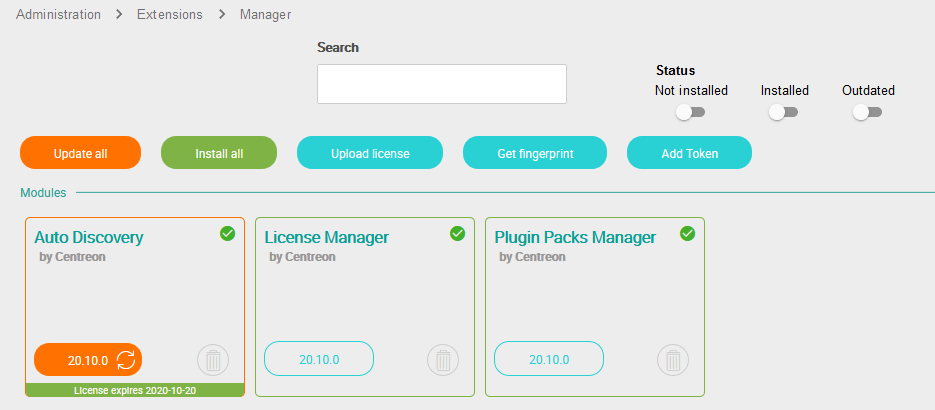

## Mise à jour

> Lors de la montée de version vers 20.04, toutes les données de la
> fonctionnalité **Host Discovery** seront perdues:
>
> - Tâches de découverte,
> - Paramètres/informations d'identification sauvegardés.
>
> Cela est dû à la nouvelle méthode renforcée de stockage des informations
> d'identification dans cette version.
>
> Les hôtes découverts au travers des tâches ne sont pas touchés.

Pour mettre à jour le module, exécutez la commande suivante :

``` shell
yum update -y centreon-auto-discovery-server
```

Connectez-vous sur l’interface web de Centreon en utilisant un compte ayant les
droits d’installer des modules et rendez-vous dans le menu `Administration >
Extensions > Gestionnaire`.

> Assurez vous que les modules **License Manager** et **Plugin Packs Manager**
> sont à jour avant de procéder à la mise à jour du module **Auto Discovery**

Cliquez sur l’icône de mise à jour correspondant au module **Auto Discovery** :



Le module est maintenant à jour :


## Désinstallation

Connectez-vous sur l’interface web de Centreon en utilisant un compte ayant les
droits d’installer des modules et rendez-vous dans le menu `Administration >
Extensions > Gestionnaire`.

Cliquer sur l’icône de suppression correspondant au module **Auto Discovery** :


Une fenêtre de confirmation apparaît, confirmer l’action :


Le module est maintenant désinstallé :


> La désinstallation du module supprimera toutes les données associées. Les
> données ne pourront être restaurées sauf si une sauvegarde de la base de
> données a été faite.

## Découverte d'hôtes

### Configuration du module Gorgone

Le module **Auto Discovery** amène une configuration spécifique pour le service
Gorgone du serveur Central. La configuration par défaut est
`/etc/centreon-gorgone/config.d/41-autodiscovery.yaml`.

Une durée maximale pour les tâches de découverte est configurée de manière
globale au module. S'il est nécessaire de la modifier (par exemple pour une
découverte SNMP sur un large sous-réseau), il faut éditer le fichier
de configuration et ajouter le directive *global_timeout*.

Exemple de configuration :

```yaml
gorgone:
  modules:
    - name: autodiscovery
      package: "gorgone::modules::centreon::autodiscovery::hooks"
      enable: true
      check_interval: 15
      global_timeout: 300
```

> Assurez vous de redémarrer le service Gorgone après chaque modification :
>
> ```shell
> systemctl restart gorgoned
> ```

### Architecture distribuée

La découverte d'hôtes se base sur Gorgone pour effectuer les découvertes à la
fois sur le serveur Central et sur les Remote Servers ou Pollers.

> Il est nécessaire d'avoir une communication en ZMQ entre le serveur Central
> et un Remote Server pour effectuer une découverte sur un Poller rattaché à ce
> Remote Server.
>
> Consultez la documentation sur les différents types de
> [communication](../monitoring-servers/communications.html) pour en savoir
> plus.

## Découverte de services

Le module **Auto Discovery** pour la découverte de service est composé
de 3 parties :

  - Une interface Web : création des règles, administration et exploitation du
    module,
  - Les sondes de découvertes,
  - Une tâche planifiée qui exécute les règles de découverte.

Les sondes de découverte vérifient la présence de nouveaux éléments à
superviser. Voir [sondes de
découvertes](services-discovery.html#sondes-de-découverte) pour
plus de détails.

Les règles, gérées à travers l’interface Web, sont sauvegardées dans la base de
données Centreon et sont exécutées périodiquement (toutes les nuits à 22h30) par
une [tâche planifiée cron](#tâche-programmée).

Les schémas suivants décrivent le fonctionnement général du module :


### Tâche programmée

Toutes les règles de découverte sont exécutées périodiquement à travers d'une
tâche ordonnancée par le démon cron. La description des exécutions est
disponible dans le fichier **/etc/cron.d/centreon-auto-disco** :

``` shell
#####################################
# Centreon Auto Discovery
#

30 22 * * * centreon /usr/share/centreon/www/modules/centreon-autodiscovery-server//cron/centreon_autodisco.pl --config='/etc/centreon/conf.pm' --config-extra='/etc/centreon/centreon_autodisco.pm' --severity=error >> /var/log/centreon/centreon_service_discovery.log 2>&1
```

La configuration par défaut exécute les règles de découvertes tous les jours à
22h30.

Les informations et les erreurs relatives à l’exécution des règles de découverte
sont sauvegardées dans le fichier
**/var/log/centreon/centreon\_service\_discovery.log**.

### Configuration du moteur de découverte

Voici un exemple complet de la configuration possible du fichier
**/etc/centreon/centreon\_autodisco.pm** :

``` perl
%centreon_autodisco_config = (
    internal_com_type => 'ipc',
    internal_com_path => '/tmp/centreonautodisco/routing.ipc',
    # Execute rules in parallel (0) or sequential (1)
    sequential => 1,
    timeout_wait => 60,
    # Use to connect to a Centreon poller
    ssh_password => '',
    ssh_extra_options => {
        user => 'centreon',
        stricthostkeycheck => 0,
        sshdir => '/var/www/.ssh/',
        knownhosts => '/dev/null',
        timeout => 60,
    },
    ssh_exec_options => {
        timeout => 60,
        timeout_no_data => 120,
        parallel => 8, #Max.: 8
    },
    # Centreon CLAPI parameters
    clapi_cmd => '/usr/bin/centreon',
    clapi_user => 'admin',
    clapi_password => 'centreon',
    clapi_reload => 'POLLERRELOAD',
    # Parameters to send email report if enable in rule
    mail_subject => 'Centreon Auto Discovery',
    mail_from => 'centreon-autodisco',
    mail_command => '/bin/mail',
);

1;
```

> Les directives *clapi_user* et *clapi_password* sont susceptibles d'être
> modifiées pour s'adapter aux informations d'identifications d'un utilisteur
> *admin* nécessaire pour la création des services et le rechargement de la
> configuration.

### Architecture distribuée

La découverte de service utilise toujours la communication SSH entre le serveur
Central et les Remote Server ou Poller lorsque la découverte concerne un hôte
supervisé par ces Remote Server ou Poller.

Il faut donc s'assurer que les clés SSH soient créées pour l'utilisateur
**centreon**.

#### Créer et échanger les clées SSH

Si vous n’avez pas de clé SSH privée sur le **serveur Central** pour
l’utilisateur **centreon**, vous pouvez la créer avec la commande suivante :

``` shell
su - centreon
ssh-keygen -t rsa
```

> Appuyez sur la touche *entrée* quand il vous sera demandé de saisir un
> fichier pour enregistrer la clé. **Laissez le mot de passe vide**. Vous
> recevrez une empreinte digitale de clé et une image randomart.

S'il n'en a pas, générez un mot de passe sur le serveur distant pour
l'utilisateur **centreon** :

``` shell
passwd centreon
```

Pour finir, vous devez copier cette clé sur le serveur distant avec les
commandes suivantes :

``` shell
su - centreon
ssh-copy-id -i .ssh/id_rsa.pub centreon@<IP_POLLER>
```

#### Copier les clées SSH pour l'utilisateur Apache

Pour que la découverte puisse se faire depuis l'interface web, il est nécessaire
d’autoriser le processus Apache à accéder aux clés SSH de l’utilisateur
**centreon**. Pour cela exécutez les commandes suivantes :

``` shell
mkdir /var/www/.ssh/
cp /var/spool/centreon/.ssh/* /var/www/.ssh/
chown -R apache. /var/www/.ssh
chmod 600  /var/www/.ssh/id_rsa
```
