## Ajouter une tâche de découverte

Pour démarrer une découverte, vous devez ajouter une tâche de découverte.

L'assistant de création de tâche de découverte est un assistant en six étapes
qui vous permettra de choisir un fournisseur, définir des paramètres, des règles
de traitement du résultat ainsi que les politiques de mise à jour et
d'exécution.

Depuis le menu `Configuration > Hôtes > Découverte`, cliquez sur **+AJOUTER**.

### Choisir un fournisseur

Premièrement, choisissez un fournisseur en cliquant dessus :

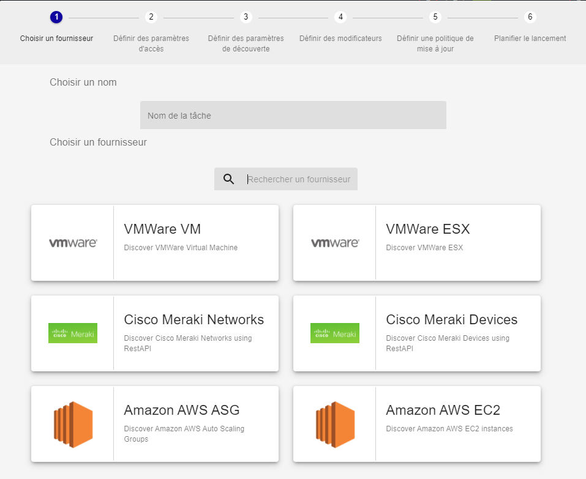

La bar de recherche permet de chercher un fournisseur spécifique :

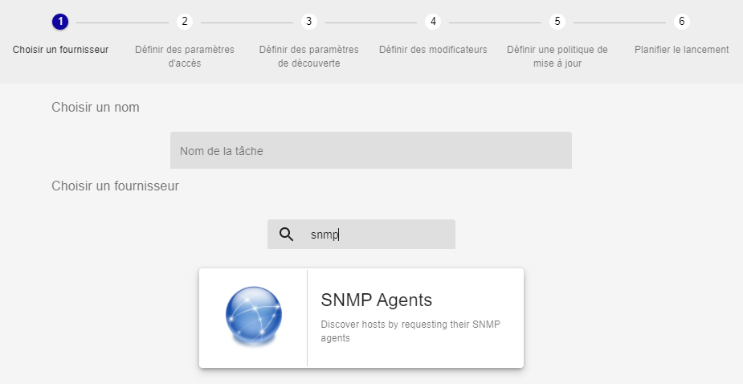

> Les fournisseurs de découverte sont amnenés par l'installation de Plugin Packs
> (Azure, Amazon AWS, VMware, etc). Pour connaître la liste complète, consultez
> le [catalogue des Plugin
> Packs](../../integrations/plugin-packs/introduction.html).

Un nom peut être défini pour identifier la tâche. Le nom du fournisseur sera
utiliser par défaut.

### Définir les paramètres d'accès et de découverte

La deuxième étape permet de définir les paramètres d'accès, surtout le serveur
de supervision depuis lequel sera faite à la découverte :

Certain fournisseur demande d'autres paramètres d'accès comme un proxy si la
découverte doit se faire sur un service en ligne et/ou des identifiants.

Puis, des paramètres additionnels peuvent être nécessaire pour définir la portée
de la découverte :

### Définir des modificateurs

La quatrième étape définit comment le résultat de la découverte sera traité pour
créer les hôtes dans la configuration :

Dans cet étape, des *modificateurs* peuvent être ajoutés ou réarrangés à
convenance. Allez au chapitre [Comment utiliser les
*modificateurs*](#comment-utiliser-les-modificateurs) pour en savoir plus.

Une simulation sur un jeu de données d'exemple donne un aperçu de ce à quoi
pourrait ressembler le résultat de la découverte :

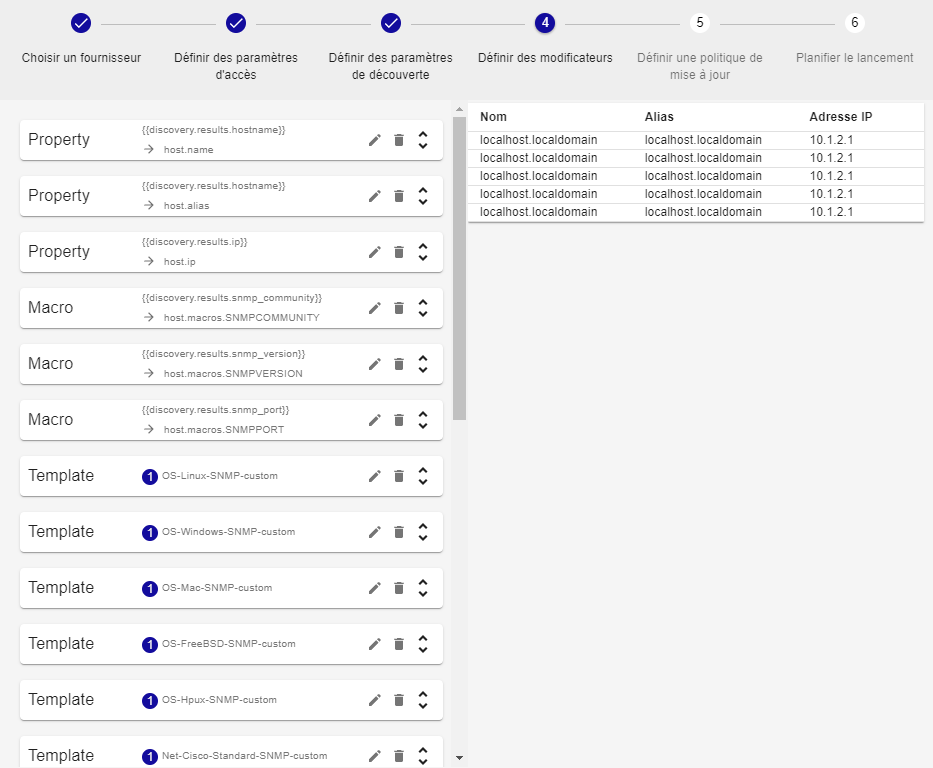

### Définir les politiques d'analyse et de mise à jour

La cinquième étape permet de choisir entre deux méthodes d'analyse et de définir
les politiques de mise à jour de la configuration.

#### Analyse manuelle

L'analyse manuelle demandera à l'utilisateur de choisir quoi ajouter à la
configuration au travers de la page de résultat accessible après une tâche de
découverte réussie.

#### Analyse automatique

L'analyse automatique traitera le résultat automatiquement et utilisera les
politiques choisies parmis les suivantes :

  - Ajouter les hôtes à la configuration quand ils sont découverts pour la
    première fois
  - Désactiver les hôtes déjà ajoutés à la configuration si la règle de
    modification les exclus
  - Activer les hôtes déjà ajoutés à la configuration si ils sont découverts
    mais désactivés

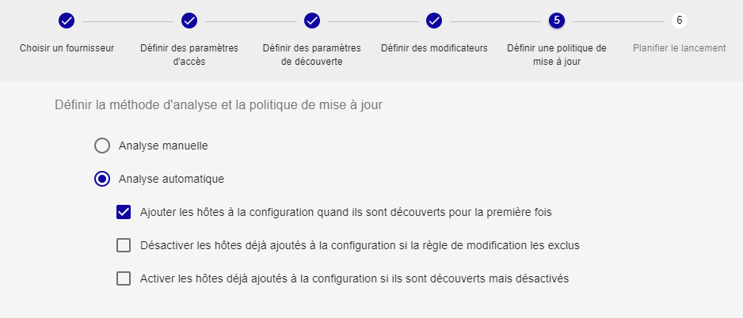

> Au moins une de ces politiques doit être sélectionnée.

### Définir l'exécution

La dernière étape permet de choisir parmis deux méthodes d'exécution.

#### Exécuter immédiatement

L'exécution immédiate lancera la découverte juste après la création de la tâche.

#### Planifier l'exécution

L'exécution planifiée permet de choisir parmis plusieurs types de planification
:

  - Chaque année à des jours définis de mois définis et à une heure définie

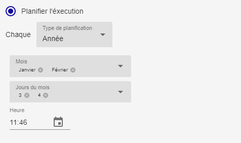

  - Chaque mois à des jours définis du mois et à une heure définie

  - Chaque semaine à des jours définis de la semaine et à une heure définie

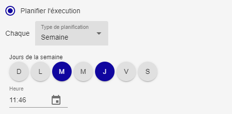

  - Chaque jour à une heure définie

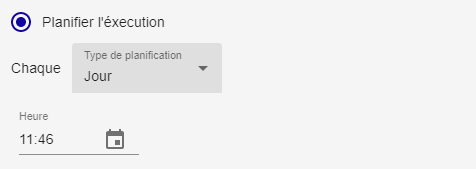

  - Toutes les x heures (à des minutes définies)

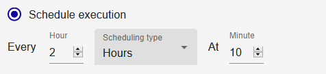

  - Toutes les x minutes

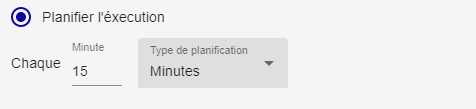

Cliquez sur **TERMINER** à la dernière étape pour ajouter et planifier la tâche
de découverte.

## Gérer les tâches de découverte

Aller au menu `Configuration > Hôtes > Découverte` pour accéder à la liste des
tâches de découverte.

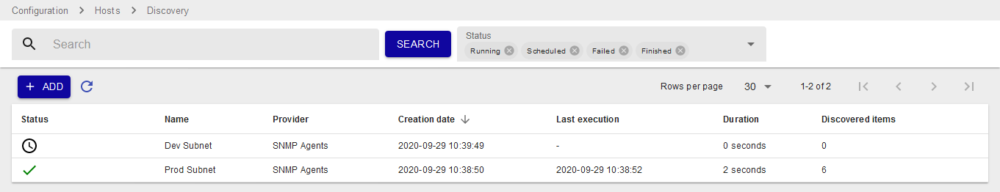

Les états d'une tâche peuvent être :

  - Programmé 
  - En cours 
  - En cours d'enregistrement 
  - Terminé 
  - Echoué 

Si une tâche est dans un état *Echoué*, survolez l'icone pour en connaitre la
raison.

Si une tâche est dans l'état *Terminé*, cliquez dessus pour analyser le
résultat. Allez au chapitre [Analyser le résultat d'une
tâche](#analyser-le-résultat-dune-tâche) pour en savoir plus.

Plusieurs actions peuvent être réalisées sur les tâches :

  - Les tâches peuvent être re-exécutées en utilisant l'action *Forcer l'exécution* 
  - Elles peuvent aussi être éditées  
  - Ou même supprimées 
  - Si la tâches est planifiée, elle peut être mise en pause 
  - Et reprise 

## Analyser le résultat d'une tâche

Depuis le menu `Configuration > Hôtes > Découverte`, cliquez sur une tâche
terminée to visualiser le resulat.

Les modificateurs liés à cette tâche peuvent être édités et appliqués
directement au résultat en cliquant sur le bouton d'édition 

Sélectionnez les hôtes que vous voulez ajouter à la configuration et cliquez
sur le bouton d'enregistrement 

Une tâche sera lancée pour enregistrer les hôtes et créer les services liés aux
modèles d'hote.

Allez au menu `Configuration > Hôtes` pour voir les hôtes nouvellement créés.

Si les hôtes que vous aviez sélectionnés ne sont pas visibles dans la
configuration, retournez à la liste des tâches et regardez si une erreur est
survenue pendant la tâche d'enregistrement.

## Editer une tâche de découverte

Depuis le menu `Configuration > Hôtes > Découverte`, cliquez sur l'icone
d'édition.

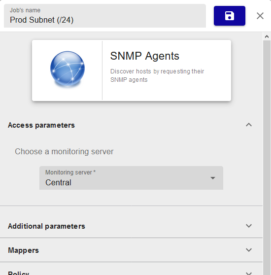

Depuis le panneau sur la droite, tous les paramètres d'une tâche peuvent être
modifiés.

L'édition des *modificateurs* aura un effet direct sur les résultats de la
tâche.

Cliquez sur l'icone de sauvegarde  

## Comment utiliser les *modificateurs*

Un *modificateur* est un objet vous permettant de lier la valeur d'un
attribut d'un item découvert à la propriété d'un futur hôte.

Il y a six types de *modificateur* :

  - Association: associe la valeur d'un attribut aux propriétés communes
    d'un hôte comme son nom, son alias ou son adresse IP,
  - Macro: associe la valeur d'un attribut à une macro *custom* d'un hôte,
  - Template: ajoute un modèle d'hôte,
  - Monitoring: choisit depuis quel serveur de supervision l'hôte sera
    supervisé,
  - Exclusion: exclure un sous-ensemble des hôtes sur la base de leurs attributs,
  - Inclusion: inclut un sous-ensemble des hôtes qui aurait été exclus.

Pour tous ces *modificateur*, des conditions peuvent être définies pour savoir
si la modification sera effective ou non.

Les conditions sont aussi basées sur la valeur des attributs à laquelle est
comparée une valeur définie pas l'utilisateur. Les opérateurs de comparaison
peuvent être : *equal*, *not equal*, *contain* et *not contain*.

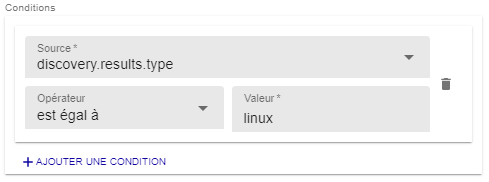

La liste des attributs dépend du fournisseur et sont listés comme *Source* pour
à la fois les *modificateurs* et les *conditions*.

### AJouter un *modificateur*

Depuis l'étape quatre de l'assistant de création d'une tâche, ou depuis le
panneau d'édition dans la section *Modificateurs*, cliquez sur **+AJOUTER UN
MODIFICATEUR**

Sélectionnez le type de *modificateur* depuis le menu déroulant, et remplissez
tous les champs requis.

Cliquez sur **ENREGISTRER** pour ajouter un *modificateur*.

### Editer un *modificateur*

Depuis l'étape quatre de l'assistant de création d'une tâche, ou depuis le
panneau d'édition dans la section *Modificateurs*, cliquez sur l'icone d'édition 

Modifiez n'importe quel champs ou le type de *modificateur* lui-même.

Cliquez sur **ENREGISTRER** pour enregistrer le *modificateur*.

### Supprimer un *modificateur*

Depuis l'étape quatre de l'assistant de création d'une tâche, ou depuis le
panneau d'édition dans la section *Modificateurs*, cliquez sur l'icone de
suppression  

Une fenêtre demandera de confirmer l'action.

Cliquez sur **SUPPRIMER** pour supprimer le *modificateur*.

## Types de **modificateur**

### Association

Le *modificateur* **Association** est utilisé pour définir les propriétés
communes d'un hôte comme son nom, son alias ou son adresse IP. Ces trois
propriétés sont obligatoires.

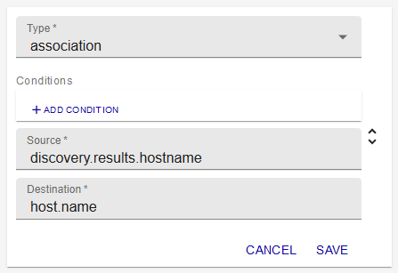

La liste des *Source* permet de choisir entre les données d'identification
(credentials), les paramètres additionnels (parameters) ou les attributs
attendus dans le résultat (attributes).

La liste des *Destination* permet de définir à quelle propriété la valeur sera
associée.

### Macro

Le *modificateur* **Macro** est utilisé pour créer des macros *custom* à
définir au niveau de l'hôte.

La liste des *Source* permet de choisir entre les données d'identification
(credentials), les paramètres additionnels (parameters) ou les attributs
attendus dans le résultat (attributes).

Le champs *Destination* est un champs texte libre.

La case *Mot de passe* définit si la macro sera créée comme une macro "mot de
passe" ou non.

### Template

Le *modificateur* **Template** est utilisé pour ajouter des modèles à l'hôte. Ce
n'est pas un remplacement.

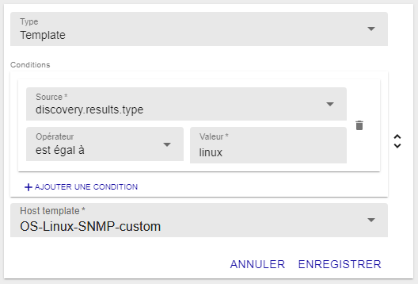

La liste *Modèles d'hôte** permet de choisir parmis tous les modèles d'hôte
définis dans la configuration.

### Monitoring

Le *modificateur* **Monitoring** est utilisé pour choisir depuis quel serveur de
supervision l'hôte sera supervisé.

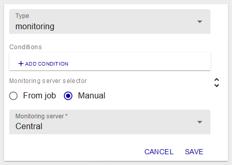

Le bouton radio *Sélecteur d'instance de supervision* permet de choisir entre
le serveur de supervision définit dans la tâche ou depuis ceux disponibles sur
la plateforme Centreon.

Ce *modificateur* est obligatoire.

### Exclusion

Le *modificateur* **Exclusion** *mapper* est utilisé pour exclure un
sous-ensemble des hôtes de la liste des résultats.

Le modificateur utilise les attributs des hôtes comme condition pour les
exclure.

### Inclusion

Le *modificateur* **Inclusion** *mapper* est utilisé pour inclure un
sous-ensemble des hôtes de la liste des résultats.

Le modificateur utilise les attributs des hôtes comme condition pour les
inclure.
