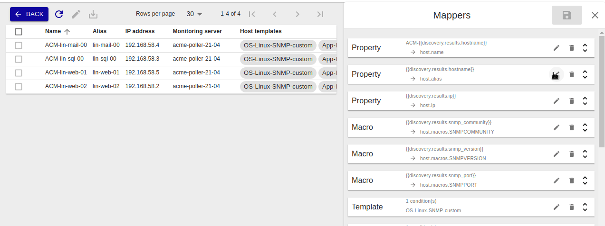
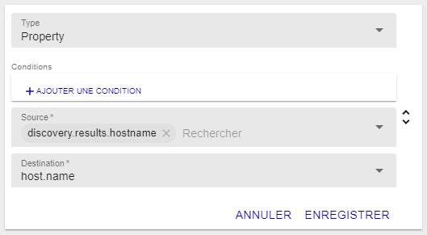
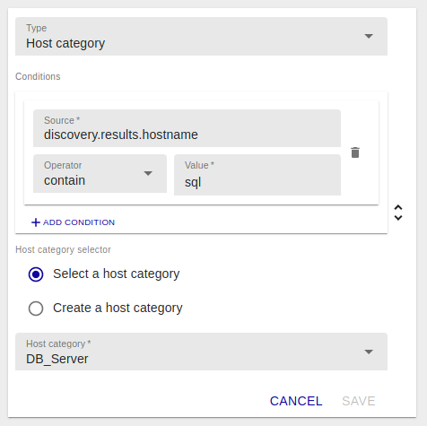
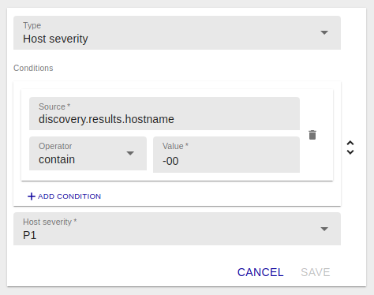
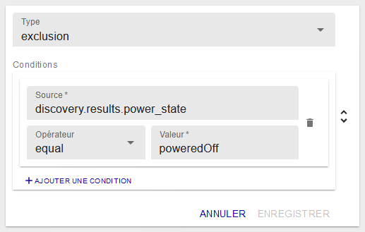
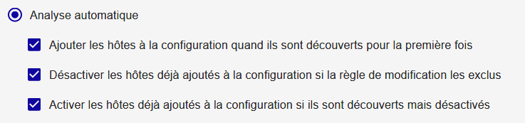

## Ajouter une tâche de découverte

Pour démarrer une découverte, vous devez ajouter une tâche de découverte.

L'assistant de création de tâche de découverte est un assistant en six étapes
qui vous permettra de choisir un fournisseur, définir des paramètres, des règles
de traitement du résultat ainsi que les politiques de mise à jour et
d'exécution.

Depuis le menu `Configuration > Hôtes > Découverte`, cliquez sur **+AJOUTER**.

### Choisir un fournisseur

Premièrement, choisissez un fournisseur en cliquant dessus :

La barre de recherche permet de chercher un fournisseur spécifique :

> Les fournisseurs de découverte sont amenés par l'installation de Plugin Packs
> (Azure, Amazon AWS, VMware, etc). Pour connaître la liste complète, consultez
> le [catalogue des Plugin
> Packs](../../integrations/plugin-packs/introduction.html).

Un nom peut être défini pour identifier la tâche. Le nom du fournisseur sera
utilisé par défaut.

### Définir les paramètres d'accès et de découverte

La deuxième étape permet de définir les paramètres d'accès, surtout le serveur
de supervision depuis lequel sera faite à la découverte :

Certains fournisseurs demandent d'autres paramètres d'accès comme un proxy si la
découverte doit se faire sur un service en ligne et/ou des identifiants.

Puis, des paramètres additionnels peuvent être nécessaires pour définir la portée
de la découverte :

### Définir des modificateurs

La quatrième étape définit comment le résultat de la découverte sera traité pour
créer les hôtes dans la configuration :

Dans cette étape, des *modificateurs* peuvent être ajoutés ou réarrangés à
convenance. Allez au chapitre [Comment utiliser les
*modificateurs*](#comment-utiliser-les-modificateurs) pour en savoir plus.

Une simulation sur un jeu de données d'exemple donne un aperçu de ce à quoi
pourrait ressembler le résultat de la découverte :

### Définir les politiques d'analyse et de mise à jour

La cinquième étape permet de choisir entre deux méthodes d'analyse et de définir
les politiques de mise à jour de la configuration.

#### Analyse manuelle

L'analyse manuelle demandera à l'utilisateur de choisir quoi ajouter à la
configuration au travers de la page de résultat accessible après une tâche de
découverte réussie.

#### Analyse automatique

L'analyse automatique traitera le résultat automatiquement et utilisera les
politiques choisies parmi les suivantes :

  - Ajouter les hôtes à la configuration quand ils sont découverts pour la
    première fois
  - Désactiver les hôtes déjà ajoutés à la configuration si la règle de
    modification les exclut
  - Activer les hôtes déjà ajoutés à la configuration si ils sont découverts
    mais désactivés

> Au moins une de ces politiques doit être sélectionnée.

> Note: le fait que des hôtes soient non découverts (ou plus découverts) ne
> désactivera pas les hôtes dans la configuration Centreon. Seuls les hôtes
> découverts et dans le même temps exclus seront désactivés (voir
> modificateur [exclusion](#exclusion)).

### Définir l'exécution

La dernière étape permet de choisir parmi deux méthodes d'exécution.

#### Exécuter immédiatement

L'exécution immédiate lancera la découverte juste après la création de la tâche.

#### Planifier l'exécution

L'exécution planifiée permet de choisir parmi plusieurs types de planification
:

  - Chaque année à des jours définis de mois définis et à une heure définie

  - Chaque mois à des jours définis du mois et à une heure définie

  - Chaque semaine à des jours définis de la semaine et à une heure définie

  - Chaque jour à une heure définie

  - Toutes les x heures (à des minutes définies)

  - Toutes les x minutes

Cliquez sur **TERMINER** à la dernière étape pour ajouter et planifier la tâche
de découverte.

## Gérer les tâches de découverte

Aller au menu `Configuration > Hôtes > Découverte` pour accéder à la liste des
tâches de découverte.

Les états d'une tâche peuvent être :

  - Programmé 
  - En cours 
  - En cours d'enregistrement 
  - Terminé 
  - Échoué 

Si une tâche est dans un état *Échoué*, survolez l'icône pour en connaître la
raison.

Si une tâche est dans l'état *Terminé*, cliquez dessus pour analyser le
résultat. Allez au chapitre [Analyser le résultat d'une
tâche](#analyser-le-résultat-dune-tâche) pour en savoir plus.

Plusieurs actions peuvent être réalisées sur les tâches :

  - Les tâches peuvent être re-exécutées en utilisant l'action *Forcer l'exécution* 
  - Elles peuvent aussi être éditées  
  - Ou même supprimées 
  - Si la tâche est planifiée, elle peut être mise en pause 
  - Et reprise 
  - Et le plus important, accéder aux résultats de la tâche de découverte 

## Analyser le résultat d'une tâche

  - Depuis le menu `Configuration > Hôtes > Découverte`, cliquez sur la flèche  
d'une tâche terminée pour en visualiser le résultat.

  - Les modificateurs liés à cette tâche peuvent être édités et appliqués
directement au résultat en cliquant sur le bouton d'édition 

  - Sélectionnez les hôtes que vous voulez ajouter à la configuration et cliquez
sur le bouton d'enregistrement 

Les hôtes sont alors créés ainsi que les services liés à leurs modèles d'hôte.

  - Allez au menu `Configuration > Hôtes` pour voir les hôtes nouvellement créés.

Si les hôtes que vous aviez sélectionnés ne sont pas visibles dans la
configuration, retournez à la liste des tâches et regardez si une erreur est
survenue pendant la tâche d'enregistrement.

## Éditer une tâche de découverte

  - Depuis le menu `Configuration > Hôtes > Découverte`, cliquez dans la ligne 
de la tâche.

  - Depuis le panneau sur la droite, tous les paramètres d'une tâche peuvent être
modifiés.

L'édition des *modificateurs* aura un effet direct sur les résultats de la
tâche.

  - Cliquez sur l'icône de sauvegarde  

## Comment utiliser les *modificateurs*

Un *modificateur* est un objet vous permettant de lier la valeur d'un
attribut d'un item découvert à la propriété d'un futur hôte.

Il y a neuf types de *modificateurs* :

  - Property : associe la valeur d'un attribut aux propriétés communes
    d'un hôte comme son nom, son alias ou son adresse IP,
  - Macro : associe la valeur d'un attribut à une macro *custom* d'un hôte,
  - Template : ajoute un modèle d'hôte,
  - Host group : rattachement à un groupe d'hôtes,
  - Host category : classification des hôtes par catégorie,
  - Host severity : priorisation des hôtes par sévérité,
  - Monitoring : choisit depuis quel serveur de supervision l'hôte sera
    supervisé,
  - Exclusion : exclure un sous-ensemble des hôtes sur la base de leurs attributs,
  - Inclusion : inclut un sous-ensemble des hôtes qui aurait été exclus.

Pour tous ces *modificateurs*, des conditions peuvent être définies pour savoir
si la modification sera effective ou non.

Les conditions sont aussi basées sur la valeur des attributs à laquelle est
comparée une valeur définie par l'utilisateur. Les opérateurs de comparaison
peuvent être : *equal*, *not equal*, *contain* et *not contain*.

La liste des attributs dépend du fournisseur. Ils sont listés comme *Source* pour
à la fois les *modificateurs* et les *conditions*.

> Depuis la version 21.04, dans les modificateurs *Property*, *Macro*, *Host
group* et *Host category* il est possible de concaténer un ou plusieurs
de ces attributs avec une ou plusieurs chaînes de caractères personnalisées.

### Ajouter un *modificateur*

Depuis l'étape quatre de l'assistant de création d'une tâche, ou depuis le
panneau d'édition dans la section *Modificateurs*, cliquez sur **+AJOUTER UN
MODIFICATEUR**

Sélectionnez le type de *modificateur* depuis le menu déroulant, et remplissez
tous les champs requis.

Cliquez sur **ENREGISTRER** pour ajouter un *modificateur*.

### Éditer un *modificateur*

  - Depuis l'étape quatre de l'assistant de création d'une tâche, ou depuis
le panneau d'édition dans la section *Modificateurs*, cliquez sur l'icone 
d'édition 

  - Modifiez n'importe quel champ ou le type de *modificateur* lui-même.

  - Cliquez sur **ENREGISTRER** pour enregistrer le *modificateur*.

### Supprimer un *modificateur*

  - Depuis l'étape quatre de l'assistant de création d'une tâche, ou depuis le
panneau d'édition dans la section *Modificateurs*, cliquez sur l'icône de
suppression  

Une fenêtre demandera de confirmer l'action.

Cliquez sur **SUPPRIMER** pour supprimer le *modificateur*.

## Types de **modificateur**

### Property

Le *modificateur* **Property** est utilisé pour définir les propriétés
communes d'un hôte comme son nom, son alias ou son adresse IP. Ces trois
propriétés sont obligatoires.

La liste *Source* permet de choisir entre les données d'identification
(credentials), les paramètres additionnels (parameters) ou les attributs
attendus dans le résultat (attributes).

La liste *Destination* permet de définir à quelle propriété la valeur sera
associée.

### Macro

Le *modificateur* **Macro** est utilisé pour créer des macros *custom* à
définir au niveau de l'hôte.

La liste *Source* permet de choisir entre les données d'identification
(credentials), les paramètres additionnels (parameters) ou les attributs
attendus dans le résultat (attributes).

Le champ *Destination* est un champ texte libre.

La case *Mot de passe* définit si la macro sera créée comme une macro "mot de
passe" ou non.

### Template

Le *modificateur* **Template** est utilisé pour ajouter des modèles à l'hôte. Ce
n'est pas un remplacement.

La liste *Modèles d'hôte* permet de choisir parmi tous les modèles d'hôte
définis dans la configuration.

### Host group

Depuis la version 21.04, il est possible de rattacher des hôtes découverts
automatiquement à des groupes d'hôtes. Cela peut se faire de deux manières.

#### Sélection d'un groupe d'hôtes existant

La première possibilité consiste à choisir un groupe d'hôtes déjà existant.
Il suffit d'en sélectionner un dans le menu déroulant.

#### Création de groupe d'hôtes à la volée

La seconde consiste à composer un nom de groupe à partir de chaînes de 
caractères et/ou d'informations issues de la découverte (une aide à la 
saisie propose les informations disponibles).

Dans cet exemple, si l'on découvre des serveurs Linux, alors un groupe d'hôtes
`os-linux` sera créé.

Bien sûr, si un groupe d'hôtes existe déjà avec ce nom, il ne sera pas recréé,
l'hôte sera simplement rattaché à ce groupe.

### Host category

Depuis la version 21.04, il est également possible de catégoriser les hôtes
découverts automatiquement. Cela peut se faire de deux manières.

#### Sélection d'une catégorie d'hôtes existante

La première possibilité consiste à choisir une catégorie d'hôtes déjà existante.
Il suffit d'en sélectionner une dans le menu déroulant.

#### Création de catégorie d'hôtes à la volée

La seconde consiste à composer un nom de catégorie à partir de chaînes de
caractères et/ou d'informations issues de la découverte (une aide à la 
saisie propose les informations disponibles).

Bien sûr, si une catégorie d'hôtes existe déjà avec ce nom, elle ne sera pas 
recréée, l'hôte sera simplement rattaché à cette catégorie.

### Host severity

Toujours depuis la version 21.04, il est également possible de hiérarchiser
les hôtes découverts automatiquement à l'aide de sévérités d'hôtes. Les 
sévérités étant constituées d'un nom et d'un niveau (numérique), celles-ci
ne peuvent pas être créées à la volée. On ne proposera que la sélection
d'une sévérité existante dans le menu déroulant.

### Monitoring

Le *modificateur* **Monitoring** est utilisé pour choisir depuis quel serveur de
supervision l'hôte sera supervisé.

Le bouton radio *Sélecteur d'instance de supervision* permet de choisir entre
le serveur de supervision défini dans la tâche ou depuis ceux disponibles sur
la plateforme Centreon.

Ce *modificateur* est obligatoire.

### Exclusion

Le *modificateur* **Exclusion** *mapper* est utilisé pour exclure un
sous-ensemble des hôtes de la liste des résultats.

Le modificateur utilise les attributs des hôtes comme condition pour les
exclure.

### Inclusion

Le *modificateur* **Inclusion** *mapper* est utilisé pour inclure un
sous-ensemble des hôtes de la liste des résultats.

Le modificateur utilise les attributs des hôtes comme condition pour les
inclure.

## Exemples

### Mettre à jour votre configuration dynamiquement

*Situation*

Avoir un vCenter VMware avec des machines virtuelles ajoutées, démarrées et
arrêtées dynamiquement.

*Objectif*

Mettre à jour la configuration Centreon en accord avec l'état des machines
virtuelles.

*Créer la bonne tâche de découverte*

Depuis la page principale de la découverte d'hôtes, ajoutez une tâche en
commençant par choisir le fournisseur VMware VM.

Définissez le serveur de supervision depuis lequel vous voulez faire la
découverte. Pour ce fournisseur en particulier, ce paramètre doit être en
accord avec les paramètres de découverte où vous définissez les informations
relatives aux accès au Connecteur Centreon VMware (nom d'hôte/ip et port).

Dans la plupart des cas, vous allez installer le Connecteur sur le serveur de
supervision, les paramètres d'accès seront donc *localhost* et le port par
défaut *5700*.

Définissons maintenant les modificateurs et les politiques de mise à jour pour
répondre à nos besoins :

  - Premiers besoins :
    - Ajouter les nouvelles machines virtuelles (ou non encore ajoutées), (1)
    - Exclure les machines virtuelles non démarrées. (2)

  - Deuxièmes besoins :
    - Désactiver les machines virtuelles qui sont arrêtées, (3)
    - Ré-activer les machines virtuelles qui sont démarrées (après avoir été
      arrêtées). (4)

Cela va se traduire par un modificateur *Exclusion* avec la configuration
suivante :

Ainsi, toutes les machines virtuelles qui sont arrêtées ne feront pas partie du
résultat qui sera analysé. Elles ne seront pas ajoutées. (2)

En plus de ce modificateur, choisissez l'analyse automatique avec toutes les
politiques de mise à jour comme ci-dessous :

Avec la première politique, les machines virtuelles qui font partie du résultat
seront ajoutées (1).

Avec la deuxième, les machines virtuelles qui ont été ajoutées à un moment (car
dans un état démarré) seront désactivées dans la configuration Centreon si elles
se retrouvent dans un état arrêté (3).

La dernière activera les machines virtuelles qui sont de nouveau dans un état
démarré (4).

Bien sûr, les deux dernières politiques fonctionnent mieux si la tâche de
découverte est planifiée pour être exécutée plus d'une fois.

> Note : Si une machine virtuelle est amenée à être supprimée, elle ne sera pas
> supprimée (ni même désactivée) de la configuration Centreon. Seul les hôtes
> découverts et dans le même temps exclus sont désactivés dans la configuration
> (si la politique est choisie).
