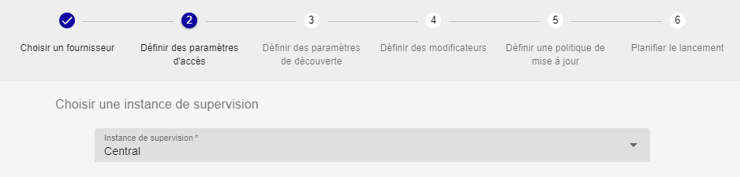
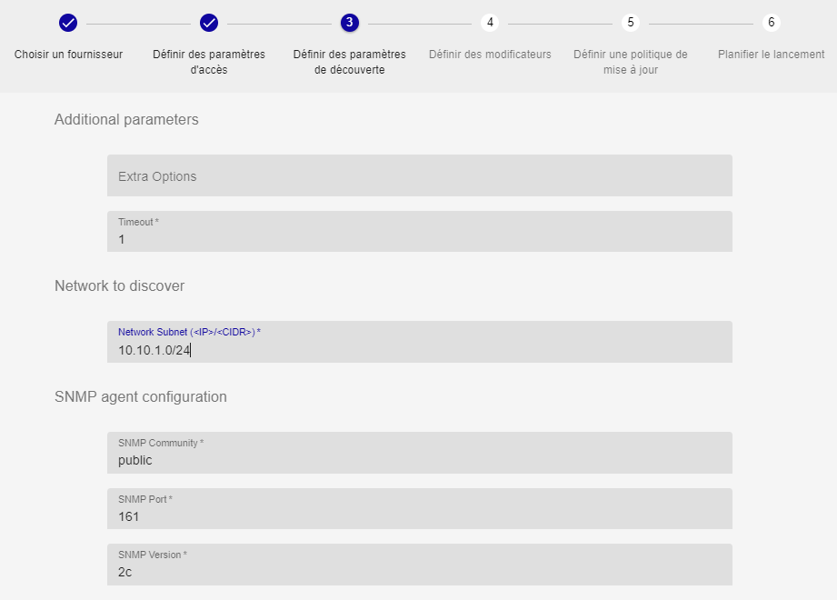
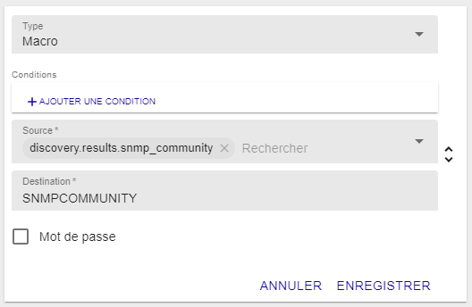
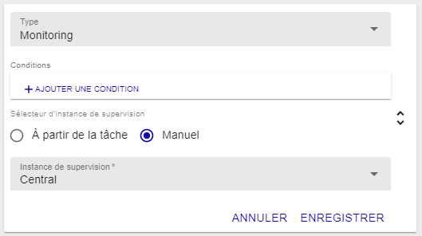

> Les fournisseurs de découverte sont amnenés par l'installation de Plugin Packs
> (Azure, Amazon AWS, VMware, etc). Pour connaître la liste complète, consultez
> le [catalogue des Plugin
> Packs](../../integrations/plugin-packs/introduction.html).

## Ajouter une tâche de découverte

Pour démarrer une découverte, vous devez ajouter une tâche de découverte.

L'assistant de création de tâche de découverte est un assistant en six étapes
qui vous permettra de choisir un fournisseur, définir des paramètres, des règles
de traitement du résultat ainsi que les politiques de mise à jour et
d'exécution.

Depuis le menu `Configuration > Hôtes > Découverte`, cliquez sur **+AJOUTER**.

Premièrement, choisissez un fournisseur en cliquant dessus :

La bar de recherche permet de chercher un fournisseur spécifique :

La deuxième étape permet de définir les paramètres d'accès, surtout le serveur
de supervision depuis lequel sera faite à la découverte :

Puis, des paramètres additionnels peuvent être nécessaire pour définir la portée
de la découverte :

La quatrième étape définit comment le résultat de la découverte sera traité pour
créer les hôtes dans la configuration :

Dans cet étape, des *modificateurs* peuvent être ajoutés ou réarrangés à
convenance. Allez au chapitre [Comment utiliser les
*modificateurs*](#comment-utiliser-les-modificateurs) pour en savoir plus.

Une simulation sur un jeu de données d'exemple donne un aperçu de ce à quoi
pourrait ressembler le résultat de la découverte :

Les cinquième et sixième étapes permettent seulement de définir une analyse
manuelle comme politique de mise à jour et une planification immédiate.

Il y aura d'avantage de choix dans les futurs versions pour permettre la mise à
jour automatique et l'exécution cyclique.

Cliquez sur **TERMINER** à la dernière étape pour ajouter et planifier la tâche
de découverte.

## Gérer les tâches de découverte

Aller au menu `Configuration > Hôtes > Découverte` pour accéder à la liste des
tâches de découverte.

Les états d'une tâche peuvent être :

  - Programmé 
  - En cours 
  - En cours d'enregistrement 
  - Terminé 
  - Echoué 

Si une tâche est dans un état *Echoué*, survolez l'icone pour en connaitre la
raison.

Si une tâche est dans l'état *Terminé*, cliquez dessus pour analyser le
résultat. Allez au chapitre [Analyser le résultat d'une
tâche](#analyser-le-résultat-dune-tâche) pour en savoir plus.

Les tâches peuvent être reprogrammées en utilisant l'action *Reprogrammer* 

Elles peuvent aussi être éditées  

Ou même supprimées 

## Analyser le résultat d'une tâche

Depuis le menu `Configuration > Hôtes > Découverte`, cliquez sur une tâche
terminée to visualiser le resulat.

Sélectionnez les hôtes que vous voulez ajouter à la configuration et cliquez
sur **ENREGISTRER**. Une tâche sera lancée pour enregistrer les hôtes

Allez au menu `Configuration > Hôtes` pour voir les hôtes nouvellement créés.
Pour déployer les services liés aux modèles d'hôte associés, sélectionnez les
hôtes puis l'action **Déployer les services** depuis la liste déroulante **Plus
d'actions...**.

Si les hôtes que vous aviez sélectionnés ne sont pas visibles dans la
configuration, retournez à la liste des tâches et regardez si une erreur est
survenue pendant la tâche d'enregistrement.

## Editer une tâche de découverte

Depuis le menu `Configuration > Hôtes > Découverte`, cliquez sur l'icone
d'édition.

Depuis le panneau sur la droite, tous les paramètres d'une tâche peuvent être
modifiés.

L'édition des *modificateurs* aura un effet direct sur les résultats de la
tâche.

Cliquez sur l'icone de sauvegarde  

## Comment utiliser les *modificateurs*

Un *modificateur* est un objet vous permettant de lier la valeur d'un
attribut d'un item découvert à la propriété d'un futur hôte.

Il y a quatre types de *modificateur* :

  - Association: associe la valeur d'un attribut aux propriétés communes
    d'un hôte comme son nom, son alias ou son adresse IP,
  - Macro: associe la valeur d'un attribut à une macro *custom* d'un hôte,
  - Template: ajoute un modèle d'hôte,
  - Monitoring: choisit depuis quel serveur de supervision l'hôte sera
    supervisé.

Pour tous ces *modificateur*, des conditions peuvent être définies pour savoir
si la modification sera effective ou non.

Les conditions sont aussi basées sur la valeur des attributs à laquelle est
comparée une valeur définie pas l'utilisateur. Les opérateurs de comparaison
peuvent être : *equal*, *not equal*, *contain* et *not contain*.

La liste des attributs dépend du fournisseur et sont listés comme *Source* pour
à la fois les *modificateurs* et les *conditions*.

### AJouter un *modificateur*

Depuis l'étape quatre de l'assistant de création d'une tâche, ou depuis le
panneau d'édition dans la section *Modificateurs*, cliquez sur **+AJOUTER UN
MODIFICATEUR**

Sélectionnez le type de *modificateur* depuis le menu déroulant, et remplissez
tous les champs requis.

Cliquez sur **ENREGISTRER** pour ajouter un *modificateur*.

### Editer un *modificateur*

Depuis l'étape quatre de l'assistant de création d'une tâche, ou depuis le
panneau d'édition dans la section *Modificateurs*, cliquez sur l'icone d'édition 

Modifiez n'importe quel champs ou le type de *modificateur* lui-même.

Cliquez sur **ENREGISTRER** pour enregistrer le *modificateur*.

### Supprimer un *modificateur*

Depuis l'étape quatre de l'assistant de création d'une tâche, ou depuis le
panneau d'édition dans la section *Modificateurs*, cliquez sur l'icone de
suppression  

Une fenêtre demandera de confirmer l'action.

Cliquez sur **SUPPRIMER** pour supprimer le *modificateur*.

## Types de **modificateur**

### Association

Le *modificateur* **Association** est utilisé pour définir les propriétés
communes d'un hôte comme son nom, son alias ou son adresse IP. Ces trois
propriétés sont obligatoires.

La liste des *Source* permet de choisir entre les données d'identification
(credentials), les paramètres additionnels (parameters) ou les attributs
attendus dans le résultat (attributes).

La liste des *Destination* permet de définir à quelle propriété la valeur sera
associée.

### Macro

Le *modificateur* **Macro** est utilisé pour créer des macros *custom* à
définir au niveau de l'hôte.

La liste des *Source* permet de choisir entre les données d'identification
(credentials), les paramètres additionnels (parameters) ou les attributs
attendus dans le résultat (attributes).

Le champs *Destination* est un champs texte libre.

La case *Mot de passe* définit si la macro sera créée comme une macro "mot de
passe" ou non.

### Template

Le *modificateur* **Template** est utilisé pour ajouter des modèles à l'hôte. Ce
n'est pas un remplacement.

La liste *Modèles d'hôte** permet de choisir parmis tous les modèles d'hôte
définis dans la configuration.

### Monitoring

Le *modificateur* **Monitoring** est utilisé pour choisir depuis quel serveur de
supervision l'hôte sera supervisé.

Le bouton radio *Sélecteur d'instance de supervision* permet de choisir entre
le serveur de supervision définit dans la tâche ou depuis ceux disponibles sur
la plateforme Centreon.

Ce *modificateur* est obligatoire.
