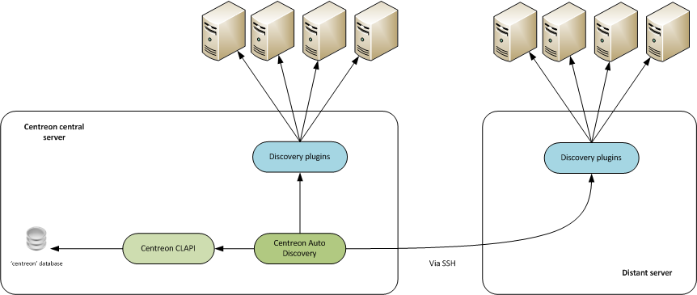

## Installation du paquet

Exécutez la commande suivante sur le serveur Central :

``` shell
yum install -y centreon-auto-discovery-server
```

## Installation de l'extension

Connectez-vous à l’interface web de Centreon en utilisant un compte ayant les
droits d’installer des modules et rendez-vous dans le menu `Administration >
Extensions > Manager`.

Cliquez sur l’icône d’installation correspondant au module **Centreon Auto
Discovery** :


Le module est maintenant installé :


## Installer les Plugin Packs

Afin de bénéficier de règles de découverte prêtes à l’emploi, rendez-vous dans
le menu `Configuration > Packs de plugins` et [installez vos premiers
packs](../pluginpacks.html#installation-du-pack).

## Architecture

### Découverte de services

Le module **Auto Discovery** pour la découverte de service est composé
de 3 parties :

  - Une interface Web : création des règles, administration et exploitation du
    module,
  - Les sondes de découvertes,
  - Une tâche planifiée qui exécute les règles de découverte.

Les sondes de découverte vérifient la présence de nouveaux éléments à
superviser. Voir [sondes de
découvertes](services-discovery.html#sondes-de-découverte) pour
plus de détails.

Les règles, gérées à travers l’interface Web, sont sauvegardées dans la base de
données Centreon et sont exécutées périodiquement (toutes les nuits à 22h30) par
une [tâche planifiée cron](administration.html#tâche-programmée).

Les schémas suivants décrivent le fonctionnement général du module :



#### Configuration des accès à l’API Centreon

Editez le fichier **/etc/centreon/centreon\_autodisco.pm** et modifiez les
valeurs des paramères **clapi\_user** et **clapi\_password** puis sauvegarder
les modifications.
