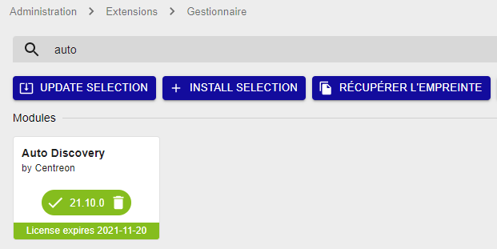

## Installation du paquet

Exécutez la commande suivante sur le serveur Central :

``` shell
yum install -y centreon-auto-discovery-server
```

## Installation de l'extension

Connectez-vous à l’interface web de Centreon en utilisant un compte ayant les
droits d’installer des modules et rendez-vous dans le menu `Administration >
Extensions > Manager`.

> Assurez vous que les modules **License Manager** et **Plugin Packs Manager**
> sont à jour avant de procéder à l'installation du module **Auto Discovery**

Cliquez sur l’icône d’installation correspondant au module **Centreon Auto
Discovery** :


Le module est maintenant installé :



## Installer les Plugin Packs

Afin de bénéficier de règles de découverte prêtes à l’emploi, rendez-vous dans
le menu `Configuration > Packs de plugins` et [installez vos premiers
packs](../pluginpacks.html#installation-du-pack).
