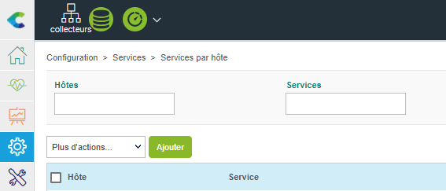
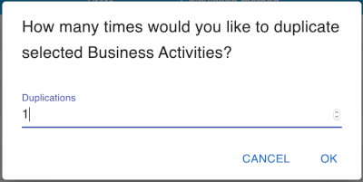
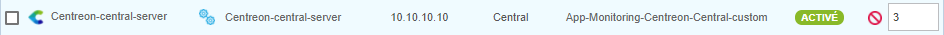
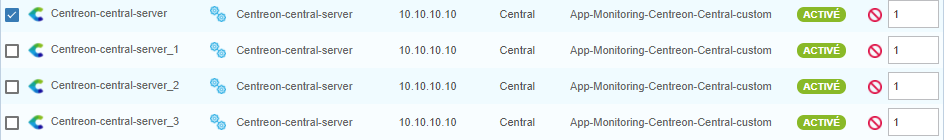
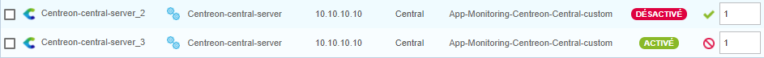

Au sein du menu **Configuration** il est possible d’effectuer certaines actions "génériques" sur les différents objets.

## Ajouter un objet

L’ajout d’un nouvel objet se fait via le bouton **Ajouter** à côté du menu **Plus d'actions**/au-dessus de la liste des objets.

## Dupliquer un objet

La duplication d’un objet permet de copier/cloner celui-ci afin de pouvoir réutiliser ses attributs pour la création
d’un nouvel objet. Exemple : J’ai 10 serveurs web identiques à superviser :

1. J’ajoute le premier serveur web avec tous les attributs nécessaires.
2. Je duplique cet hôte 9 fois.
3. Je n’ai plus qu’à changer les noms d’hôtes et les adresses IP de chaque duplication pour les adapter aux 9 autres
  serveurs web à superviser.

Grâce à cette méthode, il n’est plus nécessaire de créer unitairement chaque hôte.

<!--DOCUSAURUS_CODE_TABS-->
<!--Méthode 1-->

Par exemple, pour dupliquer une Business Activity:

1. Sélectionnez la Business Activity que vous souhaitez dupliquer en cochant la case associée.
2. Cliquez sur l'icône **Dupliquer** qui apparaît au survol de l'objet : 
3. Entrez le nombre d'exemplaires supplémentaires de l'objet que vous souhaitez obtenir.

  

4. Cliquez sur **OK**.

<!--Méthode 2-->

Par exemple, pour dupliquer un hôte :

1. Sélectionnez l’hôte que vous souhaitez dupliquer.
2. Dans la colonne **Options**, entrez le nombre d'exemplaires supplémentaires que vous souhaitez obtenir:

    

3. Dans le menu **Plus d'actions** cliquez sur **Dupliquer**, puis confirmez la duplication.

    

<!--END_DOCUSAURUS_CODE_TABS-->

## Changement massif

Les changements massifs permettent d’appliquer un changement à plusieurs objets à la fois.

Exemple : L’ensemble des serveurs web précédemment créés changent de communauté SNMP. Un changement massif permet de
modifier cette communauté sans devoir modifier chaque fiche de chaque hôte unitairement.

Pour effectuer un changement massif :

<!--DOCUSAURUS_CODE_TABS-->
<!--Méthode 1-->

1. Sélectionnez les objets que vous souhaitez modifier.
2. Cliquez sur l'icône **Changement multiple** au-dessus de la liste des objets : 
3. Confirmez les changements.

<!--Méthode 2-->

1. Sélectionnez les objets que vous souhaitez modifier.
2. Dans le menu **Plus d'actions**, cliquez sur **Changement massif**.
3. Le formulaire correspondant au type d'objet s'ouvre, avec deux options à côté de chaque champ:

    * **Incrémentale** : la modification va s’ajouter aux options déjà existantes
    * **Remplacement** : la modification va écraser les options déjà existantes.

<!--END_DOCUSAURUS_CODE_TABS-->

## Activer/Désactiver un objet

L’activation et la désactivation des objets permettent de prendre en compte ou non l’objet lors de la génération de la
configuration. Le principal intérêt est de pouvoir garder la configuration d’un objet sans pour autant l’appliquer.

Pour activer/désactiver un objet :

<!--DOCUSAURUS_CODE_TABS-->
<!--Méthode 1-->

1. Sélectionnez les objets que vous souhaitez modifier.
2. Cliquez sur l'icône désirée dans la ligne de l'objet ou au-dessus de la liste :

    * **Activer** 
    * **Désactiver** 

<!--Méthode 2-->

1. Sélectionnez les objets que vous souhaitez modifier.
2. Dans le menu **Plus d'actions**, cliquez sur **Activer/désactiver**.
  
Vous pouvez également utiliser les boutons suivants en fin de ligne : 

  * **Activer** 
  * **Désactiver** 

   

<!--END_DOCUSAURUS_CODE_TABS-->

## Supprimer un objet

> La suppression d’un objet est définitive. Si vous avez supprimé un objet par accident, il vous faudra le recréer. De
> même, la suppression d’un objet supprime automatiquement tous les objets qui sont liés à lui et ne peuvent vivre
> sans. Exemple : La suppression d’un hôte entraîne la suppression de tous les services associés à cet hôte.

Pour supprimer un objet :

<!--DOCUSAURUS_CODE_TABS-->
<!--Méthode 1-->

1. Sélectionnez les objets que vous souhaitez supprimer.
2. Cliquez sur l'icône **Supprimer** : 
3. Confirmer l'action.

<!--Méthode 2-->

1. Sélectionnez les objets que vous souhaitez supprimer.
2. Dans le menu **Plus d'actions**, cliquez sur **Supprimer**.
3. Confirmer l'action.

<!--END_DOCUSAURUS_CODE_TABS-->
