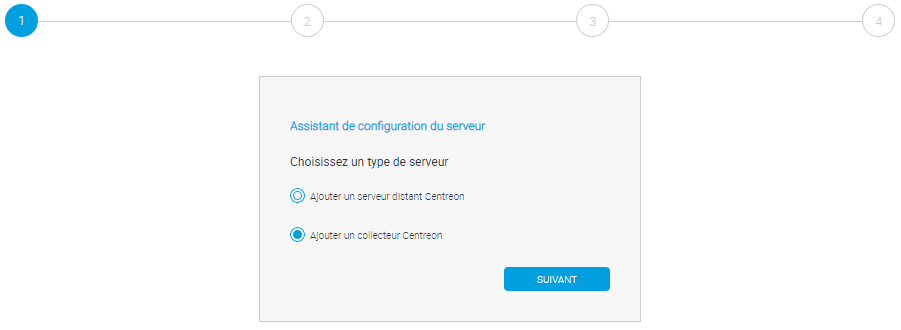
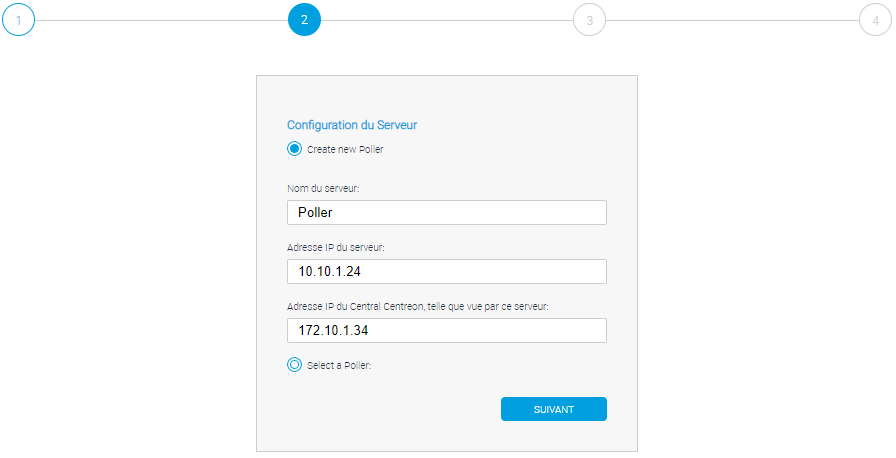
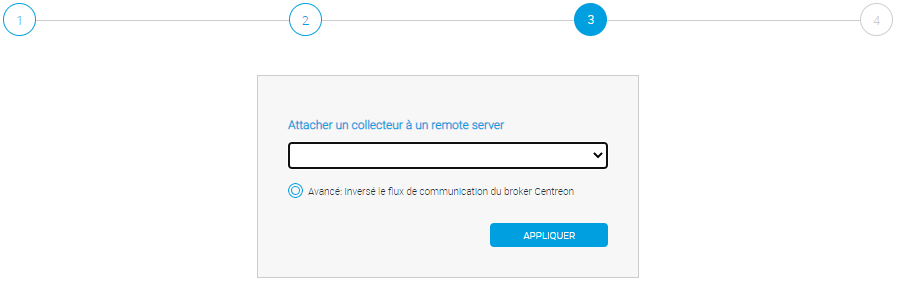
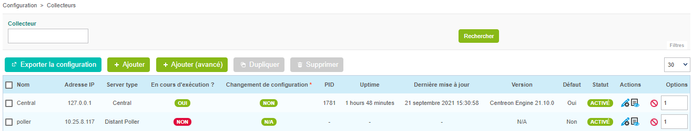
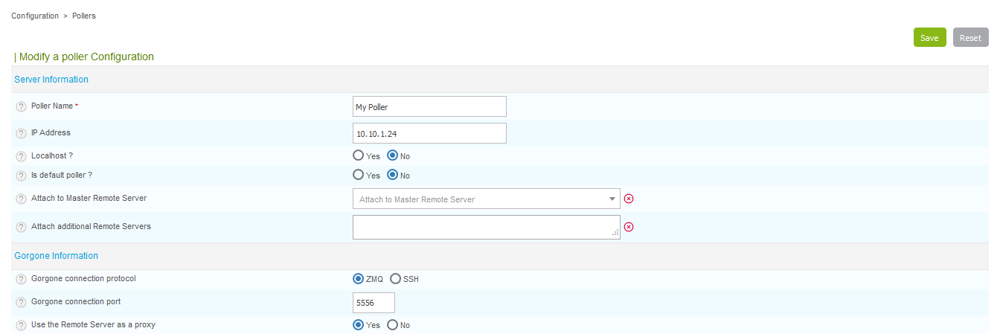
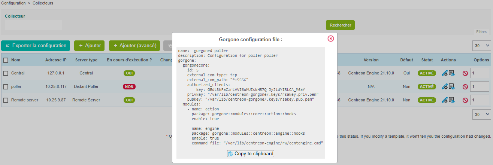
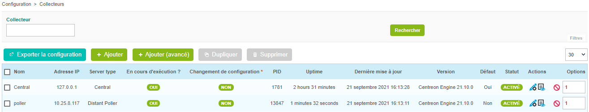

## Configurer un nouveau Poller

Depuis la version 18.10, un nouvel assistant de configuration permet de créer
toutes les configurations nécessaire pour ajouter un Poller.

> Vous pouvez toujours ajouter un nouveau Poller manuellement mais la procédure
> suivante est recommandée.

Rendez-vous dans le menu `Configuration > Collecteurs` et cliquez sur
**Ajouter un serveur à l'aide de l'assistant** pour accéder à l'assistant de
configuration.

Sélectionnez **Ajouter un collecteur Centreon** et cliquez sur **Suivant** :



Saisissez le nom, l'adresse IP du collecteur et celle du serveur Centreon Central,
cliquez sur **Suivant** :



> L'adresse IP du collecteur est l'adresse IP ou le FQNS pour accéder au
> collecteur depuis le serveur Centreon Central.
>
> L'adresse IP du collecteur est l'adresse IP ou le FQNS pour accéder au
> collecteur serveur Centreon Central vers le collecteur.

Si vous souhaitez lier ce collecteur au serveur Centreon Central, cliquez sur
**Appliquer** :



Sinon, si vous souhaitez lier ce collecteur à un Remote Server, sélectionnez le
Remote Server dans la liste et cliquez sur **Appliquer**.

Patientez quelques secondes, l'assistant va configurer votre nouveau serveur.



## Activer la communication

La communication entre un Central et un Poller est assurée par Gorgone et peut
être faite en utilisant ZMQ (avec un Gorgone s'exécutant sur le Poller,
recommandé) ou en utilisant le protocole SSH.

<!--DOCUSAURUS_CODE_TABS-->

<!--Avec ZMQ (Recommandé)-->

#### Sélectionner le type de communication

Editer la configuration du Poller fraichement créé, et sélectionner **ZMQ**
comme **Protocole de connexion utilisé par Gorgone**. Définir le **port**
adéquat (le port **5556** est recommandé).



Cliquer sur **Sauvegarder**.

#### Afficher la configuration de Gorgone

Depuis la liste des Pollers, cliquer sur l'icon d'action **Gorgone
configuration** sur la ligne correspondant à votre Poller 

Une pop-in affiche la configuration à copier dans le **terminal du Poller**.
Cliquer sur **Copy to clipboard**.



Coller le contenu du presse-papier directement dans le **terminal du Poller**
car celui-ci créera le fichier de configuration attendu :

```shell
cat <<EOF > /etc/centreon-gorgone/config.d/40-gorgoned.yaml
name:  gorgoned-My Poller
description: Configuration for poller My Poller
gorgone:
  gorgonecore:
    id: 2
    external_com_type: tcp
    external_com_path: "*:5556"
    authorized_clients:
      - key: Np1wWwpbFD2I0MdeHWRlFx51FmlYkDRZy9JTFxkrDPI
    privkey: "/var/lib/centreon-gorgone/.keys/rsakey.priv.pem"
    pubkey: "/var/lib/centreon-gorgone/.keys/rsakey.pub.pem"
  modules:
    - name: action
      package: gorgone::modules::core::action::hooks
      enable: true

    - name: engine
      package: gorgone::modules::centreon::engine::hooks
      enable: true
      command_file: "/var/lib/centreon-engine/rw/centengine.cmd"

EOF
```

Appuyer sur la touche *Entrée* pour que la commande soit appliquée.

> Vous pouvez copier la configuration en sélectionnant le contenu de la pop-in
> pour la copier dans un fichier de configuration personnalisé.

#### Démarrer le daemon Gorgone

Depuis le Poller, exécuter la commande suivante pour démarrer le service
Gorgone :

```shell
systemctl start gorgoned
```

Assurez vous que le service est démarré en exécutant la commande suivante :

```shell
systemctl status gorgoned
```

Le résultat devrait être similaire :

```shell
● gorgoned.service - Centreon Gorgone
   Loaded: loaded (/etc/systemd/system/gorgoned.service; disabled; vendor preset: disabled)
   Active: active (running) since Mon 2020-03-24 19:45:00 CET; 20h ago
 Main PID: 28583 (perl)
   CGroup: /system.slice/gorgoned.service
           ├─28583 /usr/bin/perl /usr/bin/gorgoned --config=/etc/centreon-gorgone/config.yaml --logfile=/var/log/centreon-gorgone/gorgoned.log --severity=info
           ├─28596 gorgone-dbcleaner
           ├─28597 gorgone-engine
           └─28598 gorgone-action

Mar 24 19:45:00 localhost.localdomain systemd[1]: Started Centreon Gorgone.
```

<!--Avec SSH-->

#### Sélectionner le type de communication

Editer la configuration du Poller fraichement créé, et sélectionner **SSH**
comme **Protocole de connexion utilisé par Gorgone**. Définir le **port** adéquat.


Cliquer sur **Sauvegarder**.

## Echange de clés SSH

Si vous n’avez pas de clé SSH privée sur le **serveur Central** pour
l’utilisateur **centreon-gorgone**, vous pouvez la créer avec la commande
suivante :

``` shell
su - centreon-gorgone
ssh-keygen -t rsa
```

> Appuyez sur la touche *entrée* quand il vous sera demandé de saisir un
> fichier pour enregistrer la clé. **Laissez le mot de passe vide**. Vous
> recevrez une empreinte digitale de clé et une image randomart.

Générez un mot de passe sur le **nouveau Poller** pour l'utilisateur **centreon** :

``` shell
passwd centreon
```

Pour finir, vous devez copier cette clé sur le **nouveau Poller** avec les
commandes suivantes :

``` shell
su - centreon-gorgone
ssh-copy-id -i .ssh/id_rsa.pub centreon@<IP_POLLER>
```
<!--END_DOCUSAURUS_CODE_TABS-->

**Pour forcer le Gorgone du Central à se connecter au Poller**, redémarrez le avec
la commande suivante depuis le **serveur Central** :

```shell
systemctl restart gorgoned
```

## Exporter la configuration

Depuis la liste des Pollers, sélectionner le Poller et cliquer sur **Exporter
la configuration**.

Cocher ensuite les quatre premières cases, sélectionner la méthode **Redémarrer**
et cliquer sur  **Exporter** :


Le moteur de supervision du Poller va alors démarrer et se connecter au Broker
Central.



## Premiers pas

Rendez-vous dans le chapitre [Premiers pas](../../tutorials/first-steps.html)
pour mettre en place votre première supervision.
