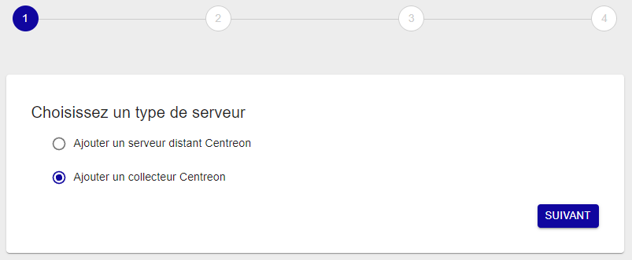
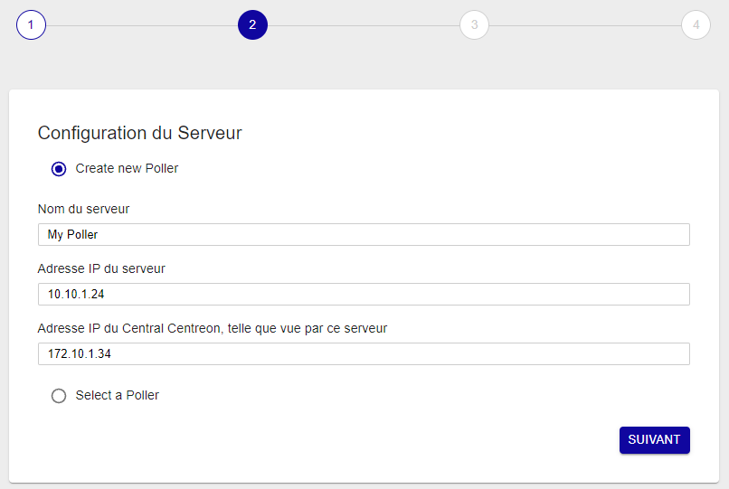
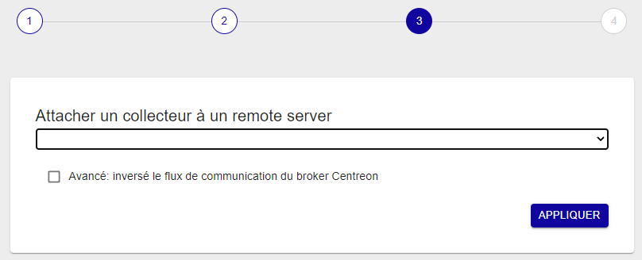
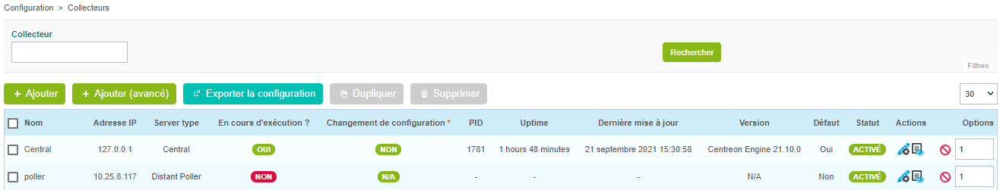
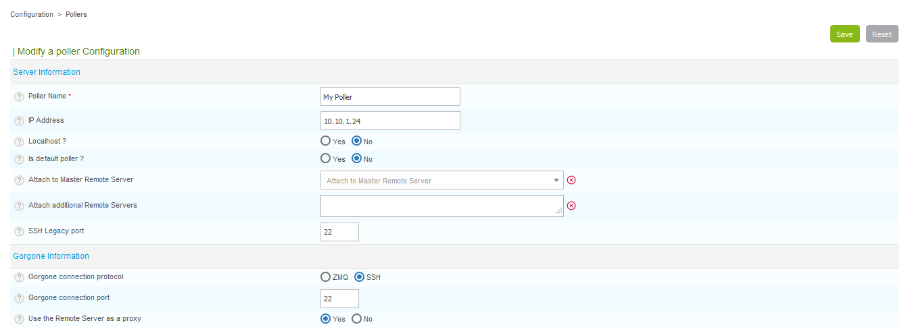
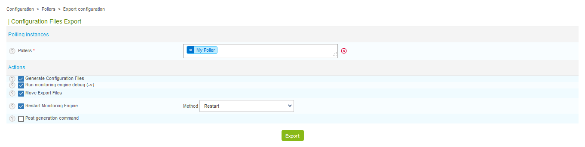
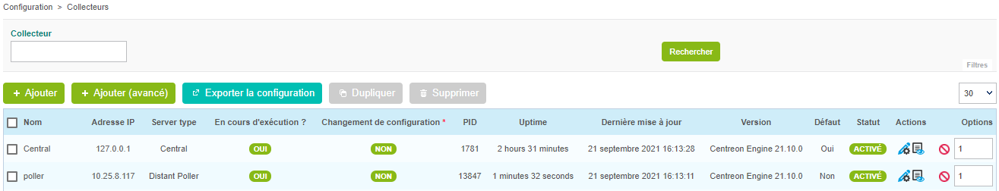

## Prérequis

Installez le collecteur (soit [en utilisant l'ISO](../../installation/installation-of-a-poller/using-centreon-iso.html), soit [en utilisant les paquets](../../installation/installation-of-a-poller/using-packages.html)).

## Étape 1 : Configurer un nouveau collecteur

Depuis la version 18.10, un nouvel assistant de configuration permet de créer
toutes les configurations nécessaires pour ajouter un collecteur.

> Vous pouvez toujours ajouter un nouveau collecteur manuellement mais la procédure
> suivante est recommandée.

1. Rendez-vous dans le menu **Configuration > Collecteurs > Collecteurs** et cliquez sur
**Ajouter** pour accéder à l'assistant de
configuration.

2. Sélectionnez **Ajouter un collecteur Centreon** et cliquez sur **Suivant** :

    

3. Sélectionnez l'option désirée :
    - **Create new Poller** si vous n'avez pas encore enregistré le collecteur sur le serveur central ou un serveur distant
    - **Select a Poller** si vous avez déjà enregistré le collecteur sur le serveur central ou un serveur distant.

4. Saisissez le nom, l'adresse IP du collecteur et celle du serveur Central, puis
cliquez sur **Suivant** :

    

    > L'adresse IP du collecteur est l'adresse IP ou le FQDN pour accéder au
    > collecteur depuis le serveur Central.
    >
    > L'adresse IP du serveur Central est l'adresse IP ou le FQDN pour accéder au
    > serveur Central depuis le collecteur.

5. Reliez le collecteur au central ou à un serveur distant :

   - Si vous souhaitez lier ce collecteur au serveur Central, cliquez sur
**Appliquer** :

      

    - Si vous souhaitez lier ce collecteur à un serveur distant, sélectionnez celui-ci dans la liste et cliquez sur **Appliquer**.

    Patientez quelques secondes, l'assistant va configurer votre nouveau serveur.

    

## Étape 2 : Activer la communication

La communication entre le serveur Central et un Poller est assurée par Gorgone et peut
être faite en utilisant ZMQ (avec un Gorgone s'exécutant sur le Poller,
recommandé) ou en utilisant le protocole SSH.

<!--DOCUSAURUS_CODE_TABS-->

<!--Avec ZMQ (Recommandé)-->

1. Sélectionner le type de communication :

    Éditez la configuration du Poller fraîchement créé, et sélectionnez **ZMQ**
    comme **Protocole de connexion utilisé par Gorgone**. Définissez le **port**
    adéquat (le port **5556** est recommandé).

    

    Cliquez sur **Sauvegarder**.

    > Notez que le *SSH Legacy port* n'est plus utilisé et sera supprimé.
    >
    > Si vous l'utilisiez dans des scripts personnalisés, pensez à changer pour
    > utiliser le système de communication de Gorgone.

2. Afficher la configuration de Gorgone :

    Depuis la liste des collecteurs, cliquez sur l'icône d'action **Gorgone
    configuration** sur la ligne correspondant à votre collecteur : 

    Une pop-in affiche la configuration à copier dans le **terminal du collecteur**.
    Cliquez sur **Copy to clipboard**.

    

    Collez le contenu du presse-papier directement dans le **terminal du collecteur**
    car celui-ci créera le fichier de configuration attendu :

    ```shell
    cat <<EOF > /etc/centreon-gorgone/config.d/40-gorgoned.yaml
    name:  gorgoned-My Poller
    description: Configuration for poller My Poller
    gorgone:
      gorgonecore:
        id: 2
        external_com_type: tcp
        external_com_path: "*:5556"
        authorized_clients:
          - key: Np1wWwpbFD2I0MdeHWRlFx51FmlYkDRZy9JTFxkrDPI
        privkey: "/var/lib/centreon-gorgone/.keys/rsakey.priv.pem"
        pubkey: "/var/lib/centreon-gorgone/.keys/rsakey.pub.pem"
      modules:
        - name: action
          package: gorgone::modules::core::action::hooks
          enable: true

        - name: engine
          package: gorgone::modules::centreon::engine::hooks
          enable: true
          command_file: "/var/lib/centreon-engine/rw/centengine.cmd"

    EOF
    ```

    Appuyez sur la touche *Entrée* pour que la commande soit appliquée.

    > Vous pouvez copier la configuration en sélectionnant le contenu de la pop-in
    > pour la coller dans un fichier de configuration personnalisé.

3. Démarrer le daemon Gorgone :

    Depuis le Poller, exécutez la commande suivante pour démarrer le service
    Gorgone :

    ```shell
    systemctl start gorgoned
    ```

    Assurez-vous que le service est démarré en exécutant la commande suivante :

    ```shell
    systemctl status gorgoned
    ```

    Le résultat devrait être similaire à ceci :

    ```shell
    ● gorgoned.service - Centreon Gorgone
      Loaded: loaded (/etc/systemd/system/gorgoned.service; disabled; vendor preset: disabled)
      Active: active (running) since Mon 2020-03-24 19:45:00 CET; 20h ago
    Main PID: 28583 (perl)
      CGroup: /system.slice/gorgoned.service
              ├─28583 /usr/bin/perl /usr/bin/gorgoned --config=/etc/centreon-gorgone/config.yaml --logfile=/var/log/centreon-gorgone/gorgoned.log --severity=info
              ├─28596 gorgone-dbcleaner
              ├─28597 gorgone-engine
              └─28598 gorgone-action

    Mar 24 19:45:00 localhost.localdomain systemd[1]: Started Centreon Gorgone.
    ```

    Enfin, activez le démarrage automatique du service avec la commande :

    ```shell
    systemctl enable gorgoned
    ```

4. Pour forcer le Gorgone du Central à se connecter au collecteur, redémarrez-le avec
la commande suivante depuis le **serveur Central** :

    ```shell
    systemctl restart gorgoned
    ```
<!--Avec SSH-->

1. Sélectionner le type de communication :

    Éditez la configuration du collecteur fraîchement créé, et sélectionnez **SSH**
comme **Protocole de connexion utilisé par Gorgone**. Définissez le **port** adéquat.

    

 2. Cliquez sur **Sauvegarder**.

    > Notez que le *SSH Legacy port* n'est plus utilisé et sera supprimé.
    >
    > Si vous l'utilisiez dans des scripts personnalisés, pensez à changer pour
    > utiliser le système de communication de Gorgone.

3. Échange de clés SSH :

    Si vous n’avez pas de clé SSH privée sur le **serveur Central** pour
    l’utilisateur **centreon-gorgone**, vous pouvez la créer avec la commande
    suivante :

    ``` shell
    su - centreon-gorgone
    ssh-keygen -t rsa
    ```

    > Appuyez sur la touche *Entrée* quand il vous sera demandé de saisir un
    > fichier pour enregistrer la clé. **Laissez le mot de passe vide**. Vous
    > recevrez une empreinte digitale de clé et une image randomart.

    Générez un mot de passe sur le **nouveau Poller** pour l'utilisateur **centreon** :

    ``` shell
    passwd centreon
    ```

    Pour finir, vous devez copier cette clé sur le **nouveau Poller** avec les
    commandes suivantes :

      ``` shell
      su - centreon-gorgone
      ssh-copy-id -i .ssh/id_rsa.pub centreon@<IP_POLLER>
      ```

  5. Pour forcer le Gorgone du Central à se connecter au collecteur, redémarrez-le avec
la commande suivante depuis le **serveur Central** :

  ```shell
  systemctl restart gorgoned
  ```
<!--END_DOCUSAURUS_CODE_TABS-->

## Étape 3 : Exporter la configuration

1. Depuis la liste des collecteurs, sélectionnez le collecteur et cliquez sur **Exporter
la configuration**.

2. Cochez ensuite les quatre premières cases, sélectionnez la méthode **Redémarrer**
et cliquez sur  **Exporter** :

    

    Le moteur de supervision du collecteur va alors démarrer et se connecter au Broker
Central.

    

## Premiers pas

Rendez-vous dans le chapitre [Premiers pas](../../getting-started/installation-first-steps.html#start-to-monitor-your-first-host)
pour mettre en place votre première supervision.
