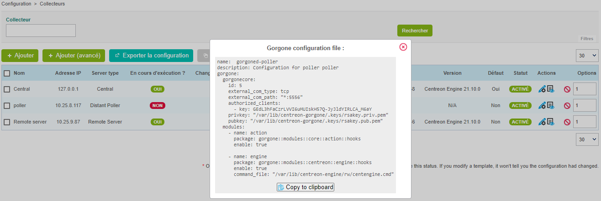
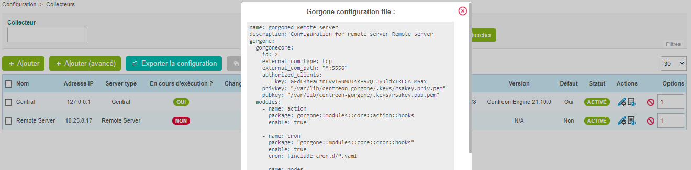

## Modes de communication

Même si Gorgone est installé sur les Pollers et les Remote Servers, il est
autorisé de communiquer avec eux (depuis un Central, ou entre un Remote Server
et un Poller) en utilisant le protocole SSH.

Bien que la communication de type SSH soit autorisée, elle doit être utilisée
en période de transition d'une ancienne plateforme qui utilisait Centcore vers
une plateforme utilisant ZMQ.

> Les Pollers ou Remote Servers qui n'utiliseraient pas ZMQ comme type de
> communication entre le Gorgogne du Central et le leur ne bénéficieront pas
> de toutes les évolutions de Centreon et de ses extensions.

Les modes de communication sont listés ci-après :

### Sans Remote Server

<!--DOCUSAURUS_CODE_TABS-->

<!--Moderne (recommandé)-->

| Communications                         | Actions autorisées                                                                |
| -------------------------------------- | --------------------------------------------------------------------------------- |
| **Central** \<-- *ZMQ* --\> **Poller** | Actions de supervision\*, collecte des statistiques Engine/Broker, Host Discovery |

<!--Legacy (ex-Centcore)-->

| Communications                         | Actions autorisées                                                                |
| -------------------------------------- | --------------------------------------------------------------------------------- |
| **Central** \<-- *SSH* --\> **Poller** | Actions de supervision\*, collecte des statistiques Engine/Broker, Host Discovery |

<!--END_DOCUSAURUS_CODE_TABS-->

\* Les actions de supervision sont toutes les actions disponibles dans
l'interface web comme ajouter des temps d'arrêt, des acquittements, etc et
exporter la configuration.

### Avec Remote Server

<!--DOCUSAURUS_CODE_TABS-->

<!--Moderne (recommandé)-->

| Communications                                                    | Actions autorisées                                                                |
| ----------------------------------------------------------------- | --------------------------------------------------------------------------------- |
| **Central** \<-- *ZMQ* --\> **Remote** \<-- *ZMQ* --\> **Poller** | Actions de supervision\*, collecte des statistiques Engine/Broker, Host Discovery |

<!--Mixed-->

| Communications                                                    | Actions autorisées                                                                |
| ----------------------------------------------------------------- | --------------------------------------------------------------------------------- |
| **Central** \<-- *ZMQ* --\> **Remote** \<-- *SSH* --\> **Poller** | Actions de supervision\*, collecte des statistiques Engine/Broker, Host Discovery |

<!--Legacy (ex-Centcore)-->

| Communications                                                    | Actions autorisées                                                                                                      |
| ----------------------------------------------------------------- | ----------------------------------------------------------------------------------------------------------------------- |
| **Central** \<-- *SSH* --\> **Remote** \<-- *SSH* --\> **Poller** | Actions de supervision\*, collecte des statistiques Engine/Broker (seulement Remote), Host Discovery (seulement Remote) |

<!--Autre (non recommandé)-->

| Communications                                                    | Actions autorisées       |
| ----------------------------------------------------------------- | ------------------------ |
| **Central** \<-- *SSH* --\> **Remote** \<-- *ZMQ* --\> **Poller** | Actions de supervision\* |

> Ce mode ne permet pas de récupérer l'empreinte du Remote et rend donc
> impossible l'affichage de la configuration du Gorgone du Poller depuis
> l'interface web.

<!--END_DOCUSAURUS_CODE_TABS-->

\* Les actions de supervision sont toutes les actions disponibles dans
l'interface web comme ajouter des temps d'arrêt, des acquittements, etc et
exporter la configuration.

## Changer la communication de SSH à ZMQ

<!--DOCUSAURUS_CODE_TABS-->

<!--Pour un Poller-->

#### Sélectionner le type de communication

Editer la configuration du Poller, et sélectionner **ZMQ**
comme **Gorgone connection protocol**.

Définir le **port** adéquat (le port **5556** est recommandé).


Cliquer sur **Save**.

#### Afficher la configuration de Gorgone

Depuis la liste des Pollers, cliquer sur l'icon d'action **Gorgone
configuration** sur la ligne correspondant à votre Poller 

Une pop-in affiche la configuration à copier dans le **terminal du Poller**.
Cliquer sur **Copy to clipboard**.



Coller le contenu du presse-papier directement dans le **terminal du Poller**
car celui-ci créera le fichier de configuration attendu :

```shell
cat <<EOF > /etc/centreon-gorgone/config.d/40-gorgoned.yaml
name:  gorgoned-My Poller
description: Configuration for poller My Poller
gorgone:
  gorgonecore:
    id: 2
    external_com_type: tcp
    external_com_path: "*:5556"
    authorized_clients:
      - key: Np1wWwpbFD2I0MdeHWRlFx51FmlYkDRZy9JTFxkrDPI
    privkey: "/var/lib/centreon-gorgone/.keys/rsakey.priv.pem"
    pubkey: "/var/lib/centreon-gorgone/.keys/rsakey.pub.pem"
  modules:
    - name: action
      package: gorgone::modules::core::action::hooks
      enable: true

    - name: engine
      package: gorgone::modules::centreon::engine::hooks
      enable: true
      command_file: "/var/lib/centreon-engine/rw/centengine.cmd"

EOF
```

Appuyer sur la touche entrée pour que la commande soit appliquée.

> Vous pouvez copier la configuration en sélectionnant le contenu de la popin
> pour la copier dans un fichier de configuration personnalisé.

#### Démarrer le daemon Gorgone

Depuis le Poller, exécuter la commande suivante pour démarrer le service
Gorgone :

```shell
systemctl start gorgoned
```

Assurez vous que le service est démarré en exécutant la commande suivante :

```shell
systemctl status gorgoned
```

Le résultat devrait être similaire :

```shell
● gorgoned.service - Centreon Gorgone
   Loaded: loaded (/etc/systemd/system/gorgoned.service; disabled; vendor preset: disabled)
   Active: active (running) since Mon 2020-03-24 19:45:00 CET; 20h ago
 Main PID: 28583 (perl)
   CGroup: /system.slice/gorgoned.service
           ├─28583 /usr/bin/perl /usr/bin/gorgoned --config=/etc/centreon-gorgone/config.yaml --logfile=/var/log/centreon-gorgone/gorgoned.log --severity=info
           ├─28596 gorgone-dbcleaner
           ├─28597 gorgone-engine
           └─28598 gorgone-action

Mar 24 19:45:00 localhost.localdomain systemd[1]: Started Centreon Gorgone.
```

Enfin, activez le démarrage automatique du service avec la commande :

```shell
systemctl enable gorgoned
```

> S'il y a un Remote Server entre le Central et ce Poller, assurez-vous
> d'exporter la configuration du Remote Server.
>
> Depuis la liste des Pollers, sélectionner le Remote Server et cliquer sur
> **Export configuration**.
>
> Sélectionner ensuite les trois premières cases puis cliquer sur **Export**.
>
> Enfin, redémarrer le démon Gorgone du Remote Server en exécutant la commande
> suivante :
>
> ```shell
> systemctl restart gorgoned
> ```

<!--Pour un Remote Server-->

#### Sélectionner le type de communication

Editer la configuration du Remote Server, et sélectionner **ZMQ**
comme **Gorgone connection protocol**.

Définir le **port** adéquat (le port **5556** est recommandé).


Cliquer sur **Save**.

#### Afficher la configuration de Gorgone

Depuis la liste des Pollers, cliquer sur l'icon d'action **Gorgone
configuration** sur la ligne correspondant à votre Remote Server 

Une pop-in affiche la configuration à copier dans le **terminal du Remote
Server**.
Cliquer sur **Copy to clipboard**.



Coller le contenu du presse-papier directement dans le **terminal du Remote
Server** car celui-ci créera le fichier de configuration attendu :

```shell
cat <<EOF > /etc/centreon-gorgone/config.d/40-gorgoned.yaml
name: gorgoned-My Remote Server
description: Configuration for remote server My Remote Server
gorgone:
  gorgonecore:
    id: 3
    external_com_type: tcp
    external_com_path: "*:5556"
    authorized_clients:
      - key: Np1wWwpbFD2I0MdeHWRlFx51FmlYkDRZy9JTFxkrDPI
    privkey: "/var/lib/centreon-gorgone/.keys/rsakey.priv.pem"
    pubkey: "/var/lib/centreon-gorgone/.keys/rsakey.pub.pem"
  modules:
    - name: action
      package: gorgone::modules::core::action::hooks
      enable: true

    - name: cron
      package: "gorgone::modules::core::cron::hooks"
      enable: true
      cron: !include cron.d/*.yaml

    - name: nodes
      package: gorgone::modules::centreon::nodes::hooks
      enable: true

    - name: proxy
      package: gorgone::modules::core::proxy::hooks
      enable: true

    - name: legacycmd
      package: gorgone::modules::centreon::legacycmd::hooks
      enable: true
      cmd_file: "/var/lib/centreon/centcore.cmd"
      cache_dir: "/var/cache/centreon/"
      cache_dir_trap: "/etc/snmp/centreon_traps/"
      remote_dir: "/var/cache/centreon/config/remote-data/"

    - name: engine
      package: gorgone::modules::centreon::engine::hooks
      enable: true
      command_file: "/var/lib/centreon-engine/rw/centengine.cmd"

    - name: statistics
      package: "gorgone::modules::centreon::statistics::hooks"
      enable: true
      broker_cache_dir: "/var/cache/centreon/broker-stats/"
      cron:
        - id: broker_stats
          timespec: "*/5 * * * *"
          action: BROKERSTATS
          parameters:
            timeout: 10
        - id: engine_stats
          timespec: "*/5 * * * *"
          action: ENGINESTATS
          parameters:
            timeout: 10

EOF
```

Appuyer sur la touche entrée pour que la commande soit appliquée.

> Vous pouvez copier la configuration en sélectionnant le contenu de la popin
> pour la copier dans un fichier de configuration personnalisé.

#### Redémarrer le daemon Gorgone

Depuis le Remote Server, exécuter la commande suivante pour redémarrer le
service Gorgone :

```shell
systemctl restart gorgoned
```

Assurez vous que le service est démarré en exécutant la commande suivante :

```shell
systemctl status gorgoned
```

Le résultat devrait être similaire :

```shell
● gorgoned.service - Centreon Gorgone
   Loaded: loaded (/etc/systemd/system/gorgoned.service; enabled; vendor preset: disabled)
   Active: active (running) since Wed 2020-03-24 19:45:00 CET; 6s ago
 Main PID: 30902 (perl)
   CGroup: /system.slice/gorgoned.service
           ├─30902 /usr/bin/perl /usr/bin/gorgoned --config=/etc/centreon-gorgone/config.yaml --logfile=/var/log/centreon-gorgone/gorgoned.log --severity=info
           ├─30916 gorgone-nodes
           ├─30917 gorgone-dbcleaner
           ├─30924 gorgone-proxy
           ├─30925 gorgone-proxy
           ├─30938 gorgone-proxy
           ├─30944 gorgone-proxy
           ├─30946 gorgone-proxy
           ├─30959 gorgone-engine
           ├─30966 gorgone-action
           └─30967 gorgone-legacycmd

Mar 24 19:45:00 localhost.localdomain systemd[1]: Started Centreon Gorgone.
```

<!--END_DOCUSAURUS_CODE_TABS-->

**Pour forcer le Gorgone du Central à changer le mode de communication**,
redémarrez le avec la commande suivante depuis le **serveur Central** :

```shell
systemctl restart gorgoned
```
