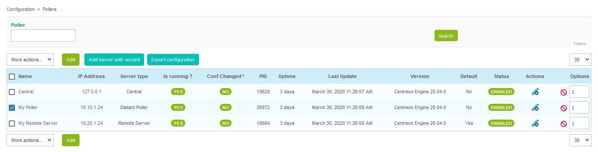
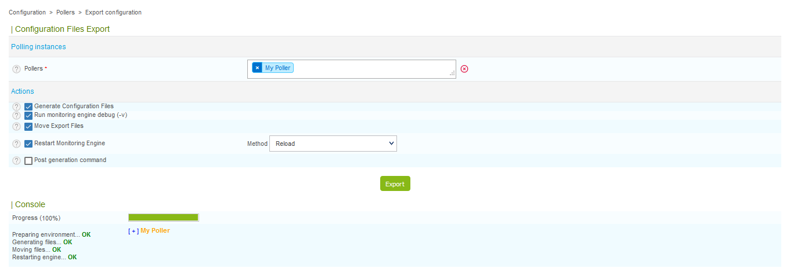

Lors de la création/suppression/modification des objets via l’interface de configuration, les changements effectués ne
sont pas appliqués de manière automatique aux serveurs de supervision. Afin de pouvoir appliquer les modifications
effectuées, il est nécessaire de suivre la procédure suivante ci-dessous.

## Procédure

1. Rendez-vous dans le menu **Configuration > Pollers**
2. Choisissez les collecteurs sur lesquels exporter la configuration

3. Cliquez sur **Export configuration**
4. Cochez les cases **Generate Configuration Files**, **Run monitoring engine debug (-v)**,
**Move Export Files** et **Restart Monitoring Engine**
5. Cliquez sur **Export**

> L’option **Post generation command** permet de demander l’exécution de la commande post-génération paramétrée au
> niveau de la configuration de l’ordonnanceur.

## Explications

Au sein de la page de génération de la configuration, plusieurs options sont disponibles :

* **Generate Configuration Files** : Génère les fichiers de configuration de l’ordonnanceur dans un répertoire
  temporaire. Cette configuration est générée à partir des objets configurés via l’interface web
* **Run monitoring engine debug (-v)** : Permet à l’ordonnanceur de vérifier la configuration générée
* **Move Export Files** : Déplace les fichiers de configuration du répertoire temporaire vers le répertoire de
  l’ordonnanceur
* **Restart Monitoring Engine** : Redémarre l’ordonnanceur afin d’appliquer les nouveaux fichiers de configuration
* **Post generation command** : Exécute la commande post-génération paramétrée au niveau de la configuration de
  l’ordonnanceur
