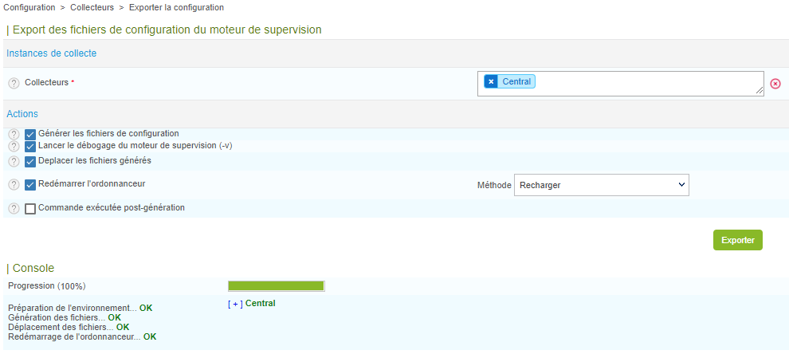

Lorsque vous créez, supprimez ou modifiez des objets via le menu
**Configuration**, les changements effectués ne sont pas appliqués de manière
automatique (ni sur le serveur central sur lequel vous avez créé, supprimé ou modifié l'objet, ni sur aucun collecteur ou serveur distant qui en dépendrait). Pour que les modifications soient prises en compte, il est nécessaire d'exporter la configuration.

Pour des changements apportés à des serveurs distants ou des collecteurs, l'export doit se faire sur le serveur central.

## Exporter la configuration

1.  Allez à la page **Configuration > Collecteurs > Collecteurs**. La page affiche l'état de votre serveur central et de tous les collecteurs et serveurs distants qui y sont reliés : les changements sont signalés dans la colonne **Changement de configuration**. 

2.  Sélectionnez le serveur central, le serveur distant ou le collecteur dont la configuration a changé.

    

3.  Cliquez sur **Exporter la configuration**.

4.  Cochez les cases suivantes (voir la section [**Options d'export**](#options-dexport)) :
    - **Générer les fichiers de configuration**
    - **Lancer le débogage du moteur de supervision (-v)**
    - **Déplacer les fichiers générés**
    - **Redémarrer l'ordonnanceur**. Utilisez la méthode : 
      - **Recharger** : lorsque vous avez créé, supprimé ou modifié des objets supervisés
      - **Redémarrer** : lorsque vous avez apporté des changements à la communication entre un collecteur et le serveur central, ou à la configuration du moteur de collecte. Un redémarrage prend plus de temps qu'un rechargement.

5.  Cliquez sur **Exporter**. Un log de l'export s'affiche.

    

6. Dans le log, vérifiez que l'export a bien fonctionné et qu'aucune erreur n'a été remontée.

## Options d'export

Les différentes options fonctionnent de la manière suivante :

  - **Générer les fichiers de configuration** : Génère les fichiers de
    configuration du moteur de supervision dans un répertoire temporaire. Cette
    configuration est générée à partir des objets configurés via l’interface web.
  - **Lancer le débogage du moteur de supervision (-v)** : Permet au
    moteur de supervision de vérifier la configuration générée.
  - **Deplacer les fichiers générés** : Déplace les fichiers de configuration du
    répertoire temporaire vers le répertoire du moteur de supervision.
  - **Redémarrer l'ordonnanceur** : Redémarre le moteur de supervision afin d’appliquer
    les nouveaux fichiers de configuration.
  - **Commande exécutée post-génération** : Exécute la commande post-génération
    paramétrée au niveau de la configuration du moteur de supervision.
