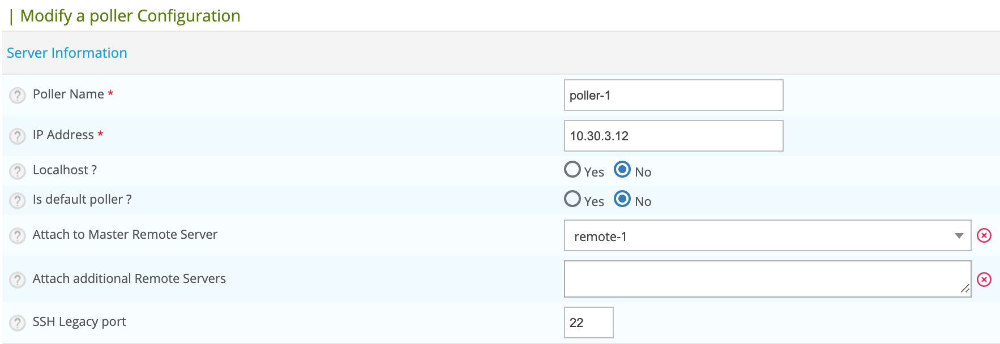
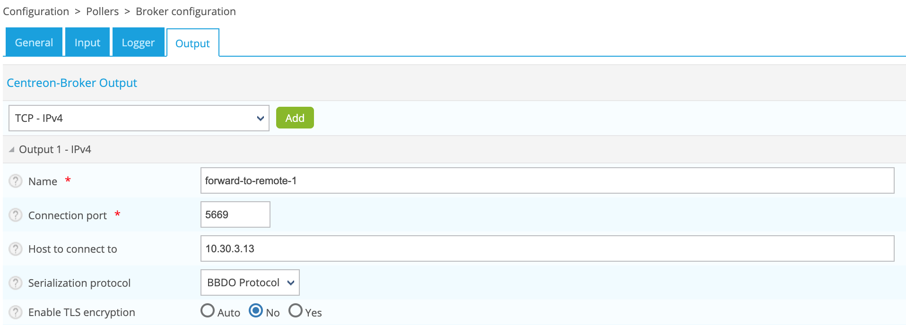

Voici la procédure pour attacher un collecteur du serveur Centreon Central à un serveur distant, ou à partir d'un
serveur distant à un autre.

## Mise à jour de la configuration Centreon Poller

Rendez-vous dans le menu **Configuration > Pollers > Pollers** et éditer votre collecteur.

Dans le champ **Attach to Master Remote Server** sélectionné le nouveau serveur :



Cliquez sur **Save**.

## Mise à jour de la configuration Centreon Gorgone

Depuis la liste des Pollers, cliquer sur l'icon d'action **Gorgone
configuration** sur la ligne correspondant à votre Remote Server 

Une pop-in affiche la configuration à copier dans le **terminal du Remote
Server**.
Cliquer sur **Copy to clipboard**.


Coller le contenu du presse-papier directement dans le **terminal du Remote
Server** car celui-ci créera le fichier de configuration attendu :

```shell
cat <<EOF > /etc/centreon-gorgone/config.d/40-gorgoned.yaml
name: gorgoned-My Remote Server
description: Configuration for remote server My Remote Server
gorgone:
  gorgonecore:
    id: 3
    external_com_type: tcp
    external_com_path: "*:5556"
    authorized_clients:
      - key: Np1wWwpbFD2I0MdeHWRlFx51FmlYkDRZy9JTFxkrDPI
    privkey: "/var/lib/centreon-gorgone/.keys/rsakey.priv.pem"
    pubkey: "/var/lib/centreon-gorgone/.keys/rsakey.pub.pem"
  modules:
    - name: action
      package: gorgone::modules::core::action::hooks
      enable: true

    - name: cron
      package: "gorgone::modules::core::cron::hooks"
      enable: true
      cron: !include cron.d/*.yaml

    - name: nodes
      package: gorgone::modules::centreon::nodes::hooks
      enable: true

    - name: proxy
      package: gorgone::modules::core::proxy::hooks
      enable: true

    - name: legacycmd
      package: gorgone::modules::centreon::legacycmd::hooks
      enable: true
      cmd_file: "/var/lib/centreon/centcore.cmd"
      cache_dir: "/var/cache/centreon/"
      cache_dir_trap: "/etc/snmp/centreon_traps/"
      remote_dir: "/var/cache/centreon/config/remote-data/"

    - name: engine
      package: gorgone::modules::centreon::engine::hooks
      enable: true
      command_file: "/var/lib/centreon-engine/rw/centengine.cmd"

    - name: statistics
      package: "gorgone::modules::centreon::statistics::hooks"
      enable: true
      broker_cache_dir: "/var/cache/centreon/broker-stats/"
      cron:
        - id: broker_stats
          timespec: "*/5 * * * *"
          action: BROKERSTATS
          parameters:
            timeout: 10
        - id: engine_stats
          timespec: "*/5 * * * *"
          action: ENGINESTATS
          parameters:
            timeout: 10

EOF
```

Appuyer sur la touche *Entrée* pour que la commande soit appliquée.

> Vous pouvez copier la configuration en sélectionnant le contenu de la popin
> pour la copier dans un fichier de configuration personnalisé.

Redémarrez Centreon Gorgone:
```shell
systemctl restart gorgoned
```

## Mise à jour de la configuration Centreon Broker

Rendez-vous dans le menu **Configuration > Pollers > Pollers** et éditez la configuration liée à votre collecteur.

Dans l'onglet **Output** , ajoutez ou modifiez l'entrée **TCP - IPv4** pour se connecter au nouveau serveur :



Cliquez sur **Save**

## Deploy the new configuration

Rendez-vous dans le menu **Configuration > Pollers > Pollers** et déployez la configuration de votre collecteur.

Sur le serveur sur lequel vous avez connecté votre serveur, redémarrez Centreon Gorgone :
```shell
systemctl restart gorgoned
```
