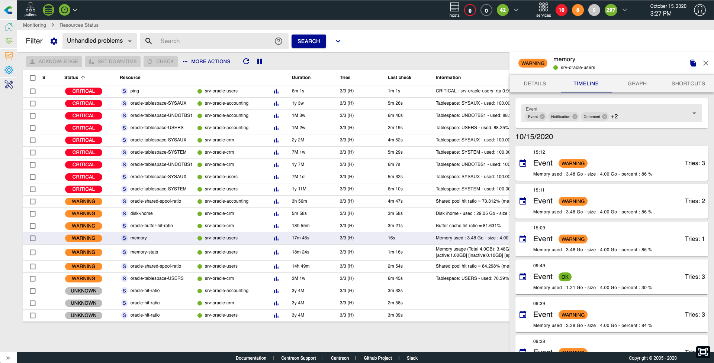
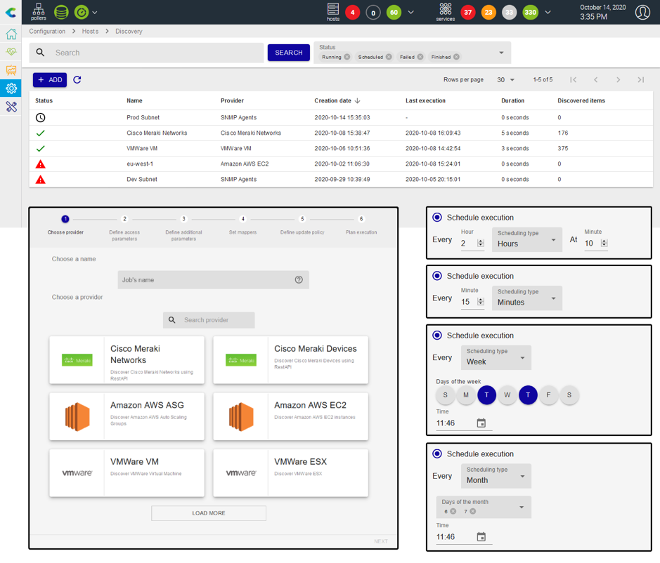

Vous trouverez dans ce chapitre la note de version globale de la **Plateforme
Centreon 20.10**.

Pour accéder aux notes de version détaillées par composants, rendez vous dans
les sections suivantes:

- [Core](centreon-core.html)
- [Extensions commerciales](centreon-commercial-extensions.html)
- [Extensions Open Source](centreon-os-extensions.html)

#### Statut des ressources (précédemment Event View)

Grâce aux commentaires sur la précédente version 20.04, nous avons ajouté les
fonctionnalités manquantes avant de faire de cette vue la vue par défaut.

Cette nouvelle vue est accessible via le menu `Monitoring > Resources Status` et
apporte les fonctionnalités suivantes:

- Une page unifiée regroupant les hôtes et les services
- Une recherche par nom basé sur les mécaniques d'expressions régulières
- La possibilité de forcer le critère de recherche via des labels prédéfinis
- Des critères de filtres additionnels multi-valeurs
- Possibilité de sauvegarder et gérer vos filtres
- Des actions rapide sur les lignes et efficace via des boutons accessibles en
  haut de page (acquittement, mise en place de plage de maintenance,
  rafraîchissement du statut), soumettre un résultat, etc.
- Des informations détaillées affichées sous forme de panneau au dessus de la
  liste afin de toujours garder un oeil et d'accéder facilement à d'autres
  ressources, comme : les détails des objets, les informations, la chronologie
  des événements, le graphique de performance associé et les raccourcis.

Pour en savoir plus sur cette fonctionnalité, [rendez vous sur cette
page](../alerts-notifications/resources-status.html)

## Industrialisation de l’exploitation : automatisation des mises à jour de configuration

La fonctionnalité Host Discovery venant de l'extension Auto Discovery a été
améliorée pour ajouter de nouvelles possibilités :

- L'assistant Host Discovery permet désormais de planifier vos découvertes de
  plusieurs manières: annuelle, mensuelle, quotidienne, horaire et même toutes
  les x minutes.
- Les travaux de découverte planifiés peuvent être suspendus et repris à tout
  moment.
- Le résultat de la découverte peut également être traité automatiquement pour
  ajouter, désactiver et, si nécessaire, réactiver les hôtes dans la
  configuration.
- Si vous décidez d'ajouter manuellement les hôtes à partir de la page de
  résultats du travail, les règles de mappage peuvent maintenant être modifiées
  et enregistrées à partir de cette page pour répondre à vos besoins en appliquant
  la règle directement sur le résultat.
- Les nouveaux mappeurs *exclusion* et *inclusion* vous aideront à décider quels
  hôtes doivent être ajoutés dans la configuration, et ceux qui doivent être
  désactivés ou activés.

Jetez un oeil à la [section dédiée](../monitoring/discovery/hosts-discovery.html)
pour savoir comment lancer votre première découverte!

Pour tout savoir sur les modifications, consultez
[la note de publication](centreon-commercial-extensions.html#centreon-auto-discovery-release-notes)

## Un coeur Open Source encore plus robuste

### Authentification Multi-Facteurs des utilisateurs, basée sur OpenID Connect

Centreon 20.10 supporte OAuth 2.0 (avec Authorization Code Grant type), le
protocole libre de délégation d’autorisation, ainsi que la couche
d’authentification OpenID Connect (OIDC), proposée par la fondation OpenID.
Tous les fournisseurs de gestion d’identités et d’accès qui proposent une
authentification à facteurs multiples supportent OIDC.

Jetez un oeil à la [section dédiée](../administration/parameters/centreon-ui.html#openid-connect).

### Compatibilité SELinux pour un renforcement des contrôles d’accès au noyau

Centreon 20.10 est maintenant compatible avec le module Security-Enhanced Linux
(SELinux), qui permet de définir une politique de contrôle d'accès obligatoire
aux éléments systèmes.

### Système d’exploitation Linux avec les derniers correctifs de sécurité (bientôt disponible)

Centreon 20.10 s’appuie désormais sur les dernières versions de CentOS ou de
RedHat Enterprise Linux (RHEL), soit CentOS v8 ou RHEL v8.

### Plan d’engagement de correction des vulnérabilités

Comme à son habitude, Centreon s’engage sur un plan de correction des
vulnérabilités détectées par des tiers. Les échéances d’engagement dépendent de
la sévérité de la vulnérabilité, mesurée selon son score CVSS (Common
Vulnerability Scoring System). Centreon 20.10 incorpore la correction de toutes
les vulnérabilités détectées sur les versions logicielles précédentes.
