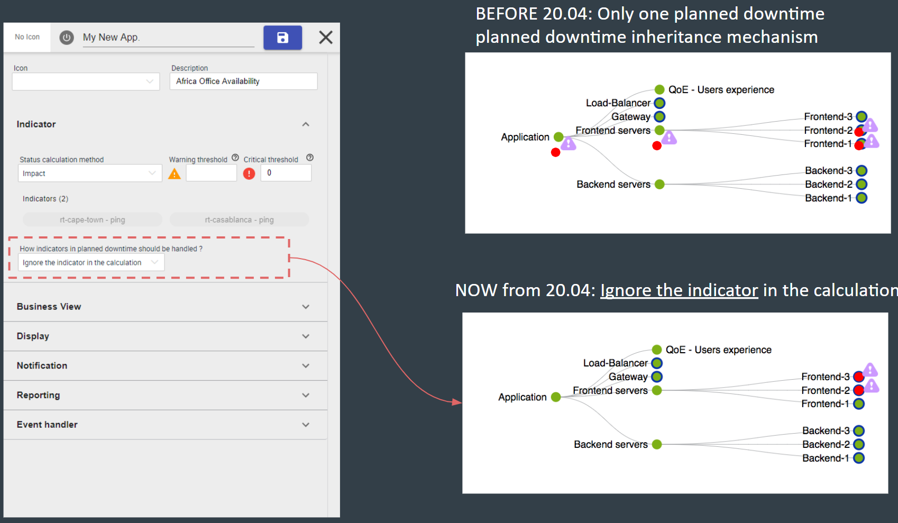

Vous trouverez dans ce chapitre la note de version globale de la **Plateforme
Centreon 20.04**.

Pour accéder aux notes de version détaillées par composants, rendez vous dans
les sections suivantes:

  - [Core](centreon-core.html)
  - [Extensions commerciales](centreon-commercial-extensions.html)
  - [Extensions Open Source](centreon-os-extensions.html)

#### Nouvelle vue d'évènements (beta)

L'interface de Centreon se voit ajouter une nouvelle expérience de consultation
et gestion des évènements. Cela est mis en place grâce à une nouvelle vue
"unifiée", mélangeant hôtes et services et permettant de filtrer et d'agir
efficacement sur les alertes en cours.

Cette vue est proposée en version "beta" afin de pouvoir la faire évoluter le
plus efficacement et rapidement possible en fonction de vos retours et des
analyses déjà effectuées. L'objectif est de faire de cette vue la plus efficace
possible en terme gestion des alertes à destination des opérateurs &
administrateurs système.

Cette nouvelle vue est accessible via le menu `Home > Events view (beta)` et
apporte les fonctionnalités suivantes:

  - Une page unifiée regroupant les hôtes et les services
  - Une recherche par nom basé sur les mécaniques d'expressions régulières
  - La possibilité de forcer le critère de recherche via des labels prédéfinis
  - Des critères de filtres additionnels multi-valeurs
  - Des actions rapide sur les lignes et efficace via des boutons accessibles en
    haut de page (acquittement, mise en place de plage de maintenance,
    rafraîchissement du statut)
  - Des informations détaillées affichées sous forme de panneau au dessus de la
    liste afin de toujours garder un oeil et d'accéder facilement à d'autres
    ressources
  - *... et bien plus à venir dans les semaines & mois qui viennent*

<iframe width="640" height="480" src="https://www.youtube.com/embed/FVjuIbBDuYU" frameborder="0" allowfullscreen></iframe>

Pour en savoir plus sur cette fonctionnalité, [rendez vous sur cette
page](../alerts-notifications/events-view.html)

#### Centreon en Mobilité

Une version mobile de Centreon est disponible \! Il est possible de l'installer
sur votre téléphone afin d'être en mesure d'effectuer les actions suivantes, sur
votre mobile:

  - Afficher la liste des resources (hôtes et services) et leur statut
  - Filtre ces listes
  - Agir sur les ressources: mise en place d'acquittement ou de plage de
    maintenance
  - Afficher le détail du statut des ressources et un graphiques lorsque
    disponible

<video width="375" height="812" controls="true" allowfullscreen="true" poster="../assets/mobile/mobile-login.png">
    <source src="../assets/mobile/mobile-demo.mp4" type="video/mp4">
</video>

Plus d'information sur l'installation et l'utilisation de l'application mobile
sur [cette page](../mobile/introduction.html)

## Une découverte d'hôtes plus flexible


La fonctionnalité Host Discovery venant de l'extension Auto Discovery a été
complétement réécrite pour apporter une nouvelle expérience quand vient le
moment d'ajouter des ressources à la configuration.

Nous avons aussi ajouté de nouvelles fonctionnalités :

  - Gestion des données d'identification plus simple et plus sécurisée,
  - Possibilité de découvrir des ressources depuis n'importe quel serveur de
    supervision,
  - Nouveau système pour faire le lien entre résultat de découverte et
    configuration Centreon.

Jetez un oeil à la [section dédiée](../monitoring/discovery/hosts-discovery.html)
pour savoir comment lancer votre première découverte!

## Service mapping: nouvelles possibilités

#### New calculation methods

La manière de modéliser les activités métier a été améliorer afin de proposer de
nouvelles méthodes de calcul.

Jusqu'à présent, la modélisation des services IT et des application pouvait être
complexe car uniquement basée sur une mécanique d'"Impact".

Vous êtes maintenant en mesure de:

  - Modéliser les cas simple simplement grâce à une méthode de calcul **Worst**
    et **Pire** statuts
  - Modéliser des concepts de cluster simplement avec la méthode de calcul
    **Ratio**

Exemple: Je souhaite modéliser qu'au moins 50% de mes indicateurs contenus dans
mon activité métier soit OK, je peux désormais le faire comme ci-dessous:


#### New planned downtime inheritance management

Business activity (\<=\> App. & Services) appears “Down” even when a maintenance
(\<=\> planned downtime) was anticipated by the IT teams. That’s not convenient
because it may be visible by external stakeholders & understandable in the
reporting

We add the possibility to exclude the indicator when it’s in planned downtime so
the Business Activity is not impacted during this planned downtime.



It's configurable at business’ activity level & globally (default behavior)

## Administration des vues graphiques simplifiée

#### Système de license unifié

La license de l'extension est désormais gérée en local. Pas d'inquiétude si vous
veniez d'une version \< 20.04, votre license est toujours valide, vous pourrez
néanmoins en demander une nouvelle afin d'enlever le message d'erreur
apparaîssant dans le gestionnaire d'extensions.

#### Packaging simplifié

Le paquet du serveur Centreon Map ne dépend plus de tomcat mais uniquement de
Java.

Le service à manipuler s'appeler désormais "centreon-map" et les logs sont
désormais dans `/var/log/centreon-map`

```shell
systemctl restart centreon-map
```

Suivez la documentation de [mise à jour](../graph-views/upgrade.html) afin de
correctement migrer l'extension.

Enfin, il est désormais possible d'installer le serveur Centreon Map en mode
"automatic" (silencieux) en plus du mode interactif déjà présent.

## Architecture & Performance

#### Nouveau gestionnaire de tâches

Un nouveau composant a fait son entrée dans la famille Centreon : Gorgone.

Gorgone vient en remplacement de Centcore pour assurer la gestion des tâches
dans des architectures distribuées : actions des utilisateurs depuis l'interface
web, copie des configurations pour Engine et Broker et ainsi de suite.

Il sera aussi utilisé comme un nouveau moyen de réaliser toute action qui n'est
pas de la supervision. Les premières applications sont la découverte d'hôtes,
la récupération des configurations pour le module Anomaly Detection ou encore
la collecte des statistiques de la plateforme.

Gorgone vient avec un mode *héritage* pour gérer les communications avec les
serveurs de supervision utilisant SSH, mais la nouvelle méthode de communication
ZMQ est recommandée pour bénéficier de toutes les nouvelles fonctionnalités.

Reportez vous à la [section
Communication](../monitoring/monitoring-servers/communications.html) pour en
savoir plus.

#### Engine : prêt pour le futur, Broker : compatible multi-thread

Dans cette version, Engine introduit le dernière étage de la nouvelle
fonctionnalité Anomaly Detection. Ses performances ont été globalement
améliorées.

Broker lui a été partiellement réécrit pour se débarraser de QT et apporter
une nouvelle façon de communiquer avec l'instance SQL grâce aux connexions
multi-thread.

Les deux embarquent une nouvelle API gRPC qui améliorera énormément la façon de
communiquer avec eux dans les futurs versions.

## Haute Disponibilité pour tous

Centreon ouvre sa solution de Haute Disponibilité à tout le monde en partageant
son code source et ses procédures d'installation.

Essayer la en suivant le [documentation
dédiée](../integrations/centreon-ha/centreon-ha-architectures.html).
