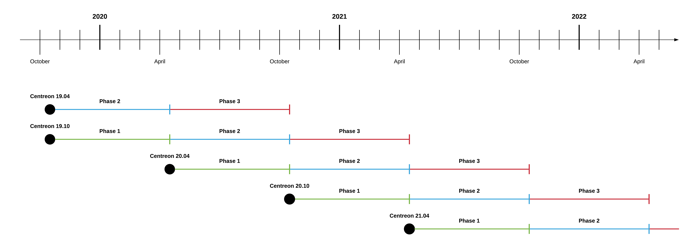

À partir de Centreon 18.10, la société Centreon publiera de nouvelles versions
de Centreon sur une cadence régulière, permettant à la communauté, aux
entreprises et aux développeurs de planifier leurs feuilles de route avec la
certitude d’avoir de la visibilité en amont sur les nouvelles capacités offertes par l'open source.

## Les numéros de version sont AA.MM

Les versions de Centreon sont nommées par l'année et la période de livraison : XX.04 pour la version de printemps,
et XX.10 pour la version d'automne. Par
exemple, Centreon 21.04 a été livrée au printemps 2020. Tous les modules et
composants de la collection de logiciels Centreon possèdent le même numéro de
version.

## Cadence de publication

La société Centreon prévoit de publier 2 versions par an, la première au printemps
et la seconde en automne. Entre ces deux versions majeures, Centreon fournira de
manière régulière des versions mineures, y compris des correctifs de sécurité,
des correctifs et améliorations.

## Mises à jour de maintenance et de sécurité

### Jusqu'à la version 21.04

Jusqu'à la version 21.04 incluse, les versions sont supportées pendant 18 mois. Le cycle de vie d'une version est divisé en 3 phases :

1.  Première phase : bogues de toute criticité (minor, major, critical,
    blocking) et correction de sécurité seront traités par priorité
2.  Seconde phase : bogues et correction de sécurité de criticité major,
    critical et blocking seront traités par priorité
3. Troisième phase : bogues et correction de sécurité de criticité blocking seront traités par priorité.

> La gravité et la hiérarchisation des bogues sont la responsabilité de l'équipe
> Centreon.

La première phase commence le cycle de vie de la version.

La deuxième phase d'une version commence lorsque la prochaine version majeure
est disponible. Par exemple, la publication de Centreon 21.04 lance la deuxième
phase de Centreon 20.10.

La troisième phase d'une version commence lorsque la deuxième version majeure
suivante est disponible. Par exemple, la sortie de Centreon 21.04 lance la
troisième phase de Centreon 20.04 et la deuxième phase de Centreon 20.10.

### À partir de la version 21.10

À partir de la version 21.10, les versions sont supportées pendant 2 ans. Le cycle de vie d'une version est divisé en 2 phases d'un an chacune.

1.  Première phase : bogues de toute criticité (minor, major, critical,
    blocking) et correction de sécurité seront traités par priorité
2.  Seconde phase : bogues et correction de sécurité de criticité major,
    critical et blocking seront traités par priorité.

> La gravité et la hiérarchisation des bogues sont la responsabilité de l'équipe
> Centreon.

### Schéma

Le schéma suivant présente le cycle de vie Centreon :

## Tableau de maintenance des anciens produits

> Tous les autres produits non décrits dans les tableaux suivants ne sont plus
> pris en charge par Centreon.

### Centreon OSS 3.4

| Product                 | Version  | Release date | End of life    | State         |
| ----------------------- | -------- | ------------ | -------------- | ------------- |
| Centreon Web            | 2.8.x    | 2016/11/14   | Centreon 20.04 | Not supported |
| Centreon Engine         | 1.8.x    | 2017/09/19   | Centreon 20.04 | Not supported |
| Centreon Broker         | 3.0.x    | 2016/11/14   | Centreon 20.04 | Not supported |
| Centreon DSM            | 2.x      | 2014/09/01   | Centreon 20.04 | Not supported |
| Centreon Open Tickets   | 1.2.x    | 2016/06/20   | Centreon 20.04 | Not supported |
| Centreon AWIE           | 1.x      | 2018/04/11   | Centreon 20.04 | Not supported |
| Centreon Poller Display | 1.5.x    | 2018/04/11   | Centreon 20.04 | Not supported |
| Centreon Widgets        | 1.x      | N/A          | Centreon 20.04 | Not supported |
| Centreon Plugins        | YYYYMMDD | N/A          | Centreon 20.04 | Not supported |

### Centreon IMP 3.4

| Product                       | Version | Release date | End of life    | State           |
| ----------------------------- | ------- | ------------ | -------------- | --------------- |
| Centreon OSS                  | 3.4     | 2016/11/14   | Centreon 20.04 | Not supported   |
| Centreon License Manager      | 1.1.x   | 2018/02/23   | Centreon 20.04 | Not supported   |
| Centreon Plugin Packs Manager | 2.4.x   | 2018/05/30   | Centreon 20.04 | Not supported   |
| Plugin Packs                  | 3.x     | N/A          | N/A            | All issues      |

### Centreon EMS 3.4

| Product                 | Version | Release date | End of life    | State                     |
| ----------------------- | ------- | ------------ | -------------- | ------------------------- |
| Centreon IMP            | 3.4     | 2016/11/14   | Centreon 20.04 | Not supported             |
| Centreon BAM            | 3.6.x   | 2018/02/22   | Centreon 20.04 | Not supported             |
| Centreon MAP            | 4.4.x   | 2017/01/02   | Centreon 20.04 | Not supported             |
| Centreon MBI            | 3.2.x   | 2018/07/09   | Centreon 20.04 | Not supported             |
| Centreon Auto Discovery | 2.3.x   | 2017/08/24   | Centreon 20.04 | Not supported             |
